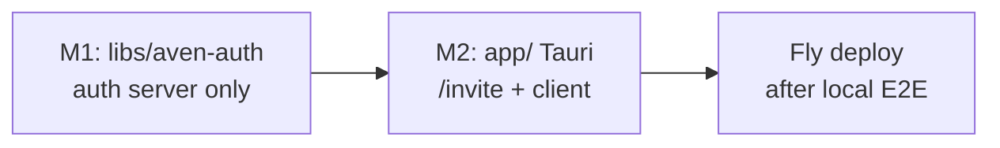

# avenAuth — two-milestone plan

## Package name

`**libs/aven-auth/**` — headless auth server (not `aven-auth-auth`).

```
libs/aven-auth/
  package.json          # @avenos/aven-auth
  Dockerfile
  fly.toml
  src/
    lib/auth.ts
    lib/auth/plugins/aven-auth/
    hooks.server.ts
    routes/
      api/auth/[...all]/+server.ts
      health/+server.ts
```

Root script (M1): `"dev:aven-auth": "bun --cwd libs/aven-auth dev"`  
Local default: `http://localhost:3000` — `BETTER_AUTH_URL` + Tauri client point here for M2 E2E before Fly.

---

## Milestone overview




|                 | M1                              | M2                                                           |
| --------------- | ------------------------------- | ------------------------------------------------------------ |
| **Deliverable** | Runnable headless auth API      | Tauri registration UX                                        |
| **Location**    | `libs/aven-auth/`               | `app/src/routes/invite/`, `app/src/lib/self/network-auth.ts` |
| **Test**        | curl / script against localhost | Tauri app → local server → full bootstrap + invite flow      |
| **Deploy**      | —                               | Fly + `auth.testnet.aven.ceo` after local E2E passes         |


---

# M1 — Auth server (`libs/aven-auth`)

## Goal

Ship a **locally runnable** headless Better Auth service with the custom `**avenAuth`** plugin. No Tauri changes. No Fly yet.

## Features

- **SQLite** via `better-sqlite3` — `./data/aven-auth.db` locally (gitignored)
- `**avenAuth` plugin** endpoints under `/api/auth/aven-auth/`:
  - `GET site/status` — `{ bootstrapped, hasAdmin }`
  - `POST invite/create` — admin session only; default TTL **1 day**
  - `GET invite/check?token=…`
  - `POST nonce` — `{ did, flow, inviteToken? }`
  - `POST verify` — Ed25519 `did:key` verify → session cookie
- **Bootstrap rule:** first new ppK with `flow: "bootstrap"` → sole admin (`self_site_config.adminUserId`)
- **Invite rule:** new ppK with `flow: "invite"` + valid token
- `**emailAndPassword: { enabled: false }`** — ppK-only
- `**GET /health`** for sanity checks

## M1 schema (plugin tables)

- `self_site_config` — singleton, `adminUserId`
- `self_invite` — token hash, expiry, consumed, `boundDid`, `createdBy`
- `self_challenge` — nonce, did, flow, message, expiry

## M1 local dev

```bash
# from repo root
bun run dev:aven-auth
# → http://localhost:3000
```

Env (`.env` / `libs/aven-auth/.env.example`):

```
BETTER_AUTH_URL=http://localhost:3000
BETTER_AUTH_SECRET=<openssl rand -base64 32>
AVEN_AUTH_DB_PATH=./data/aven-auth.db
```

First run: `bunx auth migrate` (or migrate on server start).

## M1 smoke tests (curl only)

Use a test Ed25519 keypair in a script under `libs/aven-auth/tests/` or `scripts/`:

1. `GET /health` → 200
2. `GET /api/auth/aven-auth/site/status` → `{ bootstrapped: false }`
3. `nonce` + `verify` with `flow: bootstrap` → session cookie; user is admin
4. `POST invite/create` with admin cookie → `{ inviteToken, inviteDeepLink: "avenos://invite?invite=…" }`
5. Second keypair: `invite/check` → `nonce` → `verify` with `flow: invite`
6. Expired token rejected after TTL

**M1 done when:** server starts locally and all API smoke tests pass.

---

# M2 — Tauri integration (`app/`)

## Goal

Wire the native app to the auth server. **Run full flow against local `libs/aven-auth` first.** Deploy to Fly only after local E2E works.

## Deliverables

### 1. API client — `[app/src/lib/self/network-auth.ts](app/src/lib/self/network-auth.ts)`

- Configurable base URL:
  - **Local (default in dev):** `http://localhost:3000`
  - **Prod:** `https://auth.testnet.aven.ceo`
- Persistent Better Auth session cookie (secure storage)
- `siteStatus()`, `checkInvite(token)`, `register({ flow, inviteToken? })`
- Uses `plugin:self|signer_did` + `plugin:self|sign`

### 2. Route — `[app/src/routes/invite/+page.svelte](app/src/routes/invite/+page.svelte)`

Top-level `**/invite`** (not under `/self`). Single surface for:


| Case          | URL                    | Flow                              |
| ------------- | ---------------------- | --------------------------------- |
| First admin   | `/invite` (no query)   | `bootstrap` when not bootstrapped |
| Redeem invite | `/invite?invite=TOKEN` | `invite`                          |


Deep link: `avenos://invite?invite=TOKEN` → `goto('/invite?invite=…')`

Page flow: unlock → `site/status` → optional `invite/check` → nonce → sign → verify → success.

i18n: `invite.`* keys in `app/messages/en.json` + `de.json`.

### 3. Admin invite creation UI

**Out of M2** — admin uses curl against local server during E2E; Tauri admin screen later.

## M2 local E2E test plan

**Prereq:** M1 server running (`bun run dev:aven-auth`).

1. Start Tauri app with `AVEN_AUTH_AUTH_URL=http://localhost:3000` (or dev default).
2. Open `/invite` → bootstrap → admin session stored.
3. curl `invite/create` with admin cookie → copy token.
4. Second instance / device: `/invite?invite=TOKEN` → registered.
5. Re-open `/invite` on registered device → return sign-in without invite.

**M2 done when:** above passes locally.

## M2 Fly deploy (after local E2E)

Mirror `[scripts/deploy-relay-fly.ts](scripts/deploy-relay-fly.ts)`:

- App: `auth-testnet-aven-ceo`, region `fra`
- Volume: `auth_data` → `/data/aven-auth.db`
- Script: `bun run deploy:aven-auth-fly`
- DNS: `A auth.testnet.aven.ceo → Fly IPv4`
- Switch Tauri prod config to `https://auth.testnet.aven.ceo`

---

## Identity model (unchanged)

- 1 user = 1 ppK = 1 device (v1)
- First bootstrap = sole admin
- Invites: 1-day default, single-use
- Multi-device / per-human: out of scope

## API invite response shape

```json
{
  "inviteToken": "…",
  "inviteDeepLink": "avenos://invite?invite=…",
  "expiresAt": "…"
}
```

---

## Explicitly out of scope

- Admin create-invite UI in Tauri
- Web pages on auth server
- Multi-admin, email/OAuth, SIWE
- Fly deploy before M2 local E2E

---

## Key references

- [Better Auth + SQLite](https://www.better-auth.com/docs/installation)
- [Better Auth plugins](https://www.better-auth.com/docs/concepts/plugins)
- Fly pattern: `[scripts/deploy-relay-fly.ts](scripts/deploy-relay-fly.ts)`
- Signing: `[libs/tauri-plugin-self/src/commands.rs](libs/tauri-plugin-self/src/commands.rs)`

