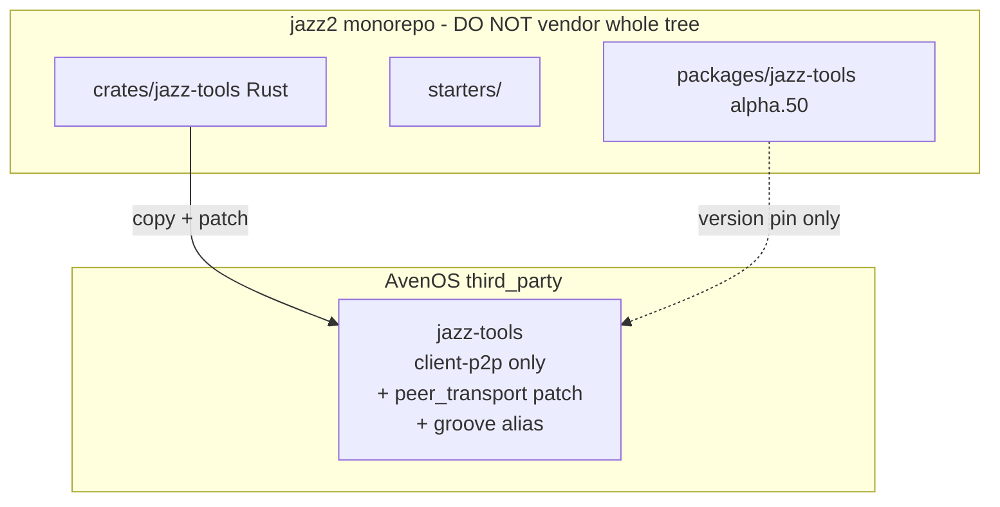

# Jazz upstream re-vendor — execution plan (v2)

> Supersedes [jazz_upstream_gap_analysis_0bfdfa4c.plan.md](jazz_upstream_gap_analysis_0bfdfa4c.plan.md)

## Scope contract — Rust + RocksDB native only

AvenOS Tauri (macOS + iOS) uses **one vendored Rust crate** and nothing else from the jazz2 monorepo.

**In scope:**

- `crates/jazz-tools` (Rust engine + client)
- `rocksdb` storage backend (`jazz.rocksdb`) on **both** macOS and iOS
- AvenOS patches: `peer-transport`, P2P fanout, `groove` lib alias
- Host integration: `lib/app/src-tauri`, `tauri-plugin-peer`, `libs/jazz-schema` (Rust-side schema manifest only)

**Explicitly out of scope — do not vendor, build, or migrate:**

| Exclude | Why |
|---|---|
| **npm** `packages/jazz-tools` (alpha.50 TS SDK) | Browser/Node; AvenOS has no npm jazz-tools dep |
| **TypeScript** bindings, React/Vue/Svelte, CLI JS | Same |
| **OPFS** / `opfs-btree` / WASM storage | Browser-only; native uses RocksDB |
| **SQLite** / `rusqlite` feature | Rejected — RocksDB both platforms only |
| **WebSocket** `transport-websocket` | AvenOS is P2P-only via Hyperswarm |
| **HTTP server** / `server` / `cli` / `otel-*` | Never run in Tauri shell |
| **Starters**, **examples**, **specs**, RN bindings | Not runtime |

The npm alpha.50 version is a **reference pin** for how far main has moved — not something AvenOS imports.

## Status: Phase 1 already done (feature-gating)

Commit **ed80d2b** delivered compile-time trim via `client-p2p`. AvenOS no longer links reqwest/HTTP sync for native builds.

| Item | Status |
|---|---|
| `client-p2p` feature + consumer migration | **Done** |
| HTTP `cfg` gates in `client.rs` / `lib.rs` | **Done** |
| CLI bin gated (`required-features = ["cli"]`) | **Done** |
| WASM OPFS gated (`target_arch = "wasm32"`) | **Done** |
| AvenOS P2P patches preserved | **Done** |
| Physical file deletion / README | **Not done** — next step (Phase A below) |

**Do not** cherry-pick against `_published_groove/` — upstream main layout diverged. Full re-vendor only.

---

## Upstream mirror — update required

Local mirror is **stale**. Fetched `origin/main` (May 28, 2026):

| | Stale (on disk) | Latest (`origin/main`) |
|---|---|---|
| Git SHA | `2517141` | **`232a9933`** (PR #955 untrusted-lengths) |
| npm `jazz-tools` | **2.0.0-alpha.49** | **2.0.0-alpha.50** |
| Rust `Cargo.toml` version | `2.0.0-alpha.0` | still `2.0.0-alpha.0` (crates.io label unchanged) |

**Phase A step 1 (do first):**

```bash
cd third_party/jazz2-upstream
git fetch origin main && git checkout main && git pull origin main
# verify:
git log -1 --oneline
git show HEAD:packages/jazz-tools/package.json | head -4
```

Record SHA + npm alpha in `third_party/jazz-tools/UPSTREAM.md` (or `third_party/jazz2-upstream/VENDOR_PIN.md`).

---

## Phase A — Strip-down analysis (essential Rust only)

Yes — AvenOS Tauri **only needs the Rust client engine + AvenOS patches**. Everything else is dead weight in the vendor tree (even if already feature-gated).

### A1. Current vendored fork — safe to **delete** (~1.9k LOC on disk)

Already **excluded from `client-p2p` builds**; deleting reduces confusion before re-vendor:

| Path | Why dead for AvenOS |
|---|---|
| `src/main.rs` | CLI binary |
| `src/commands/` | CLI subcommands |
| `src/routes.rs` | HTTP Jazz server routes |
| `src/middleware/` | HTTP server auth |
| `src/transport.rs` | HTTP client sync (needs `transport-http`) |
| `tests/auth_test.rs`, `tests/integration.rs`, `tests/test_server.rs` | CLI/server E2E |
| `Cargo.toml.orig`, `.cargo-ok` | crates.io publish artifacts |
| `benches/`, `examples/` | empty dirs |

**Keep:** `tests/peer_transport_codec.rs` (only test AvenOS needs).

Verify after delete:

```bash
cd lib/app/src-tauri && cargo check
cd lib/app/src-tauri && cargo check --target aarch64-apple-ios
```

### A2. Current fork — **cfg-gate** (still compiled today, candidate trim)

These modules compile under `client-p2p` but AvenOS never uses server/CLI paths:

| Module | Notes | Action |
|---|---|---|
| `query_manager/server_queries.rs` | Server-side query subscriptions | Gate `#[cfg(feature = "server")]` + remove from `mod.rs` default |
| `schema_manager/files.rs` | TS/DSL codegen for `jazz-tools build` | Gate `#[cfg(feature = "cli")]` — AvenOS uses `libs/jazz-schema` + `schema_manifest.rs` |
| `transport_protocol.rs` | Not in `client-p2p` features today | Already excluded — confirm no accidental `transport` feature enable |

**Do NOT delete** without `cargo check` — engine modules are interconnected.

### A3. Current fork — **must keep** until re-vendor replaces crate

| Area | Paths |
|---|---|
| Core engine | `_published_groove/{commit,metadata,object,object_manager,query_manager,schema_manager,storage,sync_manager,runtime_core}` |
| Tokio runtime | `_published_runtime_tokio/` |
| Client + P2P | `client.rs`, `peer_transport.rs` |
| Storage (interim) | `storage/surrealkv.rs`, `storage/memory.rs` |
| AvenOS patches | `writes.rs` fanout, `forwarding.rs` P2P bypass, `QueryError::InternalError` |

### A4. Upstream re-vendor scope — Rust native only

Copy **only** `jazz2-upstream/crates/jazz-tools/` into `third_party/jazz-tools`. Do **not** copy anything from the TS/npm/browser side of the monorepo.

| Exclude from vendor tree | Category |
|---|---|
| `packages/*` | npm TypeScript (alpha.50 SDK, create-jazz, inspector, …) |
| `crates/opfs-btree` | OPFS / WASM browser storage |
| `starters/`, `examples/`, `specs/` | Dev/docs/templates |
| `sqlite` feature + `rusqlite` dep | Storage — use RocksDB only |
| `transport-websocket`, `server`, `cli`, `otel-*` | Server/browser sync stack |

**Only enable for AvenOS:**

```toml
client-p2p = ["runtime-tokio", "rocksdb", "peer-transport", "dep:thiserror", "dep:tokio"]
[[lib]]
name = "groove"   # keep alias — src-tauri imports `groove::`
```

Also delete from current fork before re-vendor: `storage/opfs_btree.rs` (WASM-only; not needed on native).



---

## Gap: vendored snapshot vs jazz2 main (alpha.50)

| Dimension | Vendored (today) | Upstream main (alpha.50) |
|---|---|---|
| Layout | `_published_groove/*` (83 .rs) | Flat modules (185 .rs) |
| Storage | SurrealKV `groove.surrealkv` | RocksDB `jazz.rocksdb` |
| Transport | HTTP + AvenOS peer-transport | WebSocket only — **must re-port peer-transport** |
| Schema | `AppContext.live_schemas` | Catalogue rehydrate |
| Sync | Patched forwarding | Catalogue-centric sync_manager rewrite |

---

## AvenOS patches to re-port (must not lose)

| Patch | Current | Upstream target |
|---|---|---|
| `PeerTransport` + framing | `peer_transport.rs` | New file |
| `connect_with_peer_transport` | `client.rs` | Upstream `client.rs` (TokioRuntime rewrite) |
| P2P write fanout | `query_manager/writes.rs` | Upstream `writes.rs` |
| Sync P2P bypass | `sync_manager/forwarding.rs` | Upstream `sync_manager/inbox.rs` |
| `QueryError::InternalError` | `query_manager/manager.rs` | Re-apply |
| `client-p2p` feature | `Cargo.toml` | rocksdb + peer-transport, no websocket |
| `groove` lib alias | `Cargo.toml` | Keep |

Host integration: [`jazz/mod.rs`](lib/app/src-tauri/src/jazz/mod.rs), [`peer_sync_gate.rs`](lib/app/src-tauri/src/peer_sync_gate.rs), [`schema_migrations.rs`](lib/app/src-tauri/src/schema_migrations.rs), [`hyperswarm_groove_bridge.rs`](projects/tauri-plugin-peer/src/hyperswarm_groove_bridge.rs), [`libs/jazz-schema`](libs/jazz-schema).

---

## Execution phases (ordered)

### Phase A — Mirror refresh + strip-down (before spike)

1. Pull `third_party/jazz2-upstream` → **alpha.50** / `232a9933+`
2. Physical delete dead trees (A1 table) from current `third_party/jazz-tools`
3. Optional cfg-gate server-only modules (A2)
4. Write `UPSTREAM.md` fork boundary doc
5. `cargo check` macOS + iOS on **current** SurrealKV fork (sanity)

### Phase B — iOS RocksDB spike (**mandatory — no SQLite fallback**)

Use upstream crate from refreshed mirror with `rocksdb` feature:

```bash
cd lib/app/src-tauri
cargo build --target aarch64-apple-ios   # with patched dep path to upstream + client-p2p,rocksdb
bun run release:app:ios 13 --no-upload
```

Pass: `librocksdb-sys` links; app opens `jazz.rocksdb`. Fail: fix iOS toolchain — do not fall back to SQLite.

### Phase C — Re-vendor + re-port patches

Replace `third_party/jazz-tools` with `jazz2-upstream/crates/jazz-tools`; apply AvenOS patch set; `cargo test peer_transport_codec`.

### Phase D — Tauri integration + storage cutover

`groove.surrealkv` → `jazz.rocksdb`; wipe legacy DB on upgrade; fix AppContext / schema migrations.

### Phase E — P2P smoke (macOS + iOS TestFlight)

---

## Removed / rejected from old plan

| Item | Reason |
|---|---|
| Cherry-pick audit on alpha.0 | Upstream layout diverged |
| SQLite fallback | **Rejected** — RocksDB both only |
| npm bump (aven-ceo) | Out of scope |
| trim-fork-features todo | **Done** (client-p2p, ed80d2b) — replaced by physical strip (Phase A) |

---

## Recommended next action

1. **Pull `jazz2-upstream` to alpha.50** (`232a9933+`)
2. **Physical strip-down** of current vendored fork (Phase A1) — quick win, cleaner diff before re-vendor
3. **iOS RocksDB spike** on upstream crate (Phase B)
