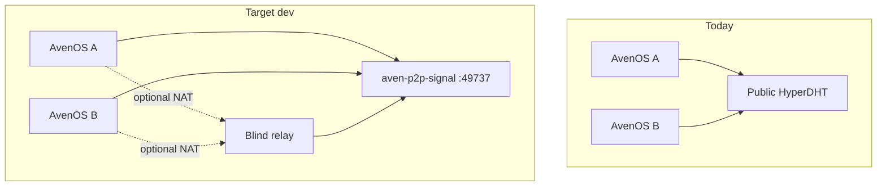

# Local P2P Signal Service for Instant Dev Pairing

## Problem

Pairing today uses [`SwarmConfig::with_public_bootstrap()`](third_party/peeroxide/src/swarm.rs) plus optional prepend via [`AVENOS_DHT_BOOTSTRAP`](projects/tauri-plugin-peer/src/lib.rs). That still contacts Holepunch nodes (`node1/2/3.hyperdht.org:49737`), so DHT roundtrips, announce/lookup, and relay discovery are slow and flaky—especially for short-lived pairing topics.

Per [peeroxide DHT routing docs](https://rightbracket.github.io/peeroxide/concepts/dht-and-routing.html), **isolated mode** = empty public bootstrap + only your bootstrap nodes. All peers share one small routing table → near-instant rendezvous on localhost.



## Architecture

New package **[`projects/aven-p2p-signal/`](projects/aven-p2p-signal/)** — Rust binary using vendored [`third_party/peeroxide-dht`](third_party/peeroxide-dht):

| Component | Role | Default |
|-----------|------|---------|
| **DHT bootstrap node** | Isolated HyperDHT entry point; handles announce/lookup for pairing topics | `127.0.0.1:49737`, `ephemeral=false`, `firewalled=false` |
| **Blind relay** (phase 1b) | Predictable NAT fallback via existing `relay_through` / `relay_address` env hooks | Node subprocess bootstrapped to local DHT |

On startup the binary prints one JSON line to stdout (machine-readable “ready” handshake):

```json
{"ready":true,"bootstrap":"127.0.0.1@127.0.0.1:49737","relayPubkeyHex":"…","relayAddr":"127.0.0.1:49738"}
```

Stable Ed25519 keypairs persisted under `<repo>/.avenOS/dev/p2p-signal/` (gitignored) so relay pubkey stays constant across restarts.

Implementation follows the pattern in [`hyperdht_connect_interop.rs`](third_party/peeroxide-dht/tests/hyperdht_connect_interop.rs) (bootstrap node with `bootstrap = []`, fixed host/port) and [`relay_soak.rs`](third_party/peeroxide-dht/examples/relay_soak.rs) (non-ephemeral, non-firewalled DHT server).

**Blind relay (phase 1b):** peeroxide ships only a [`BlindRelayClient`](third_party/peeroxide-dht/src/blind_relay.rs), not a Rust server. Mirror [`relay_test.rs`](third_party/peeroxide/examples/relay_test.rs): small Bun launcher in the signal package that spawns `blind-relay-server.js` (vendored from peeroxide `tests/node/` or `npm:blind-relay`) bootstrapped to the local DHT. Parent process supervises both children.

## App-side changes

In [`projects/tauri-plugin-peer/src/lib.rs`](projects/tauri-plugin-peer/src/lib.rs):

1. **New env `AVENOS_DHT_ISOLATED=1`** — start from `SwarmConfig::default()` (empty bootstrap) instead of `with_public_bootstrap()`.
2. **Keep `AVENOS_DHT_BOOTSTRAP`** — still sets bootstrap list (now the *only* nodes when isolated).
3. **Optional `AVENOS_DHT_PUBLIC=1`** — escape hatch to restore public bootstrap for real-network testing.

Replace:

```335:338:projects/tauri-plugin-peer/src/lib.rs
let mut cfg = peeroxide::SwarmConfig::with_public_bootstrap();
cfg.key_pair = Some(kp);
cfg.max_parallel = 8;
apply_avensos_swarm_env(&mut cfg)?;
```

With a small helper, e.g. `swarm_config_from_env(kp)`, that picks isolated vs public before `apply_avensos_swarm_env`.

Existing relay env vars already work and should be set by dev scripts:

- `AVENOS_HYPERSWARM_RELAY_PUBKEY_HEX`
- `AVENOS_HYPERSWARM_RELAY_ADDR`

Update [`.env.example`](.env.example) with the new vars and documented defaults.

## Dev script integration

Shared module **[`scripts/p2p-signal.ts`](scripts/p2p-signal.ts)** (pattern from [`projects/dev-stack/run-dev.ts`](projects/dev-stack/run-dev.ts)):

- `freePort(49737)` (+ relay port if used)
- Spawn `cargo run --manifest-path projects/aven-p2p-signal/Cargo.toml`
- Parse ready JSON from stdout
- Return env map for child processes
- Register `SIGINT`/`SIGTERM` cleanup (kill signal + free ports)

Wire into all four entry points (always-on for dev, skippable via `AVENOS_SKIP_P2P_SIGNAL=1`):

| Script | Change |
|--------|--------|
| [`scripts/dev-app-macos.ts`](scripts/dev-app-macos.ts) | Start signal → merge env → spawn Tauri |
| [`scripts/dev-app-linux.ts`](scripts/dev-app-linux.ts) | Same |
| [`scripts/dev-two-instances.ts`](scripts/dev-two-instances.ts) | Start signal once; both A/B inherit same env |

Root [`package.json`](package.json) additions:

- `"dev:p2p-signal": "cargo run --manifest-path projects/aven-p2p-signal/Cargo.toml"`
- Optionally document standalone use

**Note:** [`tauri-plugin-peer`](projects/tauri-plugin-peer/src/lib.rs) P2P is **macOS-only** today; Linux dev scripts get the signal service + env pre-configured so pairing works immediately once Linux swarm support lands (Daniel’s Linux compat work). Signal service itself is cross-platform.

## Docs

Add **[`libs/docs/network/developers/05-p2p-signal.md`](libs/docs/network/developers/05-p2p-signal.md)** covering:

- What the signal service is (isolated HyperDHT, not a generic HTTP relay)
- Local dev flow and env vars
- Troubleshooting (port in use, `AVENOS_SKIP_P2P_SIGNAL`, fallback to public DHT)
- Fly.io deployment sketch (below)

Link from existing harness doc [`04-two-instance-harness.md`](libs/docs/network/developers/04-two-instance-harness.md).

## Fly.io (phase 2 — design only in this PR)

Prepare the package for remote hosting without implementing deploy yet:

- **Dockerfile** in `projects/aven-p2p-signal/` — multi-stage Rust build + optional Bun relay layer
- **`fly.toml` stub** — UDP service on `49737` (HyperDHT wire protocol), dedicated IPv4 via `fly ips allocate-v4`
- **Production env** for shipped apps (not dev):

  ```
  AVENOS_DHT_ISOLATED=1
  AVENOS_DHT_BOOTSTRAP=<fly-ip>@p2p.avenos.dev:49737
  AVENOS_HYPERSWARM_RELAY_PUBKEY_HEX=…
  AVENOS_HYPERSWARM_RELAY_ADDR=<fly-ip>:49738
  ```

- Document that Fly UDP + persistent volume for keypair material is required; health = DHT bootstrap completes and routing table ≥ N peers under load

## Verification

1. `cargo build --manifest-path projects/aven-p2p-signal/Cargo.toml`
2. `bun run dev:app2x:mac` — signal starts, logs show isolated bootstrap (no `node*.hyperdht.org`)
3. Pair two vaults — expect `pairing swarm conn` within seconds, not minutes
4. `AVENOS_SKIP_P2P_SIGNAL=1` + no env → falls back to current public-DHT behavior
5. Unit smoke: signal binary emits valid ready JSON; plugin respects `AVENOS_DHT_ISOLATED`

## Out of scope (follow-ups)

- Enabling Linux swarm in `tauri-plugin-peer` (separate from signal service)
- Production Fly deploy automation / CI
- Replacing pairing DHT topics with a custom HTTP signaling channel (different architecture; not needed if isolated DHT solves latency)
