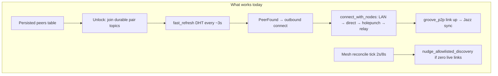
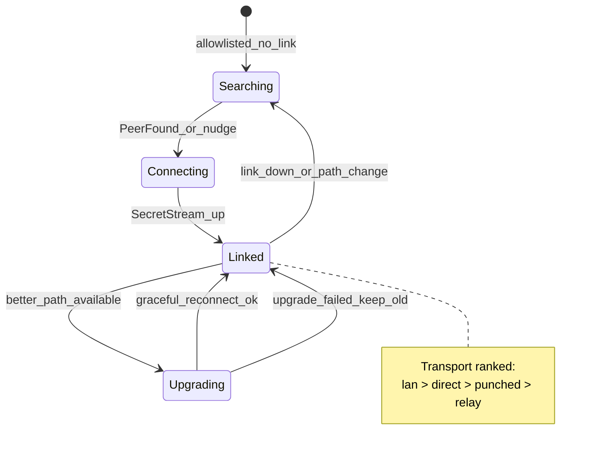

# P2P mesh auto-healing and dynamic transport plan

## What you mean (confirmed)

You want **trusted peers to stay linked without re-inviting**, across:

- Wi‑Fi ↔ 5G / carrier changes
- Either device rebooting or app restart (after unlock)
- One side moving between networks while the other stays put
- **Best available path at all times:** LAN → holepunch → relay, chosen from current conditions

That is the right target. Today we are **partially there**, not fully resilient.

---

## Current state (honest baseline)




| Capability                              | Status        | Where                                                                                                                                                     |
| --------------------------------------- | ------------- | --------------------------------------------------------------------------------------------------------------------------------------------------------- |
| Persist peers across reboot             | Yes           | `[peers` table + unlock ritual](libs/docs/network/developers/01-architecture.md)                                                                          |
| Re-join topics without invite           | Yes           | `[set_allowlist_and_join_pair_topics](projects/tauri-plugin-peer/src/lib.rs)` + `pairing_join_opts()`                                                     |
| Connect-time transport waterfall        | Yes           | `[hyperdht.rs` connect path](third_party/peeroxide-dht/src/hyperdht.rs) — documented in [05-p2p-signal.md](libs/docs/network/developers/05-p2p-signal.md) |
| Retry on **failed connect attempt**     | Yes           | `[schedule_retry](third_party/peeroxide/src/swarm.rs)` (2s cap while `fast_refresh`)                                                                      |
| Periodic discovery nudge                | Partial       | `[execute_mesh_reconcile](app/src-tauri/src/jazz/mod.rs)` — only when **all** live links are empty                                                    |
| **Detect link down and reconnect**      | **No**        | `[multiplex_connection](projects/tauri-plugin-peer/src/hyperswarm_groove_bridge.rs)` cleans Groove state but never tells peeroxide                        |
| **Upgrade relay → LAN while connected** | **No**        | Transport mode set once at connect; no renegotiation                                                                                                      |
| **Network path change hook**            | **No**        | No NWPath / reachability integration                                                                                                                      |
| Proven-peer fast reconnect              | **Dead code** | `[PeerInfo::disconnected()](third_party/peeroxide/src/peer_info.rs)` is never called                                                                      |


### Critical bug blocking auto-heal

When a link dies, `[HyperswarmGrooveBridge](projects/tauri-plugin-peer/src/hyperswarm_groove_bridge.rs)` logs `groove_p2p link closed` and removes the Groove client — but **peeroxide’s internal `connections` map still thinks the peer is connected**. Future `PeerFound` events are skipped:

```722:724:third_party/peeroxide/src/swarm.rs
if self.connections.has(&public_key) {
    return;
}
```

So after the first successful pair, a drop often leaves the mesh **stuck in SEARCHING/OFFLINE** until full swarm teardown (lock/unlock) or manual `peer_swarm_retry`.

---

## Target architecture




**Design principles**

1. **Link lifecycle is first-class** — every Groove mux exit must notify the swarm.
2. **Reconnect is per-peer**, not global — one dead peer must not block others.
3. **Transport preference is evaluated on each connect attempt**, not only the first pairing.
4. **Upgrade = controlled reconnect** — Hyperswarm/peeroxide does not hot-swap UDX paths; open a better path, migrate Groove, then drop the old socket.
5. **Network events accelerate healing** — path change triggers flush + reconnect, not full vault lock.

---

## Phase 1 — Connection lifecycle (highest priority)

**Goal:** Any link drop → automatic reconnect within seconds, on any network.

### 1a. Swarm disconnect API

Add to peeroxide (`[swarm.rs](third_party/peeroxide/src/swarm.rs)`):

- `SwarmCommand::NotePeerDisconnected { public_key, reason }`
- Handler: remove from `connections`, call `PeerInfo::disconnected()`, emit connect UI `Disconnected`, **re-queue** peer if still on an allowlisted topic (respect `max_peers` / banned)

Wire from AvenOS:

- `[HyperswarmGrooveBridge::multiplex_connection](projects/tauri-plugin-peer/src/hyperswarm_groove_bridge.rs)` tail (already has `remote_pk`) → `PeerCtl::notify_peer_disconnected(pk)` → swarm command

### 1b. Per-peer reconnect scheduler

Extend mesh reconcile (`[execute_mesh_reconcile](app/src-tauri/src/jazz/mod.rs)`):

- For each **allowlisted DID with no live bridge ClientId**: call `nudge_allowlisted_discovery` **and** explicit reconnect hint to swarm (don’t wait for global `live.is_empty()`)
- Map DID → static pubkey via existing `client_id_to_did` / inverse lookup from peers table

### 1c. Proven-peer priority

Activate existing `[PeerInfo::disconnected()](third_party/peeroxide/src/peer_info.rs)` logic:

- Connection lasted ≥15s → `proven=true`, reset attempts, higher priority on next `PeerFound`
- Pair with `fast_refresh` topics so backoff stays ≤2s for trusted peers

**Exit criteria:** Kill one side’s app or toggle airplane mode → other side returns to READY within ~5–15s without re-invite.

---

## Phase 2 — Network change awareness

**Goal:** Device switches Wi‑Fi ↔ 5G ↔ hotspot → DHT re-announces fresh addresses and reconnects promptly.

### 2a. Path monitor (platform layer)

New small module in Tauri (macOS + iOS):

- **iOS / macOS 12+:** `NWPathMonitor` (Network framework) via objc/swift bridge or existing crate
- **macOS fallback:** `SCNetworkReachability` if needed for sandbox

Emit app events: `peer:network-path-changed { satisfied, expensive, constrained, interfaces[] }`

### 2a. Reactions on path change

In `[PeerCtl](projects/tauri-plugin-peer/src/lib.rs)`:

1. **Soft heal** (default): `flush_swarm_for_pairing("network path changed")` + per-peer reconnect nudge — topics stay joined
2. **Hard heal** (only if soft fails N times): destroy/recreate swarm while preserving seed + allowlist (today’s `peer_swarm_retry` pattern, but automatic)

### 2b. Fresh LAN addresses

On path change, ensure next handshake uses updated `[enumerate_ipv4_lan()](third_party/peeroxide-dht/src/local_addresses.rs)` — may require peeroxide to rebuild `addresses4` at announce time rather than caching at swarm start.

**Exit criteria:** Mac on Wi‑Fi + iPhone on 5G linked via relay; iPhone joins same Wi‑Fi → reconnect upgrades to LAN within one heal cycle.

---

## Phase 3 — Dynamic transport preference (upgrade loop)

**Goal:** While connected, prefer better paths as surroundings change.

### 3a. Transport ranking (already implicit)

Use existing modes from `[PeerConnectUiTracker](projects/tauri-plugin-peer/src/peer_connect_ui.rs)`:


| Rank | Mode      | When                          |
| ---- | --------- | ----------------------------- |
| 1    | `lan`     | Shared subnet in `addresses4` |
| 2    | `direct`  | Reflexive / open firewall     |
| 3    | `punched` | Holepunch success             |
| 4    | `relay`   | Blind-relay fallback          |


### 3b. Upgrade policy

While `Linked` on rank N:

- **Triggers to probe upgrade:** network path change, LAN interface appeared, link quality degraded (RTO / idle timeout), periodic low-rate probe (e.g. every 60–120s for proven peers)
- **Action:** spawn **background outbound connect** for same pubkey (peeroxide already dedups in `[handle_connect_result](third_party/peeroxide/src/swarm.rs)`)
- **Accept rule:** if new connect succeeds with `transport_mode` rank < current → migrate Groove mux to new `SwarmConnection`, close old stream, update UI
- **Reject rule:** keep existing link if probe fails or rank is not better

### 3c. Downgrade handling

If LAN link dies mid-session (AP isolation, walk out of Wi‑Fi range):

- Phase 1 link-down handler fires → fall back through holepunch → relay on reconnect attempt (existing waterfall)

**Important constraint:** Do not run parallel Groove sync on two links to the same peer — migrate atomically (same pattern as today’s duplicate-link warning in `[on_swarm_connection](projects/tauri-plugin-peer/src/hyperswarm_groove_bridge.rs)`).

---

## Phase 4 — Reboot and foreground resilience

**Goal:** Survive one-sided reboot cleanly.


| Event                          | Action                                                                                                                                 |
| ------------------------------ | -------------------------------------------------------------------------------------------------------------------------------------- |
| **Vault unlock**               | Keep today’s ritual ([architecture doc](libs/docs/network/developers/01-architecture.md)): sync allowlist → join topics → capped flush |
| **App foreground** (iOS/macOS) | New: mesh refresh + flush + per-peer reconnect check                                                                                   |
| **Hyperswarm ready**           | Keep `[apply_pending_allowlist](projects/tauri-plugin-peer/src/lib.rs)`                                                                |
| **Remote peer reboot**         | Phase 1 link-down + fast_refresh discovery handles it                                                                                  |


Remove reliance on manual `[peer_swarm_retry](projects/tauri-plugin-peer/src/commands_macos.rs)` for normal operation (keep as debug escape hatch).

---

## Phase 5 — Jazz/sync layer continuity

Reconnect transport ≠ sync complete. Leverage existing pieces:

- `[peer_catchup](app/src-tauri/src/peer_catchup.rs)` — already re-queues flush on `on_peer_registered`
- `[refresh_peer_mesh_groove_register_primitives](app/src-tauri/src/jazz/mod.rs)` — register sync client when link returns

Add: on transport upgrade, **do not** reset catch-up state if same `ClientId` (pubkey unchanged).

---

## Phase 6 — Observability and UX

Extend mesh snapshot (`[mesh-state.ts](app/src/lib/peer/mesh-state.ts)`):

- `lastDisconnectReason`, `reconnectAttempt`, `desiredTransport` vs `actualTransport`
- Rust logs: `peer_heal: link_down`, `peer_heal: path_change`, `peer_heal: upgrade lan`

Update docs: [01-architecture.md](libs/docs/network/developers/01-architecture.md) — replace “public HyperDHT only” note for reconnect with central-relay path parity.

---

## Suggested implementation order

1. **Phase 1** — unblocks all scenarios; smallest change, biggest impact
2. **Phase 2** — makes network switches feel instant
3. **Phase 3** — LAN preference when topology improves
4. **Phases 4–6** — polish, UX, docs

---

## Test matrix (acceptance)


| Scenario                               | Expected                                       |
| -------------------------------------- | ---------------------------------------------- |
| Linked → kill remote app → reopen      | Reconnect ≤15s, sync resumes                   |
| Linked on relay → both join same Wi‑Fi | Upgrade to LAN or stay stable                  |
| Linked on LAN → iPhone to 5G           | Downgrade to punched/relay, stay linked        |
| Mac reboot, iPhone stays open          | Mac unlock → reconnect without invite          |
| Airplane mode toggle on one device     | Heal after path satisfied                      |
| Walk through: relay → LAN → relay      | No manual invite; transport mode updates in UI |


---

## Out of scope (for this plan)

- Multi-hop routing / mesh relay between unrelated peers
- Persistent connection across vault lock (intentionally torn down for privacy)
- Changing DHT bootstrap / Fly infra (already stable at `:49737`)

