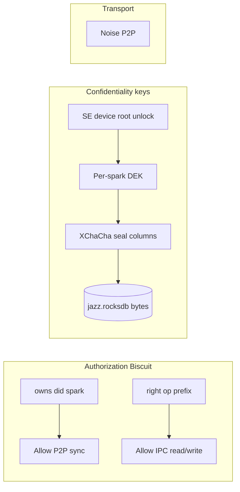

# Private-by-default values + spark admin ACC (revised education plan)

## Your clarifications (incorporated)

| Topic | Decision |
|-------|----------|
| **Granularity** | **Spark-level admin is enough for now** — `owns` + “add peer as admin” ([`attenuate_add_owner_third_party`](app/src-tauri/src/spark_acc.rs)) + keyshare. Row-level / per-row caps **later**. |
| **Priority** | **Private by default for all values** — enforce sealing; no intentional public user content today. |
| **Local disk** | Only the **unlocked device identity** should be able to read decrypted values; on disk everything sensitive should be **ciphertext**, not readable by copying `jazz.rocksdb` alone. |
| **Ship order** | **Do not** bundle column-at-rest sealing with row-level biscuit ACC — two layers, two PRs. |

---

## One go or separate? (encrypted at rest vs row-level access)

**No — do not solve both in one go.**

They are different layers with different code paths:

| Workstream | What changes | Depends on |
|------------|--------------|------------|
| **At-rest (values)** | Manifest: no `plaintext: true`; seal every column with spark (or vault) DEK; unlock to decrypt | `crypto.rs`, `schema.manifest.json`, write/read in `jazz_engine` |
| **Access (who)** | Biscuit: spark `owns` today; row-scoped `right` later | `spark_acc.rs`, `peer_sync_gate.rs`, grant UI |

- **At-rest** answers: “If someone copies `jazz.rocksdb`, can they read bytes?” → only if they also have device root + DEK (after you seal everything).  
- **Row-level ACC** answers: “Can peer B read row 7 without admin on the whole spark?” → biscuit facts you deferred.

You can ship **seal-all-values + spark-admin sync gate** without designing row URNs, `public(row)`, or per-row attenuation. Row-level caps **build on** the same `authorize()` helper later; they do not require RocksDB encryption.

---

## RocksDB encryption — not required

**Correct:** the RocksDB **engine/file** does not need its own encryption layer for your model.

- Groove stores **column cell bytes** you write. If every value is **sealed** (XChaCha + DEK), those bytes in `jazz.rocksdb` are already ciphertext.  
- RocksDB is just LZ4/Zstd compression of opaque blobs — no extra TDE needed for v1.  
- **Biscuits do not encrypt values** — they gate **who** may sync/read and **who** receives keyshares. **DEKs seal values.**

Optional later (P2 in plan): wrap the whole vault with a device-root KEK — defense-in-depth if a future column is accidentally left plaintext, **not** a substitute for sealing.

---

## Critical correction: today you **do** have public (plaintext) values

The manifest marks many columns `"plaintext": true` — they are stored **unencrypted** in RocksDB.

| Table | Plaintext columns (readable from disk without DEK) |
|-------|--------------------------------------------------|
| `humans` | all columns |
| `peers` | all columns (allowlist / DID / labels) |
| `keyshares` | `spark_id`, `dek_version`, `recipient_did`, `wrapper_did`, **`wrapped_dek`** |
| `sparks` | `spark_id`, `name`, **`genesis_b64`**, `issuer_pubkey_b64`, `current_dek_version`, … |
| `todos` | **`spark_id`** only — `title`, `done`, `description` are **sealed** |
| `messages` | **`spark_id`**, `created_at_ms`, **`author_did`** — `body` sealed |
| `files` | **`spark_id`**, `filename`, `mime_type`, `size_bytes`, `created_at_ms` — `content` sealed |

So the product goal (“we shouldn’t have one public value right now”) is a **target state**, not current reality. Enforcing it means **manifest + write-path changes**, not only toggling a flag.

---

## Biscuit vs encryption (do not conflate)

| Mechanism | What it does | What it does **not** do |
|-----------|--------------|-------------------------|
| **Biscuit** | Decides if **this `did:key`** may read/write/sync a **spark** (admin) | Encrypt RocksDB pages |
| **Spark DEK + seal** | Makes **column bytes** opaque on disk | Stop a **paired admin** from syncing ciphertext |
| **SelfState unlock** | Loads device root; required for [`jazz_connect`](app/src-tauri/src/jazz/mod.rs) | Auto-encrypt DB file without app |
| **Noise** | Encrypts **wire** between peers | Protect disk from other OS users |

**Answer to “encrypted on disc using the biscuits”:** Biscuit is the **capability ticket**, not the disk cipher. “Only logged-in key pair reads values” means:

1. **App locked** → no `jazz_connect`, no shell DEKs in memory ([`is_unlocked`](app/src-tauri/src/jazz/mod.rs) gate).  
2. **All user payload columns sealed** → copy of `jazz.rocksdb` without your SE root + DEKs is useless.  
3. **Biscuit** → even after unlock, **another DID** on the same machine (if ever added) still fails `authorize_gate` unless `owns` / `right` on that spark.

Optional **defense-in-depth**: encrypt the whole vault directory with a key derived from device root (see [disk defense](#p2-disk-defense-in-depth) below) — that is **separate** from biscuit facts.

---

## ACC scope for **now** (spark admin only — sufficient)

Keep current model documented in [grant flow](docs/sparks/developers/04-grant-flow.md):

- **Local peer** = genesis `owns` on each spark.  
- **Remote peer** = pairing (transport) **plus** admin grant (`owns` + keyshare).  
- **Sync gate** ([`BiscuitGatedPeerTransport`](app/src-tauri/src/peer_sync_gate.rs)): outbound already requires `spark_peer_is_owner` for spark-scoped row batches.  

**Gaps to close (still spark-level, not row-level):**

| Gap | Fix |
|-----|-----|
| Inbound sync not filtered | Mirror outbound: drop frames where source peer is not admin for that spark |
| Plaintext columns on disk | Seal all non-structural columns (see P0 below) |
| `aven-db` reads raw bytes | App never exposes raw Groove rows to UI without `row_to_public_map` + unlock |
| Shell tables (`peers`, `humans`) | Policy: local-only / nosync where already; still seal if “no public value” is strict |

**Deferred (you agreed):** row-level `right(read, exact row)`, `public(row)` flags, per-recipient wire envelopes (old plan Phase B).

---

## P0 — Enforce private-by-default for **all values**

### P0.1 Manifest: eliminate plaintext user payload

**Target for v1:** every column that carries user or policy content is **sealed** (no `"plaintext": true`), except you may keep **non-reversible routing indices** only if engineering requires them (minimize: prefer sealing `spark_id` too).

Concrete steps:

1. Remove `"plaintext": true` from `todos`, `messages`, `files` metadata columns currently public (`spark_id`, `author_did`, filenames, …).  
2. Decide shell tables:  
   - **`peers` / `humans`**: already nosync / local trust — still **seal** if “zero public bytes” is literal.  
   - **`sparks` / `keyshares`**: `genesis_b64` and `wrapped_dek` **must** be sealed (today they leak biscuit chain + wrapped DEKs on disk).  
3. Update [`manifest_sensitive_columns`](app/src-tauri/src/schema_manifest.rs) comment to: **“no plaintext columns in production manifest.”**

### P0.2 Write path: fail closed

- Every insert/patch through [`jazz_engine`](app/src-tauri/src/jazz/jazz_engine.rs) must run [`seal_sensitive_columns`](app/src-tauri/src/jazz/jazz_engine.rs) for **all** columns (not only manifest “secret” set).  
- Reject writes that leave plaintext `Value::Text` for columns that should be sealed.  
- No UI/IPC path that bypasses sealing into Groove.

### P0.3 Read path: unlock + biscuit only

Already partially true:

- [`with_jazz_client`](app/src-tauri/src/jazz/mod.rs) requires `self_state.is_unlocked()`.  
- [`query_table_publish`](app/src-tauri/src/jazz/jazz_engine.rs) skips rows failing [`authorize_gate`](app/src-tauri/src/jazz/jazz_engine.rs) (spark admin for local `peer_did`).

**Enforce:**

- Any other Groove list/read/export path must go through the same decrypt + authorize pipeline.  
- When locked, **zero** decryption of spark data (clear shell / DEK cache on lock — already intended when Groove torn down).

### P0.4 No “public” product surface for now

- Do **not** implement `public(row)` or world-readable sync until explicitly requested.  
- Docs: “all sparks and rows are private; sharing = admin grant only.”

---

## P1 — Spark-level sync hardening (no row caps)

1. **Inbound** [`recv_inbound`](app/src-tauri/src/peer_sync_gate.rs): same rule as outbound — spark-scoped row batches only if source DID is biscuit admin for that spark (or drop).  
2. **Catalogue frames**: document whether schema/lens sync is admin-only or all paired peers (today: catalogue always forwards).  
3. **Tests**: `dev:app2x:mac` — peer B paired but not admin sees no todo/message/file **content**; after grant, sees decrypted content.

---

## P2 — Disk defense in depth

Biscuit alone does not protect against **offline copy of `jazz.rocksdb`** while columns are plaintext.

| Approach | Protects stolen DB file |
|----------|-------------------------|
| **P0 seal all columns** | Ciphertext without DEK (good) |
| **Vault KEK from device root** | Encrypt DEK cache / or entire RocksDB with key only available after SE unlock |
| **OS FileVault** | Whole-disk (ops recommendation) |

Education recommendation: spec a **VaultDataKey = HKDF(device_root, "aven-vault-v1")`** used to wrap spark DEKs at rest in a sidecar or to open an encrypted RocksDB provider — **not** stored in biscuit tokens.

---

## What stays deferred

| Item | Why deferred |
|------|----------------|
| Row-level biscuit caps | Spark admin enough for v1 |
| `visibility: public` rows | You want no public values now |
| Per-recipient wire envelopes | Phase B; after seal-all + inbound gate |
| Row-scoped grants without `owns` | Later granularity |

---

## Documentation to add (education)

| Doc | Content |
|-----|---------|
| `docs/sparks/founders/04-private-by-default.md` | No public columns; admin = share; locked app = no reads |
| `docs/security/01-threat-model.md` | Biscuit vs DEK vs unlock vs Noise vs filesystem |
| Update `docs/sparks/founders/03-what-stays-private.md` | Honest list of what is still plaintext **today** vs target |

---

## Implementation order (when executing)

1. Manifest audit + remove `plaintext: true` from user/shell sensitive columns.  
2. Enforce seal-on-write for all columns in spark-scoped tables.  
3. Verify all read paths use unlock + `authorize_gate` + decrypt.  
4. Inbound sync gate (spark admin).  
5. Optional vault-at-rest KEK.  
6. (Later) row-level caps and public rows if product needs them.

---

## Summary

- **Yes** — spark admin (`owns` + peer device as admin) is the right ACC granularity **for now**; finer caps later.  
- **No** — you are **not** already “all private”; many manifest columns are plaintext on disk today, including **`genesis_b64`**, **`wrapped_dek`**, and routing fields.  
- **Enforce private-by-default** = seal **every** value column + lock-gated reads + spark-admin sync (inbound + outbound), not biscuit encrypting RocksDB.  
- **Logged-in key pair only** = Secure Enclave unlock → device root → DEKs + biscuit verification; optional vault-wide encryption keyed from that root for disk copies.
