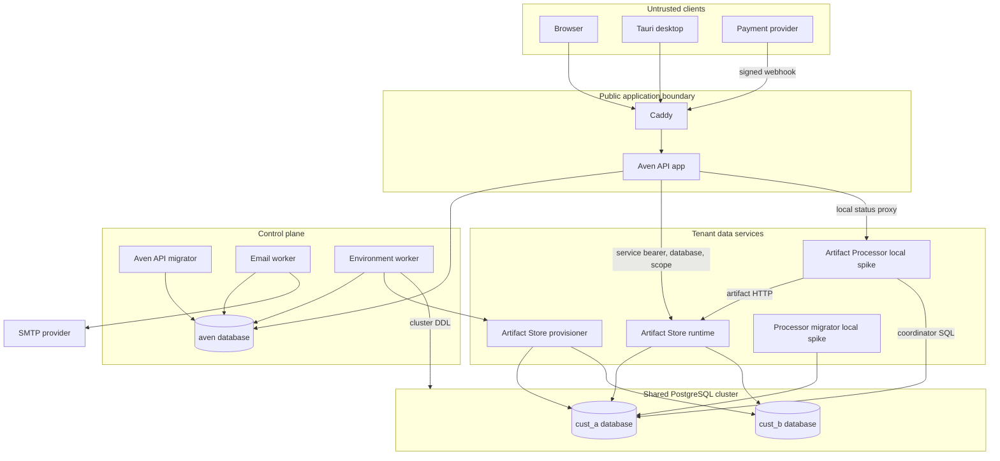
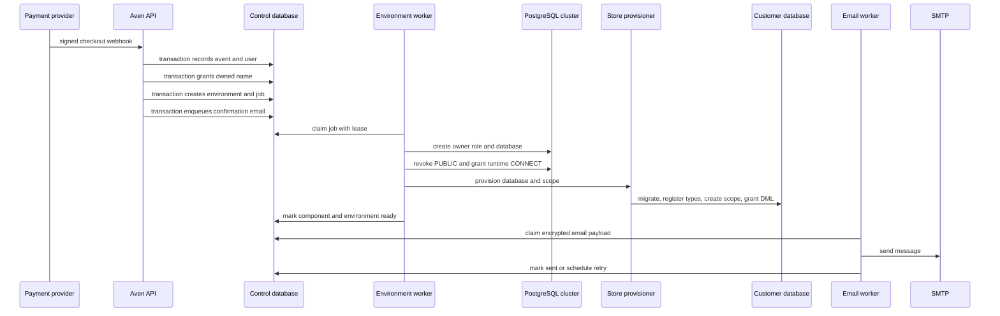
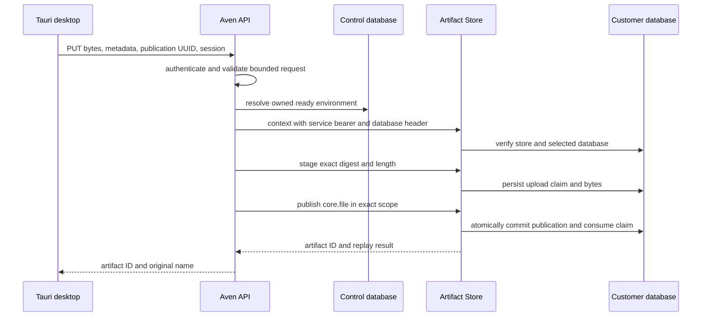
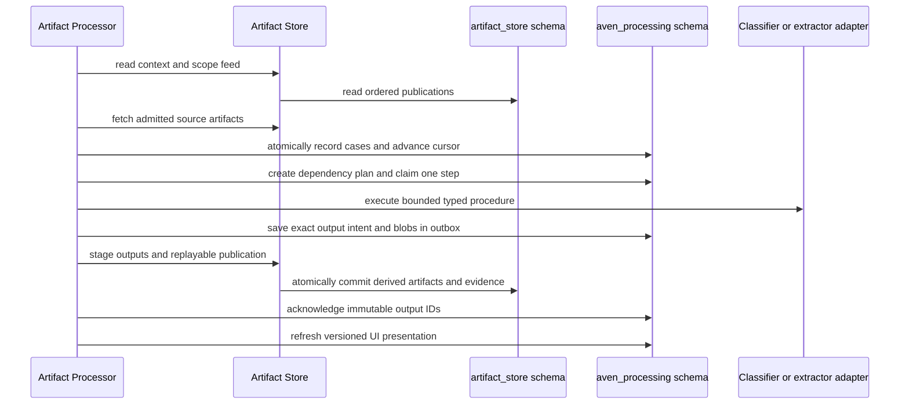
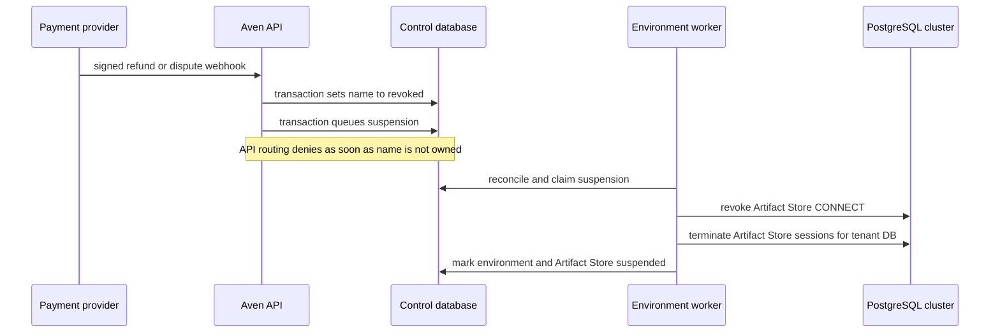
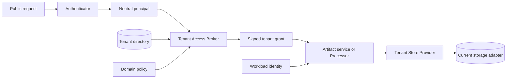
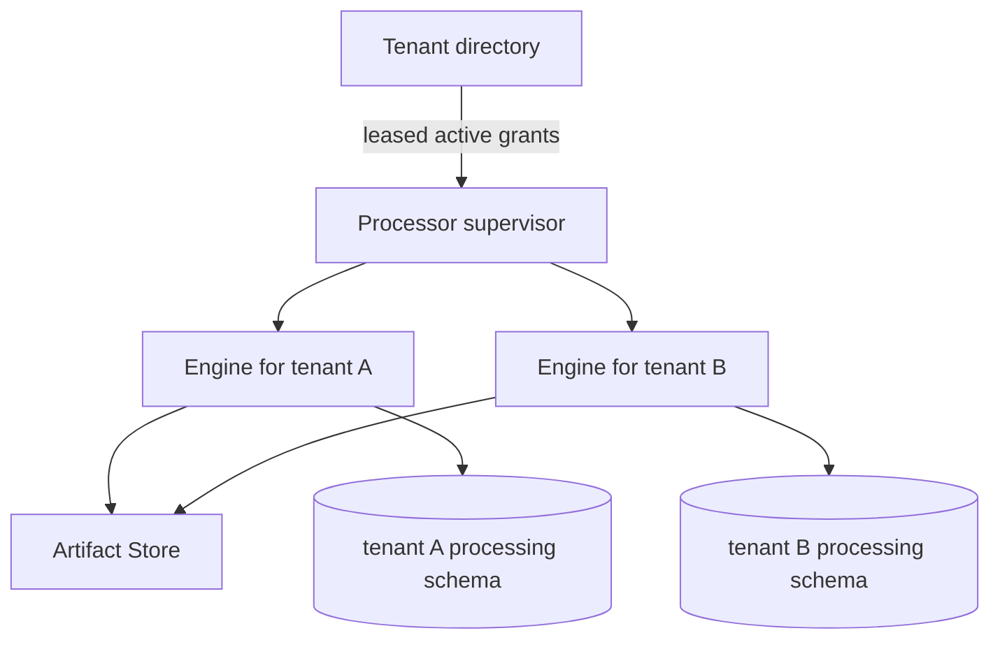

# Customer data-plane architecture

Status: current-state discovery and standardization proposal

Date: 23 August 2026

Implementation update: the first deployment rail described by this paper is now
implemented for Artifact Processor. The control plane tracks Processor rollout state,
the environment worker provisions and suspends both component roles, a private
authenticated directory exposes only ready `(database, scope)` bindings, and the
runtime uses bounded per-tenant pools. Static service credentials remain an explicitly
accepted transitional limitation; short-lived tenant grants are still the target.

The LLM-specific use of those grants, workload identity, and tenant billing accounts
are defined in
[`LLM-SERVICE-AND-METERING-ARCHITECTURE.md`](LLM-SERVICE-AND-METERING-ARCHITECTURE.md).
The separately owned Intent/Artifact provenance model is defined in
[`INTENT-ARTIFACT-LINEAGE-ARCHITECTURE.md`](INTENT-ARTIFACT-LINEAGE-ARCHITECTURE.md).

## Executive assessment

avenOS currently has a sensible, deliberately small foundation:

- the Aven API database is the **control plane** for identity, ownership, tenant
  routing, lifecycle jobs, audit, email, and worker health;
- every customer environment has a separate PostgreSQL database, which is the
  **tenant data plane**;
- Artifact Store owns `artifact_store` in each customer database;
- Artifact Processor owns `aven_processing` in the same customer database; and
- clients reach customer data only through authenticated Aven API routes. They never
  receive a database locator or an internal service credential.

The strongest existing design choice is the separation between a stable environment
identity, a physical customer database, and an Artifact Store scope. The weakest point
is that the trust transfer between services is still implicit: after Aven API has made
an end-user authorization decision, downstream services receive a broad static bearer,
a raw database-name header, and a scope. The credential is not cryptographically bound
to the user, tenant, operation, audience, or expiry.

The previous lifecycle asymmetry has been closed for the initial deployment: both
components now have provisioning, schema-version tracking, suspension, a shared
deployed runtime, and aggregate health checks. Processor execution remains deliberately
single-process and fair round-robin rather than a distributed worker fleet.

The proposed standard is a small **Tenant Runtime Rail**:

1. keep one stable opaque `tenantId`, currently the environment UUID;
2. separate authentication, authorization, tenant lookup, and physical routing;
3. pass a short-lived, audience- and action-bound tenant grant to downstream services;
4. give every tenant component the same provision, migrate, probe, suspend, and version
   lifecycle;
5. retain domain-specific repositories instead of inventing a generic database API;
6. classify every tenant and component as known good, converging, known error, or
   unknown; and
7. make restore and credential rotation explicit lifecycle operations.

This puts the current design on rails without introducing one process per customer, a
distributed workflow engine, row-level security, or a speculative universal storage
abstraction.

## Scope and terminology

This paper covers all processes that create, select, migrate, connect to, read from, or
write to either the control database or a customer database. It also covers workers
whose durable queues live in the control database, because they participate in the
same lifecycle and reliability model.

| Term | Meaning now | Important distinction |
| --- | --- | --- |
| User | Better Auth user in the control database | An authenticated user is not automatically authorized for a tenant |
| Name | Commercial entitlement in `names` | `owned` is currently the immediate access fence |
| Environment | Row in `customer_environments` | This is the current tenant directory and lifecycle record |
| Tenant | Logical customer data boundary | Use the environment UUID as its stable ID, not its database name |
| Customer database | PostgreSQL database named `cust_*` | A physical locator, not a business identity |
| Owner role | Per-database `cust_*_owner` role | `NOLOGIN`; it is a DDL ownership mechanism, not the customer's credential |
| Artifact scope | UUID in `artifact_store.artifact_scopes` | Currently equal to the environment UUID, but remains a separate concept |
| Component | A bounded context installed in a tenant database | Currently Artifact Store and, locally, Artifact Processor |
| Principal | Authenticated caller represented independently of provider | Proposed seam; Better Auth is the current provider |
| Tenant grant | Authorization decision usable by one downstream audience | Proposed replacement for an unbound static bearer plus routing headers |

## Current topology



The cluster is shared, but PostgreSQL databases are the tenant isolation unit. Artifact
blobs are stored as `bytea` in the same customer database as their metadata and
processing coordination state. There is no cross-customer blob deduplication.

## Process and authority inventory

| Process | Identity or credential | Control database authority | Customer database authority | External authority |
| --- | --- | --- | --- | --- |
| Aven API app | `aven_server`; Better Auth sessions at HTTP | Runtime access to auth, names, billing, environment, email-outbox, and audit tables according to `grants.sql` | No direct SQL | Calls Artifact Store and local Processor with static service bearers |
| Aven API migrator | `aven_migrator` | Owns the database/schema and runs Drizzle migrations plus role grants | None | None |
| Email worker | `aven_email_worker` | Claims and updates `email_queue`; maintains its heartbeat | None | Sends SMTP mail |
| Environment worker | `aven_environment_worker` plus separate provisioner URL | Reads desired state; claims environment jobs; writes environment status, logs, audit, heartbeat | Indirect privileged DDL through `aven_provisioner` and component provisioners | Calls Store and Processor provisioners with distinct static bearers |
| PostgreSQL provisioner | `aven_provisioner`, `CREATEDB`, `CREATEROLE`, `pg_signal_backend` | Connects to cluster administration database | Creates databases/roles, grants and revokes `CONNECT`, terminates sessions | None |
| Artifact Store provisioner | Static provisioner bearer; connects as `aven_provisioner` | None | Runs Artifact Store migrations, registers immutable types, creates scope, grants runtime DML | Internal HTTP only by deployment intent |
| Artifact Store runtime | Shared `aven_artifact_store` login and static service bearer | None | Lazy bounded pools to every granted `cust_*` database; Artifact Store DML only | Internal HTTP used by API and Processor |
| Processor provisioner | Static provisioner bearer; connects as `aven_provisioner` | None | Creates/migrates `aven_processing`, registers its scope, and grants runtime DML | Internal HTTP only by deployment intent |
| Artifact Processor | Shared restricted role `aven_artifact_processor`; directory, Store, and status bearers | No SQL; reads an authenticated private tenant directory over HTTP | Bounded pools to ready granted `cust_*` databases; `aven_processing` DML only | Reads and publishes artifacts through Artifact Store HTTP |
| Caddy | No database credential | None | None | TLS termination and request-size enforcement |
| Deployment workflow | GitHub environment, SSH, registry, and application secrets | Runs migrator and starts services | Indirectly starts provisioners | Deploys immutable container images |

Two boundaries are intentionally different:

- **DDL and lifecycle** use privileged provisioner identities and must never be
  reachable through ordinary data-plane requests.
- **Runtime data access** uses restricted component roles. A runtime role must not own
  schemas, create databases, create roles, or inherit privileged memberships.

## Data ownership

### Control database

The `aven` database is authoritative for:

- Better Auth users, sessions, accounts, passkeys, verification, setup links, and
  device authorization;
- names, holds, purchase sessions, payment events, subscriptions, and billing state;
- `customer_environments`, environment jobs, and environment logs;
- the email outbox;
- audit events; and
- worker heartbeats.

It is the source of truth for **who may use a tenant** and **where that tenant currently
lives**. It is not the source of truth for artifact contents or processing results.

### Customer database

Each `cust_*` database currently contains or may contain:

| Schema | Owner of semantics | Contents | Deployment state |
| --- | --- | --- | --- |
| `artifact_store` | Artifact Store | immutable publications, artifact graph, blobs, upload claims, scopes, type definitions, evidence, store epoch | Production lifecycle |
| `aven_processing` | Artifact Processor | feed cursor, cases, plan steps, attempts, fencing tokens, durable outbox, acknowledgements, model-call ledger, UI projection, provisioned scopes | Installed per ready customer database; semantic adapters remain a spike |

Putting both schemas in the same customer database is useful: a database-consistent
snapshot can include immutable artifact truth and the processor state derived from it.
It does not make the control database part of that snapshot, and it does not by itself
solve divergent restore, entitlement reconstruction, encryption, off-host retention,
or erasure.

### Stable identity versus physical location

The current mapping is:

```text
user.id
  -> names.owner_user_id where names.status = owned
  -> customer_environments.owner_user_id and name
  -> customer_environments.id                 stable tenant identity
  -> customer_environments.database_name      physical PostgreSQL locator
  -> customer_environments.artifact_scope_id  Artifact Store authorization boundary
```

`environment.id` and `artifact_scope_id` currently contain the same UUID. Code should
not treat that equality as an eternal identity law. A future tenant may have multiple
artifact scopes, a migrated database, or more than one bounded data service.

## Current authentication, authorization, and routing

These are four distinct decisions even though some current code performs them close
together.

| Layer | Question | Current answer |
| --- | --- | --- |
| Authentication | Who made this public request? | Better Auth resolves a cookie or bearer session; passkeys and device authorization establish sessions |
| Eligibility | May this account use protected product features? | `requireUser` requires a session and verified email; some auth routes additionally require any owned name |
| Tenant authorization | May this principal perform this action in this tenant? | Artifact routes call `artifactTargetForUser`, which requires one owned, ready environment with a current Artifact Store schema |
| Physical routing | Which storage instance serves it? | The same lookup returns `database_name` and `artifact_scope_id`; server-side clients forward them internally |
| Workload authentication | Which service is calling another service? | Static bearer tokens for Artifact Store, its provisioner, and Processor status |
| Database authentication | Which code may issue SQL? | Separate PostgreSQL login roles and grants |

### Public request boundary

`requireUser` calls Better Auth using the request headers and returns a small
`SessionUser`. Mutating browser requests must have the configured origin. A valid
Better Auth bearer session permits native/service-style mutations without the browser
origin header. Webhooks authenticate separately with the payment-provider signature.

The useful existing seam in `identity.ts` only isolates direct reads and writes of the
`user` table. Session authentication is still called directly from `requireUser`, so
the application is not yet independent of Better Auth.

### Tenant decision

`artifactTargetForUser` is currently the decisive policy and routing lookup. It:

1. filters environments by `owner_user_id`;
2. joins `names` and requires `names.status = 'owned'`;
3. refuses no environment with 403;
4. refuses more than one environment with 409 because no explicit tenant selector
   exists yet;
5. requires both environment and Artifact Store states to be `ready`; and
6. requires the installed Artifact Store schema version to be current.

This is fail-closed and keeps raw routing away from the client. However, it combines
authorization policy and infrastructure lookup in one method and returns no durable
authorization-decision identity for auditing or downstream verification.

### Downstream trust transfer

Artifact Store tenant mode first compares one static service bearer. It then accepts
`x-aven-artifact-database`, validates the `cust_*` grammar, opens or reuses a pool, and
checks that the route scope exists in that selected database.

This prevents an accidental database/scope mismatch, but the bearer is authorized for
all operations and all customer databases that the shared PostgreSQL role can access.
The store has no independent proof that Aven API authorized the current user for the
selected tenant. `rootActor: user:<id>` is useful provenance, but it is a claim made by
the trusted publisher, not independently authenticated end-user identity.

The store creates a one-minute `RequestContext` after accepting the request, but that
expiry is local publication context. It does not make the upstream bearer short-lived
or bind the caller's earlier authorization decision.

In the local stack, API uploads and Processor publications also use the same Artifact
Store bearer and the same fixed stable publisher (`aven-api` / `artifact-coordinator`).
Artifact Store therefore cannot distinguish those two workloads by authenticated
publisher identity. Run receipts can describe an executor, but they do not narrow the
shared publisher credential's authority.

Artifact Processor status uses another static bearer plus a database routing header.
It accepts the pair only when it exactly matches a current ready directory binding.
This prevents bearer-only arbitrary database selection, but does not yet provide the
audience-, action-, and expiry-bound tenant grant proposed below.

## Current data paths

### 1. Purchase, entitlement, and provisioning



The webhook event, user/name grant, environment job, audit record, and email enqueue
share control-database transactions at their respective call sites. Provisioning is
asynchronous and idempotent. There is deliberately no cross-database transaction
between the commercial grant and customer database creation.

The environment worker uses advisory locking, safe identifier validation, existing
role/database ownership checks, bounded SQL timeouts, leases, backoff, and periodic
level-triggered reconciliation. It marks ready only after customer DB reachability and
Artifact Store provisioning succeed.

### 2. Authenticated file upload



The API applies the 25 MiB policy, validates UUID/digest/content length/media type, and
rejects unsafe filenames. Artifact Store independently verifies the body digest and
length and applies concurrency and per-scope quotas.

Staging and publication are separate calls. A failure between them can leave a staged
claim, not a partial publication. Claims expire and become eligible for cleanup;
cleanup currently runs during later staging activity, so an idle scope has no strict
wall-clock reclamation guarantee. Reusing the same publication UUID with the same
intent replays the same result; conflicting reuse is rejected.

### 3. Artifact processing



The engine in `engine.rs` is logically several workers in one process:

- a feed discoverer;
- a deterministic planner;
- a leased step executor;
- an outbox publisher;
- a failure reconciler; and
- a presentation projector.

Coordinator writes are transactional. Feed advancement and source admission share a
transaction. Trigger keys deduplicate replay. Attempts have leases and fencing tokens.
Exact publication IDs and upload claims make outbox replay safe across ambiguous HTTP
failures. Permanent failures and retry exhaustion become explicit terminal states, and
the presentation retains its last valid narrow representation with a warning.

The processor reads artifact bytes and metadata only through Artifact Store. It writes
direct SQL only to its own `aven_processing` schema. This is a good bounded-context
boundary and should remain.

The real adapter path is still incomplete and local: deterministic inspection,
decomposition, native PDF text/layout, page signals, assembly, and aggregation exist;
OCR, page rendering, vision/LLM classification, and domain extraction remain adapter
work. A decoder child is bounded and credential-free but still shares the processor
network namespace.

### 4. Processing status API

An API route now exists for processing state by artifact ID. It authenticates the
user, resolves their current environment, and forwards only the resolved scope and
artifact ID to Processor. Processor checks its fixed local scope and reads the
projection from `aven_processing`. The desktop artifact card is not yet wired to poll
this route, so this is a tested service path rather than a complete current UI path.

There is not yet a general authenticated Aven API proxy for Artifact Store graph,
content, evidence, or feed reads. The internal Artifact Store HTTP API supports those
reads, but exposing them safely to the UI requires the same tenant authorization rail.

### 5. Refund, dispute, and suspension



The immediate security fence is the `names.status = 'owned'` predicate in API tenant
resolution. Physical suspension is eventual. Today it revokes and terminates only the
Artifact Store runtime role. It does not cover Processor because Processor is absent
from the production component lifecycle.

Suspension does not delete customer data, revoke the privileged provisioner, rotate
shared credentials, remove backups, or constitute an erasure workflow.

### 6. Email outbox

Producers may insert but not update `email_queue`; the Email worker may select and
update but cannot read auth/domain tables. Payloads are encrypted at rest in the queue.
Workers use `FOR UPDATE SKIP LOCKED`, leases, retry classification, exponential delay,
attempt limits, terminal `dead` state, and a heartbeat.

Delivery is **at least once**, not exactly once. SMTP can accept a message immediately
before the worker crashes or loses its lease and before `sent` commits. The queue may
then send it again. The stable `X-Aven-Queue-ID` helps correlation but is not a general
SMTP idempotency guarantee.

### 7. Migrations and deployment

Deployment currently orders work as follows:

1. start PostgreSQL;
2. ensure the provisioner has `pg_signal_backend`;
3. run the central Aven API migrator and refresh grants;
4. start and wait for Artifact Store provisioner, Artifact Store, API, and Caddy;
5. start Email and Environment workers; and
6. poll Aven API aggregate health and public smoke endpoints.

Artifact Store tenant migrations happen lazily through environment provisioning, not
by fanning deployment out to every database directly. The reconciler queues upgrades
for owned environments whose recorded schema version is old.

There is a fresh-cluster bootstrap ordering hazard. The base `db-init.sh` does not
create `aven_artifact_store`; Environment worker initialization creates/rotates that
role, but the deployment workflow waits for Artifact Store to become healthy before it
starts Environment worker. An existing cluster where the role already exists works.
A genuinely fresh cluster can deadlock the ordering at Artifact Store readiness. Role
bootstrap must become an explicit one-shot step before starting the runtime.

Processor migrations and runtime are only in the local Compose overlay. No production
secret, role creation, per-tenant migration, rollout status, service startup, health
gate, or suspension exists for Processor.

### 8. Health and observability

The public status route combines:

- Email and Environment worker heartbeat freshness;
- missing environment mappings;
- queued/running environment operations;
- terminal environment failures;
- expired environment leases;
- unexplained desired/observed drift; and
- Artifact Store reachability, using one ready tenant as a sample when available.

This is a useful aggregate deployment gate, but a successful sample does not prove
every customer database is reachable or current. Processor lag, processor schema,
processor terminal cases, backup freshness, capacity, and every-tenant probes are not
part of production health.

Worker heartbeat means process/database liveness, not downstream progress. Email can
keep heartbeating while SMTP verification or delivery fails. Environment worker can
keep heartbeating while a reconciliation pass repeatedly errors; its last reconciliation
is metadata but is not evaluated by the public health route. Local Processor readiness
checks its repository and Artifact Store context, not whether its background engine is
advancing the feed.

## Guarantees that hold now

The word “guarantee” below means enforced by current code or database constraints, not
merely intended by documentation.

| Guarantee | Enforcement boundary |
| --- | --- |
| A public artifact upload requires a valid, verified Better Auth user | Aven API `requireUser` |
| The browser cannot select a database, scope, service publisher, or service token | Tauri command and Aven API server-side configuration |
| New artifact access is denied immediately after a name ceases to be owned | `artifactTargetForUser` joins current name state |
| Ambiguous multi-environment routing fails instead of choosing silently | Lookup returns at most two and rejects the second |
| A database/scope mismatch fails closed | Artifact Store requires the scope row in the selected database |
| Each customer database denies `PUBLIC CONNECT` | Environment provisioning |
| Runtime roles are restricted and separate from migrator/provisioner roles | PostgreSQL role creation, safety checks, and grants |
| Artifact bytes match declared SHA-256 and length | Artifact Store upload transaction and constraints |
| An Artifact Store publication is atomic and immutable | One PostgreSQL transaction, foreign keys, uniqueness, and mutation-rejecting triggers |
| Publication replay is stable and conflicting identity reuse is rejected | Publisher/scope/request-digest binding |
| Artifact feed order is scope-local and monotonic | Locked scope sequence and unique constraint |
| Old feed epochs are rejected | Store epoch comparison |
| Artifact migration/type registration is replayable and detects definition drift | SQLx migrations and stored type-definition digest |
| Artifact upload resource use is bounded at configured limits | HTTP body limit, global semaphore, per-scope claim/staging/logical quotas |
| Environment provisioning is retryable and level-triggered | Durable jobs plus periodic reconciliation and idempotent component operations |
| An exhausted environment operation is visible as failed | Job and environment terminal state plus aggregate health |
| Processor source discovery and cursor advance are atomic | One customer-database transaction |
| Processor duplicate discovery for the same source/plan/version is suppressed | Unique trigger key |
| Processor attempt completion is fenced | Attempt identity, lease owner, and fencing token |
| Processor publication survives ambiguous failures without inventing new output IDs | Durable outbox and Artifact Store idempotent publication |
| A processor failure preserves the last presentable UI state | Versioned projection and explicit warning |

## Explicit non-guarantees

### Authorization and service identity

- A static Artifact Store bearer is not bound to a tenant, action, user, audience, or
  expiry. Possession grants the full service surface.
- Artifact Store trusts the caller's raw database header after grammar validation. It
  does not query the control-plane ownership decision or verify a signed tenant grant.
- The shared Artifact Store PostgreSQL login can access every customer database where
  it has been granted `CONNECT`; a credential compromise has cross-tenant blast radius.
- API and Processor share the same Artifact Store publisher identity in the local
  stack, so publisher-level audit and authorization cannot distinguish their calls.
- String bearer comparisons are exact comparisons, but the current adapters do not
  provide rotation overlap, revocation metadata, audience claims, proof of possession,
  or mTLS workload identity.
- Artifact `rootActor` records provenance supplied by Aven API. It is not independent
  end-user authentication by Artifact Store.
- There is no general action policy yet. Upload and processing-status handlers each
  embed their own ownership/readiness logic.
- Authorization is tenant/scope-wide. There is no collaborator, delegated role, or
  per-artifact ACL model yet.
- `artifactTargetForUser` checks `environment.owner_user_id` and that the joined name
  is still `owned`, but it does not also compare `names.owner_user_id`. The current
  product has no ownership-transfer flow, so those values are created together. A
  future transfer or manual repair would be unsafe until that invariant is enforced.

### Tenant lifecycle

- Control-plane ready state and physical data-plane state are eventually consistent,
  not atomically committed across databases and services.
- An Environment worker whose lease expires can continue an already-started external
  PostgreSQL or HTTP side effect. Completion is lease-checked, and operations are
  idempotent, but external work itself is not cancelled or fenced by a generation.
- A terminal failed environment remains failed until explicit retry; reconciliation
  does not endlessly retry it. This is intentional but needs operator tooling.
- Suspension currently revokes only Artifact Store runtime access. It is not a generic
  all-component fence.
- Environment `status = provisioning` is also used while a suspension job runs, which
  makes the state label less precise than the operation record.
- `artifact_store_schema_version` is the only component version in the control plane.
  Processor has no observed version. `effective_config` still writes Artifact Store
  schema version 1 while the current deployment constant is 2, so it must not be used
  as authoritative observed state.
- Ownership transfer, tenant rename, database relocation, region migration, and more
  than one selected environment per user have no complete contract yet.

### Processor production behavior

- Processor is local-only and fixed to one database and one scope.
- Production provisioning does not create its login, grant `CONNECT`, migrate
  `aven_processing`, record its version, or revoke its sessions.
- Processor background discovery has no production source of authorized tenant
  bindings.
- Its current source trigger admits `desktop-drop` based on artifact payload policy.
  A production trigger and rollout/budget policy are not defined.
- Real OCR, vision classification, and semantic extraction are not implemented. Mock
  behavior is not a correctness guarantee.
- The decoder subprocess lacks its final no-network sandbox.

### Storage, availability, and recovery

- Separate PostgreSQL databases provide a strong logical boundary, not separate
  clusters, hosts, encryption keys, backups, CPU, I/O, or failure domains.
- Bounded lazy pools prevent unbounded cached pools, but a shared process, role, and
  PostgreSQL cluster remain shared resources.
- Upload buffering is globally bounded, but content reads currently load a complete
  blob before applying a byte range and have no equivalent read semaphore. The public
  API does not expose this path yet; it needs read admission before doing so.
- Artifact Store readiness in tenant mode proves the cluster administration target is
  reachable. API health samples at most one ready tenant; neither proves every tenant.
- Email and Environment heartbeat freshness does not prove SMTP delivery or recent
  successful reconciliation, and Processor readiness does not prove feed progress.
- There is no declared production RPO/RTO, automated off-host encrypted backup,
  per-tenant restore drill, or coordinated control/data-plane restore procedure in this
  implementation.
- Store-epoch and exclusion tables provide protocol foundations, but no deployed
  divergent-history reconciliation operator is exposed. An old restore must not be
  treated as safe merely because the database starts.
- Suspension is not deletion. Retention, legal hold, export, erasure, and backup expiry
  are outside the current lifecycle.
- PostgreSQL-specific semantics are material: advisory locks, database roles, JSONB,
  arrays, `SKIP LOCKED`, triggers, `bytea`, and SQL transactions. The database is not
  currently replaceable by configuration.

### Delivery and exactly-once effects

- SMTP delivery is at least once and can duplicate across the send/ack crash window.
- Payment webhooks are deduplicated by event ID, but the system depends on the provider
  retrying non-2xx failures.
- No distributed transaction spans payment provider, SMTP, control DB, Artifact Store,
  Processor, and customer DB. Reliability comes from durable state, idempotency, and
  reconciliation at each boundary.

## Pitfalls and likely failure modes

| Risk | What happens now | Required operational interpretation |
| --- | --- | --- |
| Static Artifact Store token leaks | Attacker reaching the internal endpoint can try any syntactically valid `cust_*` database and scope | Cross-tenant incident; rotate token and DB credential, terminate sessions, audit all tenants |
| Raw database and wrong scope are paired | Store opens the named DB, then returns not found because scope is absent | Fail-closed, but still causes an avoidable pool/connect attempt |
| Name revoked during a provision call | API denies immediately; old worker may finish provisioning; reconciliation later suspends | Known converging, not an authorization hole at API |
| Environment lease expires mid-DDL | Another worker may replay idempotent work; stale worker may still run external steps | Usually converges, but lacks hard operation fencing |
| Processor crashes before publish | Durable outbox remains pending | Replay stages the same claims and publication |
| Processor crashes after publish before ack | Same publication is replayed | Artifact Store returns stable result and Processor acknowledges it |
| Artifact Store restored to older history | Old feed cursor conflicts only if epoch changes correctly; acknowledged publications may be absent | Keep writes fenced until explicit divergent-restore reconciliation |
| Control DB restored separately from tenant DB | Ownership, locator, component state, and actual schemas can disagree | Reconcile from a restore manifest; never infer ready from one side alone |
| SMTP accepted mail before worker ack | Lease recovery sends again | Duplicate is possible and must be harmless |
| One tenant fills shared cluster disk | Per-scope logical quota helps Artifact Store only | Cluster disk/WAL alerting and capacity admission still required |
| Shared runtime password rotates | Existing connections for that role are terminated across tenants | Intentional cluster-wide disruption; staggered credentials are not supported |
| Fresh production cluster starts | Artifact Store may wait for a runtime role that the not-yet-started Environment worker owns | Add a one-shot role bootstrap before waiting for Artifact Store |
| A user gains a second environment | Artifact routes return 409 | Safe but unusable until explicit tenant selection exists |
| A name is transferred while remaining owned | The stale environment owner may still satisfy current routing | No supported transfer until name owner, tenant owner, and routing generation change atomically |
| Processor projection is stale | A status caller sees the last committed presentation or an error | Projection is rebuildable, but production lag/age is not yet exposed |

## Proposed standard: the Tenant Runtime Rail

### Design rules

1. **The control plane authorizes; data services enforce the grant.** A data service
   must not infer ownership from a database name or trust a free-form user ID.
2. **Tenant identity is opaque and stable.** A physical database locator may change
   without changing `tenantId`.
3. **Authentication is replaceable before authorization.** Better Auth maps to a
   neutral principal; policy consumes that principal, not Better Auth objects.
4. **Authorization is replaceable before persistence.** Domain actions and resource
   references are explicit. Database roles are defense in depth, not product policy.
5. **Every component gets the same lifecycle contract.** A component that cannot be
   provisioned, probed, versioned, suspended, restored, and observed is not production
   ready.
6. **Repositories remain domain-specific.** Replace PostgreSQL behind bounded-context
   ports; do not spread a lowest-common-denominator query abstraction through domain
   code.
7. **Eventual consistency must have named states.** No “probably ready” state.

### Minimal application contracts

The Aven API needs three small ports. Names are illustrative; the contract matters more
than a shared package on day one.

```ts
interface Principal {
  subjectId: string
  kind: 'user' | 'service'
  assurance: string[]
  sessionId?: string
}

interface Authenticator {
  authenticate(request: Request): Promise<Principal | null>
}

type TenantAction =
  | 'artifact.publish'
  | 'artifact.read'
  | 'artifact.processing.read'
  | 'artifact.process'

interface TenantAccessBroker {
  authorize(input: {
    principal: Principal
    requestedTenantId?: string
    action: TenantAction
  }): Promise<TenantGrant>
}

interface TenantGrant {
  decisionId: string
  tenantId: string
  scopeId: string
  action: TenantAction
  actor: { kind: 'user' | 'service'; id: string }
  audience: string
  routingGeneration: number
  expiresAt: string
  dataLocator: { kind: 'postgres-database'; reference: string }
}
```

The first `Authenticator` adapter wraps Better Auth. A later OIDC, external identity
service, or another session system only has to produce the neutral principal. The
first `TenantAccessBroker` preserves today's policy: verified user, current owned name,
explicit or unique environment, ready component, correct action.

Do not put email addresses, provider session objects, SQL credentials, or mutable names
in downstream grants. `subjectId` must be an application-stable identifier. Preserve
the current `identity.ts` seam for user lifecycle, but route all session resolution
through `Authenticator` too.

### Bound tenant grant

For service-to-service calls, serialize and sign the `TenantGrant` with:

- issuer and key ID;
- audience;
- decision ID;
- tenant and scope IDs;
- one or a small allowlist of actions;
- actor identity for provenance;
- routing generation;
- issued-at and short expiry; and
- an opaque physical locator or a digest-bound locator reference.

Use asymmetric signatures so Aven API can sign and Artifact Store/Processor only need
verification keys. Retain workload authentication separately: mTLS or a rotatable
service credential proves which process connected, while the tenant grant proves what
that process may do for this request. Do not write a bespoke token format; use a
well-reviewed JWT/PASETO or signed-header implementation with strict algorithms,
audience checks, clock bounds, and key rotation.

A signed grant prevents accidental or forged cross-tenant routing at the HTTP
boundary. It does not contain a hostile process that already owns a cluster-wide
PostgreSQL runtime password. Keep credential lookup behind `TenantStoreProvider`; when
the threat model requires a smaller compromise radius, that provider can mint
short-lived per-tenant database credentials or use a database proxy. This is a later
hardening option, not a requirement for the first rail.

Near-term, the locator may still resolve to `cust_*`, but it is inside the signed grant
and interpreted only by a trusted `TenantStoreProvider`. Later it can become a managed
PostgreSQL endpoint, another region, or another storage adapter without changing public
routes or authorization policy.



### Tenant directory and component state

Keep `customer_environments` initially. Add a component table rather than adding more
`artifact_*` columns for every new service:

```text
customer_environment_components
  environment_id
  component_key              artifact-store or artifact-processor
  desired_state              ready or suspended
  observed_state             pending, provisioning, ready, suspended, failed, unknown
  desired_schema_version
  observed_schema_version
  observed_routing_generation
  last_probe_at
  last_error_code
  last_error_message
  updated_at
```

The environment row retains stable identity, owner, name, physical binding,
authoritative `routing_generation`, and overall roll-up. Existing Artifact Store
columns can be migrated into the component table and kept temporarily as compatibility
projections.

Use a monotonically increasing `routing_generation` whenever entitlement, location,
credentials, restore epoch, or suspension changes. Tenant grants carry that generation.
Services reject stale generations after refreshing their bounded binding cache. Short
grant expiry bounds the remaining invalidation window.

### Component lifecycle contract

The Environment worker should invoke registered, source-controlled component drivers:

```ts
interface TenantComponentDriver {
  readonly key: string
  readonly targetSchemaVersion: number
  ensureReady(context: ProvisioningContext): Promise<ObservedComponent>
  ensureSuspended(context: ProvisioningContext): Promise<ObservedComponent>
  probe(context: ProbeContext): Promise<ObservedComponent>
}
```

This is a lifecycle abstraction, not a general remote-service framework. Each driver
owns concrete, idempotent steps and validates its own runtime role. Initially register:

- database foundation: owner role, DB, `PUBLIC` revocation, base connectivity;
- Artifact Store: role access, migrations, type catalog, scope, runtime probe; and
- Artifact Processor: role access, migrations, feed/projection readiness, runtime
  registration.

Suspension iterates every registered data-plane component, revokes its role's
`CONNECT`, terminates its sessions, invalidates its routing generation, and records an
observed state. Provisioner authority remains separate and audited.

Component jobs must carry the expected tenant generation. Check it before and after an
external side effect. PostgreSQL DDL remains idempotent and advisory-locked, but a stale
worker must be unable to publish success for another generation. A changed desired
state schedules the compensating operation.

### Multi-tenant Processor

Do not deploy one always-on process per customer. Preserve a shared Processor runtime
with bounded per-tenant pools, but do not let it invent tenant bindings.

Add a control-plane work-source boundary that leases active tenant bindings to
Processor. Each lease contains a renewable `artifact.process` grant. A small supervisor
maintains a bounded set of per-tenant engines; each engine keeps today's scope-local
feed cursor, planner, leases, outbox, and projection in that tenant's `aven_processing`
schema.



An alternative central queue can trigger exact tenant/artifact work later. The first
production version can retain feed polling if tenant leases are bounded and fair. The
important invariant is that Processor receives authorized bindings from the control
plane, not a cluster-wide list it derives from PostgreSQL names.

Status requests use an `artifact.processing.read` grant and resolve the same tenant
binding as the background engine. This removes the current fixed-scope special case.

### Persistence replaceability without over-abstraction

Define ports at bounded-context semantics:

- `ControlPlaneRepository` for identity-adjacent tenant directory and lifecycle jobs;
- `ArtifactRepository` for immutable publication, feed, content, and evidence;
- `ProcessingRepository` for cases, leases, fenced attempts, outbox, and projections;
  and
- `TenantStoreProvider` for opening the correct implementation from an authorized
  binding.

Do not expose `query(sql)`, tables, transactions, JSONB, or PostgreSQL role names in
domain interfaces. Do expose the semantics a replacement must provide: atomic commit,
unique idempotency keys, compare-and-swap/fencing, ordered cursors, immutable records,
bounded blobs, and transactional outbox acknowledgement.

PostgreSQL remains the only implementation until a concrete reason justifies another.
A replacement database is acceptable only if it passes the same conformance suite. If
it cannot implement the transaction and fencing contract, it is not a drop-in adapter;
the domain guarantee must be redesigned explicitly.

### Known-state model

Every tenant component should reduce to one of four operational classes:

| Class | Definition | API behavior |
| --- | --- | --- |
| Known good | Desired and observed state match; version current; fresh successful probe | Permit actions covered by a fresh grant |
| Converging | One current-generation operation has a valid lease and bounded deadline | Return retryable not-ready; expose operation state internally |
| Known error | Attempts exhausted or a permanent invariant failed; stable error code recorded | Deny; require explicit repair or retry |
| Unknown | Probe stale, generation mismatch, expired lease not reclaimed, or state cannot be read | Deny and alert; reconciliation must classify it |

“Queued forever,” “ready according to only the control DB,” and “a container is alive”
are not known-good states.

For Processor, expose at least:

- schema version;
- runtime registration and last heartbeat;
- store epoch and feed cursor per tenant;
- feed lag or last successful poll time;
- active/running/failed case counts;
- oldest pending outbox age;
- model/adapter budget state; and
- projection version and rebuild state.

### Restore contract

A production restore must be a tenant lifecycle operation:

1. set desired state to suspended and increment routing generation;
2. stop issuing grants and terminate every component runtime session;
3. select and verify the customer-database backup plus its manifest;
4. restore Artifact Store and Processor schemas together;
5. enter Artifact Store reconciliation mode with a new store epoch;
6. reconcile acknowledged and ambiguous publications or exclude their old identities;
7. reset/replay Processor feed state against the new epoch and rebuild projections as
   needed;
8. compare every component schema version and run idempotent upgrades;
9. verify ownership, scope, artifact graph, blobs, processor invariants, and quotas;
10. reconcile the control-plane binding and component observations; and
11. increment generation again, mark known good, and resume grant issuance.

Back up the control plane independently with a manifest that records tenant IDs,
physical locators, routing generations, component versions, and relevant store epochs.
Restoring either side without reconciling the manifest leaves the tenant unknown and
write-fenced.

## Security baseline for the rail

- Keep all data-plane and provisioner endpoints off the public network.
- Separate workload identity from end-user/tenant authorization grants.
- Give each component a distinct runtime role and distinct workload credential.
- Validate identifiers both before interpolation and with database constraints.
- Bind grants to one audience and the smallest action set; keep them short-lived.
- Redact credentials, raw authorization headers, cookies, database URLs, and sensitive
  extracted content from logs.
- Audit decision ID, tenant ID, actor, action, component, result, and routing generation;
  do not audit file contents or model prompts by default.
- Apply quotas per tenant and global admission limits per service. Add cluster disk,
  WAL, connection, latency, and backup alarms.
- Run hostile file decoders without network, credentials, writable host paths, or
  unnecessary syscalls; bound CPU, memory, pixels, object count, output, and time.
- Treat document/model content as untrusted data. Models receive no general tools,
  URLs, database credentials, or authority to choose tenant/resource IDs.
- Store provider request/response receipts and evidence IDs without retaining more
  customer content than policy permits.
- Exercise wrong-tenant and stale-generation tests in every data service, not only at
  the API boundary.

## Recommended delivery sequence

### Phase 0: codify current invariants

- Adopt `environment.id` as the explicit `tenantId` vocabulary.
- Add architecture tests for wrong user, wrong tenant, wrong database/scope pairing,
  revoked name, stale schema, and ambiguous environment selection.
- Correct `effective_config` version drift or stop treating it as current observation.
- Move Artifact Store role creation/rotation into an explicit deployment bootstrap
  that runs before Artifact Store readiness on a fresh cluster.
- Document that SMTP is at least once and make repeated transactional emails harmless.

### Phase 1: component lifecycle rail

- Add `customer_environment_components` and `routing_generation`.
- Convert Artifact Store lifecycle to the component driver contract without changing
  its runtime behavior.
- Add Artifact Processor role/schema/version/probe/suspend drivers.
- Make aggregate health classify every component into the four known-state classes.
- Add operator retry, probe, and per-tenant diagnostic views with safe redaction.

### Phase 2: neutral principal and access broker

- Wrap Better Auth behind `Authenticator`.
- Move tenant action policy and selection into `TenantAccessBroker`.
- Require explicit `tenantId` once multiple environments are supported.
- Record a decision ID and routing generation for every customer-data action.

### Phase 3: bound downstream authorization

- Introduce short-lived signed tenant grants and verification in Artifact Store and
  Processor.
- Bind database locator, scope, action, audience, actor, and generation.
- Split Artifact Store API and Processor workload identities; implement key rotation.
- Keep static bearers only as a temporary workload-auth layer, then prefer mTLS or
  managed workload identity when infrastructure supports it.

### Phase 4: multi-tenant Processor production slice

- Add the Processor supervisor and leased tenant work source.
- Reuse bounded tenant-pool behavior and preserve one engine's current transactional
  state machine per tenant.
- Add production Compose, secrets, deployment ordering, limits, health, rollback, and
  suspension.
- Gate real adapters separately from coordinator deployment; initially run deterministic
  stages only or an allowlisted canary.

### Phase 5: recovery and portability

- Declare RPO/RTO and build encrypted off-host backup plus restore drills.
- Implement write-fenced divergent restore and publisher reconciliation.
- Build repository conformance suites before introducing another auth provider or
  database implementation.
- Replace one adapter at a time; do not run a simultaneous identity and storage
  migration without an explicit dual-read/cutover plan.

## Required test matrix

| Area | Minimum scenario |
| --- | --- |
| Authentication | Cookie, native bearer, expired/revoked session, unverified account, provider outage |
| Authorization | Non-owner, revoked owner, two environments without selector, stale routing generation |
| Tenant isolation | Valid tenant A grant with tenant B DB, scope, artifact ID, status ID, and feed cursor |
| Provisioning | Fresh DB, partial role creation, partial migration, repeated call, type drift, wrong existing owner |
| Suspension | Before DB exists, during provision, during upload, with live Store and Processor sessions |
| Worker recovery | Lease expires before effect, during effect, after effect, and before control-plane completion |
| Artifact publication | Crash before stage, after stage, after commit, before response, conflicting replay |
| Processor | Feed replay, epoch change, expired attempt, stale fencing token, outbox every crash window, projection rebuild |
| Capacity | Pool eviction, many idle tenants, one noisy tenant, quota race, cluster disk pressure |
| Credentials | Signing-key overlap, service-secret rotation, stale grant, wrong audience, revoked workload |
| Restore | Exact restore, older divergent restore, missing control-plane row, stale component version, excluded publication |
| Email | SMTP timeout before acceptance, acceptance before ack, lease loss, permanent failure, duplicate delivery |

## Decisions to adopt

The following choices fit the current implementation and preserve simplicity:

1. The environment UUID is the stable tenant ID.
2. One PostgreSQL database remains the customer isolation and backup unit.
3. Each bounded context owns one schema and one runtime role in that database.
4. Shared service processes may serve many tenants through bounded pools; there is no
   process-per-customer requirement.
5. Aven API/control plane remains the sole entitlement and tenant-directory authority.
6. Data services enforce short-lived tenant grants and never accept client-selected
   physical routing.
7. No row-level security is required inside a one-tenant database for this design;
   schema/table grants and service boundaries remain the database security model.
8. PostgreSQL remains the implementation, while domain repositories and tenant-store
   providers are the replacement seams.
9. Artifact Store and Processor remain separate bounded contexts even though they share
   a database and deployment repository.
10. Every asynchronous boundary uses durable intent, idempotency, bounded retry, and an
    explicit terminal state; exactly-once external effects are not claimed.

## Source map

The current-state findings are grounded primarily in:

- [Aven API authentication](services/aven-api/src/lib/server/auth.ts)
- [public API authentication helper](services/aven-api/src/lib/server/api.ts)
- [identity table seam](services/aven-api/src/lib/server/identity.ts)
- [tenant directory and routing](services/aven-api/src/lib/server/environments/service.ts)
- [environment reconciliation worker](services/aven-api/src/lib/server/environments/worker.ts)
- [database and Artifact Store provisioning](services/aven-api/src/lib/server/environments/provisioning.ts)
- [database role grants](services/aven-api/migrations/grants.sql)
- [file publication coordinator](services/aven-api/src/lib/server/artifacts/service.ts)
- [processing status proxy](services/aven-api/src/lib/server/artifacts/processing.ts)
- [email outbox worker](services/aven-api/src/lib/server/email/worker.ts)
- [Artifact Store HTTP and tenant router](services/artifact-store/crates/server/src/lib.rs)
- [Artifact Store PostgreSQL adapter](services/artifact-store/crates/postgres/src/lib.rs)
- [Artifact Processor engine](services/artifact-store/crates/processor/src/engine.rs)
- [Artifact Processor repository](services/artifact-store/crates/processor/src/repository.rs)
- [Artifact Processor runtime](services/artifact-store/crates/processor/src/main.rs)
- [production Artifact Store overlay](services/aven-api/docker-compose.artifact-store.deploy.yml)
- [local Artifact Processor overlay](services/aven-api/docker-compose.artifact-store.yml)
- [existing per-customer Artifact Store paper](services/artifact-store/PER-CUSTOMER-ARCHITECTURE.md)
- [processing implementation report](services/artifact-store/ARTIFACT-PROCESSING-IMPLEMENTATION-REPORT.md)
