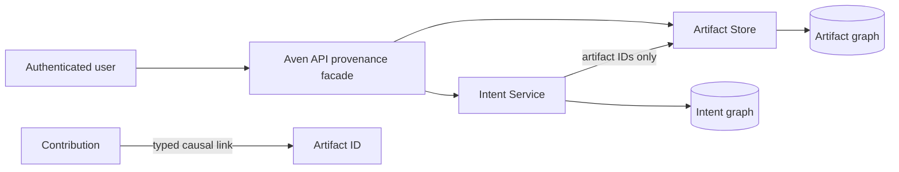
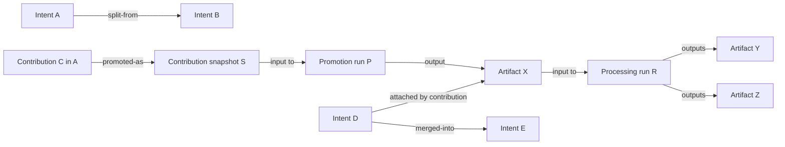

# Intent and artifact lineage architecture

Status: proposed architecture for implementation on `feat/llm-metering-lineage`.

This paper defines lineage across intents, contributions, skill runs, Artifact Store
publications, production runs, artifacts, structural references, and evidence. It does
not define model-provider metering, pricing, budgets, or billing. Those belong to the
LLM Service and are specified in
[`LLM-SERVICE-AND-METERING-ARCHITECTURE.md`](LLM-SERVICE-AND-METERING-ARCHITECTURE.md).

## 1. Outcome and ownership

The system needs two authoritative graphs because work context and information
provenance answer different questions:

- **Intent Service** owns work history: intents, contributions, intent relations, skill
  runs, and artifact membership.
- **Artifact Store** owns immutable information provenance: publications, production
  runs, exact run inputs and outputs, structural references, and evidence.

Aven API provides a tenant-authorized facade that composes bounded results from both
services. Neither service writes the other's tables or treats copied presentation data
as independent truth.



## 2. Current state

### 2.1 Artifact Store

Artifact Store already persists the stronger half of the lineage model:

- immutable publication and artifact occurrence identities;
- production runs with ordered input artifacts and bound outputs;
- structural artifact references;
- output-to-input evidence locators; and
- database constraints that keep run inputs within one scope and earlier history.

The Processor declares source and intermediate artifacts as exact run inputs, so the
ancestry from uploaded file through pages, OCR, classification, extraction, and
validation is retained.

The missing part is queryability. The core contract specifies producer, input, output,
consumer, derivation, reference, evidence, and bounded lineage reads, but the current
server exposes only context, type, upload, publication, feed, exact artifact, and
content routes.

### 2.2 Intent Service

Intent Service v1 persists:

- intent lifecycle state and optimistic version;
- ordered contributions;
- a current intent-to-artifact projection;
- File-skill presentation; and
- merge relations plus `merged_into_id`.

The current merge implementation copies artifact projection rows into the target,
marks sources merged, and appends one target contribution containing source IDs. It
does not expose the source contribution histories through a typed lineage API, and the
copied membership loses which source relation introduced it.

There is no split relation, contribution promotion, causal attach command, reply/skill
run linkage, or general intent-lineage query. `attached` is an allowed membership value
but lacks a complete command and causal record.

### 2.3 Intent declaration

File upload atomically publishes `core.file@1` and `intent.declaration@1`. Intent Service
infers their relationship because both occur in one publication. The declaration type
currently has no structural source reference, so Artifact Store itself cannot traverse
from the declaration to the file.

## 3. Lineage vocabulary

“Related” is too weak. Each edge has a distinct owner and meaning:

| Edge family | Owner | Meaning |
| --- | --- | --- |
| Intent relation | Intent Service | Work was merged, split, continued, or derived into another intent |
| Contribution causation | Intent Service | A contribution replies to, summarizes, corrects, or selects another contribution |
| Intent artifact membership | Intent Service | An artifact is a source, attachment, reference, control object, or skill output in an intent |
| Skill execution | Intent Service | A contribution triggered a skill run that produced contributions or artifacts |
| Production lineage | Artifact Store | Existing artifacts were exact inputs to a run producing new artifacts |
| Structural reference | Artifact Store | One immutable artifact composes or points to another |
| Evidence | Artifact Store | An input locator supports an output locator |

These edge kinds must survive storage and API serialization. A generic `related-to`
edge cannot distinguish derivation from mention, composition, membership, or evidence.

## 4. Architectural decisions

1. Intent and Artifact Store remain separate authoritative graphs.
2. Stable UUIDs and typed bridge links connect them; database schemas do not use
   cross-service foreign keys.
3. Merge and split preserve source histories and identifiers.
4. Contributions are append-only occurrences. Promotion creates an artifact rather
   than mutating a contribution into one.
5. Artifact membership is contextual, not production lineage.
6. Current membership projections may be copied or cached for efficient UI reads only
   when their causal origin is retained.
7. Every traversal is tenant-authorized, bounded by depth and nodes, cursor-based, and
   explicit when truncated.
8. A composed graph preserves service-local edge types and high-water boundaries.

## 5. Intent relations

Replace the merge-only relation with append-only typed relations:

```text
intent_relations
  id
  scope_id
  relation_kind       merged-into | split-from | continued-as | derived-from
  source_intent_id
  target_intent_id
  operation_contribution_id
  created_by_kind
  created_by_id
  created_at
```

Both intents belong to the same scope. Self-relations are rejected. Relation kinds that
require acyclicity enforce it transactionally. The existing `merge_relations` and
`merged_into_id` remain compatibility projections during migration.

### 5.1 Merge

A merge:

1. locks and validates target/source versions in one transaction;
2. appends one `merged-into` relation per source;
3. appends an operation contribution to the target;
4. changes source lifecycle state without deleting source history; and
5. updates any compatibility membership projection with explicit inheritance origin.

It does not copy source contribution text into new target contributions. A composite
timeline may show source histories under their original IDs and sequences.

### 5.2 Split

A split creates one or more new intent IDs and `split-from` relations. The command
records which source contributions and artifact memberships were selected as context.
It does not move, renumber, or delete them from the source.

The new intent may append small `selected-from` contributions that link to exact source
contribution IDs. Duplicating source text as unlinked history is forbidden.

## 6. Contribution causation

Extend contributions with stable contributor identity, status, and common direct
causal fields:

- `contributor_id`;
- `status` such as accepted, interrupted, or superseded;
- `reply_to_contribution_id`;
- `source_contribution_id`;
- `skill_run_id`; and
- safe producer provenance.

Use a typed `contribution_links` table for multiple sources or targets:

```text
contribution_links
  scope_id
  source_contribution_id
  target_contribution_id
  relation_kind       mentions | summarizes | corrects | selected-from
  ordinal
  attributes
  created_at
```

Payload JSON remains presentation data. An artifact ID or contribution ID appearing in
payload is not an authoritative link.

## 7. Artifact membership history

The current `(intent_id, artifact_id)` table is a current projection. Add append-only
membership events:

```text
intent_artifact_events
  id
  scope_id
  intent_id
  artifact_id
  event_kind             added | removed | superseded
  relation               source | attachment | reference | skill-output | control
  caused_by_contribution_id
  caused_by_skill_run_id
  inherited_via_relation_id
  source_event_id
  created_by_kind
  created_by_id
  created_at
```

This preserves multiple valid reasons for the same artifact to belong to one intent.
The current projection may still expose one visible row per intent/artifact, but it
must not erase membership events.

When merge compatibility copies membership into a target projection, the event retains
`source_event_id` and `inherited_via_relation_id`. Future reads can derive inherited
membership without copying it.

Artifact existence and scope are validated through Artifact Store. Intent Service does
not duplicate artifact payload truth or create a database foreign key into the
Artifact Store schema.

## 8. Contribution-to-artifact links

Add typed links:

```text
contribution_artifact_links
  scope_id
  contribution_id
  artifact_id
  relation_kind       mentions | attaches | promoted-as | generated | supersedes
  production_run_id
  ordinal
  attributes
  created_at
```

`production_run_id` is populated when Artifact Store materialized the relation through
a run. It remains null for a pure mention or contextual attachment.

An external service receipt, including an opaque model-request ID, may be retained as
safe producer provenance on the contribution or production receipt. It is not an
Intent/Artifact graph owner and does not change the edge taxonomy here.

## 9. Contribution promotion

A contribution never changes identity and “becomes” an artifact. Promotion creates a
new immutable occurrence and retains the source contribution.

### 9.1 Verbatim promotion

Publish `intent.contribution-snapshot@1` containing:

- tenant-local contribution ID;
- relevant immutable content and content digest;
- contributor identity/provenance permitted by policy;
- original creation time; and
- promotion policy version.

The snapshot itself is the promoted artifact and receives a `promoted-as` link.

### 9.2 Transformed promotion

Use the snapshot as an exact Artifact Store run input:

```text
Contribution C
  -> contribution snapshot artifact S
  -> production run P(input S)
  -> domain artifact X
```

This keeps Artifact Store inputs artifact-native and independently traversable. Putting
only a contribution ID in a free-form run receipt would create a weaker edge that
Artifact Store cannot validate.

### 9.3 Cross-service consistency

Promotion is an idempotent saga:

1. Intent commits a promotion command and transactional outbox record with stable IDs.
2. The publisher creates the snapshot publication idempotently.
3. Optional transformation publishes a run using the snapshot input.
4. Intent records the typed link and membership event.
5. A reconciler repairs either side after an ambiguous response.

Intent never marks promotion complete until the exact artifact occurrence is readable.

## 10. Reusing artifacts in later intents

Attaching an existing artifact to another intent records contextual membership. It
does not create false production lineage.

If a skill later processes that artifact, its Artifact Store run declares the original
artifact as an exact input. Derived outputs then have genuine production ancestry. The
intent's skill-output membership records why those outputs appear in that work context.

The `intent.declaration@1` type should gain a required structural `source` reference to
its `core.file@1` occurrence. Atomic co-publication remains valuable, while the explicit
reference makes the relation queryable within Artifact Store.

## 11. Artifact Store graph reads

Implement the routes already specified in the Artifact Store core contract:

```text
GET /v1/scopes/{scopeId}/runs/{runId}
GET /v1/scopes/{scopeId}/artifacts/{artifactId}/producer
GET /v1/scopes/{scopeId}/artifacts/{artifactId}/producer-inputs
GET /v1/scopes/{scopeId}/artifacts/{artifactId}/sibling-outputs
GET /v1/scopes/{scopeId}/artifacts/{artifactId}/consuming-runs
GET /v1/scopes/{scopeId}/artifacts/{artifactId}/direct-derivations
GET /v1/scopes/{scopeId}/artifacts/{artifactId}/references
GET /v1/scopes/{scopeId}/artifacts/{artifactId}/referrers
GET /v1/scopes/{scopeId}/artifacts/{artifactId}/supporting-evidence
GET /v1/scopes/{scopeId}/artifacts/{artifactId}/evidence-usages
GET /v1/scopes/{scopeId}/artifacts/{artifactId}/lineage
```

The PostgreSQL graph is already authoritative. The work is repository queries, bounded
resource DTOs, HTTP routes, SDK support, pagination, and tenant-isolation tests.

Lineage requests specify direction, edge kinds, maximum depth, maximum nodes, and a
cursor bound to scope, epoch, filters, and first-page high-water. Exhaustion returns an
explicit truncation marker.

## 12. Intent Service lineage reads

Add:

```http
GET /v1/scopes/{scopeId}/intents/{intentId}/lineage
```

Parameters include direction, intent/contribution edge kinds, maximum depth, maximum
nodes, contribution window, artifact inclusion, and cursor.

Intent detail also exposes merge/split relations and source intent links even when a
source no longer appears in the default active-intent list. Source history remains
readable by exact authorized ID.

A composite timeline presents inherited source histories under their original intent,
contribution ID, sequence, and time. It never invents one total sequence across merged
intents.

## 13. Aven API provenance facade

After both service-local APIs exist, add:

```http
GET /api/provenance/graph?rootKind=intent&rootId=<uuid>&maxDepth=4&maxNodes=250
```

Aven API authenticates the user, resolves the tenant, authorizes graph access, and
composes Intent and Artifact Store results.

Every response contains:

- tenant and scope selected by the server;
- typed nodes and edges retaining their owning service;
- service-local cursors and high-water boundaries;
- `truncated` and the reason;
- stable IDs for exact follow-up reads; and
- omitted counts only when they cannot reveal unauthorized existence.

Traversal limits apply before hydration. Authorization occurs before revealing node
existence, counts, referrers, consumers, or truncation caused by an unauthorized node.

The facade is a query composition layer, not a third provenance database. A later
read-optimized index is allowed only as a rebuildable projection with explicit source
high-water marks.

## 14. Example lineage



A composed query explains that E inherits D's work context, D attached X, X was
promoted from C in A, A split into B, and Y/Z were produced from X. Split, merge,
promotion, membership, and production remain visibly different claims.

Today only `X -> R -> Y/Z` is strongly preserved when R declares X as an input. Merge
is partially reconstructable from Intent SQL. Split, promotion, causal attachment, and
the composed query are absent.

## 15. Failure handling and reconciliation

No distributed transaction spans Intent Service and Artifact Store. Cross-service
operations use stable IDs, transactional outboxes, idempotent commands, and
reconciliation.

Required rules:

- Allocate contribution, relation, publication, and artifact IDs before remote calls.
- Persist an outbox item in the same transaction as the initiating contribution or
  skill command.
- Treat timeouts as ambiguous until an exact read proves absence.
- Do not create membership merely because text or a model mentioned an artifact ID.
- Do not mark promotion complete until the artifact is readable.
- Do not delete source history after merge or split.
- Preserve the last valid current projection while reconciliation is pending.
- Replaying a projector repairs missing projections without adding duplicate events.

## 16. Security and privacy

- Every public query and command requires authenticated tenant authorization.
- Scope, database locator, and service credentials remain server-selected.
- Intent and artifact UUIDs are identifiers, not capabilities.
- Cross-tenant negative tests cover every exact read, traversal direction, count, and
  cursor continuation.
- Contribution bodies and artifact payloads are hydrated only after graph admission.
- Traversal limits prevent graph amplification and cyclic-reference denial of service.
- Promoted contribution snapshots follow tenant retention and visibility policy.
- Contributor identity and safe provenance are durable, but secrets, access tokens,
  hidden reasoning, and raw provider responses are excluded.

## 17. Guarantees and non-guarantees

### Target guarantees

- Every derived artifact identifies its exact production run and ordered inputs.
- Structural reference, evidence, membership, and production remain distinct.
- Merge and split preserve source intent and contribution identities.
- Promotion retains a typed contribution-to-artifact link.
- Inherited membership retains the relation and source event that introduced it.
- Queries are bounded, tenant-authorized, cursor-based, and explicit when truncated.
- Projection replay cannot create duplicate lineage events.

### Explicit non-guarantees

- Intent membership does not imply production derivation.
- Structural reference does not imply evidence or causation.
- A merged intent does not rewrite source contributions into one total order.
- A contribution promotion proves origin, not the semantic correctness of the result.
- Archiving or deleting an intent does not automatically delete referenced artifacts.
- The composed facade does not provide a transactionally simultaneous snapshot across
  both services; it reports each service's high-water boundary.

## 18. Implementation slices

### Slice 1: Artifact graph reads

1. Implement run, producer/input/output, consumer/derivation, reference, evidence, and
   bounded lineage repositories.
2. Add closed DTOs, HTTP routes, and SDK pagination.
3. Add graph amplification and cross-tenant tests.
4. Add the explicit declaration-to-file source reference for new publications.

Acceptance: source file to final extraction ancestry and evidence are queryable through
authorized HTTP without direct database access.

### Slice 2: Intent causal schema

1. Add intent relations, contributor identity, contribution links, artifact membership
   events, and contribution-artifact links.
2. Backfill current merge and membership rows with explicit legacy origin.
3. Keep current detail DTOs as compatibility projections.
4. Add replay, concurrency, and same-scope constraints.

Acceptance: existing intents read identically while new causal events retain their
origin and cannot cross scopes.

### Slice 3: Merge, split, attach, and promotion

1. Migrate merge writes to typed relations and inherited membership events.
2. Add split commands with selected-source links.
3. Add causal attach/reference commands.
4. Add contribution snapshot type, promotion outbox, and reconciliation.

Acceptance: merge, split, reuse, and promotion preserve the example graph after retry
and restart without copying source contributions as new truth.

### Slice 4: Query composition

1. Add Intent lineage and composite timeline APIs.
2. Add the Aven API provenance facade.
3. Add bounded graph UI navigation.
4. Add multi-service high-water and truncation tests.

Acceptance: an authorized user can start from an intent, contribution, or artifact and
follow each typed relationship across both services without tenant leakage.

## 19. Deployment and rollback

Deploy additively:

1. Artifact Store read APIs;
2. Intent causal tables and dual-write compatibility projections;
3. backfill with explicit legacy provenance;
4. merge/split/attach commands;
5. promotion saga; and
6. composed facade and UI.

Rollback may restore an older reader or writer, but it never deletes relation,
membership, contribution-link, production-run, reference, or evidence records. New
writers keep compatibility projections until the rollback window closes.

## 20. Product decisions still required

- Whether merged source timelines are expanded automatically or on demand.
- Whether split context copies only links or also creates human-readable excerpts.
- Which contribution kinds may be promoted without confirmation.
- Retention and visibility rules for contribution snapshot artifacts.
- Which tenant roles may inspect contributor and producer provenance.
- Maximum default graph depth/node count for desktop and web clients.
