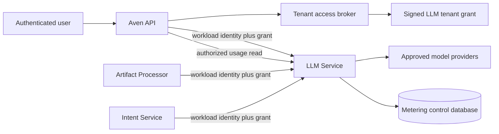
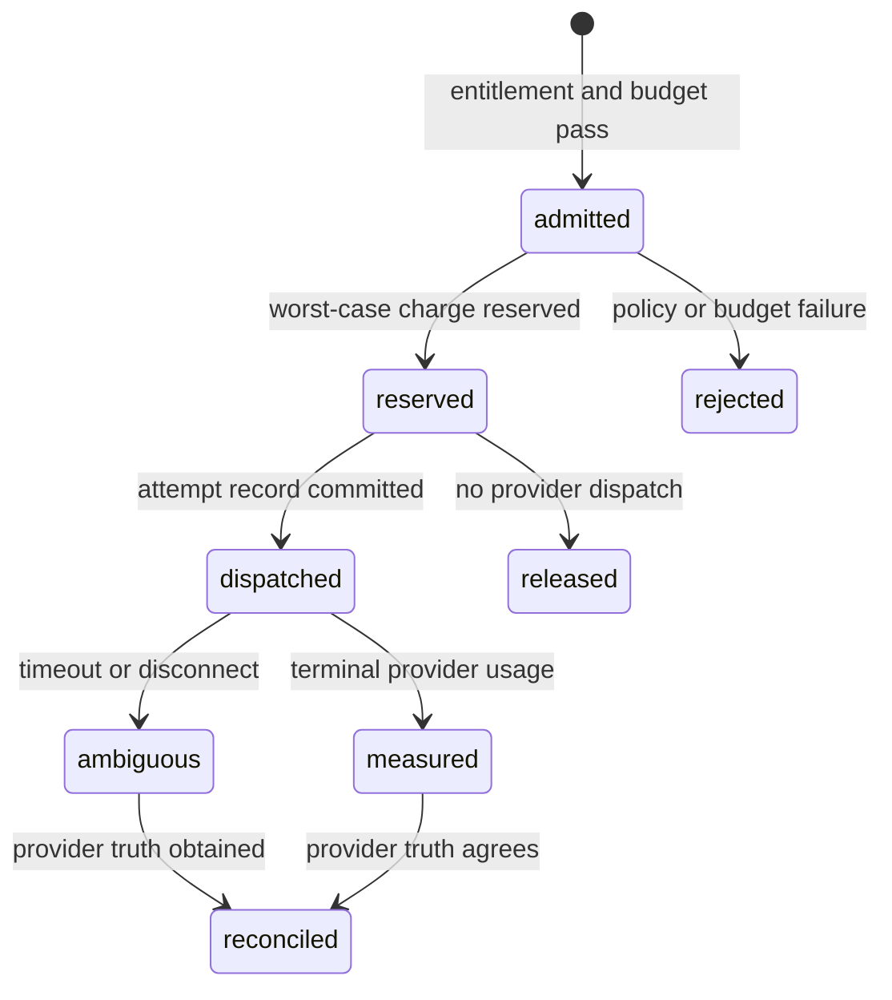

# LLM Service and metering architecture

Status: proposed architecture for implementation on `feat/llm-metering-lineage`.

This paper defines the shared LLM provider boundary, tenant separation, workload
authorization, usage accounting, budget admission, and customer billing attribution.
It does not define intent, contribution, or artifact lineage. Those concepts belong to
the Intent Service and Artifact Store and are specified in
[`INTENT-ARTIFACT-LINEAGE-ARCHITECTURE.md`](INTENT-ARTIFACT-LINEAGE-ARCHITECTURE.md).

## 1. Outcome and ownership

AvenOS should have one internal LLM Service through which every production model call
passes. It owns:

- provider credentials and approved outbound destinations;
- workload authentication and tenant-grant verification;
- provider-neutral request admission and model routing;
- per-request and per-period budget reservations;
- provider attempt execution, retry policy, and streaming finalization;
- immutable usage and pricing records;
- provider usage reconciliation; and
- tenant-authorized usage aggregation.

It does not own:

- end-user sessions or tenant membership policy;
- intent contributions, summaries, skill state, or agent history;
- artifact payloads, blobs, evidence, or production runs; or
- domain schemas and business validation for invoices, statements, or routing.

Domain services decide what to ask, validate the returned domain result, and retain the
result in their own tenant data plane. The LLM Service decides whether the call is
authorized and affordable, executes it, and accounts for every provider attempt.



## 2. Current state

| Area | Reusable current capability | Missing capability |
| --- | --- | --- |
| User authentication | Better Auth session and verified-email boundary in Aven API | Tenant roles beyond the current owner-only path |
| Tenant resolution | Stable customer environment ID, artifact scope, component readiness | Explicit tenant selection and tenant-to-billing-account assignment |
| Downstream authorization | Proposed `TenantAccessBroker` and bound tenant grant | Signed grant implementation and workload identity |
| Model execution | Processor OpenAI-compatible profiles, validation, timeouts, and exact-request cache | Central provider boundary and capability policy |
| Usage receipts | Provider/model/request IDs and sanitized token counts in Processor receipts | Append-only attempt ledger, pricing, budgets, reconciliation, and queries |
| Billing | User-keyed Creem customers and recurring subscriptions | Tenant billing accounts and metered settlement |
| App chat | Development-only Phala/RedPill relay | Authenticated production path and metering |

The Artifact Processor currently holds a provider key and calls an OpenAI-compatible
endpoint directly. Its `model_call_ledger` provides valuable workflow leasing,
idempotency, and successful-response caching, but it is not a billing ledger: failed or
ambiguous paid attempts are not retained independently, usage has no authenticated
service attribution or price snapshot, and there is no tenant usage API.

## 3. Architectural decisions

1. The LLM Service is a control-plane service with its own database.
2. Stable `customer_environments.id` is the tenant key. Artifact scope remains a
   separate identifier even while both commonly match.
3. A billing account, not an individual request actor, is the charge owner.
4. Workload identity determines service attribution. Request JSON cannot claim it.
5. An allowlisted operation describes the cost center within a service.
6. One logical inference request may create several provider attempts; every actual
   dispatch has an immutable accounting record.
7. Prompts and responses are not stored in the metering ledger.
8. Provider cost and customer charge are separate exact-money values bound to an
   immutable rate-card version.
9. A production service cannot retain a direct provider credential after migration.

## 4. Identity and tenant authorization

### 4.1 Three identity dimensions

Every request has three independent identities:

- **workload**: the authenticated calling process, such as `artifact-processor`,
  `intent-service`, or `aven-api`;
- **tenant**: the stable customer environment whose entitlement and budget apply; and
- **actor**: the user or service on whose behalf the domain operation occurs.

The workload is security identity and service-level cost attribution. The actor is
provenance. A background Processor call can therefore be attributed to
`artifact-processor` without impersonating the user who originally uploaded a file.

### 4.2 Workload authentication

Authenticate the workload independently of the tenant grant. The first deployment may
use distinct rotatable service credentials. The target is mTLS or workload OIDC.

The LLM Service maps the authenticated subject to a workload record containing:

- stable workload ID and service key;
- enabled or revoked state;
- allowed audience, operations, and capabilities;
- credential generation and rotation metadata; and
- optional environment restrictions.

No `x-service-name`, request field, or model-supplied value is authoritative.

### 4.3 Bound LLM tenant grant

Extend the tenant grant proposed in `CUSTOMER-DATA-PLANE-ARCHITECTURE.md` for the LLM
audience:

```ts
interface LlmTenantGrant {
  issuer: string
  keyId: string
  audience: 'llm-service'
  decisionId: string
  tenantId: string
  scopeId: string
  actions: Array<'llm.infer' | 'llm.usage.read'>
  actor: { kind: 'user' | 'service'; id: string }
  allowedCapabilities: string[]
  allowedOperations: string[]
  routingGeneration: number
  issuedAt: string
  expiresAt: string
  tokenId: string
}
```

An LLM grant omits the physical PostgreSQL locator because the LLM Service does not
open the tenant database. This prevents coupling metering to the current `cust_*`
layout and reduces disclosure.

The service verifies:

1. signature, issuer, algorithm, key ID, audience, issued-at, expiry, and clock bounds;
2. non-revoked workload identity;
3. action, operation, and capability allowlists;
4. current tenant entitlement and billing assignment; and
5. request limits and budget admission.

Tenant, scope, workload, actor, and billing identities come from authenticated context.
Conflicting request values are rejected rather than normalized.

### 4.4 Public requests

Browser and Tauri clients never receive provider or workload credentials. They call
Aven API. Aven API authenticates the user, resolves or requires an explicit tenant,
applies membership policy, and calls the LLM Service with its own workload identity and
a short-lived tenant grant.

The initial owner-only policy can permit inference and usage reads. Shared tenants need
roles that distinguish ordinary inference from billing and usage visibility.

## 5. Billing account boundary

Current Creem rows belong to users. Shared tenant usage requires a separate charge
owner:

```text
billing_accounts
  id, status, currency, customer_reference, created_at

billing_account_members
  billing_account_id, user_id, role, valid_from, valid_until

tenant_billing_assignments
  tenant_id, billing_account_id, valid_from, valid_until, decision_id

subscriptions
  ... existing provider fields ..., billing_account_id
```

The ledger snapshots tenant and billing account at admission time. Ownership changes
do not silently move historical charges. Corrections are immutable adjustment records.

The first product policy may remain plan credits plus a hard cap. The metering kernel
does not assume that policy: it measures usage and records provider cost, customer
charge, reservations, credits, and adjustments separately.

## 6. Inference contract

Use a bounded internal canonical API rather than an unrestricted OpenAI-compatible
proxy. Provider adapters translate the request to tool-call, JSON-schema, chat,
embedding, image, or future provider protocols.

```http
POST /v1/inference
Authorization: Workload <credential>
X-Aven-Tenant-Grant: <signed grant>
Idempotency-Key: <stable caller request key>
Content-Type: application/json
```

```json
{
  "operation": "artifact-processor.invoice-extract",
  "capability": "vision.structured-output",
  "input": {
    "messages": [],
    "images": [],
    "tools": [],
    "responseSchema": {}
  },
  "limits": {
    "maxOutputTokens": 4096,
    "deadlineMs": 180000
  },
  "routing": {
    "policy": "finance-structured-v1"
  },
  "causation": {
    "traceId": "uuid",
    "intentId": "optional uuid",
    "contributionId": "optional uuid",
    "skillRunId": "optional uuid",
    "processingCaseId": "optional uuid",
    "processingStepId": "optional uuid",
    "artifactPublicationId": "optional uuid"
  },
  "stream": false
}
```

Input is bounded tenant data and is not written to the metering ledger. Causation IDs
are opaque metadata for diagnostics and domain receipts; the caller remains responsible
for ensuring they belong to the granted tenant.

The result contains provider-neutral output and a safe receipt:

```json
{
  "requestId": "uuid",
  "output": {},
  "receipt": {
    "attemptId": "uuid",
    "provider": "provider-key",
    "model": "deployment-key",
    "providerRequestId": "optional opaque id",
    "usage": {
      "inputTokens": 0,
      "cachedInputTokens": 0,
      "outputTokens": 0,
      "reasoningTokens": 0,
      "totalTokens": 0
    },
    "rateCardVersion": "uuid",
    "usageState": "measured"
  }
}
```

Domain services store the opaque request ID and safe receipt in their own records.
They do not copy customer charge calculations as independent truth.

## 7. Idempotency, retries, and streaming

The logical key is `(tenant_id, workload_id, idempotency_key)`. Replaying it with a
different canonical request digest is a conflict. One logical request may have several
attempts; each attempt gets a distinct ID and provider idempotency key.

An attempt row is committed before outbound dispatch. Earlier paid attempts are never
overwritten by retry state.

To close the provider-success/caller-crash window, retain successful canonical output
in a separate encrypted retry buffer for a bounded period or until acknowledged. This
buffer is customer data, not part of the metering ledger. It is accessible only with
the same tenant/workload authorization and is deleted on acknowledgement or expiry.
The service supports exact request status/result retrieval by request ID.

If a tenant policy forbids even temporary response retention, an ambiguous lost result
must become a visible recovery state; the service must not silently redispatch and
pretend the second attempt was the first.

For streaming calls, the LLM Service owns the upstream stream until a terminal provider
frame or an ambiguous disconnect. Client cancellation does not delete the request.
Usage persistence cannot be a best-effort callback after returning the response.

## 8. Metering data model

Use an append-only control database. Mutable request status and aggregates are
projections; attempts, pricing snapshots, and adjustments are immutable.

### 8.1 Logical requests

`llm_requests` records:

- request, tenant, scope, and billing-account IDs;
- workload ID, service key, operation, capability, and actor;
- idempotency key and canonical request digest;
- routing policy and selected deployment;
- status, reservation ID, and safe terminal code;
- bounded causation IDs; and
- accepted, started, terminal, and reconciled timestamps.

### 8.2 Provider attempts

`llm_attempts` records one row per provider dispatch:

- request and attempt IDs, attempt number, and provider idempotency key;
- provider account/project, region, and deployment snapshot;
- provider and HTTP request IDs when available;
- start, finish, outcome, and safe error category;
- input, cached-input, output, reasoning, image/audio, and total usage;
- measurement source: provider, tokenizer, estimate, or reconciliation;
- rate-card version;
- provider cost and customer charge in exact decimal or integer micros;
- currency and reconciliation state.

Failed HTTP calls, malformed output, domain-schema rejection, timeout, and client
disconnect are distinct outcomes. Any may still be billable.

### 8.3 Rate cards

Immutable rate-card lines define effective time, provider/model match, unit, provider
cost, customer price, currency, rounding, and tax-treatment reference. Each attempt
binds one version. Historical money is never recalculated with today's provider price.

Floating-point money is forbidden. Token quantities are integers; money uses exact
decimal or integer micros.

### 8.4 Reservations and budgets

Admission reserves a worst-case charge derived from measured input, requested output
limit, capability, and routing policy. Terminal measurement releases unused reservation
or records policy-defined overage.

Budgets may apply to billing account, tenant, service, operation, or model class. The
most restrictive applicable rule wins.



## 9. Usage API

The LLM Service owns:

```http
GET /v1/usage?from=<instant>&to=<instant>&groupBy=service,operation,model
```

It requires workload authentication and an `llm.usage.read` grant. The granted tenant
is authoritative; a query parameter cannot select another tenant.

Aven API exposes:

```http
GET /api/llm/usage?from=<instant>&to=<instant>&groupBy=service,operation,model
```

The response contains:

- tenant, billing account, currency, and exact period;
- measured input/output/total usage;
- provider cost and customer charge;
- reserved, charged, credited, and remaining amounts;
- groups by authenticated service, allowlisted operation, model, and day;
- unpriced, estimated, and unreconciled counts; and
- a `completeThrough` timestamp.

Aggregation and pagination are bounded. Prompt and response content is never returned.
Repositories accept authenticated tenant context rather than a free tenant-ID argument,
and cross-tenant negative tests cover both detail and aggregate reads.

## 10. Provider reconciliation

Provider responses are not always a final billing source. A reconciliation worker:

1. imports provider usage records using provider request IDs and bounded time windows;
2. matches them by account, request ID, deployment, and time;
3. marks exact matches reconciled;
4. appends corrections or unmatched provider charges; and
5. alerts when completeness exceeds a bounded age threshold.

Original attempt measurements are not mutated. Adjustments reference the attempt and
explain the difference.

## 11. Privacy and outbound-data policy

Each routing policy declares:

- allowed data classifications;
- provider account, project, and region;
- retention and training-policy snapshot;
- supported capabilities;
- maximum request size and duration; and
- whether customer content may leave the approved boundary.

Durable metering records contain IDs, request digests, usage, prices, policy versions,
and safe errors only. Prompt/response diagnostics require a separate tenant-visible
policy with encryption, strict access, expiry, and audit. Hidden reasoning is never
persisted or exposed.

The encrypted retry buffer is operational customer data with a short maximum lifetime;
it is not queryable through the usage API and is excluded from analytics.

## 12. Migration of current model paths

### 12.1 Artifact Processor

Replace direct provider URL and API-key configuration with the LLM Service URL,
Processor workload credential, tenant-grant contract, and stable operation keys.

Keep current provider profiles, authoritative schema validation, materialization,
workflow retries, and exact-request cache. The cache delegates provider execution to
the LLM Service and stores the returned request ID. Artifact production receipts retain
the safe LLM receipt.

### 12.2 Intent Service

Future routing, summarization, and agent turns use the LLM Service from their first
production implementation. A durable job allocates its idempotency key before dispatch;
the resulting contribution stores the request ID and safe model provenance.

### 12.3 App chat

The development Phala/RedPill route remains non-production. Production chat calls go
through Aven API and the LLM Service. Tauri never receives a provider key.

## 13. Guarantees and non-guarantees

### Target guarantees

- Every outbound provider dispatch has a committed attempt record first.
- Every request belongs to one authenticated workload, tenant, billing account,
  operation, and actor.
- Service usage attribution is derived from workload identity.
- Usage reads cannot select a tenant outside the signed grant.
- Every charge binds the rate-card version used to calculate it.
- Failed, malformed, timed-out, and disconnected attempts do not disappear.
- Customer prompts and responses do not enter the metering ledger.

### Explicit non-guarantees

- Provider inference is not exactly once.
- Provider usage is not always final at response time.
- An LLM receipt proves a call and reported usage, not semantic correctness.
- A provider honoring an idempotency header is not guaranteed.
- Archiving or deleting domain data does not automatically erase financial records.

## 14. Implementation slices

### Slice 1: identity and billing prerequisites

1. Implement the neutral authenticator and tenant access broker seams.
2. Add signed audience/action-bound grants and verification keys.
3. Add distinct workload identities and rotation metadata.
4. Introduce billing accounts and tenant assignments without changing pricing.
5. Add negative tests for audience, action, tenant, expiry, and workload mismatch.

Acceptance: a synthetic workload can infer for exactly one tenant and every mismatched
combination fails closed.

### Slice 2: metering kernel with mock provider

1. Add the LLM Service executable, migrations, health contract, and image.
2. Implement request, attempt, rate-card, reservation, and retry-buffer storage.
3. Add a deterministic zero-cost provider.
4. Implement idempotency, admission, safe receipts, and `/v1/usage`.
5. Expose authenticated `/api/llm/usage` through Aven API.

Acceptance: concurrent retries create one logical request, every actual dispatch has
one attempt, reservations reconcile, and usage groups by authenticated service.

### Slice 3: Processor migration

1. Add an LLM Service client and stable operation mapping.
2. Preserve current request hashes, schemas, validation, and materialization.
3. Replace direct production provider credentials.
4. Store request IDs in the workflow cache and production receipts.
5. Exercise timeout, malformed output, retry, and ambiguous accounting fixtures.

Acceptance: no production Processor path can reach a provider except through the LLM
Service, and domain failure cannot remove its usage attempt.

### Slice 4: production settlement

1. Add approved provider adapters and routing policies.
2. Add reconciliation and immutable adjustments.
3. Connect measured charges to plan credits or invoicing policy.
4. Add tenant-admin usage UI and operational alerts.

Acceptance: a tenant administrator can reconcile billed usage by service, operation,
model, and period without exposing customer content.

## 15. Deployment and rollback

Deploy additively:

1. billing accounts and grant infrastructure;
2. dark LLM Service with mock provider;
3. usage API and observability;
4. Processor test-tenant cutover;
5. bounded production cutover; and
6. removal of direct production provider credentials.

Rollback may restore a previous caller executable, but it never deletes attempts, rate
cards, reservations, or adjustments. Additive readers tolerate records written by the
newer version.

## 16. Product policy still required

The architecture is independent of these choices, but production charging is not:

- pass-through, markup, prepaid credit, bundled allowance, or a combination;
- which tenant roles see cost versus token-only usage;
- whether one billing account spans multiple environments;
- diagnostic prompt/response retention, if any;
- approved provider/account/region per data class; and
- how over-budget background work is presented and resumed.

Until decided, use zero-priced mock rate cards and fail closed for real providers in
unassigned tenants.
