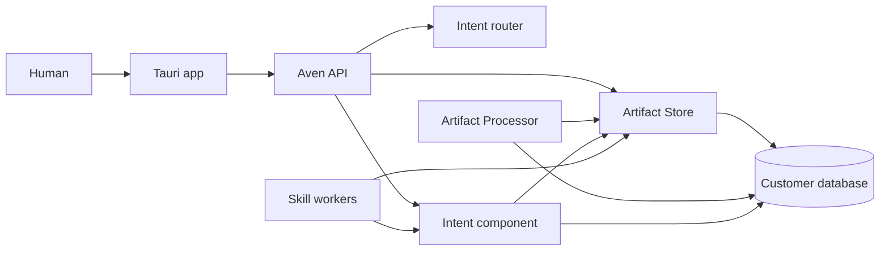
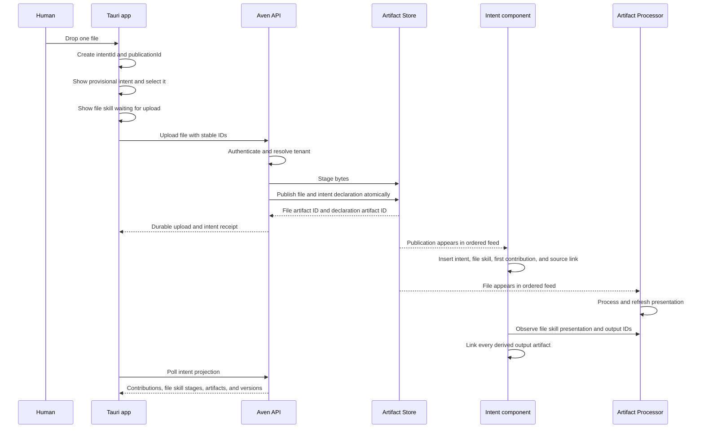
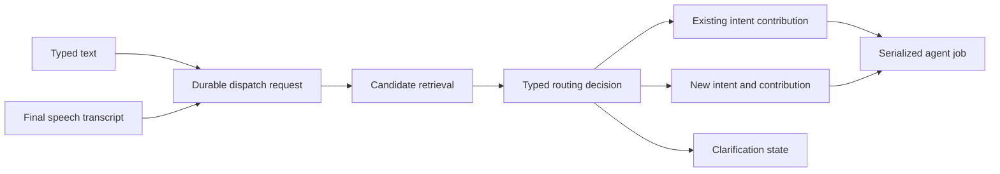

# Persistent intents: current state and missing work

Status: discovery and implementation proposal  
Date: 24 August 2026

## Executive assessment

An avenOS intent should be a durable, ordered conversation around one matter. Its
contributors are not limited to two chat roles:

- a human contributes typed messages, speech transcripts, files, corrections, and
  decisions;
- the agent contributes answers, questions, plans, and action reports;
- skills contribute progress, results, warnings, requests for human decisions, and
  artifacts; and
- system processes contribute narrowly scoped lifecycle facts such as an upload being
  accepted or processing reaching a terminal error.

A file upload is a deterministic trigger for a new intent. The new intent initially
contains one user-visible artifact: the uploaded source file. It also starts exactly one
visible skill instance: the **file skill**. File inspection, page decomposition, OCR,
classification, extraction, and validation are stages inside this one skill; they are
not separate skills in the intent UI. Every immutable output produced by those stages
is added to the intent's artifact list. None of this changes the identity of the
original file or intent.

The current app already demonstrates much of the desired interaction, including a
rudimentary form of intent self-description and LLM-based routing. However, intent
instances, their activity history, their skill instances, and the right-hand artifact
list are mock or process-memory state. The upload and Artifact Processor are real and
durable, but there is no persistent intent aggregate joining them to the conversation.

The smallest design that does not become a dead end is:

1. keep artifact bytes and immutable processing results in Artifact Store;
2. introduce a bounded Intent component in each customer database for the ordered
   contribution history and its projections;
3. publish a file and an `intent.declaration@1` trigger atomically in one Artifact Store
   root publication;
4. have the Intent component consume that publication feed idempotently and create the
   persistent intent, first contribution, and first artifact association; and
5. route all later human, agent, and skill contributions through one persistent intent
   API before showing them as committed history.

This gives the file-trigger path an important convergence property: once Artifact Store
has accepted the publication, the file and the fact that it creates an intent either
both exist or neither exists. A temporarily unavailable Intent projector can catch up
from the feed later.

## 1. Definition and invariants

### 1.1 Intent

An intent is a stable, tenant-local identity plus an ordered history of contributions.
It is not a mutable chat transcript object and it is not an Artifact Store publication.

An intent has:

- a stable opaque UUID generated before the triggering request is sent;
- a lifecycle state such as `creating`, `active`, `waiting`, `done`, `error`, or
  `archived`;
- a monotonically ordered contribution history;
- zero or more associated skill runs;
- zero or more associated user-visible artifacts;
- a current title and short self-description used for display and routing; and
- provenance for how the title, description, state, skill list, and artifact list were
  derived.

The history is authoritative. The list card, short description, current state, active
skills, and artifact rail are projections that can be rebuilt.

A file-triggered intent is more specific: it starts with one `file` skill instance and
one source artifact. The skill count does not grow as the processor advances through
inspection, decomposition, OCR, classification, extraction, and validation. Those are
stage rows of the same skill instance.

### 1.2 Contribution

A contribution is one committed occurrence in an intent. It has a contributor, a kind,
content or a reference, and a per-intent sequence number.

Contributor kinds should be closed initially:

- `human`;
- `agent`;
- `skill`; and
- `system`.

Contribution kinds should include at least:

- `message`;
- `speech-transcript`;
- `artifact-added`;
- `skill-started`;
- `skill-progress`;
- `skill-result`;
- `warning`;
- `human-decision-requested`;
- `human-decision`; and
- `lifecycle-transition`.

Internal prompts, chain-of-thought, credentials, raw provider responses, and noisy
execution logs are not contributions. Operational attempt records belong in separate
worker tables and logs. A skill should contribute a bounded human-readable result and
links to its exact artifacts.

### 1.3 Artifact membership

Intent artifact membership is an explicit association, not an inference from whatever
happens to be visible in a chat bubble.

For the first file-triggered intent:

- the uploaded `core.file@1` occurrence is the first user-visible artifact and the only
  one before processing produces outputs;
- the `intent.declaration@1` occurrence is control/provenance data and is not shown in
  the artifact rail;
- every output of the file skill is then included in the artifact rail, including file
  inspection, page, bundle, extracted text, layout, content description,
  classification, domain extraction, and validation artifacts;
- visual grouping or collapsing may keep a large list readable, but must not make the
  produced artifacts undiscoverable; and
- the source file keeps its artifact ID while its display label progresses from generic
  file to PDF/image/document and finally to invoice, account statement, or another
  narrow presentable type.

The right rail therefore describes immutable material, while the file-skill card
describes ongoing work. A stage is not an artifact until it successfully publishes an
output, and a published output remains an artifact even after the skill has completed
or failed later.

Unlinking an artifact from an intent must not delete immutable Artifact Store data.
Archiving or deleting an intent also needs a separate retention policy; it must not
silently cascade into artifact deletion.

### 1.4 Self-description

Every active intent needs a bounded routing descriptor. It should contain at least:

```ts
interface IntentRoutingDescriptor {
  intentId: string
  title: string
  summary: string
  state: 'creating' | 'active' | 'waiting' | 'done' | 'error'
  tags: string[]
  updatedAt: string
  version: number
  evidence: Array<{
    contributionId?: string
    artifactId?: string
  }>
}
```

The initial descriptor for a file upload can be entirely deterministic:

```text
title:   <original filename>
summary: Uploaded file; type and contents are still being determined.
tags:    upload, file
```

As processing narrows the artifact presentation, the descriptor may become:

```text
title:   Deutsche Bahn ticket receipt
summary: Rail ticket receipt for a trip from Berlin to Hamburg on 18 August 2026.
tags:    receipt, travel, rail
```

A user-edited title is never overwritten automatically. Store the source of every
projected field, for example `automatic`, `artifact-processing`, or `human`, and only
replace automatically owned values. Summaries are fallible projections, not business
truth.

## 2. What exists now

### 2.1 Real and reusable

The following paths are functional today:

- The Tauri drop handler uploads one real file through authenticated Aven API and
  receives an authoritative artifact ID
  ([drop handler](app/src/routes/dashboard/+page.svelte)).
- Aven API resolves the authenticated user's customer database and Artifact Store
  scope before publishing `core.file@1`
  ([file service](services/aven-api/src/lib/server/artifacts/service.ts)).
- Artifact Store persists immutable artifacts and the Processor creates durable cases,
  steps, outputs, and a presentation projection.
- The app polls the authenticated processing-status route and progressively updates
  the chat attachment
  ([processing presentation](app/src/lib/artifacts/processing.ts)).
- Typed input and speech share one visible composer. Final speech is emitted as
  `utterance(T)` to the chat actor
  ([composer](app/src/lib/intents/composer.svelte.ts),
  [listener actor](app/src/lib/actors/listener.actor.svelte.ts)).
- The actor bus, tool discovery, chat tool rounds, and in-flight turn relocation are
  real runtime behavior
  ([message bus](app/src/lib/actors/bus.ts),
  [chat](app/src/lib/chat/chat.svelte.ts)).
- Skill templates and workflow graph rendering are reusable definitions, even though
  several implementations and all per-intent instances are still mocked
  ([skill registry](app/src/lib/skills/registry.ts)).

### 2.2 Real interaction over mock intent state

`IntentsActor` exposes working `intent_list`, `intent_switch`, `intent_create`,
`intent_update`, `intent_merge`, `intent_archive`, `intent_restore`, and `intent_delete`
tools. These operations update the screen and can move an in-flight chat turn into a
different session. They only mutate the module's `$state` array, however, and therefore
do not survive restart
([intent actor](app/src/lib/intents/intents.svelte.ts)).

The chat maintains a separate visible and model history per intent, but all sessions
are stored in an in-memory `Map`. Upload attachments and their processor presentations
are also held in in-memory maps. They disappear when the app reloads
([chat sessions](app/src/lib/chat/chat.svelte.ts)).

### 2.3 Mocked

The following UI data is fixture state:

- the initial intent list and selected intent;
- intent title, type, source, deadline, and lifecycle state;
- the typed activity timeline;
- per-intent `SkillStatus[]`;
- the right-hand `MockArtifact[]` rail;
- the HITL examples seeded from mock intents; and
- merge/archive/delete outcomes after the current process exits.

The code says this explicitly: intent instances are mocked while workflow templates are
real
([workspace declaration](app/src/lib/intents/IntentsPlaceholder.svelte)).

The current right rail renders `selected.skills` and `selected.artifacts`. A
`MockArtifact` contains only `kind`, `title`, and `note`; it has no Artifact Store ID,
media type, publication ID, processing projection, provenance, or error state.

The Processor is already close to the data contract needed for the first real rail. Its
persisted `ProcessingStatus` contains the processing case state, ordered stages,
warnings, and a deduplicated `derivedArtifacts` list with artifact ID and exact type
version. The Aven API proxy returns that JSON, but the app's
`ArtifactProcessingPresentation` TypeScript interface currently omits
`derivedArtifacts`, and the UI only renders the source attachment. The output artifacts
exist; the client projection and authenticated artifact reads are the missing bridge.

There are no Aven API intent routes, no intent tables in the control-plane migrations,
and no intent schema in the customer database. The existing
[`intent.declaration@1` draft](artifact-types/types/intent.declaration.v1.json) is a
design artifact only. It is not in the running Artifact Store's built-in catalog, and
its older registration-document shape cannot be registered by the current core
unchanged.

### 2.4 The current self-description and router

There is already a useful prototype of the requested dispatch behavior.

Before every model call, `chatActor.core.context` enumerates all non-archived intents as:

```text
- <id>: "<title>" (<type>, <status>)
```

It also identifies the intent currently on screen and includes artifact descriptions
from the current in-memory conversation. The system prompt tells the model to call
`intent_switch` before answering when another intent matches, or `intent_create` when
the message starts a new matter. Until routing finishes, the human message and model
reply remain pending; `relocateTurn` can move both into the selected intent before they
settle.

That is the conceptual seed of an intent router, and the pending-turn relocation is
worth keeping. It is not yet a reliable routing boundary because:

- descriptors are in-memory mock title/type/status values rather than durable
  self-descriptions;
- every active intent is interpolated into one system-prompt string, which grows
  without bound;
- user-controlled titles and summaries would become prompt-injection material if they
  are not treated as untrusted structured data;
- routing and answering are performed by the same unconstrained model turn;
- there is no typed routing result, confidence, ambiguity state, or deterministic
  fallback;
- the unassigned human message is not durable while routing occurs;
- a missing tool call can leave the message in the previously visible intent;
- the routing decision and descriptor version are not recorded; and
- direct file upload bypasses intent creation completely and begins in whichever chat
  session was selected at the time.

## 3. Recommended boundary

Introduce an **Intent component** as a bounded tenant-data service. It owns an
`aven_intents` schema in each customer database and exposes domain HTTP operations. It
may begin as one small deployable/module, but its repository and permissions must remain
separate so it can later move processes or databases without changing the Tauri client.



Boundary rules:

- Tauri never receives a database name, internal service credential, or unrestricted
  artifact-store token.
- Aven API authenticates the end user, authorizes tenant access, resolves the physical
  route, and passes a bounded tenant grant when that rail is available.
- Artifact Store owns immutable artifact bytes, occurrences, type definitions,
  references, runs, evidence, and its publication feed.
- Artifact Processor owns processing coordination and its current presentation.
- Intent owns contribution ordering, dispatches, agent-turn jobs, skill-run association,
  artifact membership, current intent projections, and its Artifact Store feed cursor.
- A skill never writes another component's tables directly. It invokes domain APIs and
  uses stable idempotency keys.
- Aven API should not gain arbitrary direct SQL access to all customer schemas merely
  to avoid introducing the Intent boundary.

The design follows the repository seams proposed in
[`CUSTOMER-DATA-PLANE-ARCHITECTURE.md`](CUSTOMER-DATA-PLANE-ARCHITECTURE.md): domain
repositories remain replaceable without inventing a generic database API.

## 4. Persistent data model

The names below are illustrative. The important part is ownership and the enforced
invariants.

### 4.1 `intents`

A rebuildable current projection with:

- `id uuid primary key`;
- `state`;
- `title`, `title_source`;
- `routing_summary`, `summary_source`, `summary_version`;
- `tags`;
- `created_at`, `updated_at`;
- `created_by_kind`, `created_by_id`;
- `trigger_kind`, `trigger_id`;
- `last_contribution_sequence`;
- `last_error_code`, `last_error_message`; and
- optimistic `version`.

Tenant identity is implicit in the physical customer database and explicit in every
service grant. Do not put database names into domain records.

### 4.2 `intent_contributions`

An append-only history with:

- `id uuid primary key`;
- `intent_id`;
- `sequence bigint` with `unique(intent_id, sequence)`;
- contributor kind and stable contributor ID;
- contribution kind;
- bounded text or typed JSON payload;
- optional `artifact_id`, `skill_run_id`, and `reply_to_contribution_id`;
- `created_at` and optional client-observed timestamp;
- `status` for accepted, interrupted, or superseded display occurrences;
- an idempotency key unique within the tenant and producer; and
- safe provenance such as ASR model/version or agent model deployment, without secrets.

Sequence allocation and contribution insertion must be one transaction. Concurrent
messages may be accepted concurrently, but agent turns for one intent should initially
be serialized. Parallel agent answers without a causal ordering are difficult to make
understandable and much harder to retry safely.

### 4.3 `intent_artifacts`

A materialized association with:

- `intent_id` and `artifact_id` as the stable pair;
- a relation such as `source`, `attachment`, `file-skill-output`, or `reference`;
- `added_by_contribution_id`;
- `added_at`;
- an origin such as `upload` or `file-skill-output`;
- the producing file-skill case and stage when applicable;
- a display order derived from source-first, then processing stage and output order;
- a visibility class such as `primary`, `derived`, or `control`; and
- optional removal/supersession contribution IDs.

Artifact names, type labels, summaries, processor state, and warnings should be read
from Artifact Store and the Processor presentation, or cached with an explicit version.
They are not copied into the association as independent truth.

For the file skill, membership can be rebuilt from the source artifact plus the
Processor presentation's `derivedArtifacts`. The association table provides efficient
intent reads and provenance; it must not become a competing list that silently omits a
real processor output. Feed/projection reconciliation compares both sets and repairs
missing links idempotently.

### 4.4 `intent_skill_runs`

A real replacement for `SkillStatus[]` with:

- stable run ID and intent ID;
- skill key, skill version, and workflow key;
- state: `queued`, `running`, `waiting`, `retrying`, `succeeded`, `failed`, or
  `cancelled`;
- triggering contribution;
- current step and bounded progress;
- attempt and lease/fencing data where execution is asynchronous;
- terminal code/message;
- start/update/finish timestamps; and
- result contribution and output artifact IDs.

The first implementation creates exactly one entry with `skill_key = file` and a
reference to the Artifact Processor case. The Processor remains authoritative for that
case's stages, retries, warnings, and terminal state; Intent does not reimplement its
lease or attempt machinery. The intent projection caches the last observed presentation
version so it can identify stale data and reconcile.

The file skill remains visible after it reaches a terminal state. Its card shows the
current overall status and progress, and opening it shows the processor's ordered stage
list. Future non-file skills may use the same association shape, but they are outside
the first slice.

### 4.5 Routing inbox and jobs

Global input has no intent association at acceptance time, so it needs a durable inbox:

- `intent_dispatches` records the original typed message or final transcript, client
  request ID, selected-intent hint, candidate descriptor versions, routing state,
  decision, confidence, and terminal error;
- `intent_agent_jobs` records the contribution that needs an agent response, lease,
  attempts, provider request key, and terminal result; and
- a transactional outbox carries calls or notifications that cross service boundaries.

Accepting an HTTP request means the dispatch or contribution is durably stored. It does
not mean an LLM has answered or a skill has completed.

## 5. File upload trigger

### 5.1 Artifact contract

Finalize and register an active `intent.declaration@1` type for the current Artifact
Store contract. Because the existing draft has never been installed as an immutable
type, it can still be corrected before registration.

It needs:

- stable `intentId` generated by the client or Aven API;
- `triggerKind: file-upload`;
- deterministic initial title based on the sanitized original filename;
- `observedAt`;
- actor/principal provenance supplied by the authenticated server boundary;
- one required structural `source` reference to the local `core.file@1`; and
- no mutable status.

The file is declared before the intent so the declaration can reference the earlier
local key in the same root publication.

### 5.2 Successful path



The provisional intent must use the final stable `intentId`; it must not be renamed to a
server-generated object after upload. The chat session is synchronously switched to
that ID before the attachment is inserted. The current `goTo()` method only relocates
an active LLM turn and is a no-op outside one, so the upload path must explicitly select
the intent and call `chat.use(intentId)` before `beginArtifactUpload`.

### 5.3 Failure and reconciliation

- Before Artifact Store commit: no durable file or declaration exists. The UI may show
  a provisional failed intent with retry/remove controls, but must label it as local.
- Lost response after commit: retry the exact same publication ID and semantic request.
  Artifact Store returns the original result rather than duplicating either artifact.
- Intent component unavailable after commit: the declaration remains in the Artifact
  Store feed. Its cursor catches up and creates the intent idempotently later.
- Projection rejects a permanently invalid declaration: record a terminal projection
  error associated with the feed sequence, expose it in health, and do not advance past
  it silently. Operator tooling must support inspect, correct by a new compatible event,
  or explicitly quarantine.
- Processor unavailable: the intent and source artifact remain usable with their last
  presentation and an explicit processing warning.
- App restart: query the persistent intent; do not reconstruct it from local chat
  memory. Restore the file skill and all known source/derived artifacts, then resume
  observation when processing is non-terminal or its projection is stale.

The UI must distinguish `local`, `committed but projecting`, `active`, and `error` so
there is always a known state.

## 6. Human input and dispatch

Typed and spoken input should converge before dispatch:



Partial speech remains ephemeral composer state. The final transcript is persisted with
ASR provenance before routing. Whether original audio is retained is a separate privacy
decision and should default to no.

The router should return a closed result such as:

```ts
type RoutingDecision =
  | { kind: 'existing'; intentId: string; descriptorVersion: number; confidence: number }
  | { kind: 'new'; proposedTitle: string; confidence: number }
  | { kind: 'clarify'; candidateIntentIds: string[]; reasonCode: string }
```

Recommended routing rules:

1. A file upload always creates a new intent; no LLM routing is needed.
2. A message sent inside an explicitly opened intent uses that intent as a strong hint,
   especially for short follow-ups.
3. An explicit reference to another active matter can override the hint.
4. A clearly new matter creates a new intent.
5. Low-confidence ambiguity asks the human instead of silently contaminating the wrong
   history.
6. Every decision stores the descriptor versions it considered so a bad route can be
   explained and corrected.

Candidate retrieval should use bounded active-intent descriptors. Initially, with few
intents, exact text and a small model call are sufficient. Later it can add full-text or
embedding retrieval without changing the routing contract. Never place untrusted
titles, summaries, OCR, or document instructions directly into privileged system
instructions; pass candidates as structured data and explicitly classify them as
untrusted content.

The current pending-turn UI and `relocateTurn` behavior can remain as the optimistic
presentation. The durable dispatch decision, rather than an optional LLM tool call,
must decide where the committed contribution lands.

## 7. Agent participation

After a human contribution is committed, an agent job is created in the same
transaction or through a transactional outbox. The agent receives:

- the intent's current routing description;
- a bounded recent contribution window;
- an explicit summary/checkpoint of older history;
- source and derived artifact projections with exact artifact IDs;
- the file skill's current state/stages and pending human gates; and
- tool contracts available to that tenant and intent.

The final agent answer is appended as an `agent/message` contribution. Streaming deltas
may remain transient, but interruption, failure, and the final retained partial answer
must have explicit outcomes. Do not persist or expose hidden reasoning.

Tool and skill calls need stable request keys. A retried agent job must not create a
second payment, email, todo, artifact publication, or skill run. Exactly-once LLM
inference is neither possible nor required; exactly-once domain effects are approached
through idempotent commands and durable receipts.

## 8. The file skill

The current UI models decomposition, classification, document handling, and similar
workflow concepts as skills. That is not the intended presentation for this slice. A
file-triggered intent exposes one skill called `file`; the document-processing pipeline
is its implementation.

The file-skill card shows:

- overall state: waiting for upload, queued, running, retrying, review needed,
  succeeded, failed, or unavailable;
- completed stage count and total known stage count;
- the currently active or waiting stage;
- the last successful presentation version;
- warning count and safe terminal reason; and
- the number of source and derived artifacts currently linked to the intent.

Opening the skill shows the ordered `ProcessingStatus.stages` list. Existing stage keys
already cover inspection, page decomposition, native text reading, page analysis, page
classification, text/layout assembly, content/document classification, invoice or
statement extraction, and validation. Stage keys should be rendered through the
existing label map, but their exact keys and states remain available for diagnosis.

Stages are not participants and do not create separate skill cards. The file skill may
append bounded contributions at meaningful boundaries—for example “processing
started”, “12 artifacts produced”, “review needed”, or “processing failed”—but it should
not flood the conversation with one message for every internal state transition. Live
stage detail belongs in the opened skill view.

The file skill is created with the intent even before the Processor case is visible.
Its state then converges as follows:

```text
waiting-for-upload -> waiting-for-processor -> active -> succeeded
                                              |       -> needs-review
                                              |       -> failed
                                              -> retrying -> active
```

The last valid stages, outputs, and presentation remain visible if later observation
fails. “Unavailable” means the latest state cannot currently be read; it must not erase
a previously known terminal or presentable state.

Other skills can participate in an intent later, using the generic contribution and
skill-run contracts in this document. They are intentionally not part of the first
file-intent implementation.

## 9. Real artifact rail

Replace `MockArtifact[]` with a projection keyed by exact Artifact Store IDs:

```ts
interface IntentArtifactView {
  artifactId: string
  relation: 'source' | 'file-skill-output' | 'attachment' | 'reference'
  typeKey: string
  typeVersion: number
  originalName?: string
  mediaType?: string
  label: string
  summary?: string
  warnings: Array<{ code: string; message: string }>
  addedByContributionId: string
  producedByStage?: string
  publicationSequence: number
  view: {
    kind: 'pdf' | 'image' | 'text' | 'table' | 'fields' | 'json' | 'none'
    available: boolean
    reason?: string
  }
}
```

The rail contains the original file and every derived artifact reported by the file
skill. This currently includes, depending on the file and chosen plan:

- `core.file` and `core.file-inspection`;
- `docs.page` and `core.bundle`;
- `docs.extracted-text` and `docs.text-layout`;
- `core.content-classification` and `core.content-description`;
- `core.document-classification`;
- invoice candidate, details, and validation artifacts; and
- account-statement candidate and validation artifacts.

The list is source-first and then ordered by producing pipeline stage, publication
sequence, and output ordinal. It may group page or stage outputs visually, but every
exact artifact ID must remain reachable. The intent declaration is not a file-skill
output and stays out of this user-facing rail.

### 9.1 Single artifact view

Clicking one rail entry opens one artifact in the existing center preview surface. It
does not open a second conversation or a skill. The preview is selected through a small
type-to-view registry rather than conditionals embedded throughout the intent UI.

Recommended initial mappings:

| Artifact | Single view |
| --- | --- |
| Source PDF | Sandboxed PDF viewer |
| Source image | Bounded image viewer |
| Other source file | Metadata plus download/open action |
| `docs.page` | The corresponding source PDF page when addressable; otherwise fields/metadata |
| `docs.extracted-text` | Plain-text viewer |
| `docs.text-layout` | Layout/region view, with JSON fallback |
| Content/document classification | Typed classification fields and confidence |
| Content description | Summary/topics fields |
| Invoice candidate/details | Structured invoice view with evidence links |
| Account-statement candidate | Structured statement/table view with evidence links |
| Validation artifacts | Checks, status, and contradictions |
| `core.bundle` | Ordered member list |
| Unknown registered type | Read-only canonical JSON viewer |

“If available” is an explicit state. The card remains clickable when a generic envelope
or JSON view is possible. If neither payload nor blob can be retrieved or no safe view
exists, the single view shows a bounded unavailable reason instead of doing nothing.

The current public surface exposes upload and processing status but not a general
user-authorized Artifact Store read proxy. The view therefore needs authenticated API
operations for exact envelope/payload retrieval and authorized blob streaming. Evidence,
producer inputs, references, and source locators are needed for the richer views. Until
those graph routes are implemented and proxied, a typed view must clearly say when
provenance navigation is unavailable.

Artifact content is hostile input. Never execute uploaded HTML, SVG scripts, PDF
actions, office macros, or extracted markup in the application origin. Enforce media
type allowlists, size limits, sandboxing, object-URL revocation, and safe download
headers.

## 10. API surface

An initial public surface through authenticated Aven API could be:

```text
GET  /api/intents
GET  /api/intents/{intentId}
GET  /api/intents/{intentId}/contributions?afterSequence=...
GET  /api/intents/{intentId}/artifacts
GET  /api/intents/{intentId}/skills
GET  /api/intents/{intentId}/file-skill
POST /api/intent-dispatches
POST /api/intents/{intentId}/contributions
POST /api/intents/{intentId}/archive
POST /api/intents/{intentId}/restore
GET  /api/intents/{intentId}/updates?afterVersion=...
GET  /api/artifacts/{artifactId}
GET  /api/artifacts/{artifactId}/content
GET  /api/artifacts/{artifactId}/view
```

The artifact endpoints must authorize the resolved tenant and verify that the artifact
belongs to its Artifact Store scope. `view` returns a safe view descriptor; payload and
content routes remain exact-data primitives. The client must not construct an internal
Artifact Store URL or choose a customer database.

The existing upload route should accept or generate `intentId` and return:

```ts
interface FileTriggeredIntentReceipt {
  intentId: string
  intentDeclarationArtifactId: string
  publicationId: string
  artifactId: string
  originalName: string
  mediaType: string
  sha256: string
  length: number
  scopeSequence: number
  replayed: boolean
}
```

For the first slice, bounded polling with `afterVersion` or contribution sequence is
simpler and more recoverable than adding WebSockets. Server-sent events can later reduce
latency, but reconnect must still resume from a durable sequence. Live transport is an
optimization over the same persisted state, not a second truth.

## 11. Security and privacy requirements

- Every public operation requires an authenticated principal and a fresh authorization
  decision for the resolved tenant.
- Database names, scopes, service publishers, internal tokens, and model credentials
  remain server-selected.
- The Intent component receives only its own schema grants plus read access through
  service APIs; it does not write Artifact Store or Processor tables directly.
- File-skill/Processor credentials are scoped to the operation. A contribution claiming
  the skill acted is not proof; associate it with the durable processing case and exact
  artifact outputs.
- Intent and artifact IDs are opaque identifiers, not authorization capabilities.
- Cross-tenant lookup tests must cover every intent, contribution, artifact, skill-run,
  and update endpoint.
- Titles, summaries, transcripts, filenames, OCR, extracted text, and artifact content
  are untrusted LLM input. They must never alter system instructions or tool policy.
- Bound contribution size, descriptor size, candidate count, history window, artifact
  count, skill count, and per-intent concurrency.
- Do not log contribution bodies, transcripts, filenames, artifact payloads, access
  tokens, or provider responses by default.
- Persist only final speech transcripts by default. Audio retention requires explicit
  product consent, encryption, expiry, and deletion behavior.
- LLM adapters need outbound-data policy, timeouts, retry limits, idempotency ledgers,
  schema validation, and safe terminal errors.
- Human confirmation gates for destructive or externally visible effects must survive
  restart and remain bound to the exact intent, skill run, command, and preview.
- Current one-user-per-customer-database isolation avoids an initial per-intent ACL, but
  contributor identity and ownership still need stable fields so future shared tenants
  do not require rewriting history.

## 12. Guarantees and explicit non-guarantees

### Target guarantees

- A committed file-trigger publication contains both the source file and its intent
  declaration.
- Replaying the same request does not create a second file or intent.
- Every committed contribution has one stable intent ID and per-intent sequence.
- Intent list, history, artifact membership, the file skill, later skill runs, and gates
  survive restart.
- Artifact and file-skill failures retain the last presentable state, stage list,
  already published outputs, and an explicit warning.
- Feed consumers and projectors resume from durable cursors and are idempotent.
- User-edited titles are not overwritten by automatic summaries.
- Every asynchronous item reaches a known active, retrying, succeeded, failed,
  quarantined, or cancelled state.
- Routing decisions are recorded and can be corrected without deleting the original
  contribution.

### Non-guarantees

- An LLM summary or routing decision is not guaranteed correct.
- LLM inference itself is not exactly once.
- Streaming deltas are not durable history until committed as a contribution.
- External side effects are not magically exactly once; their adapters must supply
  idempotency or expose at-least-once behavior.
- Archiving an intent does not delete its artifacts or provider data.
- An intent being `done` does not prove every business assertion in its artifacts is
  correct.
- “Live” UI updates are eventually consistent with committed service state.

## 13. Implementation slices

### Slice 1: durable file-triggered intent

1. Finalize current-contract `intent.declaration@1` with stable `intentId` and one
   `source` reference.
2. Add it to Artifact Store built-ins and tenant provisioning tests.
3. Change file publication to atomically publish `core.file@1` plus the declaration.
4. Extend Aven API and Tauri receipts with `intentId` and declaration artifact ID.
5. Add the Intent schema, restricted role, migration lifecycle, provisioner hook,
   health state, and feed cursor to the Tenant Runtime Rail.
6. Project declarations into persistent intents, a `file` skill association, the first
   artifact contribution, and source artifact membership.
7. Add authenticated intent read endpoints.
8. Create/select a provisional intent synchronously before upload begins and reconcile
   it with the durable receipt.
9. Add `derivedArtifacts` to the TypeScript processing contract and reconcile every
   Processor output into intent artifact membership.
10. Replace the right-hand mocked skill list with one `file` skill card showing the
    current status and ordered pipeline stages.
11. Replace `MockIntent.artifacts` for new intents with the source and every file-skill
    output artifact.
12. Add authorized artifact payload/content reads plus the single-view registry and its
    safe fallbacks.
13. Rehydrate after restart and resume stale or non-terminal processing observation.

This slice ends with one persistent intent, one file skill, and initially one real
source artifact after a file drop. As processing publishes outputs, the same intent
shows every derived artifact and the file skill advances through its stages. Chat text
may still be the next slice, but the UI must not imply that ephemeral turns are durable.

### Slice 2: persistent human and agent contributions

1. Add the contribution log, dispatch inbox, agent jobs, and idempotency constraints.
2. Send typed and final speech input through the same dispatch API.
3. Extract routing into a typed decision before agent answering.
4. Persist the human contribution before starting the agent job.
5. Append final/interrupted agent contributions.
6. Rehydrate per-intent history and replace the chat session `Map` as truth.
7. Add correction and merge semantics without destructive history rewrites.

### Slice 3: real self-description and routing

1. Add deterministic initial descriptors.
2. Update descriptors from versioned Artifact Processor presentations.
3. Add contribution-summary checkpoints for long histories.
4. Add bounded candidate retrieval and ambiguity handling.
5. Record routing decisions, confidence, reason codes, and descriptor versions.
6. Protect manual titles and make summary provenance visible for debugging.

### Slice 4: future non-file skill participation

1. Generalize the file-skill association only when a second real skill needs it.
2. Add durable non-file skill runs and state transitions.
3. Route tool/skill commands through idempotent service operations.
4. Persist meaningful skill contributions and HITL gates.
5. Associate all resulting artifacts with the intent artifact rail.

### Slice 5: remove remaining intent mocks

1. Delete or isolate the hardcoded `INTENTS` fixtures behind an explicit demo mode.
2. Replace fixture log entries, artifacts, skill instances, and gates with API data.
3. Make list, update, merge, archive, restore, and delete tools call the persistent
   intent API.
4. Add cursor-based live updates and offline/reconnect behavior.
5. Add operational dashboards for lag, retries, terminal errors, quarantines, and
   per-tenant schema versions.

## 14. Test and failure matrix

At minimum, automate:

- drop one file, observe a provisional intent, upload, process, restart, and recover the
  same intent and artifact IDs;
- lose the HTTP response after Artifact Store commit and retry without duplication;
- stop the Intent component during upload, restart it, and observe feed catch-up;
- switch UI intents during upload and verify the file remains in the triggered intent;
- fail upload before commit and verify no durable intent exists;
- verify exactly one file skill exists throughout every pipeline stage;
- verify each published Processor output appears once in the artifact rail;
- fail processing and preserve the source, prior outputs, stage list, and last
  presentable description;
- open source PDF/image, extracted text, classification, invoice, statement, and
  validation artifacts in their single views;
- open an unsupported type and receive a safe JSON or unavailable fallback;
- submit two text messages concurrently and verify stable per-intent ordering;
- interrupt a spoken/agent turn and verify an explicit retained outcome;
- route a clear follow-up, a clear different intent, a clear new matter, and an
  ambiguous message;
- inject malicious instructions through filename, title, transcript, OCR, and summary
  and verify they cannot change routing/tool policy;
- retry the file skill and verify one stable processing case and no duplicate artifact
  membership;
- archive and restore without losing history or artifacts;
- rebuild projections from the contribution log and Artifact Store feed;
- change Artifact Store epoch and exercise explicit feed rebootstrap; and
- attempt every read/write with the wrong tenant, wrong user, wrong service audience,
  stale grant, and guessed UUID.

## 15. Decisions to make before implementation

Recommended defaults are included so these need not block the first slice.

| Decision | Recommended first answer |
| --- | --- |
| Intent stable ID | Client/Aven API generated UUID, included in declaration payload |
| File upload routing | Always creates a new intent |
| Initial title | Sanitized original filename |
| Automatic rename | Allowed only while title source is automatic |
| Intent storage | Dedicated `aven_intents` bounded schema in customer DB |
| Artifact storage | Artifact Store remains authoritative |
| First live transport | Cursor/version polling |
| Agent concurrency | One active agent turn per intent |
| Speech audio retention | Do not retain by default |
| Low-confidence routing | Ask the human |
| File-skill output artifacts | All listed; grouping may reduce visual noise but not hide them |
| File skill count | Exactly one for a file-triggered intent |
| Artifact click | One type-selected center view with a safe fallback |
| Archived artifact retention | Retain; deletion is a separate policy |
| Intent merge | Append a merge contribution and preserve source histories/IDs |

## 16. Definition of done for the first persistent vertical slice

The first slice is complete when a person can drop a file and:

1. immediately see a newly selected provisional intent named after the file;
2. see exactly one file skill and open it to watch the current status and ordered
   processing stages;
3. initially see exactly one real source artifact with its exact Artifact Store ID and
   original filename;
4. see every subsequently published extraction, page, classification, description,
   candidate, and validation artifact appear exactly once in the same rail;
5. click any artifact and get its single typed view, canonical JSON fallback, or an
   explicit unavailable state;
6. restart the application and recover the same intent, file skill, stages, and
   source/derived artifacts;
7. retry every ambiguous upload outcome without duplication;
8. observe a known error state when upload, projection, or processing cannot converge;
9. see the intent's short description improve as artifact knowledge improves; and
10. use the global input router's existing intent-list/switch concept against persistent,
   bounded routing descriptors rather than mock title/type/status rows.

Persistent text/speech history and non-file skill participation are the next slices,
not things the first slice should pretend already work. The file skill itself is real in
slice 1: it is the intent projection of the existing Artifact Processor case and its
stages. The contracts, IDs, contribution model, and service boundary established in
slice 1 must support later skills without migration to a different concept of “intent.”
