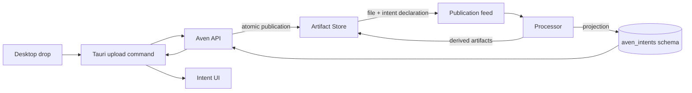

# Persistent file-triggered intents — implementation report

Status: implemented as a locally runnable vertical slice on `feat/persistent-intents`.

## What is real now

A desktop file drop creates one stable intent ID before upload starts. The file and an immutable `intent.declaration@1` artifact are then committed in one idempotent Artifact Store publication. The Processor consumes that publication and projects a tenant-local intent into the customer database.

The persistent intent contains:

- an ordered contribution history;
- the original file plus every derived Processor artifact;
- one visible `file` skill whose state, warnings, and stages follow the Processor presentation;
- a short routing summary (`File upload: <original name>`);
- durable human and agent messages added after the upload.

The Tauri UI loads these intents after restart and keeps the existing demo intents alongside them. Selecting a real artifact opens its exact content when it has a blob (image, PDF, or text). Derived data artifacts open their exact JSON payload. Unsupported content remains in a safe metadata view rather than pretending to render a document.



## Ownership boundaries

- Artifact Store owns immutable bytes, artifact payloads, types, and publication ordering.
- The Processor deployment owns the new `aven_intents` schema and the projection cursor. Intent projection and feed advancement happen in the same database transaction.
- Aven API authenticates the user, resolves the user's customer database and scope, and proxies only that tenant's intent/artifact operations.
- Tauri holds no service credential. It calls Aven API with the existing user session.
- The UI holds provisional upload state only until the authoritative intent projection is readable.

Customer separation remains database-per-customer. Processor schema version is now 4. Artifact Store schema/catalog version is now 3 so existing customer databases are reconciled and receive `intent.declaration@1`, not only newly provisioned databases.

## Known-state behavior

- A successful retry cannot create a second intent: publication ID, intent ID, timestamp, hash, and length are client-stable.
- The desktop retries one transport failure with those same identities. If the response remains ambiguous, the failed provisional view refreshes the server projection; a committed intent therefore reappears authoritatively instead of being lost.
- A publication contains both the file and declaration or neither.
- Feed projection is replay-safe and advances its cursor only with its database writes.
- Contributions use a UUID idempotency key and a row lock to serialize sequence assignment.
- Processor output acknowledgement precedes intent artifact projection; replay fills in any missing projection.
- `needs_review` presents the intent as waiting; a failed File skill presents it as error; successful processing leaves the intent open for subsequent conversation.
- The last valid Processor presentation and warning remain visible on partial failure.
- Existing deployed Processor migration 3 had one extra trailing newline. Only its two verified equivalent digests are accepted; all other checksum drift still fails closed.

## Run and verify locally

Start or rebuild the API + Artifact Store + Processor stack:

```bash
bun run dev:api:artifacts
```

In another terminal, run the automated persistent-intent smoke test:

```bash
bun run test:persistent-intent:smoke
```

It publishes a mock invoice and declaration atomically, waits for all 12 processing stages, verifies all 18 derived artifacts belong to the intent, and appends a durable conversation contribution. A successful run ends with JSON containing `"status": "ok"`, an `intentId`, and an `artifactId`.

Then start the desktop application:

```bash
bun run dev:app:linux
```

Sign in to the local stack and drop exactly one file anywhere on the open window. Expected behavior:

1. A new selected intent appears immediately.
2. The chat shows upload percentage and then the original name plus artifact ID.
3. The right rail shows one File skill and the original artifact.
4. Processing stages update live; derived artifacts appear as they are committed.
5. The intent title narrows to the best known presentation (for example, Invoice).
6. Clicking an artifact opens its blob or JSON payload.
7. Sending a message and restarting the app reloads that exchange in the same intent.

The Compose stack was rebuilt against an existing local customer database and the smoke test passed. The stack can be inspected with:

```bash
docker compose \
  -f services/aven-api/docker-compose.yml \
  -f services/aven-api/docker-compose.artifact-store.yml ps
```

## Deliberately still mocked

The preinstalled sample intents, their unrelated skills, gates, and workflow actions remain demo data. For a persistent file intent, only the File skill and artifact rail are authoritative. General intent create/update/archive/merge/delete tool calls still operate on the in-memory prototype; they must not yet be presented as durable operations. Automatic agent actions beyond the current chat and artifact-processing pipeline are also outside this slice.

The next persistence increment should move those intent lifecycle commands behind the same authenticated Intent API, with optimistic version checks and an explicit archive/delete retention policy.
