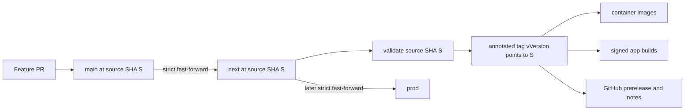

# Proposal: `next` releases without a `main` sync

Status: proposal; not implemented

Date: 23 August 2026

## Decision summary

Remove release-generated commits and the release-to-`main` synchronization step.
Treat `main`, `next`, and `prod` as source branches only. A `next` release should attach
an immutable annotated tag and release artifacts directly to the exact source commit
that was promoted to `next`; it should never write to any branch.

This keeps the existing strict fast-forward promotion model while removing the
two-way branch mutation that caused the `libs/aven-artifact-store/package.json`
add/add conflict.

The proposed invariant is:

> Promotion moves branch refs. Release creates tags, metadata, images, and binaries.
> Release never moves a branch ref.

## Why change the current model

The current workflow performs both of these operations:

1. promote source from `main` to `next`; and
2. create a version/changelog commit on `next`, then merge that commit back into
   `main`.

The second operation makes the release pipeline a source-control writer. It is needed
only because version stamping and changelog generation are currently committed. It
introduces failure modes unrelated to building or deploying the selected source:

- `main` can advance while a `next` release is running;
- equivalent PRs can have different commit IDs after independent rebase merges;
- versioned files added on both histories can produce add/add conflicts;
- a release can be tagged successfully but fail before its sync, leaving both branch
  ancestry and deployment in an intermediate state;
- the deploy key must write both `next` and `main`; and
- retry logic must reason about source patches, old release commits, merge parents,
  and concurrent branch updates.

That is too much control-plane complexity for metadata that can be materialized in an
ephemeral build workspace.

## Proposed branch and release model



There is no arrow from the release back to `main` or `next`.

### Branch invariants

1. `main` is the only branch that receives ordinary reviewed source changes.
2. `main → next → prod` promotions remain strict fast-forwards.
3. A release run does not change `main`, `next`, or `prod`.
4. A release tag points directly to the promoted source commit, not to a generated
   release commit.
5. All outputs carry the same immutable tuple:
   `(source_sha, version, tag)`.
6. Image digests and signed app artifacts remain the final deployment identities.

## Release state and idempotency

The annotated tag is the durable release reservation. The GitHub prerelease and build
outputs are reconcilable projections of it.

| Observed state | Meaning | Action |
| --- | --- | --- |
| No matching tag and `next` still equals the triggering SHA | Eligible source | Atomically create the next tag against that SHA |
| No matching tag and `next` moved | Superseded run | Exit successfully without releasing |
| Exactly one matching `next` tag already points to the SHA | Existing release | Reuse its version and repair/retry missing outputs |
| More than one matching release tag points to the SHA | Ambiguous state | Stop with an explicit error |
| Tag exists, GitHub prerelease is absent | Partial publication | Create the prerelease for the existing tag |
| Tag and prerelease exist, one build failed | Partial build | Re-run the failed build against the same tuple |
| Tag points elsewhere | Integrity error | Stop; never move or overwrite the tag |

The first tag push should include a compare-and-swap assertion for `next`, for example
an atomic no-op update of `refs/heads/next` guarded by a force-with-lease plus creation
of the new tag. This closes the gap between the final freshness check and tag creation
without changing the branch:

```text
expected next = source SHA S
atomic push = keep next at S + create tag vVersion at S
```

If `next` advanced, the atomic operation fails and the newer queued workflow owns the
new source commit. The existing `release-next` concurrency group should remain
serialized with `cancel-in-progress: false`.

## Version materialization

Source manifests should no longer be changed by each staging release. Set them once to
a valid development baseline such as `0.0.0-dev`, including matching internal Cargo
dependency requirements.

`scripts/set-version.ts` remains useful, but runs only inside disposable build
workspaces. It must not create a commit.

The `release` job should output:

- `released`: whether downstream release jobs should run;
- `source_sha`: the exact promoted source commit;
- `version`: for example `26.8.23-next.2`; and
- `tag`: for example `v26.8.23-next.2`.

Downstream consumers check out `source_sha` and use `version` explicitly. They must not
rediscover it from a mutable branch, the current date, a manifest left by an earlier
release, or the nearest reachable tag.

### Consumer changes

| Consumer | Proposed source/version behavior |
| --- | --- |
| Identity image | Checkout `source_sha`; stamp the disposable build tree if package versions are required; tag the image with source SHA and publish its digest |
| Artifact Store image | Checkout `source_sha`; use the same release tuple and publish the digest |
| Infrastructure | Checkout `source_sha`; no source stamping is required |
| Runtime deployment | Pin both images by digest; expose `version` as `APPLICATION_VERSION` and retain `source_sha` as revision metadata |
| macOS and iOS | Set `PUBLIC_APP_VERSION=version`; derive the App Store marketing version by removing `-next.N`; use the explicit prerelease counter as the build number |
| Linux | Stamp the disposable tree with `version` before building; upload assets to the explicit `tag` output |
| Website | Continue building the promoted `next` source; it is not coupled to the generated release commit |

The App Store marketing version must be derived from the reserved release version,
not by running `next-version.ts` again. Re-deriving from the wall clock can cross
midnight and produce a marketing version different from the tagged prerelease.

For example:

```text
release version:   26.8.23-next.2
marketing version: 26.8.23
build number:      2
```

## Changelog policy

Staging changelog generation should not mutate a source branch.

Recommended initial policy:

1. GitHub prerelease notes are the authoritative per-release notes.
2. Generate conventional changelog text in the release workspace and attach it as a
   release asset if a standalone file is useful.
3. Update the repository `CHANGELOG.md` only through a normal reviewed change, ideally
   when creating a stable release or as a periodic roll-up.

This separates an append-only release record from source promotion. It also avoids a
new source release being triggered merely because the previous release updated the
changelog.

## Required implementation changes

### `scripts/release-next.ts`

Replace the current stamp/commit/branch-push behavior with a tag-only state machine:

1. verify `GITHUB_SHA` and `origin/next`;
2. find an existing `v*-next.*` tag pointing to the source SHA;
3. reuse exactly one existing tag, or derive the next CalVer tag when none exists;
4. atomically reserve a new tag while asserting that `next` still equals the source
   SHA;
5. create or reconcile the GitHub prerelease;
6. emit `released`, `source_sha`, `version`, and `tag`; and
7. leave the worktree and every branch unchanged.

Dry-run mode should print the tuple and proposed notes without modifying files, refs,
or GitHub state.

### `.github/workflows/release-next.yml`

1. Delete `Sync release commit back to main` completely.
2. Rename the `commit` output to `source_sha`.
3. Add `version` as a first-class output.
4. Change every checkout from `needs.release.outputs.commit` to
   `needs.release.outputs.source_sha`.
5. Pass the explicit version/tag to image, deployment, macOS, iOS, and Linux jobs.
6. Materialize versions only in jobs whose build products consume manifest versions.
7. Use `tag` directly for release uploads and the prerelease counter directly for Apple
   build numbers; do not use `git describe` for selection.
8. Keep the release job serialized and retain immutable digest deployment.

### `.github/workflows/promote.yml`

Keep the strict fast-forward checks. Update its comments to state that a promotion may
trigger a tag-only release but the release will not move any branch.

### Tests

Add tests around a temporary bare Git remote for these cases:

- fresh source creates one tag pointing directly to the source SHA;
- a retry reuses the existing tag rather than incrementing the prerelease counter;
- a superseding `next` push prevents the old source from reserving a tag;
- two serialized runs cannot allocate the same version;
- an existing tag with a missing GitHub prerelease is reconciled;
- an unexpected or duplicate tag is a known terminal error;
- the release leaves `main`, `next`, and `prod` unchanged; and
- a release starting before midnight and building after midnight keeps one version.

## Security and operational effects

### Improvements

- The release deploy key no longer writes `main`.
- Release failures cannot create merge conflicts or partially merge source.
- A tag identifies the exact reviewed source rather than a bot-generated derivative.
- Branch protection and source review remain the only path for source changes.
- Retries reconcile explicit tag/release state instead of reconstructing branch
  ancestry.
- Provenance becomes simpler: source SHA → tag → image digest/app artifact.

### Boundaries that remain

- Tags must be immutable and protected from force updates/deletion.
- The release actor still needs narrowly scoped permission to create tags and GitHub
  prereleases.
- Build jobs must receive outputs only from the release job and must verify that the
  tag resolves to `source_sha`.
- Deployment continues to trust signed GitHub Actions workflow definitions, registry
  digests, environment secrets, and the protected `next` environment.
- Stable release policy is not redesigned here; this proposal only removes staging
  release commits and main synchronization.

## Transition from the current failed release

The existing `v26.8.23-next.1` tag is a historical release record and should not be
moved. Mark it as failed/not deployed if necessary; do not rewrite or reuse it for a
different source.

Two transition paths are possible.

### Recommended low-risk transition

1. Complete the already-prepared one-time sync recovery so `next` is again an ancestor
   of `main`.
2. Verify `git merge-base --is-ancestor origin/next origin/main`.
3. Implement this proposal on `main` in a normal reviewed PR.
4. Set committed source versions to the chosen development baseline in that PR.
5. Promote `main → next` using the existing promotion workflow.
6. Confirm the resulting release creates only a tag and artifacts and leaves both
   branch refs unchanged.
7. Retire the temporary sync-recovery branches and code.

This temporarily uses the hardened sync once, then removes the mechanism after the
branch relationship is known good.

### Direct transition without another sync release

If the interim sync should not run at all, use a one-time audited reconciliation
workflow with exact expected `main` and `next` SHAs:

1. construct one reconciliation commit whose parents are the current `main` and
   current `next` heads;
2. use the intended `main` source tree plus this proposal's implementation and the
   development version baseline;
3. push that commit to `main` only when the expected remote SHA still matches;
4. fast-forward `next` to the same reconciliation commit; and
5. let the new tag-only workflow release that source.

This path must not be performed with rebase-and-merge because preserving both parents
is what repairs ancestry. It is more operationally delicate and therefore is not the
default recommendation.

## Rollout gates

The change is ready to replace main synchronization when all of these hold:

1. A test release leaves the three branch refs unchanged.
2. The tag resolves exactly to the promoted `next` SHA.
3. All images and app artifacts report the reserved version and source SHA.
4. Re-running the same source does not create another version.
5. A simulated concurrent `next` advance produces a clean superseded result.
6. GitHub release notes or the attached changelog cover the same commit range as the
   current committed changelog.
7. `main → next` remains a strict fast-forward after one and after two releases.
8. The deployment health endpoint reports the expected application version and both
   immutable image digests are recorded by the workflow.

## Non-goals

- Redesigning CalVer.
- Changing the `main → next → prod` channel order.
- Replacing GitHub Releases, GHCR, TestFlight, or the Hetzner deployment.
- Allowing force pushes or tag rewrites.
- Designing the eventual stable-release workflow beyond keeping this proposal
  compatible with one.

## Recommendation

Adopt the tag-only model. It removes an entire distributed synchronization problem
without reducing traceability: the source SHA, protected tag, workflow run, image
digests, and signed artifacts provide a stronger and simpler release record than a
generated commit merged backward into `main`.
