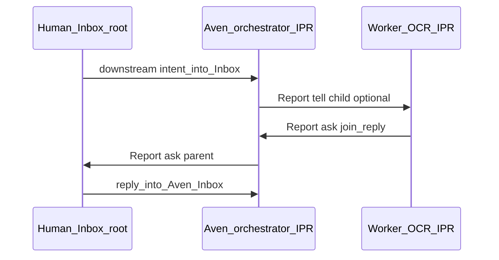
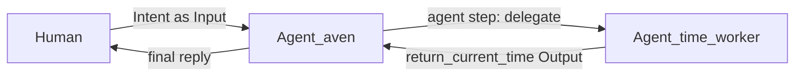

# Agent architecture — config schemata

This document describes **JSON-shaped configuration** for Agents, **Tinfoil** LLM profiles, and **tool bundles** in AvenOS. It complements [AvenOS.md](./AvenOS.md).

### Runtime stance

| Idea | Meaning |
|------|---------|
| **Sprite per agent** | **Every agent** — Aven or worker — maps to **its own** Sprite VM boundary at execution time (isolation, filesystem, egress policy). |
| **Sparks** | Meta **governance** grouping — omitted from **`/board`** until the control plane wires it explicitly. |
| **Actor shell** | **Inbox · Process · Report**: one **agent** primitive (**child agents** nest the same faces). **`/board`** docs: [`skill-playground-config.ts`](../src/lib/board/skill-playground-config.ts), [`build-board-graph.ts`](../src/lib/board/build-board-graph.ts). |

### Playground `/board`

**Non-executing** prototype: serial **Process** (**`deterministic`** = tool-like actions, **`creative`** = inline prompt and/or **`delegatesToChild`** subgraph), **Human root Inbox** + **Report** shell nodes, pedagogical **`T` / `A → parent`** edges. Default preset: OCR-style receipt extract excerpt.

Legacy **research brief** samples are archived in git history; JSON **`version`** is now **`0.4-ipr-serial`**.

---

## Actor shell — **Inbox · Process · Report**

| Face | Role |
|------|------|
| **Inbox** | Ingress: queued work plus replies (**Intent** ≈ synonym). **Human** owns the hierarchy **root inbox** — bubbled **`ask → parent`** items surface here. |
| **Process** | **Serial** **`step₀ → step₁ → …`**. Rows are **`deterministic`** actions or **`creative`** work (**inline** prompts and/or optional **`delegatesToChild`** hand-off). Lifecycle in the playground is **`idle · running · blocked · success · error`**. Effects on siblings/parents/children occur only via **Report**. |
| **Report** | Egress **`{ modality: tell \| ask; target; … }`**. **Targets:** `child` \| `parent` \| `sibling` \| `terminate`. **Never** add a **`human`** target — use **`parent`** so escalation bubbles to **Human**. |

### **Report** envelope (stub)

```yaml
report:
  modality: tell | ask
  target: child | parent | sibling | terminate
  ref?: string
  payload: ...
```


### Naming: **Human** → **Aven** orchestrator → **workers**

Product flow (mirrored on **`/board`**):

| Group | Meaning |
|-------|---------|
| **Human agent group** | Hierarchy **root inbox** · Human intent originates here; bubbled **`ask → parent`** items land here too. Not a **`Report` target**. |
| **Aven orchestrator** | Supervisor **agent**: full IPR (**Inbox · Process · Report**) on **`/board`**. Consumes downstream Human **`intent`** at its **Inbox**, then **`tell→child`** into specialist workers (preset: **`delegatesToChild: 'ocr_worker'`**). Keeps clustered **serial Process** for orchestration-only steps (not the whole preprocessing chain). **`orchestratorLabel`** overrides presentation name (**`agentId`** stays canonical). |
| **Worker agents** | Own IPR-compatible Process bands (**e.g. `ocr_worker` OCR agent** with ingest · preprocess · inline layout · delegated **field_worker** subtree). **`field_worker`** is a **nested** delegated agent shard (second Process band), not Aven’s orchestration row. |

### **`/board`** flow sketch

- **Supervisor (“Aven”) band:** deterministic + creative **routing** rows for Human intent (**default:** one delegated creative **`→ ocr_worker`**). Receipt IO · deskew/layout · nested field extraction clusters live on **OCR worker** (+ **field worker**) bands—not under Aven preprocessing.
- **Inline creative (`C`):** stays inside that Aven band alongside **`D`** steps; no extra worker graph unless a row declares **`delegatesToChild`**.
- **Delegated creative (`T`):** drops into the worker **Process band** seeded into their **Inbox** · **`join` / `Report` `ask`** semantics unchanged.

Human intent flows **Human root → Aven orchestrator Inbox** · then **serial Process**; delegated rows also reach **worker Inbox**. **`Report`** escalation uses **`parent`** until **Human** root.




---

**Further down:** historical **skill / flow prose** (`human` \| `agent` \| `tool`) remains for context but is **conceptually superseded** by IPR + serial **D/C** rows. **`time-worker` JSON** stays as a compact control-plane example.

---

## Skill execution model — flows and action steps

**Agent** means **either Aven or a worker** — same conceptual machinery. What varies is policy and **who may talk to the human directly**.

### Two flow primitives (inside a skill)

An agent’s **skill** is carried out as one or more **flows**. Each flow runs its steps in exactly one coordination mode:

| Mode | Meaning |
|------|---------|
| **Serial flow** | Action steps run **in order**; later steps may use earlier results. |
| **Parallel flow** | Multiple branches run **concurrently**; the flow merges when all branches complete (join semantics are defined by the skill/runtime). |

An agent may use **both** serial and parallel flows across different parts of a job; the important point is that **flow** is the unit of “how steps are scheduled,” not the step itself.

### Flow = *n* action steps (*n* ≥ 1)

Each **flow** consists of **one or more** **action steps** (in the serial case, ordered; in the parallel case, one step per branch or an explicitly parallelized group — exact encoding lives in the skill / executor).

### Action step kinds: `human` \| `agent` \| `tool`

Every **action step** is exactly one of:

| Kind | What it is |
|------|----------------|
| **`tool`** | A **concrete tool implementation** — a named, permissioned **function call** (OpenAI-style tool / your control-plane binding) with inputs and structured outputs. |
| **`agent`** | **Delegation** to **another agent actor**: call a **parent** agent, route to a **child** agent, or request **human-in-the-loop (HITL)** — but see escalation rules below. Not the same as “the LLM chatted”; it is an explicit **agent** hand-off in the execution graph. |
| **`human`** | A **human** action step — approval, clarification, or data only a person can provide. The runtime surfaces this as **Input** waiting on the human and resumes the flow when resolved. |

**Surface vs semantics:** Child delegation is often **declared** in config as a **function** tool (so the model can emit a `tool_call`), but the **semantic** step kind is **`agent`** — the runtime routes that call to another agent process, not an in-LLM subroutine.


> **Historical note:** HITL here uses “only Aven gates the human”; **canonical IPR** uses **`Report` `target: parent` only**, with Human at hierarchy root (**no** **`target: human`**). Treat this section as illustrative JSON shape, not the latest routing vocabulary.

### Escalation to the human (HITL)

- **Only Aven** may **escalate directly to the human** at the top of the stack (true **human** action step addressed to the end user / owner).
- **Sub-workers** (any agent that is **not** Aven) **must not** jump straight to the human. If they need approval, clarification, hit **limits**, **errors**, or **open questions**, they **bubble up** the chain: **worker → parent agent → … → Aven → human** — unless your product introduces an explicit intermediate **human** step that the parent models (still: no silent end-user contact without Aven policy for non-Aven agents).

Workers signal **blocked / needs human** as structured **Output** upward; Aven is the **gate** for when the human is actually engaged.

> **Config note:** This document’s JSON shows **agent identity**, **LLM profiles**, and **tool manifests**. **Serial / parallel flows** and **step graphs** (`human` \| `agent` \| `tool`) are part of the **skill / procedure** layer and will be serialized in a future schema; here they are **terminology** aligned with [AvenOS.md](./AvenOS.md) (*Skill* holds procedure).

---

## Workflow (example): Intent → Aven → `time_worker` → back

Terminology matches [AvenOS.md](./AvenOS.md): an Agent is a blackbox **Input → Output**. **Intent** is what the human wants; it becomes part of **Aven’s Input** for that turn. In the language above, Aven executes a **flow** whose steps include an **`agent`** step (delegate to `time_worker`) and `time_worker` runs a **flow** whose **`tool`** step is **`return_current_time`**.

| Step | What happens |
|------|----------------|
| 1 | **Human** expresses an **Intent**, e.g. “What time is it?” — fed into **Aven** as **Input** (goal text + any attachments Aven’s skill allows). |
| 2 | **Aven** runs a **flow** that includes an **`agent`** action step: **`delegate_to_time_worker`** (hand-off to the child agent in the **same** Spark). |
| 3 | **`time_worker`** runs a **flow** with a **`tool`** action step: **`return_current_time`** → structured result in **Output**. |
| 4 | **`time_worker` Output** **bubbles up** to **Aven**; **Aven** merges it into the user-visible reply. If `time_worker` needed the human, it would **bubble** via **parent → Aven** (only Aven opens a **human** step to the end user). |

There is **no** catalog of worker classes (`calendar` / `finance` / …) in this example — only **one** fixed worker id: **`time_worker`**. Further specialists are added the same way later (new agent id + tools + routing rules).



---

## Context (default Spark only)

| Idea | Meaning |
|------|---------|
| **Spark `aven`** | Default **Sprite** / OS runtime: dashboard, orchestrator, and **in-process** workers for this document all share **`spark_id: "aven"`**. |
| **Control plane** | OS-level plumbing that implements **tools** (e.g. routing a tool call to `time_worker`, policy, egress). **Not** the user’s arbitrary code unless installed inside that Spark. |
| **Sprite ↔ runtime** | One named Sprite = one persistent Linux environment ([Sprites](https://sprites.dev/)). **Both** Aven and `time_worker` are configured **against the same Spark** here. |

---

## Schema overview

| Schema | Purpose |
|--------|---------|
| `spark_config` | Single default Spark binding (`aven`). |
| `agent_config` | **`aven`** + **`time_worker`** — same `spark_id`. **Each agent defines `identity_system_prompt` (soul / persona), always first when assembling system messages.** |
| `llm_profile` | **Tinfoil** model + transport + env. |
| `tool_bundles` | Aven: **`delegate_to_time_worker`**; `time_worker`: **`return_current_time`**. |
| `inference_snapshot` | Example **first turn** on Aven: `systemPrompt` = **`identity_system_prompt`** + turn/task block; **stringified** `toolsJson`; optional `tool_choice` at runtime (see [Tinfoil JS SDK](https://docs.tinfoil.sh/sdk/javascript-sdk)). |

> **Note:** The production app may still use a different intent snapshot (e.g. routing enums) in [`run-intent.ts`](../src/lib/aven/run-intent.ts). This file is the **target shape** for the time-worker roundtrip; migration is a separate step.

---

## `spark_config`

Only the default Spark:

```json
{
  "id": "aven",
  "sprite": "aven",
  "kind": "aven",
  "parent_spark_id": null,
  "http": {
    "description": "AvenOS dashboard inside Sprite; public URL proxies to port 8080",
    "container_port": 8080
  },
  "policy": {
    "note": "Workers in this doc are co-located; no extra Sprites spawned in the example flow"
  }
}
```

---

## `agent_config`

**Same Spark** for both agents. `time_worker` is a **child** in the logical tree (parent **Aven**).

### Identity / soul — `identity_system_prompt` (required)

Every agent carries a **stable identity system prompt** at the **front** of its configuration (product language: **soul** or **persona**). It is **not** the skill recipe or the one-off task text — it answers *who this agent is*, *how it speaks*, and *what it values*. The runtime should **prepend** it when assembling chat `system` content (concatenate with any per-turn or skill prompts **after** it, separated by a clear boundary such as a blank line).

---

### Aven (orchestrator)

```json
{
  "id": "aven",
  "role": "aven",
  "spark_id": "aven",
  "parent_agent_id": null,
  "identity_system_prompt": "You are Aven — the single orchestrator in the default AvenOS Spark. You are calm, precise, and accountable: you interpret human Intent, delegate to workers in this same runtime when needed, and you never invent facts the workers did not provide. You speak plainly and close the loop back to the human.",
  "llm_profile_id": "default",
  "tools_bundle_id": "aven_delegate",
  "skill_id": "skill/aven/intent_and_delegate@1"
}
```

### `time_worker` (hardcoded specialist)

```json
{
  "id": "time_worker",
  "role": "worker",
  "spark_id": "aven",
  "parent_agent_id": "aven",
  "identity_system_prompt": "You are the time specialist (time_worker) in the same Spark as Aven. You have one job: answer questions about the current time using your tools. You are terse and literal; you do not chat or speculate. You report tool results faithfully.",
  "llm_profile_id": "default",
  "tools_bundle_id": "time_worker_tools",
  "skill_id": "skill/time/tell_me_the_time@1"
}
```

---

## `llm_profile` (Tinfoil)

Use **`TINFOIL_API_KEY`** ([`.env.example`](../.env.example)). Client: [`TinfoilAI`](https://docs.tinfoil.sh/sdk/javascript-sdk) — `await client.ready()`, OpenAI-compatible `chat.completions.create`. Transports: **`ehbp`** (default) or **`tls`**.

```json
{
  "default": {
    "provider": "tinfoil",
    "model": "llama3-3-70b",
    "temperature": 0.2,
    "transport": "ehbp",
    "api_key_env": "TINFOIL_API_KEY"
  }
}
```

---

## `tool_bundles` — Aven: delegate to `time_worker`

Aven’s only tool in this example **represents delegation** to the **`time_worker`** agent in the **same** Spark (the runtime maps this call to starting / resuming `time_worker` with the given **Input** payload).

```json
[
  {
    "type": "function",
    "function": {
      "name": "delegate_to_time_worker",
      "description": "Hand off to the tell-me-the-time worker inside the same Spark. Use when the user asks for the current time or any paraphrase of it.",
      "parameters": {
        "type": "object",
        "additionalProperties": false,
        "properties": {
          "user_message": {
            "type": "string",
            "description": "The user’s request text as received (Intent)."
          },
          "timezone_hint": {
            "type": "string",
            "description": "Optional IANA timezone name if the user specified one, e.g. Europe/Berlin"
          }
        },
        "required": ["user_message"]
      }
    }
  }
]
```

At runtime the control plane may force this tool for testing, e.g. `tool_choice: { "type": "function", "function": { "name": "delegate_to_time_worker" } }`.

---

## `tool_bundles` — `time_worker`: return time

Single tool — the **specialist’s** allowed action. Implementation returns **Output** (ISO timestamp); the worker’s LLM should call this tool once and then summarize if needed.

```json
[
  {
    "type": "function",
    "function": {
      "name": "return_current_time",
      "description": "Return the current time for composing the worker Output.",
      "parameters": {
        "type": "object",
        "additionalProperties": false,
        "properties": {
          "timezone": {
            "type": "string",
            "description": "IANA timezone for the response, default UTC if omitted",
            "default": "UTC"
          }
        },
        "required": []
      }
    }
  }
]
```

**Illustrative tool result** (what the runtime attaches to **Output** for the roll-up to Aven):

```json
{
  "iso_utc": "2026-05-07T19:30:00.000Z",
  "timezone": "UTC"
}
```

---

## `inference_snapshot` (Aven — first turn on an Intent)

Same structural idea as [`InferenceSnapshot`](../src/lib/aven/intent-request.ts): **`toolsJson` is a string** (one JSON array of tools, stringified). Below, **`toolsJson`** holds exactly the **Aven** bundle **`delegate_to_time_worker`**.

**`systemPrompt` here is composed:** **`agents.aven.identity_system_prompt`** (first) **+** a short **turn / task block** (second). In implementation, load identity from the agent record, then append the task instructions for this Intent type.

```json
{
  "model": "llama3-3-70b",
  "temperature": 0.2,
  "systemPrompt": "You are Aven — the single orchestrator in the default AvenOS Spark. You are calm, precise, and accountable: you interpret human Intent, delegate to workers in this same runtime when needed, and you never invent facts the workers did not provide. You speak plainly and close the loop back to the human.\n\nTurn: The user sends an Intent below. If they want the current time, call delegate_to_time_worker exactly once with user_message set to their text (and timezone_hint if they named a zone). Then summarize the worker result for the user.",
  "userIntentTemplate": "{{intent}}",
  "forcedToolName": "delegate_to_time_worker",
  "toolsJson": "[{\"type\":\"function\",\"function\":{\"name\":\"delegate_to_time_worker\",\"description\":\"Hand off to the tell-me-the-time worker inside the same Spark. Use when the user asks for the current time or any paraphrase of it.\",\"parameters\":{\"type\":\"object\",\"additionalProperties\":false,\"properties\":{\"user_message\":{\"type\":\"string\",\"description\":\"The user’s request text as received (Intent).\"},\"timezone_hint\":{\"type\":\"string\",\"description\":\"Optional IANA timezone name if the user specified one, e.g. Europe/Berlin\"}},\"required\":[\"user_message\"]}}}]"
}
```

### Pretty-print of the same `toolsJson` (for reading only)

```json
[
  {
    "type": "function",
    "function": {
      "name": "delegate_to_time_worker",
      "description": "Hand off to the tell-me-the-time worker inside the same Spark. Use when the user asks for the current time or any paraphrase of it.",
      "parameters": {
        "type": "object",
        "additionalProperties": false,
        "properties": {
          "user_message": {
            "type": "string",
            "description": "The user’s request text as received (Intent)."
          },
          "timezone_hint": {
            "type": "string",
            "description": "Optional IANA timezone name if the user specified one, e.g. Europe/Berlin"
          }
        },
        "required": ["user_message"]
      }
    }
  }
]
```

---

## Composed manifest: `aven.config.json` (single Spark + time worker)

```json
{
  "version": "0.2-time-worker",
  "description": "Aven + hardcoded time_worker in default Spark aven only",
  "llm_profiles": {
    "default": {
      "provider": "tinfoil",
      "model": "llama3-3-70b",
      "temperature": 0.2,
      "transport": "ehbp",
      "api_key_env": "TINFOIL_API_KEY"
    }
  },
  "sparks": {
    "aven": {
      "id": "aven",
      "sprite": "aven",
      "kind": "aven",
      "parent_spark_id": null,
      "http": { "container_port": 8080 }
    }
  },
  "agents": {
    "aven": {
      "id": "aven",
      "role": "aven",
      "spark_id": "aven",
      "identity_system_prompt": "You are Aven — the single orchestrator in the default AvenOS Spark. You are calm, precise, and accountable: you interpret human Intent, delegate to workers in this same runtime when needed, and you never invent facts the workers did not provide. You speak plainly and close the loop back to the human.",
      "llm_profile_id": "default",
      "tools_bundle_id": "aven_delegate",
      "skill_id": "skill/aven/intent_and_delegate@1"
    },
    "time_worker": {
      "id": "time_worker",
      "role": "worker",
      "spark_id": "aven",
      "parent_agent_id": "aven",
      "identity_system_prompt": "You are the time specialist (time_worker) in the same Spark as Aven. You have one job: answer questions about the current time using your tools. You are terse and literal; you do not chat or speculate. You report tool results faithfully.",
      "llm_profile_id": "default",
      "tools_bundle_id": "time_worker_tools",
      "skill_id": "skill/time/tell_me_the_time@1"
    }
  },
  "tool_bundles": {
    "aven_delegate": [
      {
        "type": "function",
        "function": {
          "name": "delegate_to_time_worker",
          "description": "Hand off to the tell-me-the-time worker inside the same Spark.",
          "parameters": {
            "type": "object",
            "additionalProperties": false,
            "properties": {
              "user_message": { "type": "string" },
              "timezone_hint": { "type": "string" }
            },
            "required": ["user_message"]
          }
        }
      }
    ],
    "time_worker_tools": [
      {
        "type": "function",
        "function": {
          "name": "return_current_time",
          "description": "Return the current time for the worker Output.",
          "parameters": {
            "type": "object",
            "additionalProperties": false,
            "properties": {
              "timezone": { "type": "string", "default": "UTC" }
            },
            "required": []
          }
        }
      }
    ]
  }
}
```

---

## Roundtrip summary

1. **Input** to Aven includes the human **Intent** (see [AvenOS.md — Input / Output](./AvenOS.md#an-agent-is-a-blackbox)).  
2. Every agent’s **`identity_system_prompt`** is loaded **first**; per-turn or skill text follows when building the model `system` message.  
3. Aven calls **`delegate_to_time_worker`** → runtime invokes **`time_worker`** in the **same** `aven` Spark.  
4. **`time_worker`** calls **`return_current_time`** → structured time → **Output** up to Aven.  
5. Aven returns the user-facing result for the Intent.

This is the minimal **meaningful** loop to validate configs, prompts, and tool wiring before adding more workers or additional Sparks.
