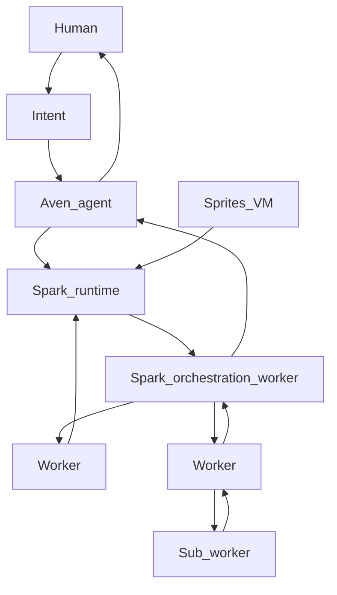

# AvenOS — Architecture Reference

---

## The Organisation

### Aven CEO GmbH

The company behind everything. A German GmbH. Builds and maintains AvenOS and the aven.ceo commercial product.

### AvenOS

The open-source operating system. The architecture described in this document. Anyone can run it, self-host it, and build on top of it. Free forever.

### aven.ceo

The commercial hosted product. AvenOS — fully managed.

aven.ceo is not a layer on top of AvenOS. It *is* AvenOS, plus everything around it:

- Hosted infrastructure — no setup required
- Backup and sync layer — coordinated execution and persistence for your °Aven
- Personalised hands-on training — your Aven aligns to how you work
- Managed updates — always running the latest AvenOS

### °Aven — your personal instance

Every human on aven.ceo gets their own **°Aven** — a personalised Aven instance living at their own subdomain and email:

```
°Aven Ted    →   ted.aven.ceo   /   ted@aven.ceo
°Aven Bob    →   bob.aven.ceo   /   bob@aven.ceo
°Aven Sarah  →   sarah.aven.ceo /   sarah@aven.ceo

```

The ° mark signals a live personalised instance — tuned to one human's life, work, and preferences. Not a generic chatbot.

### The full hierarchy

```
Aven CEO GmbH
  │
  ├─ AvenOS                        open-source OS — free, self-hostable
  │
  └─ aven.ceo                      commercial product — hosted AvenOS
        │
        ├─ °Aven Ted               ted.aven.ceo / ted@aven.ceo
        ├─ °Aven Bob               bob.aven.ceo / bob@aven.ceo
        └─ °Aven Sarah             sarah.aven.ceo / sarah@aven.ceo

```

---

## Runtime architecture — Intent, Aven, Spark, Workers

AvenOS routes human goals through a single **Aven Agent**, which delegates execution into **Sparks**. A Spark is an isolated, stateful **sandbox server environment** (filesystem, processes, optional full-stack app). Aven provisions Sparks, sets policy, and tears them down.

**Inside each Spark** there is always an **orchestration Worker** — the Spark’s own “lead” Agent — responsible for breaking work down and **sub-delegating** to other Workers **within that Spark**. Those Workers may in turn coordinate further sub-tasks. Delegation is **recursive**: the same **Agent** abstraction applies at every level (compare **RLM-style** recursive decomposition — nested planners/specialists composing a larger job).

**Workers** are recursively **composable**: any Worker can hand a scoped **Input** to another Worker and fold its **Output** back into its own run, within Spark policy and tool budgets. **Cross-Spark** coordination remains **Aven’s** job; **within-Spark** trees are owned by that Spark’s orchestration Worker.

Execution isolation and persistence are anchored in **Sprites** — hardware-isolated Linux environments (checkpoint/restore, durable disk, optional HTTP surface). See [Sprites — stateful sandboxes](https://sprites.dev/).



Typical flow:

1. **Human** expresses an **Intent** — what they want done or decided.
2. Intent becomes **Aven Agent** **Input** — goal state in Aven’s working context.
3. **Aven** **delegates** to one or more **Sparks** (create/reuse sandbox, policy, files/tools as needed).
4. Each Spark’s **orchestration Worker** plans inside the sandbox and **sub-delegates** to further Workers (and those Workers may recurse **arbitrarily deep** within the same Spark, subject to limits Aven sets).
5. **Outputs** roll up: sub-Workers → orchestration Worker → **Spark** boundary → **Aven**. **Aven** synthesises across Sparks, never arbitrary peer messaging between Sparks.
6. Aven returns **results** to the human — approvals, summaries, links (e.g. Sprite HTTP on `:8080`; see [Sprites](https://sprites.dev/)).

**Naming**

| Concept | Meaning |
|--------|---------|
| **Aven Agent** | Top orchestrator for one human (or tenancy). Single front door from Intent. |
| **Spark** | One sandbox runtime Aven controls — includes an **orchestration Worker** plus **sub-Workers**. Sprite-backed (or equivalent). |
| **Orchestration Worker** | Lead Worker **inside** a Spark; **sub-delegates** to other Workers in that Spark. |
| **Worker** | Any **Agent** inside a Spark — specialist or orchestrator; **recursively composable** (may spawn sub-Workers via Inputs/Outputs). |
| **Intent** | Human-supplied goal or judgment that feeds Aven’s input. |

---

## What is AvenOS?

You wake up in the morning. Before you check your phone, your Aven has already reviewed your calendar, flagged a conflict, and drafted a response for your approval. By the time you make coffee, your day is already organised.

**Aven is your personal AI twin** — not a passive assistant. It orchestrates personal and professional life as one operation: email, finance, health, projects, simulations. One intelligence coordinates; **Sparks** and **Workers** execute where isolation and specialty matter.

---

## Everything is an Agent

**Aven and Workers are the same thing under the hood.**

Both are **Agents**. Your **Aven** orchestrates **Sparks**. Inside each Spark, an **orchestration Worker** plays the same role at smaller scale: it **sub-delegates** to other Workers, which may themselves nest further — **recursive composition** (same blackbox **Input → Output** at every depth).

---

## An Agent is a blackbox

From the outside, every Agent looks identical. It takes one **Input** and produces one **Output**.

```
Input  →  [ Agent ]  →  Output

```

**Input** — everything the Agent needs for this run: goals from above (Aven or a **parent Worker** in the same Spark), plus any **prior Outputs** **Aven** or that parent chose to attach.

**Output** — the compressed result: what it did, what it found, **Score**, and an updated **Skill** **Generation** when the procedure improved.

**Aven** passes **Input** to a Spark (usually via its orchestration Worker). **Orchestration Workers** pass **Input** to **sub-Workers** inside the same Spark. Every Worker returns an **Output** up its chain until the **Spark** reports to **Aven**.

---

## Every Agent has four properties

No matter Aven or Worker, they share the same four properties (memory and separate flow lists are **out of scope** in this revision; procedure lives **inside** Skill).

```
worker.context    ← what it's working on right now
worker.skill      ← what it knows how to do (expertise + procedure in one place)
worker.score      ← how it measures if it did it well
worker.tools      ← what it is permitted to use

```

---

### worker.context — what it's thinking about right now

When an Agent wakes up for a job, it is loaded with its **Input** — goal and prior results Aven chose to include. All of that is the **context** for this run.

The context is temporary. When the Agent finishes and emits its **Output**, this working context is cleared. Next job, fresh context.

---

### worker.skill — expertise and procedure

A **Skill** is the Agent's know-how: **what** to achieve and **how** to get there — domain expertise, step-by-step procedure, tool-usage conventions, and reporting shape. Former “flow” ideas (ordered steps, tool calls) live here as part of the Skill, not as a separate top-level primitive.

Skills evolve. Each improvement is versioned as a **Generation**.

Example (conceptual — still one Skill, not a separate flow object):

```
worker.skill (finance Worker, simplified):
  Goal: Review accounts vs budget; flag anomalies; return structured summary.
  Procedure:
    1. read_accounts()      → balances
    2. compare_to_budget()  → variance
    3. detect_anomalies()   → flags
    4. score_run()          → compute Score
    5. emit Output

```

---

### worker.score — how it measures success

Every Agent has exactly **one Score** — a single number measuring job quality. Defined inside the Skill. Computed at end of run. Always part of the **Output**.

```
finance Worker          → anomaly detection coverage    ↑ higher better
calendar Worker         → conflict resolution rate      ↑ higher better
database-write Worker   → write latency ms              ↓ lower better
water-simulation Worker → anomaly detection recall      ↑ higher better

```

---

### worker.tools — what it is permitted to use

The tools list is the permission boundary — OpenAI / Anthropic style function definitions. **Aven** provisions tools for the **orchestration Worker**; that Worker may expose or request narrower tool scopes for **sub-Workers** within policy **Aven** set for the Spark.

```json
worker.tools = [
  {
    "name": "read_accounts",
    "description": "Read current account balances and transactions",
    "parameters": {
      "type": "object",
      "properties": {
        "account_ids": { "type": "array", "items": { "type": "string" } },
        "date_range":  { "type": "string" }
      }
    }
  }
]

```

A finance Worker does not get calendar tools unless Aven explicitly expands the budget. Workers stay bounded; Aven remains accountable.

---

## Two roles (same Agent kind)

**Aven** — top-level Skill, tools to **open/close Sparks** and read **Spark-level Outputs**. Does **not** own the internal tree inside a Spark.

**Worker** — runs **inside** a Spark. The **orchestration Worker** is a Worker whose Skill is **domain + delegation** (sub-Workers); **leaf** Workers are specialists. Any Worker may be a **parent** in a recursive tree **inside** one Spark.

```
Agent role: Aven
  worker.skill  = strategic orchestration + Spark-level delegation
  worker.tools  = [spawn_spark, read_spark_output, ...]

Agent role: Worker (orchestration, inside Spark)
  worker.skill  = decompose + sub-delegate + merge
  worker.tools  = [invoke_sub_worker, domain tools, ...]

Agent role: Worker (leaf, inside Spark)
  worker.skill  = bounded specialist routine
  worker.tools  = [domain-specific tools, ...]

```

---

## How information moves

**Between Sparks:** only **Aven** coordinates — no cross-Spark Worker gossip.

**Inside one Spark:** the **orchestration Worker** is the hub. It issues **Inputs** to **sub-Workers**, receives **Outputs**, and may recurse (a sub-Worker can itself orchestrate deeper **sub-Workers**), all **within** that Spark’s policy.

1. Aven sends **Input** to **Spark S1** (received by its **orchestration Worker**).
2. Orchestration Worker delegates **Input**’ to **sub-Workers**; sub-trees complete bottom-up.
3. Orchestration Worker emits **Output** **up** to Aven.
4. Aven may run many Sparks in parallel, collect **Outputs**, replan.

```
Aven
  └─► Spark S1
        └─► Orch₁   Input: [from Aven]
              ├─► W1   → O1
              └─► W2   → O2
                    └─► W2a (sub)  → O2a  → folded into O2
              → Output O_S1

  └─► Spark S2
        └─► Orch₂   → O_S2

Aven reads O_S1 + O_S2 → next step

```

Decomposition is **recursive** inside a Spark; **Aven** only sees **Spark-level** bundles unless Aven explicitly drills into artefacts a Spark exposes.

---

## Intent — you are always in control

AvenOS is not unchecked autonomy. When a decision is yours — approval, taste, tradeoff — Aven surfaces it.

**Intent** is your voice: it starts work (“How is my week?”) and steers Aven when it pauses for you.

```
You → Intent → Aven worker.context → Sparks / Workers → Outputs → Aven → you

```

---

## The full picture (conceptual)

```
You
  │ Intent: "How is my week looking?"
  ▼
°Aven Ted  (Agent type: Aven)
  worker.context  ← your goal + incoming Outputs
  worker.tools    ← [spawn_spark, invoke_worker, read_output, ...]
  │
  ├─► Spark α — Orch_α sub-delegates:
  │     ├─► Calendar Worker   →  "3 conflicts, Tuesday overloaded"
  │     └─► Health Worker     →  "Sleep average down this week"
  │
  └─► Spark β — Orch_β sub-delegates:
        ├─► Finance Worker     →  "Invoice arrived, Q3 on track"
        └─► Projects Worker    →  "Maia City tick 47 ready"

°Aven Ted synthesizes all Outputs → returns:

"Your Tuesday is overloaded — move the 3pm call?
 Invoice arrived; Q3 looks healthy.
 Sleep is shorter this week — block Friday morning?
 Tick 47 is ready when you are."

```

---

## Primitive Reference

| Primitive              | What it is                                                              |
| ---------------------- | ----------------------------------------------------------------------- |
| **Agent**              | Universal base unit — Aven and Workers are Agents                       |
| **Agent role: Aven**   | Top orchestrator — Intent in, Sparks out                               |
| **Agent role: Worker** | Runs inside a Spark — orchestrator (sub-delegates) or leaf specialist |
| **Orchestration Worker** | Lead Worker in a Spark; sub-delegates recursively to other Workers |
| **Spark**              | Sandbox + **orchestration Worker** + **sub-Workers**; Sprite-backed   |
| **Sprite**             | Isolated stateful VM / environment — see [sprites.dev](https://sprites.dev/) |
| **°Aven [Name]**       | Live personalised Aven — [name].aven.ceo / [name]@aven.ceo              |
| **Intent**             | Human input to Aven — starts work or resolves a judgment                |
| **Input**              | Agent input bundle — goal + optional prior Outputs                      |
| **Output**             | Agent result — findings + **Score** + Skill **Generation** when updated |
| **worker.context**     | Active working state for this run — cleared after Output               |
| **worker.skill**       | Expertise **and** procedure (steps, tools usage) — versioned            |
| **worker.score**       | Single quality metric per run                                           |
| **worker.tools**       | Allowed capability list — function-calling schema                       |
| **Generation**         | Versioned Skill snapshot after improvement                              |
| **Composition**        | **Recursive** inside a Spark — orchestration Worker → sub-Workers → … (RLM-style) |

---

## Product & Brand Reference

|                     |                                                                |
| ------------------- | -------------------------------------------------------------- |
| **Aven CEO GmbH**   | The company — German GmbH                                      |
| **AvenOS**          | Open-source operating system — free, self-hostable             |
| **aven.ceo**        | Commercial hosted product — AvenOS + infrastructure + training |
| **°Aven [Name]**    | Personalised Aven instance on aven.ceo                         |
| **[name].aven.ceo** | Web endpoint for a personalised Aven                           |
| **[name]@aven.ceo** | Email identity for a personalised Aven                         |

