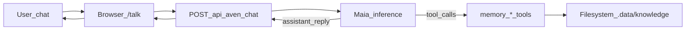

# Aven second brain & memory architecture

Memory is **separate** from Aven’s **[agent / IPR / board orchestration](./AgentArchitecture.md)** and **[actor-machine vocabulary](./AgentMachine.md)**. Those layers coordinate *work*: here we only care about **durable Markdown knowledge** (“second brain”) and how humans + models **maintain it**.

**Design in one line:** Maia always sees a **fresh index** of vault paths and titles (like a live table of contents) and is instructed to **edit existing notes in place** (unique substring replace) instead of minting parallel files for the same entity. The rules live entirely in **`.data/agents/maia/RULES.md`** and the seed **`src/lib/memory/prompts/maia-assistant.md`**—no external product names required to understand behavior.

## 1. Separation of concerns

| Piece | Responsibility |
|--------|----------------|
| **`/memory`** | Browse/edit vault Markdown; **Display** viewer (wikilinks, GFM) or **Markdown** source; sidebar lists vault index, Maia docs, and (Messages tab) Talk transcript. |
| **`/talk`** | One continuous **Aven Maia** chat: transcript in **`.data/messages/conversation.json`**, reloaded on `/talk` with a live **context** summary; tools mutate the vault. |
| **`/me`** + `/api/aven/intent` | Intent classification → Jazz workers (**not** vault maintenance). |

All vault I/O resolves under **`/.data/knowledge/`** at the repo root (see below).

---

## 2. Local storage (gitignored)

| Path | Role |
|------|------|
| **`.gitignore`** | Includes **`/.data/`** — never committed. |
| **`.data/knowledge/`** | Canonical vault (`**/*.md`). Created on first use; seeded with a short `README.md`. |
| **`.data/messages/`** | **`conversation.json`** restores the rolling chat; **`messageN.md`** logs each completed assistant turn. |

**Folder convention:** `People/`, `Organizations/`, `Projects/`, `Topics/` — a soft schema; Aven does **not** require rigid templates in v1. Prefer **one canonical note per entity** (aliases in the body) and **edit-in-place** using **`memory_edit`** when the path already exists in the injected snapshot.

**Runtime:** Paths are gated server-side (**no `..`**, resolved under vault root). **Local filesystem** implies: run **`bun dev`** from repo root so `process.cwd()` points at AvenOS.

---

## 3. Conversational maintenance loop (`/talk`)

1. **`GET /api/aven/conversation`** reloads the saved transcript and a **context scaffold** (vault index + messages + tool list) for the aside. **`POST /api/aven/chat`** (with **`stream: true`**) appends each successful reply to **`conversation.json`** and to **`messageN.md`**. NDJSON events include `context` / `status` / `done` / `error` so the UI can show **Maia**’s current step (thinking, which tool, etc.).
2. Server builds **system text** = Maia contract **+ a live Markdown table of every `Path | Title`** (`formatVaultSnapshotMarkdown`) so the model can resolve entities before creating files.
3. Model tools (OpenAI function JSON):

   - **`memory_list_notes`** — redundant JSON list after big edits.
   - **`memory_read_file`**
   - **`memory_edit`** — **primary** update: unique **`oldString`** → **`newString`** at an existing path (substring must occur exactly once in the file).
   - **`memory_write_file`** — **create** missing paths **or** deliberate **full replace** of one path when appropriate; not for duplicating an entity that already has a row in the snapshot.
   - **`memory_search`** — grep helper when titles are ambiguous.

Updating “Sam” → “Samuel” should therefore hit **`memory_edit` on `People/Sam.md`** (or **`memory_write_file`** on **that same path** only for a full rewrite), not add `People/Samuel.md`. **`Topics/Preferences.md`** is interpreted as **vault-owner** preferences; vague bullets (“likes water”) are attributed to **you** unless they name someone else.

4. Until the model emits a plain assistant message (tool round cap), repeat.

**Chat model:** Default is **`glm-5-1`** ([model details](https://tinfoil.sh/models/glm-5-1)), set in repo JSON [`src/lib/aven/tinfoil-chat.config.json`](../src/lib/aven/tinfoil-chat.config.json) under **`chatModel`**. The POST body may still pass **`model`** to override a single turn. Secrets stay in env: **`TINFOIL_API_KEY`** only (same pattern as the [JavaScript inference example](https://docs.tinfoil.sh/sdk/javascript-sdk)).

---

## 4. Direct browser API (Memory UI)

Implementation lives alongside Svelte routes:

| Method | Endpoint | Behaviour |
|--------|----------|-------------|
| `GET` | `/api/memory/notes` | `{ notes: { path, title }[] }` — also refreshes derived vault graph on the server |
| `GET` | `/api/memory/note?path=Rel/Path.md` | `{ content }` |
| `PUT` | `/api/memory/note` | `{ path, content }` — validates path |
| `GET` | `/api/memory/graph?path=Rel/Path.md` | Outgoing resolved links, backlinks, unresolved wikilink targets for that note |
| `GET` | `/api/memory/graph?full=1` | Full serialized graph (dev / inspection) |
| `GET` | `/api/memory/graph` | Aggregate stats only (`stats`, `generatedIso`) |

Same vault helpers (`$lib/memory/vault.ts`) as tool executor — **single source**.

---

## 5. Vault link graph (Aven)

Aven maintains a **derived JSON graph** for the Markdown vault only (not a general document-ingestion pipeline):

| Artifact | Role |
|----------|------|
| **`.data/state/vault-graph.json`** | Built from all `[[wikilinks]]` in `.data/knowledge` (body after frontmatter). **Outgoing** (resolved), **backlinks**, **unresolved** targets; rebuilt on memory tool writes, note `PUT`, and **`GET /api/memory/notes`** (Memory refresh). |
| **Talk** | [live-context.ts](../src/lib/aven/live-context.ts) appends a **short graph summary** after the Path \| Title snapshot (edge counts + sample broken links). |
| **Memory UI** | Backlinks / outgoing / unresolved panel for the selected note via `GET /api/memory/graph?path=`. |

Shared parsing: [`wikilink-parse.ts`](../src/lib/memory/wikilink-parse.ts) (same rules as preview injection in [`markdown-view.ts`](../src/lib/memory/markdown-view.ts)).

**Not in scope here:** temporal triple store (e.g. MemPalace-style), IPR [`buildBoardGraph`](../src/lib/board/build-board-graph.ts) — only **vault wikilink adjacency** for this subsystem.

---

## 6. Deferred extensions

- **Ingestion graph** — optional importers under **`.data/inbox/`** when you add sources.
- **Live “tracks”** — event-router over streams — extension point; **out of MVP**.

---

## 7. Constraints & next steps

- **Hosting:** ephemeral serverless mounts may lack durable `.data`; for production you’d mount a disk or migrate to synced storage (**Jazz** CoValues vs DB is product decision later).
- **Importers:** reserved **`.data/inbox/`** (document only until implemented).
- **Distillation:** overlaps with **`skill` → `tool` lifecycle** in [AgentMachine.md](./AgentMachine.md) once you automate prompt mining.

---

## See also

- [AgentArchitecture.md](./AgentArchitecture.md) — IPR surfaces.  
- [AgentMachine.md](./AgentMachine.md) — orchestration calculus.  
