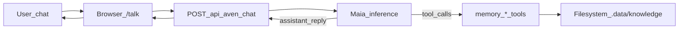

# Aven second brain & memory architecture

Memory is **separate** from Aven’s **[agent / IPR / board orchestration](./AgentArchitecture.md)** and **[actor-machine vocabulary](./AgentMachine.md)**. Those layers coordinate *work*: here we only care about **durable Markdown knowledge** (“second brain”) and how humans + models **maintain it**.

**Upstream reference (local clone):** `git clone … .repos/rowboat` then open `apps/x/packages/core/src/knowledge/note_creation.ts` — that file embeds the full **note_creation** persona, **label rules**, and **builtin tool** list (`workspace-readFile`, **`workspace-edit`** for updates, `workspace-writeFile` **only for new files**, `workspace-grep`, etc.) plus the instruction to use the **pre-built knowledge_index** before creating entities. Aven mirrors the **index + edit-not-write** pattern below.

## 1. Separation of concerns

| Piece | Responsibility |
|--------|----------------|
| **`/memory`** | Browse/edit vault Markdown; **Display** viewer (wikilinks, GFM) or **Markdown** source; Rowboat-style folder hints. |
| **`/talk`** | One continuous **Aven Maia** chat: transcript in **`.data/messages/conversation.json`**, reloaded on `/talk` with a live **context** summary; tools mutate the vault. |
| **`/me`** + `/api/aven/intent` | Intent classification → Jazz workers (**not** vault maintenance). |

All vault I/O resolves under **`/.data/knowledge/`** at the repo root (see below).

---

## 2. Local storage (gitignored)

| Path | Role |
|------|------|
| **`.gitignore`** | Includes **`/.data/`** — never committed. Optional **`/.repos/`** for a local upstream clone (`git clone https://github.com/rowboatlabs/rowboat .repos/rowboat`). |
| **`.data/knowledge/`** | Canonical vault (`**/*.md`). Created on first use; seeded with a short `README.md`. |
| **`.data/messages/`** | **`conversation.json`** restores the rolling chat; **`messageN.md`** logs each completed assistant turn. |

**Convention (Rowboat-aligned soft schema):** `People/`, `Organizations/`, `Projects/`, `Topics/` — same spirit as upstream `note_system.ts` / `note_creation.ts` entity folders; Aven does **not** require rigid templates or tag agents in v1. Prefer **one canonical note per entity** (alias in body) and **edit-in-place**, matching Rowboat’s index + **workspace-edit** pattern.

**Runtime:** Paths are gated server-side (**no `..`**, resolved under vault root). **Local filesystem** implies: run **`bun dev`** from repo root so `process.cwd()` points at AvenOS.

---

## 3. Conversational maintenance loop (`/talk`)

1. **`GET /api/aven/conversation`** reloads the saved transcript and a **context scaffold** (vault index + messages + tool list) for the aside. **`POST /api/aven/chat`** (with **`stream: true`**) appends each successful reply to **`conversation.json`** and to **`messageN.md`**. NDJSON events include `context` / `status` / `done` / `error` so the UI can show **Maia**’s current step (thinking, which tool, etc.).
2. Server builds **system text** = Maia contract **+ a live markdown table of every `Path | Title`** (`formatVaultSnapshotMarkdown`, same role as Rowboat’s `knowledge_index` injected into `note_creation` prompts).
3. Model tools (OpenAI function JSON):

   - **`memory_list_notes`** — redundant JSON list after big edits.
   - **`memory_read_file`**
   - **`memory_edit`** — **primary** update (unique `oldString` → `newString`, mirrors `workspace-edit`).
   - **`memory_write_file`** — **create / full replace only** when path is **not** already a row in the snapshot **or** rewiring an entire file deliberately.
   - **`memory_search`** — grep helper when titles are ambiguous.

Updating `Sam` → `Samuel` should therefore hit **`memory_edit` on `People/Sam.md`** (or `memory_write_file` on **that same path**), not add `People/Samuel.md`. **`Topics/Preferences.md`** is interpreted as **vault-owner** preferences; vague bullets (“likes water”) are attributed to **you** unless they name someone else.

4. Until the model emits a plain assistant message (tool round cap), repeat.

**Chat model:** Default is **`glm-5-1`** ([model details](https://tinfoil.sh/models/glm-5-1)), set in repo JSON [`src/lib/aven/tinfoil-chat.config.json`](../src/lib/aven/tinfoil-chat.config.json) under **`chatModel`**. The POST body may still pass **`model`** to override a single turn. Secrets stay in env: **`TINFOIL_API_KEY`** only (same pattern as the [JavaScript inference example](https://docs.tinfoil.sh/sdk/javascript-sdk)).

---

## 4. Direct browser API (Memory UI)

Implementation lives alongside Svelte routes:

| Method | Endpoint | Behaviour |
|--------|----------|-----------|
| `GET` | `/api/memory/notes` | `{ notes: { path, title }[] }` |
| `GET` | `/api/memory/note?path=Rel/Path.md` | `{ content }` |
| `PUT` | `/api/memory/note` | `{ path, content }` — validates path |

Same vault helpers (`$lib/memory/vault.ts`) as tool executor — **single source**.

---

## 5. Patterns borrowed from Rowboat (high level)

- **Incremental batch graph** (`build_graph.ts` / `graph_state.ts`) — optional later under **`.data/state/`** when importers arrive.
- **`/talk`** now injects a **`Path | Title`** table **every turn** (`vault-index.ts`) — aligns with **`knowledge_index`**.
- **Live “tracks”** — event-router over streams — extension point; **out of MVP**.

---

## 6. Constraints & next steps

- **Hosting:** ephemeral serverless mounts may lack durable `.data`; for production you’d mount a disk or migrate to synced storage (**Jazz** CoValues vs DB is product decision later).
- **Importers:** reserved **`.data/inbox/`** (document only until implemented).
- **Distillation:** overlaps with **`skill` → `tool` lifecycle** in [AgentMachine.md](./AgentMachine.md) once you automate prompt mining.

---

## See also

- [AgentArchitecture.md](./AgentArchitecture.md) — IPR surfaces.  
- [AgentMachine.md](./AgentMachine.md) — orchestration calculus.  
