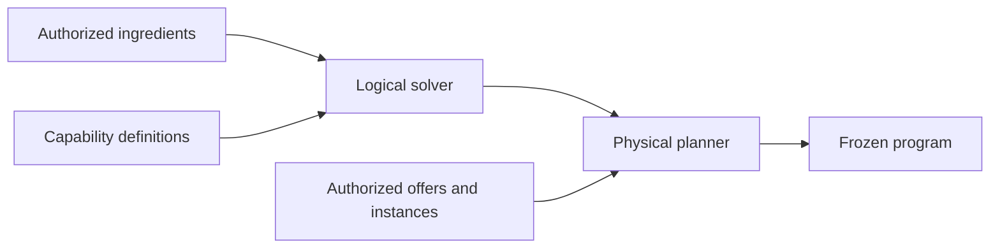

# Skills: from a desired outcome to a resumable run

This is the best starting point for understanding skill execution in avenOS. It
explains the model from a caller's point of view and is deliberately practical. For
the complete architecture, continue with
[Actors, skills, planning, and durable execution](generic-actor-registry-and-runtime.md).
The wire format and state-machine requirements are normative in
[Actor execution protocol and document-ingest cutover](actor-runtime-formal-spec.md).

## Start with an outcome

Suppose a user uploads an invoice and asks for validated invoice details. The system
has an ingredient—the uploaded file artifact—and a goal:

```prolog
ingredient  ceo.aven.docs.file(invoice_1)
goal        ceo.aven.bookkeeping.invoice_details(invoice_1)
```

There may be several ways to reach that goal. A machine-readable XRechnung can be
parsed directly. A text PDF can use native text. A scan needs a vision-capable model.
The available route also depends on the user's entitlements, current assurance,
artifact access, chosen execution environment, and the actors available there.

A **skill** captures the desired outcome and the policy around it. That outcome may be
exact—“produce invoice details”—or exploratory—“learn as much useful information as
possible about this document.” It does not need to freeze one implementation path. A
planner can discover a suitable path from the authorized actor catalog, and a runner
can execute that plan without making the skill responsible for mailboxes, retries, or
persistence.

That separation gives five concepts one job each:

| Concept | Question it answers |
| --- | --- |
| Actor definition | What kind of worker is this? |
| Capability | What can one method produce from which inputs? |
| Skill | What outcome does the product offer, under which policy? |
| Plan | Which authorized capabilities and placements solve this request? |
| Run | What has happened, what is durable, and what should happen next? |

Artifacts are not a sixth kind of process state. They are the immutable ingredients
and results that survive every actor and runner instance.

## A capability is the planner's smallest operation

Actors receive envelopes and may keep private working state. Planning happens at the
method level because a runnable step must name a concrete method, its inputs, and its
guaranteed outputs.

A capability therefore describes:

- a qualified, versioned identity;
- the actor method to invoke;
- predicates required together for one invocation;
- predicates guaranteed after success;
- input and output slots bound to canonical schemas;
- whether it transforms, observes, streams, renders a view, or causes an effect;
- idempotency and retry semantics; and
- planning metadata such as cost.

For example, a structured invoice reader can advertise:

```prolog
requires:
  ceo.aven.docs.document(D)
  ceo.aven.docs.document_profile(D, xrechnung)

produces:
  ceo.aven.bookkeeping.invoice_details(D)
```

The output slot binds the logical fact to
`ceo.aven:schema:bookkeeping:invoice-details@1`. Another capability may produce the
same fact and schema from page images. Downstream consumers depend on the meaning of
the result, not on which actor happened to produce it.

The qualifiers matter. First-party product and LLM vocabulary belongs to `ceo.aven`;
neutral actor execution protocols belong to `os.aven`; and `id.aven` is limited to
principal, authentication, assurance, authorization, and grant evidence. Predicate
functors are domain-qualified as `ceo.aven.docs.*` or
`ceo.aven.bookkeeping.*` as well.

## What a skill definition contains

A reusable skill definition should be small. It needs:

- a qualified `SkillId`, label, and version;
- accepted ingredient predicates and requested goal predicates;
- product policy, such as allowed effects, privacy, cost, or placement constraints;
- parameter schemas and human-facing descriptions; and
- optionally, a preferred recipe or views for explanation and interaction.

The preferred recipe is a hint or constraint, not a second source of capability truth.
The registry remains authoritative for what can currently be invoked.

### Exact, exploratory, and hybrid goals

An exact goal has a crisp completion condition: all requested predicates have been
proven by authorized ingredients or committed outputs.

An exploratory goal is different. “Get as much information as possible” is not one
predicate and can never mean “invoke every actor.” It is a bounded optimization
objective:

```text
maximize   useful, supported facts about document D
subject to time, cost, privacy, assurance, and confidence policy
stop when  no relevant authorized capability has sufficient expected information gain
```

The skill should name the subject, relevant fact families, utility policy, budgets,
minimum confidence, permitted effects, and stopping rule. The runner executes a useful
observer, commits its evidence, replans from the richer fact set, and stops with an
explicit reason such as `saturated`, `budget_exhausted`, `needs_input`, or
`no_authorized_route`.

The durable result is an understanding bundle or report: discovered typed artifacts,
their evidence and confidence, coverage, unresolved questions, and the stopping
reason. It is not an untyped bag of model guesses.

Most product skills will be hybrid. For example: classify the document as a mandatory
exact goal, then maximize additional supported understanding within five seconds and
without external effects. Exact predicates provide the success floor; exploration
provides useful enrichment.

The current `solve()` and `PlanRunStartCommand.goals` implement exact predicate goals
only. Exploratory utility, budgets, saturation, and understanding bundles are target
contracts, not implemented behavior in this branch.

An ad-hoc request does not need a stored skill first. A caller can submit ingredients,
goals, parameters, and policy directly. If that query becomes useful, it can later be
published as a named skill. This is much like the difference between running a SQL
query and saving a view.

### Do not confuse a skill with its UI projection

The app also contains `SkillDef` objects under `app/src/lib/skills`. They describe
authored workflow canvases and views used by the current product UI. Some are backed
by live behavior and some are demonstrations. Their edges are useful explanations,
but they are not durable `PlanRun` records and the generic runner does not execute
them.

Keep that distinction explicit:

- a UI `SkillDef` explains or presents a product workflow;
- a `ceo.aven` skill definition states an executable outcome and policy;
- an `os.aven` plan/run records one selected execution.

The UI can eventually render the compiled plan and live run over the existing canvas
without making the canvas the scheduler.

## Creating a skill

An authored skill is created in four layers, in this order.

### 1. Publish actor contracts

Each actor method declares honest `requires`, guaranteed `produces`, and schema-bound
slots. Alternatives belong in separate capabilities; possible outputs must not be
claimed as if every invocation guaranteed all of them.

Construct static IDs with `resourceId()` rather than concatenating strings:

```ts
const skillRef = resourceId({
  authority: 'ceo.aven',
  kind: 'skill',
  namespace: 'docs.ingest',
  name: 'document-ingest',
  version: '1'
})
```

### 2. Register definitions and placements

`ActorRegistry` stores three different things:

1. versioned definitions and their method capabilities;
2. factory offers that might create an actor; and
3. live instance advertisements that can receive an envelope now.

Knowing a definition exists is not the same as having permission to use it or an
instance available. The registry owns advertisements, not actor processes. Hosts and
factories own construction, draining, and disposal.

### 3. Declare the outcome and policy

Create the skill definition from domain concepts, not implementation names. “Produce
validated invoice details” is stable; “call vision actor B, then validator C” is a
particular plan.

An authored recipe may restrict allowed capabilities, demand a review point, or
provide a certified route. It should still be checked against the current registry and
schema catalog before use.

### 4. Add executable examples

Contract tests should solve representative fixtures and explain the selected route.
For a document skill, include at least:

- structured XRechnung choosing machine-readable extraction;
- scanned input choosing a vision route when authorized;
- an unauthorized premium actor being invisible to planning;
- equivalent canonical output schemas across alternative routes; and
- a useful unsolved result when no authorized proof exists.

Store expected explanations, not hand-maintained copies of graph edges.

## Planning is query optimization over capabilities

Planning has two stages.

For exact goals, **logical planning** proves that the goals follow from the
ingredients. Requirements within one capability are AND conditions. Different
capabilities that produce the same fact are OR alternatives. `solve()` implements a
bounded uniform-cost forward search with shared variable bindings, artifact-backed
inputs, and explicit failure when no proof exists.

**Physical planning** selects a live instance or factory offer for every logical step.
`solveAuthorized()` pins one execution environment—`local` or `server`—and selects
only targets present in an authorized registry view.



Authorization happens before search so the plan neither uses nor reveals forbidden
actors. `authorizeRegistryForPlanning()` provides this filtered view today. Its
`ActorAuthorizer` is an integration contract and test seam; it is not yet connected to
the final avenCEO entitlement and artifact-grant service. A production runner must
also reauthorize spawn and invocation because planning decisions can become stale.

The planner returns data. It does not instantiate actors, dispatch envelopes, publish
artifacts, or claim that a run succeeded.

### Discovery changes the plan

Some facts cannot be predicted. A recognizer can guarantee a typed report, but not
that an arbitrary input is an XRechnung. The runner executes to that observation,
commits the report, projects only its validated facts, and replans the unfinished
goal.

This is how a new XRechnung package can replace image recognition without an
`if xrechnung` branch in a generic coordinator: the recognizer establishes
`ceo.aven.docs.document_profile(D, xrechnung)`, then the structured extractor becomes
the cheapest reachable producer of the same invoice-details schema.

Exploratory planning uses the same checkpoint loop but chooses the next observer by
expected information gain rather than solely by distance to a fixed predicate. Its
relevance filter still begins with the subject and permitted fact families, so an
installed payroll or medical actor does not run merely because it could emit another
fact.

## Executing a plan

A production runner owns the operational lifecycle:

1. admit the start command and freeze its environment;
2. persist the authorized plan segment before executing it;
3. authorize and materialize factory targets as needed;
4. bind committed input artifacts to method slots and dispatch envelopes;
5. validate and atomically publish outputs plus a production-run receipt;
6. checkpoint the committed artifacts and unlock dependent work;
7. suspend on a typed continuation or replan after a new observation; and
8. drain and release actor instances at their admitted lifetime boundary.

A step is successful only after publication is acknowledged. Actor memory may make a
step faster, but recovery may depend only on the run journal and immutable artifacts.

### Current execution paths

The branch intentionally contains several layers at different maturity levels:

- **`DocumentProcessingRuntime` works end to end for the current document DAG.** It
  calls actors, publishes every successful step, retries safely, and updates the app
  projection. Its coordinator is document-specific and does not execute generated
  plans.
- **The app's `server` document host proves the portable client seam.** It freezes
  server placement and crosses the strict JSON boundary, but still runs inside the
  desktop process.
- **`services/actor-runner` proves the remote trust boundary.** Through
  `api.aven.ceo`, it provides authenticated admission, independent identity-token
  and tenant-grant verification, subject isolation, SQL-backed idempotency, status,
  cancellation, restart recovery, and SSE shape. Its baseline executor normally
  completes only already-satisfied goals; it has no generic actor executor.
- **The durable generic executor is specified, not implemented.** Its attempts,
  leases, factories, artifact ports, continuations, and effects remain the next major
  slice.

The HTTP runner is therefore a real trust and transport boundary, not yet the remote
document-ingest runtime. The app's Device/Server selector still routes both choices to
desktop-hosted `DocumentProcessingRuntime` instances.

## Resumption and human input

A run is mutable operational state. It records plan segments, attempts, leases,
fencing tokens, checkpoints, unresolved continuations, and publication outbox state.
An artifact is an immutable domain value. Mixing those two makes recovery and audit
ambiguous.

An encrypted PDF illustrates the boundary. Inspection should commit a durable report
and open a `secret` continuation. Only the request metadata is stored. The password is
submitted over an authenticated continuation, exposed through an attempt-scoped
secret handle, and destroyed after use. Postponing or restarting leaves the request
open, so reopening the intent presents it again. The current document coordinator
still ends this case in `needs_review`; the continuation behavior is specified but not
implemented.

## Artifacts as durable agent-to-agent communication

The Artifact Store is a durable blackboard and provenance ledger, not a queue.

| Communication | Representation |
| --- | --- |
| “Here is a fact or result” | Publish the domain artifact |
| “Please perform this work” | Publish a typed work-request artifact when the request itself must be durable |
| “Here is the answer” | Consume the request and publish typed result artifacts plus a production-run receipt |
| Meaningful question or decision | Typed question, answer, proposal, or decision artifact |
| External mutation | Authorized request artifact followed by a receipt or reconciliation artifact |
| Heartbeat, lease, retry, delivery acknowledgement | Run repository and control envelopes |
| Streaming tokens or UI deltas | Event transport, optionally summarized later |

Prefer domain types such as `ceo.aven.bookkeeping.reconciliation_report` over a
universal `agent.message`. A generic communication artifact is appropriate only when
the communication itself is the durable business fact.

The final result of a skill is normally the goal artifact or artifacts. A special
“skill result” wrapper is useful only when a consumer needs a named bundle.

## What is ready, and what comes next

Ready in this branch:

- qualified `id.aven`, `os.aven`, and `ceo.aven` identifiers;
- method-level capabilities and schema slots;
- a generic registry for definitions, offers, and instances;
- principal-scoped planning views and local/server physical placement;
- bounded logical and physical solvers;
- portable run and checkpoint values;
- the working document-specific executor and its client publication/retry adapter
  (the split publication downstream remains an integration requirement);
- the authenticated server runner boundary and memory reference backend.

Still required for general skill execution:

- real avenCEO entitlement, artifact-grant, and admission policy integration;
- a durable run repository with leases, fencing, and an outbox;
- a generic slot resolver, artifact publisher, envelope executor, and fact projector;
- dynamic factory activation and teardown in the runner;
- durable continuations and an ephemeral secret broker;
- checkpointed observation/replanning;
- exploratory and hybrid goal contracts with bounded utility and stopping rules;
- app wiring from the Server choice to the remote runner; and
- XRechnung recognizer/extractor packages and parity tests.

## Where to continue reading

- [Actors, skills, planning, and durable execution](generic-actor-registry-and-runtime.md)
  develops the complete conceptual model, including authorization, dynamic lifecycle,
  XRechnung, and continuations.
- [Actor execution protocol and document-ingest cutover](actor-runtime-formal-spec.md)
  is the implementation-ready normative contract.
- [Document ingest system architecture](document-ingest-system.md) explains the
  working application path and its current hard-coded coordinator.
- [`@avenos/actors`](../libs/aven-actors/README.md) documents the implemented registry
  and planners.
- [Actor runner service](../services/actor-runner/README.md) documents the current
  authenticated server boundary and its deliberate limits.
