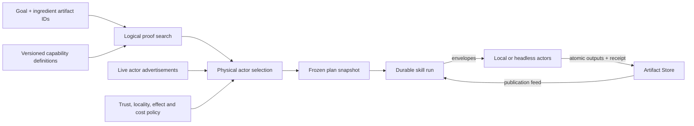

# Actor skills, resumable runs, and ad-hoc problem solving

## Conclusion

Yes: the Prolog-shaped contracts can become the catalog for a problem solver which
compiles a goal and available ingredients into an ad-hoc program. The current system
already has most of the nouns, but they currently stop at three different boundaries:

- actor contracts and the bus derive a live graph and perform one-hop fan-out;
- skill definitions describe curated workflow canvases but do not execute them;
- the Artifact Store records successful transformations, while the Processor already
  demonstrates durable steps, leases, retries, an outbox, and resumable projections.

The clean model is not to make one of these three things mean all of the others. Keep
five distinct values:

1. **Capability** — one invocable actor method, with typed requirements and guaranteed
   products.
2. **Skill definition** — a named outcome, policy, views, and optional preferred
   recipes. It is the reusable product-level affordance.
3. **Plan** — a frozen logical/physical program compiled for one goal against one
   registry snapshot.
4. **Skill run** — mutable, resumable operational state for that plan.
5. **Artifacts and production runs** — immutable ingredients, results, and successful
   provenance.

An actor view is then just another client of the actor/run event protocol. A headless
server actor and an actor with a local view have the same execution semantics.

## What the current system already says

### Actors are the execution primitive

`actors/actor.ts` gives an actor a template identity, runtime UUID, manifest, mailbox,
private state, sandboxed reducer, methods, and `requires`/`produces` predicates.
`actors/bus.ts` addresses envelopes to actor instances, derives tools from registered
methods, derives graph edges through unification, and forwards an emitted predicate to
all matching consumers.

That is already enough to support local and remote placement conceptually. The view is
not the actor. The missing part is a wire protocol and durable delivery identity; the
current `Envelope` is explicitly local and carries only an in-memory sequence.

### The registry discovers actors, not yet capabilities

`actors/registry.actor.ts` can list actors and return a manifest. It cannot currently
ask questions such as:

- who can guarantee `ocr_text(File)`?
- which method do I invoke to obtain it?
- is that instance available, local, trusted, or expensive?
- is the operation pure, idempotent, gated, streaming, or externally effectful?

Those questions need method-level capability records. Whole-actor contracts remain
useful as a summary, but a physical plan must end in a concrete envelope
`{ to, method, payload }`.

### Skills are templates and projections today

`skills/skill.ts` models a skill as workflows, each containing trigger, operation, and
output nodes. Edges are correctly derived from `provides ∩ requires`; skill boundaries
use the same merge law as composite actors. `skills/inbox.skill.ts` and
`skills/todos.skill.ts` are good visual/product descriptions.

They are not executable recipes yet. Several nodes are descriptions of future actors,
and the runtime state painted over a workflow is a UI projection. This is a useful
model, but it should not be confused with a run.

### Durable values and durable work already have good precedents

The Artifact Store has the right invariant: a production run is an immutable receipt
for one successfully committed transformation. Inputs already exist; outputs are
created atomically; attempts, failures, jobs, and progress live outside the core.

The Artifact Processor supplies the operational pattern a skill runtime needs:

- cases and steps;
- explicit dependencies;
- pending/running/retry/terminal states;
- attempts with leases and fencing tokens;
- a transactional outbox for Artifact Store publication;
- idempotent acknowledgement and replayable projections.

A general skill runtime should reuse those semantics, not encode progress into mutable
artifacts and not treat an interrupted attempt as a successful production run.

## Four ways to model a skill

### 1. Curated workflow template — the current model

A skill is a named set of authored workflows and views. This is best for predictable
UX, certification, explanation, human review placement, and repeatable common cases.

Its weakness is rigidity: it either duplicates actor contracts or freezes one route
through a registry that may have better actors tomorrow.

Use it as a product definition and optional plan hint, not as the only runtime truth.

### 2. Composite actor

A skill can be an actor whose `members` are other actors. The existing merge law gives
it a derived boundary, so skills can nest fractally and callers see only the outer
contract.

This is elegant for encapsulation and delegation. It is not sufficient for resumption:
member selection, checkpoints, attempts, artifacts, and partial completion still need
a run model outside the actor's mailbox.

### 3. Goal/rule declaration

A skill can declare an outcome rather than a path:

```text
skill prepare_todo_from_inbox
requires mail(M) OR upload(M)
goal     todo(M)
policy   no_external_side_effects, tenant_local_data
```

The planner proves the goal from registered capabilities. This is the strongest model
for discovery, substitution, and ad-hoc composition. It also needs richer semantics
than the current predicate pairs: AND versus OR, guaranteed versus possible outputs,
effect class, policy, cost, and concrete invocation data.

### 4. Frozen plan plus durable run

A plan is a DAG of concrete invocations generated from a skill definition or a
one-off goal. A run is the evolving execution state of that exact plan. This is the
best execution model because it is inspectable, resumable, and auditable.

It should be generated, not manually kept in sync with capabilities. Curated workflows
may constrain or seed planning; the compiled plan is still checked against the current
registry and then pinned for the run.

### Recommended combination

Use all four at their natural level:

| Concept | Stable meaning |
| --- | --- |
| Actor | Stateful message recipient and executor |
| Capability | One method-level transformation advertised by an actor |
| Skill | Named goal, policy, views, and optional preferred recipes |
| Composite actor | Encapsulated delegation boundary when useful |
| Plan | Derived DAG of concrete capability invocations |
| Run | Resumable operational execution of a frozen plan |
| Artifact | Immutable input/output value |
| Production run | Immutable receipt for one successfully committed step |

This avoids making “skill” simultaneously mean package, workflow template, process
instance, actor, and artifact lineage.

## The capability registry the solver needs

Publish definitions and live instances separately. Definitions change by version;
availability changes continuously.

A logical capability needs at least:

```ts
interface CapabilityDefinition {
  capabilityId: string
  actorTemplate: string
  actorVersion: string
  method: string
  requires: Predicate[]       // all required for this invocation
  produces: Predicate[]       // guaranteed after successful completion
  mode: 'transform' | 'effect' | 'stream' | 'view'
  idempotency: 'pure' | 'idempotent' | 'reconcilable' | 'none'
  policy: Record<string, unknown>
}
```

A physical actor advertisement adds:

```ts
interface ActorAdvertisement {
  actorId: string             // stable runtime address, not a display name
  actorTemplate: string
  actorVersion: string
  endpoint: string
  availableUntil: string
  locality: string
  trustDomain: string
  estimatedCost: number
  estimatedLatencyMs: number
  capabilityIds: string[]
}
```

The Prolog facts can be the source of the logical definition. The registry should
publish a normalized query representation as well, so every client does not need to
embed the Prolog parser. The definition and machine digests should be pinned in the
plan.

The important change is **method scoping**. A whole actor saying
`requires(todo_intent(I))` and `produces(todo(T))` describes its skin, but does not say
whether to invoke `todo_create`, `todo_update`, or another method. Planning facts must
identify an invocable operation.

## Planning like a database

The SQL planner analogy fits well if planning is split in two:

1. **Logical planning** finds a proof from ingredient predicates to goal predicates.
   Each capability is a rule; all its requirements are AND; multiple rules that produce
   the same predicate are OR alternatives.
2. **Physical planning** chooses a live actor instance for every logical operation,
   based on policy, locality, trust, price, latency, data movement, and availability.

The result is not merely a list. It is a DAG with bound inputs, symbolic output slots,
dependencies, gates, and compensating/reconciliation requirements.



Backward chaining is attractive when there are few goals and many capabilities.
Uniform-cost forward search is simple when the current ingredient set is small. An
eventual implementation can use an A* or Datalog-style semi-naive search and retain
multiple Pareto-optimal physical plans rather than reducing price, latency, privacy,
and reliability to one accidental number.

The planner must be bounded: maximum proof depth, expanded states, fan-out, wall time,
and output cardinality. Cycles are valid in the capability graph but must not produce
unbounded search.

## The executable spike in this worktree

`skills/problem-solver.ts` is a small, side-effect-free proof of the central claim. It
takes method-level capabilities, ingredients (optionally bound to artifact IDs), and
goals. It performs uniform-cost search, maintains variable bindings across all inputs
of a step, chooses among alternative producers, and emits an ad-hoc program containing
concrete actor/method targets and dependency links.

The tests demonstrate:

- `mail(message_42)` compiling into normalize → classify → route → create;
- a cheaper local OCR actor winning over a remote implementation;
- two-input AND semantics with a shared identity variable;
- a useful failure when no complete proof exists.

It intentionally does **not** execute, publish artifacts, query the current bus, or
claim production-ready Prolog semantics. It is the logical kernel to test and evolve
before another generic flow runtime is introduced.

## Why today's facts cannot yet safely drive execution

The present facts are adequate for diagrams and coarse routing, but several ambiguities
become correctness bugs in a solver:

1. **Actor versus method.** Actor-level contracts do not identify the envelope method.
2. **AND versus OR.** The inbox workflow's normalize node lists both `mail(M)` and
   `upload(U)` as requirements, while its prose means either input. Separate operation
   rules or explicit alternatives are required.
3. **Guaranteed versus possible output.** The route node lists todo, document, entity,
   and unknown outputs. One invocation does not guarantee all four. Each guarded branch
   needs its own rule, or the result must be represented as a sum type refined only
   after execution.
4. **Type fact versus value fact.** `todo(T)` is useful for topology. Resumption needs a
   binding to a particular artifact occurrence, such as `todo(todo_123)` plus its
   Artifact Store UUID.
5. **Streams versus durable transformations.** `delta(D)` and `interrupted()` are live
   event contracts, not planner steps. Capabilities need a mode so transient voice/UI
   fan-out does not enter a durable proof.
6. **Side effects.** Sending mail or making a payment is not equivalent to OCR. It needs
   a request artifact, authorization/HITL, downstream idempotency, and a receipt or
   reconciliation path.
7. **Parser scope.** The current fact reader is deliberately small: flat, fact-only,
   shallow argument splitting, and no full rule bodies, negation, lists, types, or
   constraint solving. Keep the first planner dialect small, but make its limits
   explicit and versioned.
8. **Availability and trust.** Logical ability and a live, authorized physical actor are
   different registries and change on different clocks.

## Creating a skill

Creation should have two valid entry points.

### Authored skill

1. Publish or install its actor/capability definitions and optional machines/views.
2. Declare the skill identity, goal interface, policy, and optional curated workflows.
3. Lint every curated workflow against the capability registry: each node must name an
   invocable method and every requirement must have a prior or external producer.
4. Solve representative fixtures and store golden plan explanations, not hard-coded
   edges.
5. Publish immutable `skill.definition@1`, `skill.workflow@1`, `skill.machine@1`, and
   view artifacts only when installation/version pinning needs them. The existing T3
   reservations already anticipate this.

### Ad-hoc skill

A caller supplies ingredients, goals, and policy without first creating a named skill.
The planner emits a plan and the runtime starts a run. If the solution proves useful,
the user can save the goal/policy/preferred-plan pattern as a named skill later.

That distinction mirrors SQL: saving a view is useful, but a query does not need a view
before it can run.

## Executing and resuming a skill

The durable orchestrator should be a service/process boundary, not a nested actor call
inside another actor's sandbox.

1. Create a run with goal, ingredient artifact IDs, policy, registry epoch, and the
   frozen plan/definition digests.
2. Mark steps runnable when every input slot resolves to an existing artifact or a
   durable root fact.
3. Lease a step with an attempt ID and fencing token.
4. Send an envelope containing run ID, step ID, attempt ID, input artifact IDs,
   parameters, and a stable publication/idempotency identity.
5. The actor performs the operation and prepares outputs. The orchestrator publishes
   the output artifacts and one production-run receipt atomically through an outbox.
6. The Artifact Store feed acknowledgement is the success boundary. The run projection
   records output bindings and unlocks dependants.
7. A crash restarts from the durable run. Completed outputs are facts; expired attempts
   can be leased again; an acknowledged publication is never repeated under a new
   identity.
8. Replanning is allowed only for the unfinished suffix. Completed steps remain pinned
   provenance. The new plan revision records why the previous physical choice became
   unusable.

For a human gate, publish or project a typed proposal and wait for a
`review.decision@1` artifact. The current in-memory `HeldMessage` remains useful for UI,
but it cannot be the durable source of truth for a process expected to survive restart.

For an external effect, use the established request/receipt pattern. The request
artifact UUID becomes the downstream idempotency/reconciliation key. Never retry an
ambiguous side effect as though it were a pure actor transformation.

## Artifact ownership

Artifacts and workflow state answer different questions:

| Data | Home | Reason |
| --- | --- | --- |
| Skill, workflow, machine, view definitions | Artifact Store when independently installable | Immutable version pinning |
| Input and output business values | Artifact Store | Durable values and lineage |
| Successful step provenance | Artifact Store production run | Atomic, immutable receipt |
| Plan snapshot | Run store initially; optional typed artifact for sharing/audit | A plan is not itself a successful transformation |
| Run/step status and dependency readiness | Skill runtime database | Mutable, resumable projection |
| Attempts, leases, errors, backoff, logs | Skill runtime database | Operational state, not domain history |
| Human proposal and decision | Typed artifacts plus run projection | Durable and reviewable |
| External action request and receipt | Typed artifacts | Idempotency and reconciliation |
| Streaming deltas and view events | Event transport, optionally summarized | Too transient/noisy for the artifact graph |

The final outcome need not be one special “skill result” artifact. The requested goal
artifacts are the result. A manifest artifact is useful only when the consumer needs a
named bundle of several outputs.

## Headless and distributed actors

Nothing about capability execution should require a view. A server actor needs:

- a stable actor/template/version identity;
- a lease-backed registry advertisement;
- an authenticated endpoint accepting the same envelope contract;
- input artifact read capabilities scoped to the run;
- output publication authority scoped to its procedure namespace;
- bounded progress/events and cancellation;
- idempotency or explicit at-least-once semantics.

The UI can attach as a subscriber to actor and run events. A local actor may expose a
view definition; a headless actor may not. That is presentation metadata, not an
execution caste.

## A staged route from here

1. **Capability contract.** Add a method-level, versioned capability descriptor and a
   registry query. Do not infer invocation semantics from whole-actor summaries.
2. **Contract cleanup.** Split alternatives and conditional outputs in the inbox/todo
   examples; classify stream/view/transform/effect modes; bind sample facts to artifact
   types and occurrences.
3. **Planner hardening.** Extend the spike with standardize-apart variables, multiple
   output cardinality, policy constraints, explanation trees, cycles, and bounded
   Pareto costing. Keep it pure and test it against registry snapshots.
4. **Durable single-host runner.** Generalize the Processor's case/step/attempt/outbox
   pattern for compiled plans. Start without nested actor sandboxes or a new canvas.
5. **Artifact bridge.** Treat Artifact Store acknowledgement as step success and build
   run projections from its feed.
6. **HITL and effects.** Add proposal/decision and request/receipt semantics before any
   planner is allowed to choose effectful capabilities.
7. **Remote transport.** Only after local resumption and idempotency are proven, allow
   physical planning onto headless server actors.
8. **Product surface.** Render the actual compiled plan/run over the existing skills
   canvas; compare it with the authored preferred workflow and explain substitutions.

There was already a generic recipe/FlowActor experiment in board item 0137, and it was
reverted because the runtime and UI complexity outweighed its value. The lesson is not
that goal solving is impossible. It is to keep the next slice narrower: first a pure
planner, then durable orchestration modeled after the Processor, with actors remaining
leaf executors and the UI remaining a projection.

