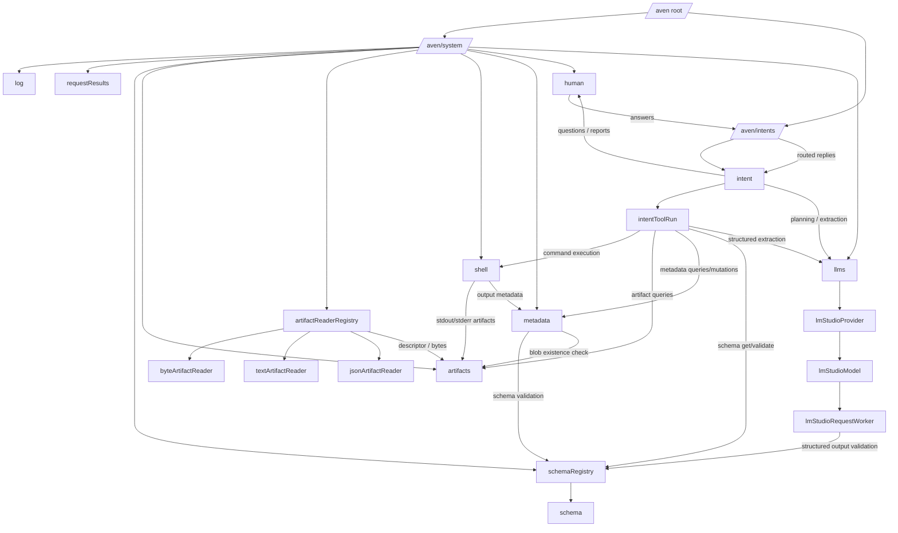

> **Note:** This describes the TypeScript actor runtime in a separate packages workspace (not yet in the AvenOS monorepo). Paths below refer to that repo.

# Actor System Capabilities

This document is the readable entry point for the actor contracts in the packages workspace. It summarizes what the system can do, how the major actors fit together, and where to look for detailed message-level behavior.

For the detailed actor-by-actor contract reference, see [Actor capabilities reference](/docs/actors/developers/02-actor-capabilities-reference).

## Scope

The packages workspace defines a TypeScript actor runtime, not Solidity contracts. The actor kinds are declared in `packages/runtime/src/spine.ts` and implemented across these packages:

- `packages/runtime`
- `packages/intents`
- `packages/artifacts`
- `packages/schema`
- `packages/metadata`
- `packages/human`
- `packages/llm`
- `packages/shell`
- `packages/*-contracts`

The system is organized around a root actor, a system-services branch, and an intents branch.

## High-level topology

## What the system provides

### 1. Intent orchestration

The `intents` router creates and routes user goals into child `intent` actors. Each `intent` maintains task state: timeline, observations, human questions, selected models, planner request ids, tool run ids, and cancellation state.

The intent system provides a structured loop:

1. create or route an intent,
2. ask an LLM planner what to do next,
3. execute a tool run,
4. capture the result as an observation,
5. ask a human when blocked or when final reporting is needed,
6. continue until done, failed, waiting, or cancelled.

### 2. Tool execution

`intentToolRun` is the per-tool child actor. It isolates a single tool invocation and reports completion back to its parent `intent`.

Current tool families include:

- `shell.execute`
- `intent.readArtifact`
- `metadata.queryRecords`
- `metadata.createRecord`
- `metadata.getRecord`
- `llm.extractStructuredFromArtifact`
- `artifact.getDescriptor`
- `schema.get`
- `schema.validateJson`
- `human.ask`

### 3. Artifact management

`artifacts` is the shared content-addressed blob registry/storage facade. It stores or registers text, JSON, base64, and externally stored blobs. Other actors address payloads through `BlobRef` values containing sha256 hash and size.

Artifact readers provide higher-level read affordances over the blob store:

- raw byte reads,
- text previews and text ranges,
- JSON parsing,
- reader discovery and compatibility checks.

### 4. Schema validation

`schemaRegistry` and child `schema` actors provide immutable schema-version registration, latest-version resolution, schema lookup, and JSON validation.

This is the validation backbone for metadata values, human answers, schema tools, and structured LLM outputs.

### 5. Metadata records

`metadata` stores immutable schema-validated records over subjects such as blobs, intents, tool runs, or LLM requests. It supports idempotent create, previous-record links, direct reads, schema/subject listings, and bounded filtered queries.

For blob subjects, it can check that the referenced artifact exists before creating the metadata record.

### 6. Human-in-the-loop coordination

`human` stores communications that need user attention. Communications can carry schema refs, option sets, suggested options, and routing hints. Answers can be schema-validated and then routed back through `intents` or directly to a specific intent.

### 7. LLM gateway and model execution

`llms` is the public gateway for model selection, usage accounting, capability matching, and request dispatch. Provider actors own configured model actors. Model actors validate requests, enforce queue/parallelism limits, spawn request workers, and retain recent completions.

Request workers perform provider execution and can validate structured outputs through the schema subsystem.

### 8. Shell side effects

`shell` is the operating-system side-effect boundary. It accepts command execution requests, applies shell configuration limits, captures stdout/stderr previews, stores larger outputs as artifacts, creates output metadata, and replies with a structured completion.

This is the highest-risk actor surface in the system because it bridges actor messages to host command execution.

### 9. Infrastructure logging and request results

`log` retains bounded infrastructure log entries. `requestResults` records completed request results keyed by request id, mostly for debug/UI flows where the original sender is not enough.

## Important design boundaries

- `intent` is the main orchestrator. Most meaningful subsystem interactions start from planner decisions or tool runs.
- `artifacts` is the payload boundary. Shell outputs, LLM artifact inputs, metadata blob subjects, and readers converge there.
- `schemaRegistry` is the validation boundary. Metadata, human answers, structured LLM output, and schema tools depend on it.
- `human` is both a communication store and a routing bridge back into the intent system.
- `llms` should be preferred over direct model actor calls because it adds catalog selection and usage accounting.
- `shell` should be treated as a privileged boundary and configured conservatively.

## Actor inventory

| Actor kind | Role |
|---|---|
| `aven` | Root lifecycle actor. Spawns system and intents branches. |
| `avenSystem` | Infrastructure composition actor. Spawns singleton system services. |
| `log` | Bounded infrastructure log. |
| `requestResults` | Bounded request-result sink keyed by request id. |
| `intents` | Intent router and factory. |
| `intent` | Goal-oriented orchestration actor. |
| `intentToolRun` | Single tool invocation child. |
| `schemaRegistry` | Schema-family registry and dispatcher. |
| `schema` | Per-schema-family version and validation actor. |
| `artifacts` | Content-addressed blob registry/storage facade. |
| `artifactReaderRegistry` | Artifact reader discovery and compatibility actor. |
| `byteArtifactReader` | Raw byte range reader. |
| `textArtifactReader` | Text preview/range reader. |
| `jsonArtifactReader` | JSON parser over artifact blobs. |
| `shell` | Command execution service. |
| `metadata` | Immutable schema-validated metadata store. |
| `human` | Human communication inbox/outbox. |
| `llms` | Public LLM gateway and usage/catalog service. |
| `lmStudioProvider` | Configured OpenAI-compatible provider group. |
| `lmStudioModel` | Queueing model actor with validation and retention. |
| `lmStudioRequestWorker` | Per-request LLM execution worker. |
