> **Note:** This describes the TypeScript actor runtime in a separate packages workspace (not yet in the AvenOS monorepo). Paths below refer to that repo.

# Actor Capabilities Reference

Detailed companion to [Actor system capabilities](/docs/actors/developers/01-actor-system-capabilities).

It lists each actor kind, its accepted messages, main relations, and a per-actor Mermaid diagram.

Message names are taken from the actor shapes, contract packages, and runtime type unions in the packages workspace.

## Legend

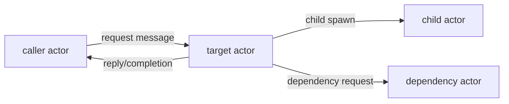

- Solid arrows are message sends or child-spawn relationships.
- Reply arrows show completion-style messages sent to `replyTo`, parent, router, or request owner actors.
- Internal messages are included when they appear in the accepted actor message union.

---

## `aven`

Root lifecycle actor. It exists to create the top-level branches of the runtime tree.

**Accepted messages**

| Message | Direction | Purpose |
|---|---:|---|
| `noop` | inbound | Placeholder message surface. |

**Relations**

- Spawns `/aven/system` as `avenSystem`.
- Spawns `/aven/intents` as `intents`.

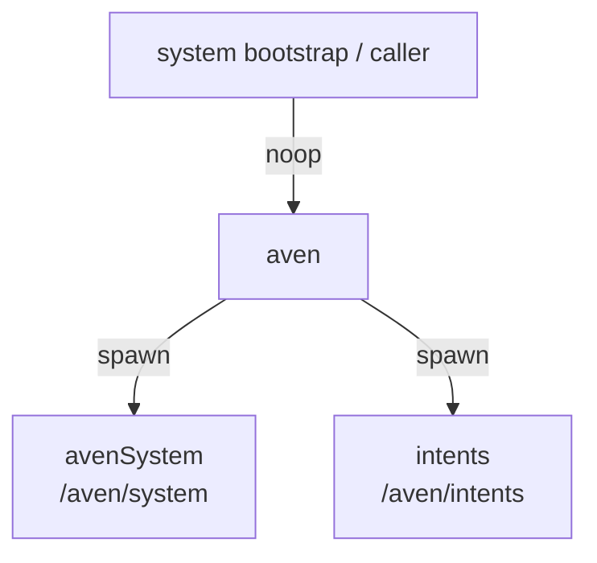

---

## `avenSystem`

Infrastructure composition actor. It wires the singleton system services under `/aven/system`.

**Accepted messages**

| Message | Direction | Purpose |
|---|---:|---|
| `noop` | inbound | Placeholder message surface. |

**Relations**

- Spawns singleton system actors: `log`, `requestResults`, `schemaRegistry`, `artifacts`, `artifactReaderRegistry`, `shell`, `metadata`, `human`, and `llms`.

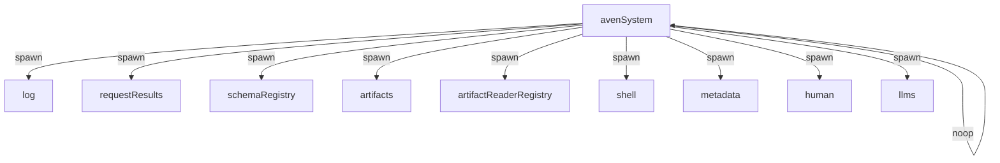

---

## `log`

Bounded infrastructure log actor.

**Accepted messages**

| Message | Direction | Purpose |
|---|---:|---|
| `appendInfrastructureLog` | inbound | Append an infrastructure log entry. The actor retains only the newest entries up to `retentionLimit`. |

**Relations**

- Receives log messages from runtime/infrastructure callers.
- Does not spawn children or call other actors.

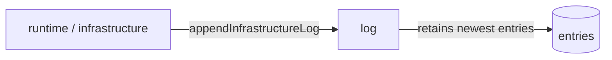

---

## `requestResults`

Bounded async request-result sink keyed by request id.

**Accepted messages**

| Message | Direction | Purpose |
|---|---:|---|
| `recordRequestResult` | inbound | Store an `ok` or `error` request result by `requestId`. |

**Relations**

- Receives result records from actors/UI plumbing that need durable-ish debug/result lookup.
- Does not spawn children or call other actors.

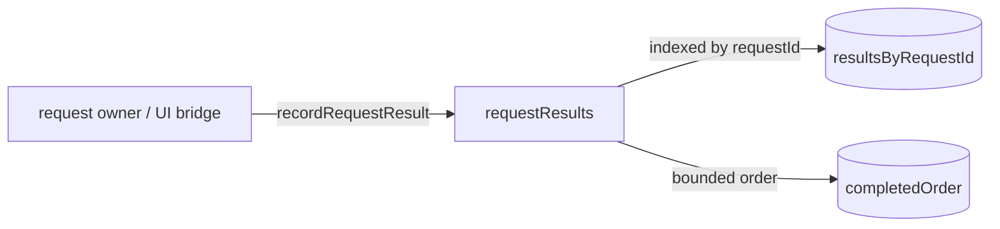

---

## `intents`

Intent router and factory. It creates intent actors, tracks routing cards, and routes human replies/messages.

**Accepted messages**

| Message | Direction | Purpose |
|---|---:|---|
| `createIntent` | inbound | Create a new child `intent`, initialize it, and start planner execution. |
| `routeHumanMessage` | inbound | Route arbitrary human input to a waiting intent or create a new intent. |
| `configureIntentRuntime` | inbound | Configure default planner/tool model requirements and overrides. |
| `listIntents` | inbound | Return/list known routing cards. |
| `getRoutingCard` | inbound | Fetch routing information for one intent. |
| `humanReplyReceived` | inbound | Receive a completed human communication and route it to the target intent. |
| `intentRoutingCardUpdated` | inbound/internal | Refresh the router's cached routing card for a child intent. |

**Relations**

- Spawns child `intent` actors.
- Sends `startIntent` to newly spawned children.
- Receives routing card updates from child intents.
- Receives validated human replies from `human` and delivers `humanReply` to the target child intent.

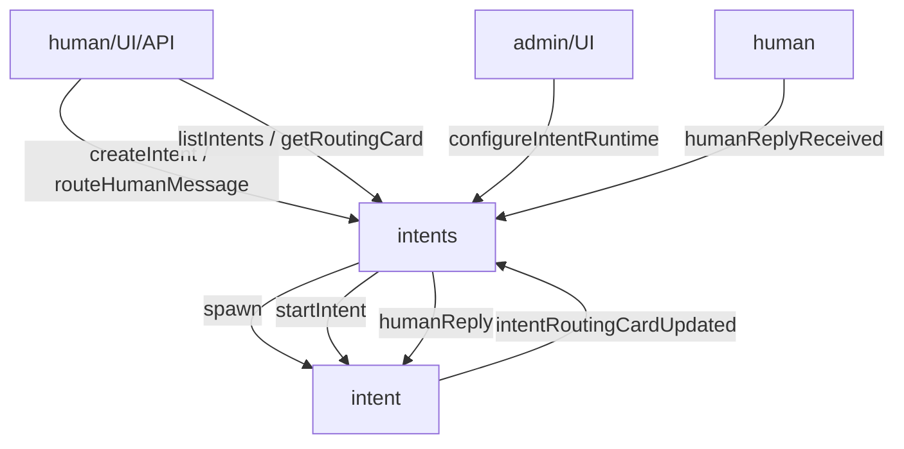

---

## `intent`

Goal-oriented orchestration actor. It owns planner state, timeline, observations, human wait state, and tool run state for one user/task goal.

**Accepted messages**

| Message | Direction | Purpose |
|---|---:|---|
| `startIntent` | inbound/internal | Start planner-driven execution. |
| `getIntent` | inbound | Inspect current intent state/result. |
| `continueIntent` | inbound | Resume/continue planner execution after a wait or step. |
| `humanReply` | inbound/internal | Consume a routed human answer for an open question. |
| `cancelIntent` | inbound | Cancel the intent and dismiss open human communication if present. |
| `plannerCompleted` | inbound/internal | Receive LLM planner result. |
| `llmRequestCompleted` | inbound/internal | Receive planner/tool LLM completion where routed directly to the intent. |
| `toolRunCompleted` | inbound/internal | Receive completion from a child `intentToolRun`. |

**Relations**

- Sends planner requests to `llms`.
- Sends human communication/report messages to `human`.
- Spawns `intentToolRun` children for catalog tool calls.
- Receives tool completions from child tool runs.
- Sends routing card updates to parent `intents`.

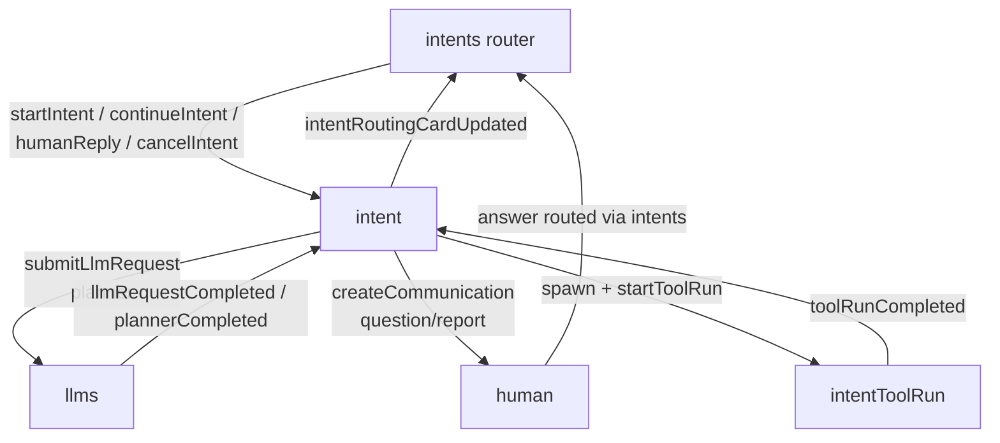

---

## `intentToolRun`

Single tool execution child actor. It isolates one catalog tool invocation and reports a normalized result to the parent intent.

**Accepted messages**

| Message | Direction | Purpose |
|---|---:|---|
| `startToolRun` | inbound/internal | Begin executing the selected catalog tool. |
| `metadataRecordCompleted` | inbound/internal | Receive completion from metadata create/get operations. |
| `metadataQueryCompleted` | inbound/internal | Receive completion from metadata query operations. |
| `llmRequestCompleted` | inbound/internal | Receive structured extraction/tool LLM completion. |
| `artifactGetDescriptorCompleted` | inbound/internal | Receive artifact descriptor result. |
| `schemaValidationCompleted` | inbound/internal | Receive schema validation result. |
| `schemaVersionCompleted` | inbound/internal | Receive schema version lookup result. |

**Tool relations**

| Tool id | Target actor | Main request message |
|---|---|---|
| `shell.execute` | `shell` | `shellExecuteRequest` |
| `intent.readArtifact` | `artifacts` | `artifactReadBytesRequest` |
| `metadata.queryRecords` | `metadata` | `queryMetadataRecords` |
| `metadata.createRecord` | `metadata` | `createMetadataRecord` |
| `metadata.getRecord` | `metadata` | `getMetadataRecord` |
| `llm.extractStructuredFromArtifact` | `llms` | `submitLlmRequest` |
| `artifact.getDescriptor` | `artifacts` | `artifactGetDescriptorRequest` |
| `schema.get` | `schemaRegistry` | `getSchemaVersionRequest` |
| `schema.validateJson` | `schemaRegistry` | `validateJsonRequest` |
| `human.ask` | parent `intent` / `human` flow | human communication flow |

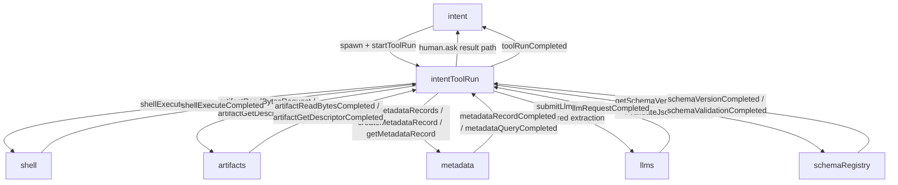

---

## `schemaRegistry`

Schema family registry and dispatcher. It owns child `schema` actors by schema id.

**Accepted messages**

| Message | Direction | Purpose |
|---|---:|---|
| `registerSchemaVersion` | inbound | Register an immutable schema version for a schema family. |
| `resolveLatest` | inbound | Resolve latest version for a schema id. |
| `validateJson` | inbound | Validate JSON directly against schema id/version. |
| `validateJsonRequest` | inbound/request | Validate JSON and reply with `schemaValidationCompleted`. |
| `getSchemaVersionRequest` | inbound/request | Fetch schema version and reply with `schemaVersionCompleted`. |

**Relations**

- Spawns child `schema` actors per `schemaId`.
- Dispatches schema-specific messages to `/aven/system/schemas/<schemaId>`.
- Sends completion messages to `replyTo` actors.

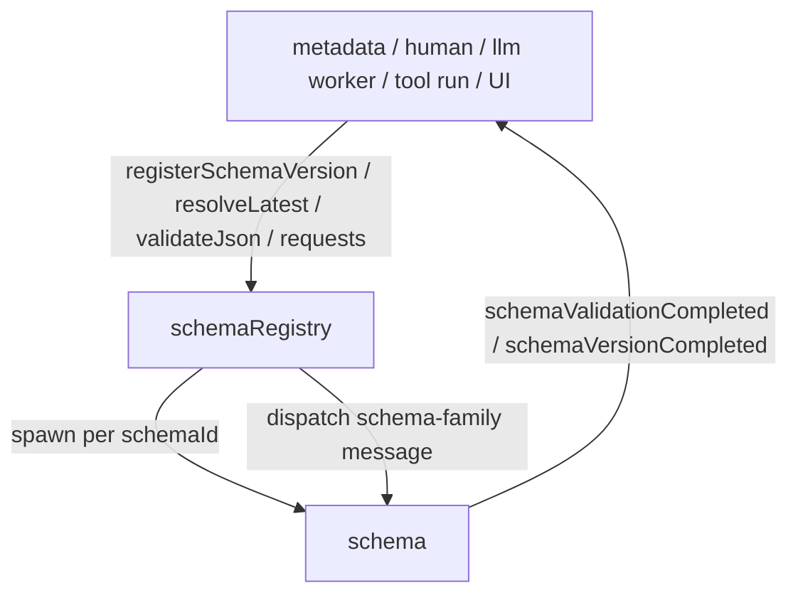

---

## `schema`

Per-schema-family actor. It stores versions for one schema id and performs validation/lookups.

**Accepted messages**

Same message surface as `schemaRegistry`:

| Message | Direction | Purpose |
|---|---:|---|
| `registerSchemaVersion` | inbound/internal | Store an immutable version if valid and not already registered. |
| `resolveLatest` | inbound/internal | Return/update latest version metadata. |
| `validateJson` | inbound/internal | Validate a value directly. |
| `validateJsonRequest` | inbound/request | Validate a value and send `schemaValidationCompleted`. |
| `getSchemaVersionRequest` | inbound/request | Fetch schema version and send `schemaVersionCompleted`. |

**Relations**

- Owned by `schemaRegistry`.
- Sends validation/version completions to the original `replyTo` actor.

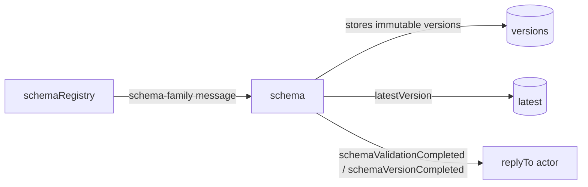

---

## `artifacts`

Content-addressed blob registry/storage facade.

**Accepted messages**

| Message | Direction | Purpose |
|---|---:|---|
| `putText` | inbound | Store a text payload as an artifact. |
| `putJson` | inbound | Serialize/store JSON as an artifact. |
| `putBase64` | inbound | Decode/store base64 as an artifact. |
| `registerStoredBlob` | inbound | Register a descriptor for a blob already written to backing storage. |
| `artifactExistsRequest` | inbound/request | Check whether a blob ref exists and reply with `artifactExistsCompleted`. |
| `artifactGetDescriptorRequest` | inbound/request | Fetch a descriptor and reply with `artifactGetDescriptorCompleted`. |
| `artifactReadBytesRequest` | inbound/request | Read byte range and reply with `artifactReadBytesCompleted`. |

**Relations**

- Called by shell, metadata, readers, intent tool runs, and LLM/artifact tooling.
- Replies to arbitrary `replyTo` actors.
- Does not spawn children.

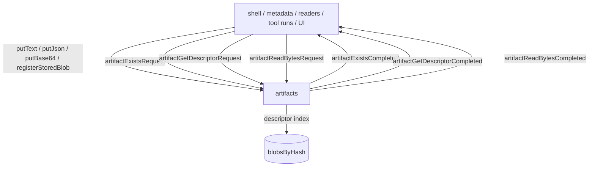

---

## `artifactReaderRegistry`

Reader discovery service. It lists known readers and determines which readers can handle a blob descriptor.

**Accepted messages**

| Message | Direction | Purpose |
|---|---:|---|
| `cleanupExpiredPending` | inbound/internal | Drop stale pending descriptor requests. |
| `listReaders` | inbound | List available reader actors/capabilities. |
| `listCompatibleReaders` | inbound | Determine compatible readers for an artifact ref. |
| `artifactGetDescriptorCompleted` | inbound/internal | Receive descriptor lookup result from `artifacts`. |

**Relations**

- Spawns concrete reader actors: byte, text, JSON.
- For compatibility checks, asks `artifacts` for the descriptor and then evaluates readers.

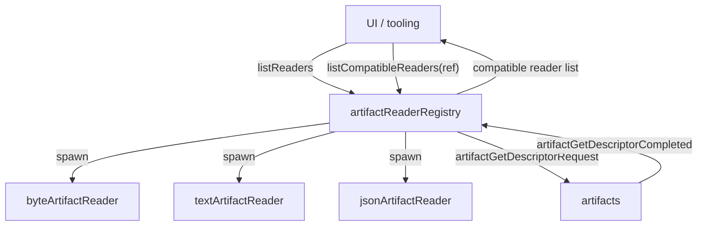

---

## `byteArtifactReader`

Raw byte-range reader over artifact blobs.

**Accepted messages**

| Message | Direction | Purpose |
|---|---:|---|
| `cleanupExpiredPending` | inbound/internal | Drop stale pending reads. |
| `readBytes` | inbound | Request a byte range from an artifact ref. |
| `artifactReadBytesCompleted` | inbound/internal | Receive byte range result from `artifacts`. |
| `artifactGetDescriptorCompleted` | inbound/internal | Receive descriptor information when needed. |

**Relations**

- Calls `artifacts` for byte ranges and sometimes descriptors.
- Tracks pending reads by request id.

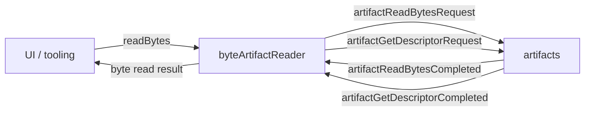

---

## `textArtifactReader`

Text reader over artifact blobs. It supports previews and character ranges by reading bytes and decoding text.

**Accepted messages**

| Message | Direction | Purpose |
|---|---:|---|
| `cleanupExpiredPending` | inbound/internal | Drop stale pending text reads. |
| `readTextPreview` | inbound | Read an initial text preview up to `maxChars`. |
| `readTextRange` | inbound | Read a text range by byte/character request shape. |
| `artifactGetDescriptorCompleted` | inbound/internal | Receive descriptor result from `artifacts`. |
| `artifactReadBytesCompleted` | inbound/internal | Receive byte result from `artifacts`. |

**Relations**

- Calls `artifacts` for descriptors and byte ranges.
- Decodes bytes as text for caller-facing preview/range results.

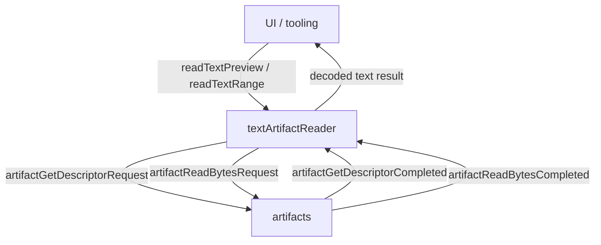

---

## `jsonArtifactReader`

JSON parser over artifact blobs.

**Accepted messages**

| Message | Direction | Purpose |
|---|---:|---|
| `cleanupExpiredPending` | inbound/internal | Drop stale pending parse requests. |
| `parseJson` | inbound | Parse an artifact as JSON. |
| `artifactGetDescriptorCompleted` | inbound/internal | Receive descriptor result from `artifacts`. |
| `artifactReadBytesCompleted` | inbound/internal | Receive bytes from `artifacts`. |

**Relations**

- Calls `artifacts` for descriptor and bytes.
- Parses the bytes into JSON and reports parse success/failure.

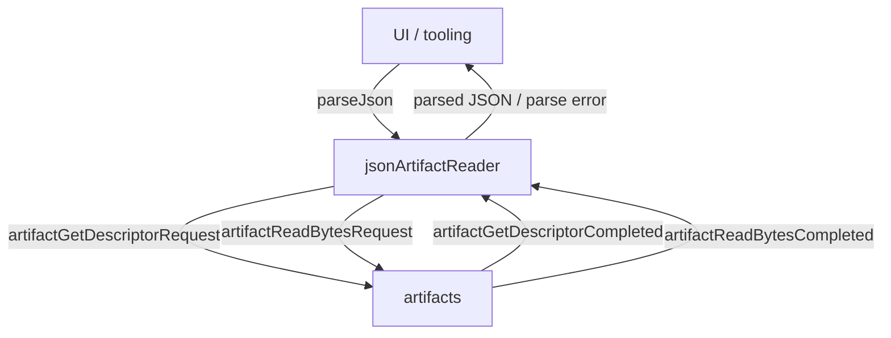

---

## `shell`

Command execution actor and OS-side effect boundary.

**Accepted messages**

| Message | Direction | Purpose |
|---|---:|---|
| `shellExecuteRequest` | inbound/request | Execute command with optional cwd, timeout, and stdin text. Reply with `shellExecuteCompleted`. |

**Completion shape**

`shellExecuteCompleted.result` includes exit code, stdout/stderr previews, truncation flags, optional stdout/stderr artifact refs, duration, and timeout status.

**Relations**

- Called by `intentToolRun` for `shell.execute`.
- Writes stdout/stderr blobs to artifact storage and registers descriptors with `artifacts` when output artifacts are created.
- Creates metadata records for shell outputs when available.
- Replies to the request `replyTo` actor.

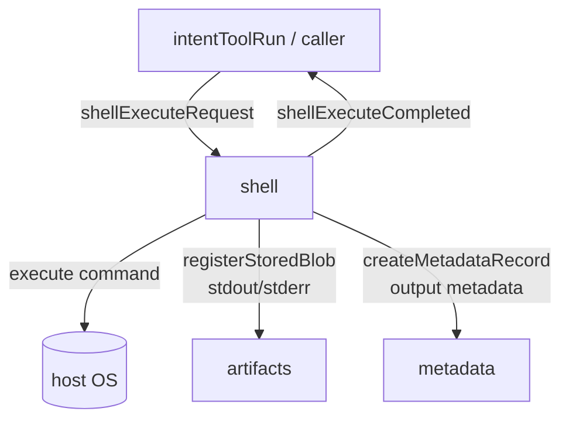

---

## `metadata`

Immutable schema-validated metadata store.

**Accepted messages**

| Message | Direction | Purpose |
|---|---:|---|
| `createMetadataRecord` | inbound/request | Validate and create an immutable metadata record. Supports idempotency and previous-record links. |
| `getMetadataRecord` | inbound/request | Fetch one metadata record by id. |
| `listMetadataBySchema` | inbound | List records matching a schema ref. |
| `listMetadataBySubject` | inbound | List records for a subject. |
| `queryMetadataRecords` | inbound/request | Run bounded filtered/sorted metadata query. |
| `schemaValidationCompleted` | inbound/internal | Continue pending create after schema validation. |
| `artifactExistsCompleted` | inbound/internal | Continue pending create after blob-subject existence check. |

**Relations**

- Calls `schemaRegistry` to validate metadata values.
- Calls `artifacts` to check existence for blob subjects.
- Replies with `metadataRecordCompleted` or `metadataQueryCompleted` when `replyTo` is provided.

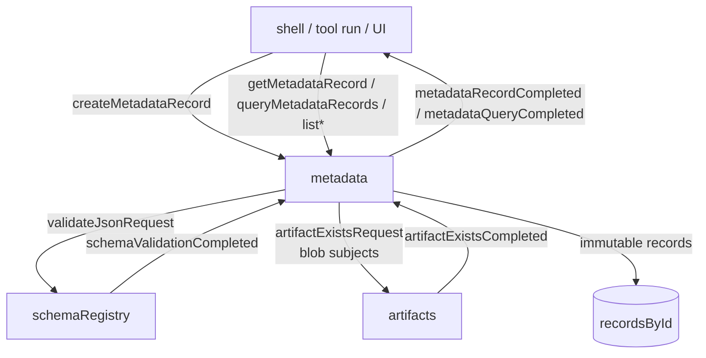

---

## `human`

Human communication inbox/outbox. It stores open/completed communications and started-intent records.

**Accepted messages**

| Message | Direction | Purpose |
|---|---:|---|
| `createCommunication` | inbound | Create a human-facing communication/question/report. |
| `answerCommunication` | inbound | Answer an open communication. May trigger schema validation. |
| `dismissCommunication` | inbound | Dismiss an open communication. |
| `getCommunication` | inbound | Fetch one communication. |
| `listOpenCommunications` | inbound | List open communications. |
| `listCompletedCommunications` | inbound | List completed/dismissed communications. |
| `recordStartedIntent` | inbound | Store a record that a human initiated an intent. |
| `schemaValidationCompleted` | inbound/internal | Continue answer flow after schema validation. |

**Relations**

- Receives questions/reports from `intent`.
- Validates schema-bound answers through `schemaRegistry`.
- Routes completed answers back to `intents` or a target intent depending on routing hints.

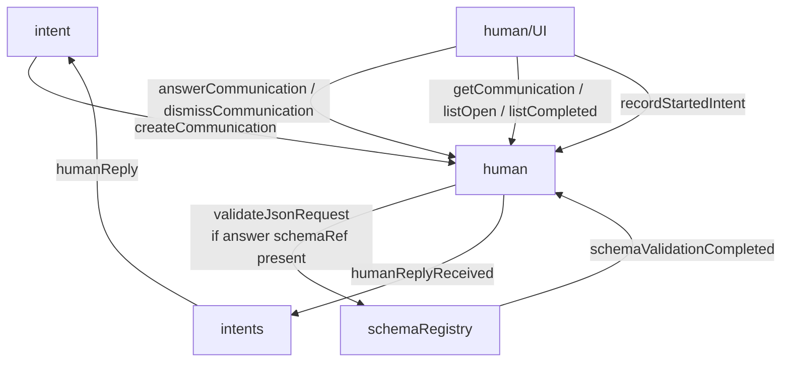

---

## `llms`

Public LLM gateway and catalog actor.

**Accepted messages**

| Message | Direction | Purpose |
|---|---:|---|
| `submitLlmRequest` | inbound/request | Select a model and submit an LLM request. |
| `listAvailableLlms` | inbound | List catalog entries, optionally filtered by requirements. |
| `findLlmsByCapabilities` | inbound | Return models matching capability requirements. |
| `getLlmUsage` | inbound | Return usage, optionally scoped to caller actor id. |
| `llmRequestCompleted` | inbound/internal | Receive completion from selected model and route/account it. |
| `registerAvailableLlm` | inbound/internal | Add/update a model descriptor in the catalog. |

**Relations**

- Spawns configured `lmStudioProvider` actors.
- Selects `lmStudioModel` by preferred path or capability/selection policy.
- Forwards request to selected model.
- Receives model completion and replies to original request `replyTo`.
- Tracks usage by caller actor id.

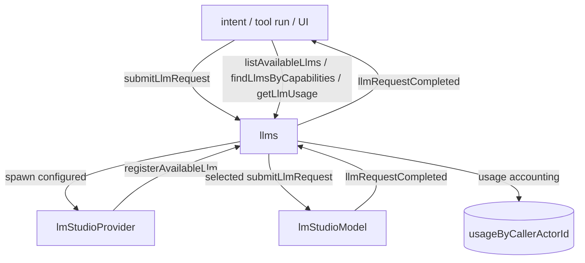

---

## `lmStudioProvider`

Configured OpenAI-compatible provider group. It owns model actors for one provider config.

**Accepted messages**

| Message | Direction | Purpose |
|---|---:|---|
| `listModels` | inbound | List configured provider models. |

**Relations**

- Spawned by `llms`.
- Spawns/reconciles `lmStudioModel` children for configured provider models.
- Registers model descriptors with `llms` through provider/model reconciliation flow.

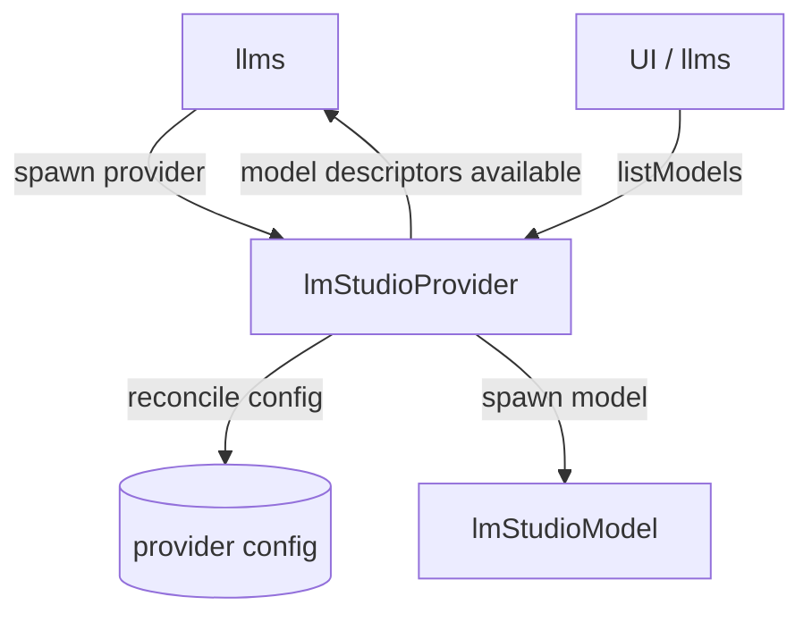

---

## `lmStudioModel`

Queueing model actor. It validates model-specific constraints, limits concurrency, spawns workers, and retains recent completions.

**Accepted messages**

| Message | Direction | Purpose |
|---|---:|---|
| `submitLlmRequest` | inbound/request | Queue or start a model request. |
| `listRequests` | inbound | List queued, running, and recently completed requests. |
| `describeCapabilities` | inbound | Return configured model capabilities. |
| `validateLlmInput` | inbound | Validate modalities, thinking, schema/output constraints, and token limits against model capabilities. |
| `requestCompleted` | inbound/internal | Receive completion from a request worker. |

**Relations**

- Spawned by `lmStudioProvider`.
- Receives forwarded requests from `llms` or direct callers.
- Spawns `lmStudioRequestWorker` for active requests.
- Sends gateway-style `llmRequestCompleted` back to `replyTo` or upstream caller.

```mermaid
flowchart TD
  G[llms / direct caller] -- submitLlmRequest --> M[lmStudioModel]
  UI[UI] -- listRequests / describeCapabilities / validateLlmInput --> M
  M -- queue / running state --> Q[(queued/running/completed)]
  M -- spawn + beginProcessing --> W[lmStudioRequestWorker]
  W -- requestCompleted --> M
  M -- llmRequestCompleted --> G
```

---

## `lmStudioRequestWorker`

Per-request LLM execution actor. It runs a single provider request and optionally validates structured output.

**Accepted messages**

| Message | Direction | Purpose |
|---|---:|---|
| `beginProcessing` | inbound/internal | Start provider execution for this request. |
| `getResult` | inbound | Return current/final worker result. |
| `schemaValidationCompleted` | inbound/internal | Continue after structured-output schema validation. |

**Relations**

- Spawned by `lmStudioModel`.
- Calls the provider runtime/client for actual LLM execution.
- If `responseSchema` is present, asks `schemaRegistry` to validate structured output.
- Reports `requestCompleted` to parent model.

```mermaid
flowchart TD
  M[lmStudioModel] -- beginProcessing --> W[lmStudioRequestWorker]
  UI[UI] -- getResult --> W
  W -- provider chat completion --> Provider[(OpenAI-compatible provider)]
  W -- validateJsonRequest\nstructured output --> SR[schemaRegistry]
  SR -- schemaValidationCompleted --> W
  W -- requestCompleted --> M
```

---

## Cross-system request/completion map

| Request message | Target actor | Completion message | Typical caller |
|---|---|---|---|
| `shellExecuteRequest` | `shell` | `shellExecuteCompleted` | `intentToolRun` |
| `artifactExistsRequest` | `artifacts` | `artifactExistsCompleted` | `metadata` |
| `artifactGetDescriptorRequest` | `artifacts` | `artifactGetDescriptorCompleted` | readers, `intentToolRun` |
| `artifactReadBytesRequest` | `artifacts` | `artifactReadBytesCompleted` | readers, `intentToolRun` |
| `validateJsonRequest` | `schemaRegistry` / `schema` | `schemaValidationCompleted` | `metadata`, `human`, LLM worker, `intentToolRun` |
| `getSchemaVersionRequest` | `schemaRegistry` / `schema` | `schemaVersionCompleted` | `intentToolRun` |
| `createMetadataRecord` | `metadata` | `metadataRecordCompleted` | shell, `intentToolRun` |
| `getMetadataRecord` | `metadata` | `metadataRecordCompleted` | `intentToolRun`, UI |
| `queryMetadataRecords` | `metadata` | `metadataQueryCompleted` | `intentToolRun`, UI |
| `submitLlmRequest` | `llms` / `lmStudioModel` | `llmRequestCompleted` | `intent`, `intentToolRun`, UI |

## Capability boundaries and risks

- `shell` is the main privileged side-effect actor. Command allow-listing, cwd, timeout, output-size, and env config matter.
- `llms` is the safer public LLM entry point. Direct model calls bypass gateway-level catalog selection and caller usage accounting.
- `schemaRegistry` must remain the source of truth for validation. Duplicating validation logic in callers will drift.
- `artifacts` is a content-addressed boundary, but descriptor existence is still operational state and should be checked where correctness depends on it.
- `metadata` is immutable by design. Corrections should use new records with `previousRecordId`, not mutation.
- `human` is both UX state and control-flow routing. Incorrect routing hints can strand answers or send them to the wrong intent.
