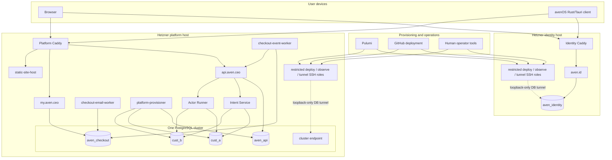
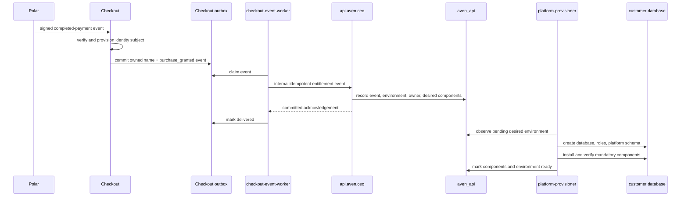
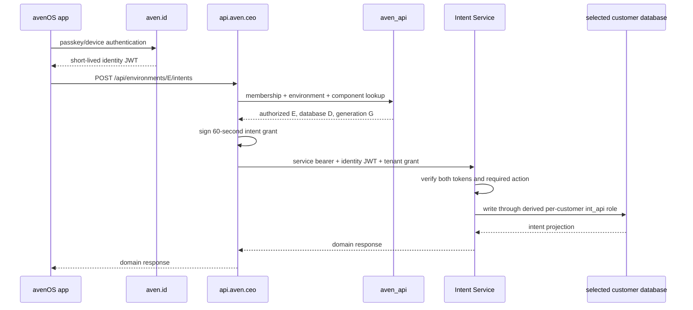
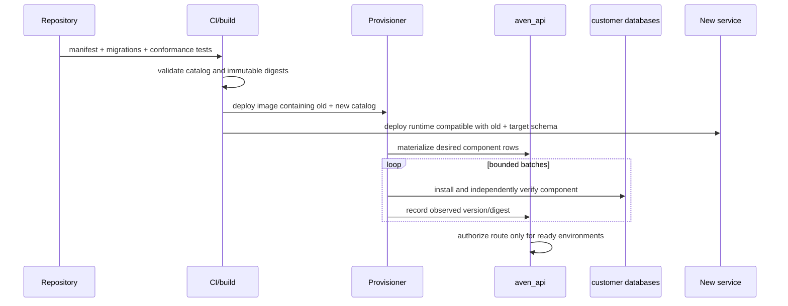
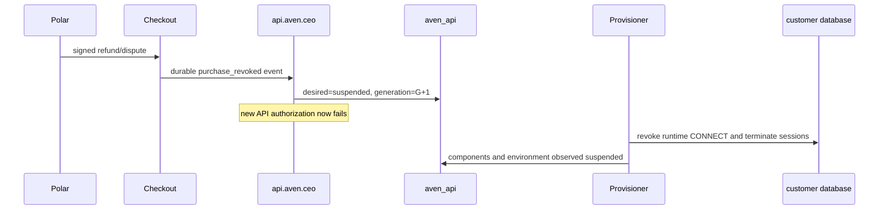

# Customer-database system map

Status: implemented foundation and explicit follow-on map for
[Customer databases as a first-class platform boundary](customer-database-platform.md)

Date: 2026-08-29

## Purpose

This paper maps the normative customer-database decision onto the deployment and
repository. It names the processes, databases, schemas, roles, routes, tokens, control
records, startup order, failure behavior, and follow-on slices.

The exact external inputs and zero-to-software/operator procedure are the
[customer platform zero-to-hero target runbook](customer-platform-getting-started.md).

It is intentionally a map of one small Docker Compose deployment on two Hetzner hosts.
It is not a Kubernetes design, a general workflow engine, or a promise of horizontal
scale.

## Implementation ledger

The foundation described here is implemented and locally verified: two Pulumi-managed
Hetzner hosts, generated deploy/observe/tunnel and host keys, central per-function
database roles, one physical database per customer environment, the compiled Intent
and Actor component catalog, reconciliation, audience-bound tenant grants, bounded
customer pools, checkout's durable entitlement outbox, raw signature-verified Polar
webhook retention, the fixed facade, and local passkey/device authorization.

The following remain deliberate follow-on hardening, not claims about the current
deployment: automated short-lived diagnostic database roles, `customer-inspect` and
`role-audit` helpers, backup/restore orchestration, staged function-root rotation, and
the Actor Runner's eventual multi-table execution journal. Today the Actor component
stores a durable JSON run record in `aven_actor_runs.runs`; its portable runner protocol
leaves room for the richer journal without granting another database or schema.

## The whole system on one page



Only Caddy publishes application ports. SSH is CIDR-restricted, and PostgreSQL has an
additional loopback-only host binding reachable solely through the tunnel account.
The provisioner, domain services, and workers are private Compose services. The
application sees only `aven.id` and `api.aven.ceo`; it never learns an internal service
origin or database name.

## What changes from the accepted split

The accepted identity/checkout/facade cut remains the base. The implemented customer
layer adds:

1. environment, membership, component, and reconciliation tables to `aven_api`;
2. an Ed25519 application-grant signing key owned by `api.aven.ceo`;
3. customer-aware facade routes with explicit environment IDs;
4. one `platform-provisioner` Compose service;
5. one durable checkout event outbox and a narrow delivery worker;
6. component manifests and customer-database migrations in each service package;
7. a shared TypeScript tenant-grant verifier and bounded pool provider;
8. `aven_intents` in every customer database instead of one shared intent database;
9. `aven_actor_runs` in every customer database for the future durable runner;
10. Pulumi-generated, purpose-separated SSH and per-function database identities;
11. infrastructure-backed fixed-scope observation and host-key-pinned database-tunnel
    transport (database credentials remain a separate operator grant);
    and
12. two-customer E2E fixtures and generic component conformance tests.

It does not restore the deleted document processor, old customer-directory service,
hand-configured operator accounts, or legacy monolith.

## Host and container map

### Identity host

The identity host remains unchanged by customer provisioning.

| Container | Network | Durable access | Responsibility |
| --- | --- | --- | --- |
| `caddy` | identity ingress | Caddy state volume | TLS and exact public/internal routing |
| `identity` | identity private + ingress | dedicated auth, account-provisioning, and authorization roles through separate pools | Signup, passkeys, sessions, device flow, identity JWTs, JWKS |
| `migrate` | identity private, one-shot | `aven_identity` through migrator role | Identity schema migration |
| `database` | identity private | protected identity PostgreSQL volume | Identity data only |

The platform host may call the narrow identity account-provisioning endpoint. Customer
databases, tenant grants, product roles, and component state never enter this host.

### Platform host

| Container | Networks | Database role | Responsibility |
| --- | --- | --- | --- |
| `caddy` | platform ingress | none | Public TLS for `aven.ceo`, `api.aven.ceo`, and `my.aven.ceo` |
| `api` | private + ingress | separate authorization, entitlement-ingest, hosting, and audit roles | Identity verification, environment policy, tenant grants, fixed downstream facade, hosting control |
| `api-migrate` | private, one-shot | `aven_api_migrator` | Central control schema only |
| `checkout` | private + ingress + egress | separate checkout HTTP and payment-webhook roles | Commerce and purchase UI |
| `checkout-migrate` | private, one-shot | `aven_checkout_migrator` | Commerce schema only |
| `checkout-event-worker` | private | `aven_checkout_platform_events` | Deliver durable purchase/revoke events to the API internal endpoint |
| `checkout-email-worker` | private + egress | `aven_checkout_email` | Deliver purchase/setup email |
| `platform-provisioner` | private | control worker + cluster provisioner roles | Reconcile customer databases from the static component catalog |
| `intent-service` | private + egress | derived per-customer Intent API role | Intent API and `aven_intents` repositories |
| `actor-runner` | private + egress | derived per-customer admission and worker roles | Actor-run API and eventual durable runner |
| `static-site-host` | private + ingress | none | Verified GitHub-backed static releases and host snapshot |
| `database-init` | private, one-shot | PostgreSQL bootstrap | Idempotently create/rotate central and component roles on every deploy |
| `database` | private | PostgreSQL internal | Central and customer databases |

`intent-service` and `actor-runner` need egress for fixed identity JWKS retrieval. Actor
execution may later need allowlisted model or artifact services. The provisioner has no
internet egress.

### Compose dependency policy

The API does not declare every domain service as a hard Compose dependency. It can
remain healthy while one optional component is unavailable and return a scoped `503`
for that route. Caddy depends on the API and static host; customer component readiness
is represented in the control database rather than in a giant container startup chain.

## PostgreSQL map

One PostgreSQL 17 cluster on the protected platform volume contains:

```text
postgres                 maintenance database
aven_checkout            commerce control
aven_api                 application control plane
cust_<environment-uuid>  one database per customer environment
```

The UUID is encoded as 32 lowercase hexadecimal characters:

```text
environment: 55a1d196-7ae1-42dd-9ef5-1adc95ce600a
database:    cust_55a1d1967ae142dd9ef51adc95ce600a
owner role: cust_55a1d1967ae142dd9ef51adc95ce600a_owner
```

The mapping is deterministic for inspection, but only server code derives or uses it.
Public requests carry the environment UUID, never the database name.

### Cluster and central-database roles

| Role | Login | Scope |
| --- | --- | --- |
| `postgres` | yes | Container/bootstrap emergency administration; not passed to normal services |
| `aven_customer_provisioner` | yes | `CREATEDB`, `CREATEROLE`, per-customer owner membership, and suspension operations; isolated to this dedicated cluster |

Every central database has a `NOLOGIN` owner, a migration login, and one login per
executable function. The initial matrix is:

| Database | Function role | Allowed work |
| --- | --- | --- |
| `aven_identity` | `aven_identity_owner` (`NOLOGIN`) | Own identity schemas/objects; only migrator may assume it |
| `aven_identity` | `aven_identity_auth` | Passkey, user, account, and session operations used by public auth routes |
| `aven_identity` | `aven_identity_accounts` | Narrow internal purchased-account/setup-link provisioning |
| `aven_identity` | `aven_identity_authorization` | Read the minimum user-role projection for internal authorization |
| `aven_identity` | `aven_identity_migrator` | Identity DDL only; one-shot container |
| `aven_checkout` | `aven_checkout_owner` (`NOLOGIN`) | Own commerce schemas/objects; only migrator may assume it |
| `aven_checkout` | `aven_checkout_http` | Checkout/name/purchase reads and ordinary writes |
| `aven_checkout` | `aven_checkout_webhooks` | Verified provider-event inbox and purchase transitions |
| `aven_checkout` | `aven_checkout_platform_events` | Claim/acknowledge only the platform event outbox |
| `aven_checkout` | `aven_checkout_email` | Claim/acknowledge only the email outbox |
| `aven_checkout` | `aven_checkout_migrator` | Checkout DDL only; one-shot container |
| `aven_api` | `aven_api_owner` (`NOLOGIN`) | Own control schemas/objects; only migrator may assume it |
| `aven_api` | `aven_api_authorization` | Read membership/environment/component policy and append authorization audit |
| `aven_api` | `aven_api_entitlements` | Idempotent commerce inbox and environment desired-state transitions |
| `aven_api` | `aven_api_hosting` | Static-site bindings and hosting status only |
| `aven_api` | `aven_platform_reconciler` | Component operations, observations, leases, and heartbeat only |
| `aven_api` | `aven_api_migrator` | Control-plane DDL only; one-shot container |

An image may receive multiple database URLs when it implements several functions, but
each handler or worker is wired to one named pool and tests prove that it cannot fall
back to a broader role. Splitting a function into another process later does not
require a grant redesign. Account separation provides least privilege and auditability;
functions packaged in one process still share that process's compromise boundary and
must be split into separate containers when that distinction needs to be a security
boundary.

There are no global component runtime logins. Each customer database receives its own
owner and function roles.

PostgreSQL roles are technically cluster-global, so "per-database account" means a
globally unique customer-qualified login whose `CONNECT` is granted to exactly one
database. Bootstrap revokes `PUBLIC CONNECT` from `postgres`, `template1`, both central
databases, and every customer database; it also revokes `TEMP` unless a manifest
explicitly proves that a function needs it. The role audit treats any second database
grant as isolation drift.

Services with no database access (`caddy`, `static-site-host`) receive no PostgreSQL
role merely for symmetry. "One account per role" means every necessary capability has
one narrowly defined identity, not that every process gets an unused account.

### One customer database

```text
cust_55a1d1967ae142dd9ef51adc95ce600a
├── aven_platform
│   ├── environment_identity
│   ├── component_installations
│   └── component_migrations
├── aven_intents
│   ├── intents
│   ├── contributions
│   └── merge_relations
└── aven_actor_runs
    └── runs              # current durable JSON run record
```

`aven_actor_runs` appears only when the durable runner component is enabled. Future
services add schemas through manifests; they do not add shared product databases.

The provisioner owns `aven_platform`. Component owner roles own their exact schemas.
Runtime roles receive `USAGE` and explicit table/sequence privileges, not ownership or
`CREATE`.

For environment `55a1…600a`, PostgreSQL roles use the full UUID hex plus a short,
catalog-defined role suffix so they remain below PostgreSQL's 63-byte identifier limit:

| Role pattern | Login | Scope |
| --- | --- | --- |
| `c_<uuidhex>_db_owner` | no | Database ownership target; owns no service tables directly |
| `c_<uuidhex>_platform_owner` | no | Owns `aven_platform`; provisioner assumes it for installation evidence |
| `c_<uuidhex>_int_owner` | no | Owns `aven_intents` objects |
| `c_<uuidhex>_int_api` | yes | Exact Intent API DML and installation-metadata read |
| `c_<uuidhex>_act_owner` | no | Owns `aven_actor_runs` objects |
| `c_<uuidhex>_act_api` | yes | Create/read/cancel run API operations only |
| `c_<uuidhex>_act_worker` | yes | Read/update the current durable run records only |

An expiring `dbg_<random>` read-only role is a future operational hardening item. The
implemented tunnel account transports only to the loopback PostgreSQL port and confers
no database login by itself.

The actual suffix is part of the immutable component manifest. Adding a worker function
means adding a role specification; it does not mean widening the API role. `PUBLIC`
loses database `CONNECT`, schema `CREATE`, and object privileges. Login roles are not
members of owner roles and have `NOCREATEDB`, `NOCREATEROLE`, `NOINHERIT`,
`NOREPLICATION`, and low connection limits.

### Per-database credential derivation

Pulumi generates an independent 32-byte root for every executable function, such as
`INTENTS_API_DB_CREDENTIAL_ROOT`, `ACTOR_API_DB_CREDENTIAL_ROOT`, and
`ACTOR_WORKER_DB_CREDENTIAL_ROOT`. The provisioner receives all customer-role roots;
each runtime receives only the roots for functions it implements.

For a role, both sides derive:

```text
username = catalog role pattern(environment UUID)
password = base64url(HMAC-SHA-256(
  function root,
  "aven/postgres-role/v1" || 0x00 ||
  environment UUID       || 0x00 ||
  routing generation     || 0x00 ||
  qualified role kind
))
```

The exact byte encoding and test vectors live in the shared customer-runtime contract;
string interpolation is not left to each service. The customer password is never
stored in `aven_api`, a manifest, a tenant grant, a deployment artifact, or a log.
Changing one environment's routing generation rotates all of that environment's
runtime passwords. Rotating a function root is a staged all-environment operation:
deploy overlap-capable roots, reconcile roles, move grants to the new key ID, drain old
pools, then remove the previous root.

This avoids a new credential-broker service while providing distinct accounts and
revocation points. It does not pretend that a service-wide function root contains a
compromise to one customer: a compromised Intent process can derive Intent API
credentials for customer IDs it learns, but it cannot derive Actor, API-control,
migrator, or cluster credentials. A local short-lived credential broker can replace
derivation later if that threat warrants the operational cost.

## Control-plane data model

The following tables live in `aven_api`. Names are planned contract names; exact SQL
types and indexes belong in the implementation migration.

### `customer_entitlement_events`

Idempotent inbox for commercial lifecycle facts delivered by checkout:

```text
event_id UUID PRIMARY KEY
kind purchase_granted | purchase_revoked
source checkout-name
source_key normalized purchased name
subject_id identity UUID
occurred_at timestamptz
payload_version integer
payload jsonb
received_at timestamptz
```

The event is evidence, not mutable environment state. Replaying the same ID and body is
successful; reusing the ID with different material is a conflict.

### `customer_environments`

```text
environment_id UUID PRIMARY KEY
source text
source_key text
display_name text
desired_state ready | suspended | erasing
observed_state pending | ready | suspended | failed | unknown
database_name text
routing_generation bigint
created_at timestamptz
updated_at timestamptz
UNIQUE (source, source_key)
UNIQUE (database_name)
```

The API creates `environment_id`; checkout never chooses it. The `(source, source_key)`
constraint makes purchase replay converge on the same environment.

### `customer_environment_memberships`

```text
environment_id UUID
subject_id UUID
role owner | admin | member
state active | revoked
revision bigint
created_at timestamptz
updated_at timestamptz
PRIMARY KEY (environment_id, subject_id)
```

The first purchase creates one `owner`. The table exists now so team membership does
not later require changing database identity or putting product roles in `aven.id`.

### `customer_environment_components`

```text
environment_id UUID
component_ref text
desired_state ready | suspended | absent
observed_state missing | pending | applying | ready | suspended | failed | unknown
desired_schema_version integer
observed_schema_version integer nullable
desired_migration_digest text
observed_migration_digest text nullable
observed_routing_generation bigint nullable
catalog_revision text
last_operation_id UUID nullable
last_verified_at timestamptz nullable
last_error_code text nullable
last_error_message text nullable
PRIMARY KEY (environment_id, component_ref)
```

### `customer_component_operations`

```text
operation_id UUID PRIMARY KEY
environment_id UUID
component_ref text
target_state ready | suspended
target_schema_version integer
target_migration_digest text
routing_generation bigint
idempotency_key text UNIQUE
state queued | running | applying | verifying | reconciling | succeeded | failed
revision bigint
attempt_id UUID nullable
started_at timestamptz nullable
heartbeat_at timestamptz nullable
attempt_count integer
next_attempt_at timestamptz
error_class text nullable
error_detail text nullable
created_at timestamptz
updated_at timestamptz
```

### `platform_worker_heartbeats`

One row records provisioner instance ID, catalog revision, start time, last heartbeat,
current operation, and aggregate counts. It is operational health, not a scheduler.

## Checkout-to-environment boundary

Checkout remains the source of truth for purchases, refunds, disputes, and owned names.
It does not receive `aven_api` credentials and cannot insert environment rows directly.

### Checkout outbox

The checkout migration adds `platform_event_outbox`:

```text
event_id UUID PRIMARY KEY
kind purchase_granted | purchase_revoked
source_key text
subject_id UUID
payload_version integer
payload jsonb
state pending | delivering | delivered | dead
attempt_count integer
next_attempt_at timestamptz
created_at timestamptz
delivered_at timestamptz nullable
last_error text nullable
```

The purchase or revoke transaction writes the commerce rows and this outbox row
atomically. `checkout-event-worker` reads only the outbox, posts to
`http://api:3000/internal/v1/customer-entitlement-events`, and acknowledges after the
API commits the idempotent inbox event.

The internal route:

- is never proxied by platform Caddy;
- requires a dedicated constant-time Bearer credential;
- accepts a strict versioned event schema;
- has a fixed body-size limit;
- rejects caller-selected environment IDs, database names, components, or desired
  schema versions; and
- is safe to replay after any uncertain response.

Email and platform-event delivery remain separate workers and database roles. SMTP
credentials cannot create customer environments, and the platform event worker cannot
read payment-provider secrets or email bodies.

## Customer environment selection

### User-facing API

The facade exposes:

```text
GET /api/environments
GET /api/environments/{environmentId}

/api/environments/{environmentId}/intents...
/api/environments/{environmentId}/actor-runs...
```

The desktop dashboard loads `/api/environments`, shows active memberships, and keeps an
explicit selected environment in local application state. A user with no ready
environment sees the checkout/onboarding state. A user with several environments must
select one; the server never guesses from identity subject or last activity.

The environment UUID in the public path is a requested logical context, not authority.
For unknown and unauthorized environment IDs, the API returns the same `404` shape.

### Customer-aware facade entry

The present fixed downstream configuration grows one customer-aware variant:

```ts
interface CustomerDownstream {
  publicPrefix: '/api/environments/:environmentId/intents'
  targetPrefix: '/api/intents'
  baseUrl: 'http://intent-service:3010'
  componentRef: 'ceo.aven:component:data:intents@1'
  audience: 'ceo.aven:component:data:intents@1'
  methodActions: {
    GET: ['intents:read']
    POST: ['intents:write']
    PATCH: ['intents:write']
    DELETE: ['intents:delete']
  }
}
```

Configuration still fixes the upstream origin, target prefix, service credential,
component, and action mapping. Request data cannot choose any of them.

For each call, the API:

1. verifies the short-lived `aven.id` token;
2. extracts the environment UUID from the fixed route position;
3. loads the active membership and current environment row;
4. requires environment `desired_state=ready` and `observed_state=ready`;
5. requires the downstream component ready at the same routing generation;
6. derives actions from the configured route and HTTP method;
7. signs a tenant grant valid for at most 60 seconds;
8. strips all caller credentials, cookies, grants, and trusted headers;
9. replaces `Authorization` with the fixed downstream service credential;
10. forwards the original identity JWT and the new tenant grant; and
11. proxies the request to the fixed internal path.

## Tenant grant

`api.aven.ceo`, not `aven.id`, signs product authorization. Pulumi generates one
Ed25519 application-grant key pair. The API receives the private JWK; downstream
services receive only a JWKS containing public keys.

The first claim set is:

```json
{
  "iss": "https://api.aven.ceo",
  "aud": "ceo.aven:component:data:intents@1",
  "sub": "identity-subject-uuid",
  "sid": "identity-session-id",
  "jti": "authorization-decision-uuid",
  "env": "customer-environment-uuid",
  "db": "cust_55a1d1967ae142dd9ef51adc95ce600a",
  "gen": 3,
  "act": ["intents:write"],
  "component": "ceo.aven:component:data:intents@1",
  "schemaVersion": 1,
  "iat": 1787950000,
  "nbf": 1787950000,
  "exp": 1787950060
}
```

The signed `db` claim is internal routing data. It is never accepted from the client or
returned as customer authority. Including it avoids a tenant-directory service or
control-database connection in every downstream. The downstream still validates the
strict `cust_[0-9a-f]{32}` contract and binds the pool key to `env + db + gen`.

The API also forwards the original identity JWT. A downstream requires:

- its fixed service Bearer;
- a valid `aven.id` JWT with passkey assurance and `services:access`;
- a valid application tenant grant with its exact audience and action;
- matching subject and session in both tokens; and
- matching derived identity projections where those headers remain useful for logs.

The application-grant key is independent from the identity signing key. Compromising
the API cannot mint an `aven.id` identity; compromising identity cannot choose a
customer environment without the API policy boundary.

## Domain service request handling

Intent Service and Actor Runner use one shared TypeScript package for admission and
database selection. Conceptually:

```ts
const admitted = await admitCustomerRequest(request, {
  serviceToken,
  identityVerifier,
  tenantGrantVerifier,
  audience: componentRef,
  requiredAction
})
const store = await tenantStores.forGrant(admitted.tenantGrant)
return domainHandler(request, admitted.principal, store)
```

Admission occurs before reading a request-selected resource. Unknown customer data and
other-customer data both produce the same not-found response where resource existence
would otherwise leak.

### Bounded pool provider

Each service receives a host/port/TLS cluster locator without a reusable PostgreSQL
login. After grant verification it derives the exact per-customer function account:

```text
host=database port=5432
database=cust_55a1d1967ae142dd9ef51adc95ce600a
user=c_55a1d1967ae142dd9ef51adc95ce600a_int_api
password=<derived from Intent API function root and routing generation>
```

The provider does not accept a database, username, role kind, or password from request
JSON or headers. Its cache key is:

```text
(environmentId, databaseName, routingGeneration, qualifiedRoleKind)
```

Initial limits are deliberately small:

```text
maximum cached tenant pools: 8
maximum connections per pool: 2
idle pool lifetime: 5 minutes
connection acquisition timeout: 5 seconds
statement timeout: 20 seconds unless a domain route is stricter
```

On a new pool, the provider checks `aven_platform.component_installations` for the
exact component, schema version, migration digest, and routing generation from the
grant. A mismatch closes the pool and returns `COMPONENT_NOT_READY`.

Generation changes naturally create a different cache key. The old pool closes on idle
expiry. Suspension additionally revokes database access and terminates sessions through
the provisioner, so keeping an old in-memory pool cannot preserve authorization.

## Static component catalog

There is no registry service. Each domain service commits a manifest next to its
migrations:

```text
services/intent-service/customer-component.json
services/intent-service/customer-migrations/0001_intents.sql
services/actor-runner/customer-component.json
services/actor-runner/customer-migrations/0001_actor_runs.sql
```

The provisioner build validates and copies these into one immutable catalog. A planned
Intent Service manifest looks like:

```json
{
  "componentRef": "ceo.aven:component:data:intents@1",
  "schema": "aven_intents",
  "targetSchemaVersion": 1,
  "migrations": [
    {
      "id": "0001_intents",
      "sha256": "<generated>",
      "transactional": true
    }
  ],
  "ownerRoleSuffix": "int_owner",
  "functionRoles": [
    {
      "kind": "ceo.aven:db-role:intents:api@1",
      "roleSuffix": "int_api",
      "grants": "grants/intents-api.sql"
    }
  ],
  "dependencies": [],
  "runtimeCompatibility": { "minimum": 1, "maximum": 1 },
  "requiredByDefault": true
}
```

Migration files and their digests are immutable once deployed. An operation row names
only the component and expected digest; it cannot carry SQL or an artifact URL.

## Provisioner internals

`platform-provisioner` is a Bun process with four small modules:

```text
catalog reader       static validated manifests and SQL resources
desired-state pass   environment + policy -> component rows and queued operations
operation worker     claim, inspect, apply, verify, report
health reporter      heartbeat and aggregate drift
```

### Main loop

Every few seconds it:

1. records a heartbeat;
2. requeues its own stale `running` operations after restart;
3. materializes missing desired component rows from the static catalog;
4. queues operations where desired and observed state differ;
5. claims up to the configured concurrency with `FOR UPDATE SKIP LOCKED`;
6. opens one dedicated control connection per operation;
7. takes `pg_advisory_lock(hash(environmentId, componentRef))`;
8. reloads the operation, environment, and catalog entry;
9. stops if revision, attempt, generation, or desired state changed;
10. reconciles the physical database;
11. verifies through a fresh connection; and
12. commits the current observation and releases the lock.

The first deployment uses concurrency `2`. There is only one worker container, but the
advisory lock and attempt comparison also make accidental duplicate tasks safe.

### Environment bootstrap

For a new environment the provisioner:

1. validates the deterministic database, owner-role, and function-role names;
2. creates the `NOLOGIN` database/platform owners and per-function login roles if
   absent, deriving a distinct password for the current routing generation;
3. creates the database with that owner if absent;
4. rejects an existing database or role with conflicting ownership;
5. revokes `PUBLIC` connect and schema creation;
6. creates the `aven_platform` schema and installation tables;
7. writes the immutable environment UUID and routing generation;
8. installs mandatory components in dependency order; and
9. verifies connectivity, expected identity, and denied cross-schema actions with every
   function role before marking ready.

Every step first observes existing state. `duplicate_object` is not blindly treated as
success; ownership and exact configuration must match.

### Component installation

For one component it:

1. confirms dependencies are ready in the same customer database;
2. checks the component migration journal and historical digests;
3. creates/rotates the per-customer component owner and function roles from the
   manifest and current derivation generation;
4. connects as provisioner and `SET ROLE`s to the per-customer component owner;
5. applies missing migrations in order with declared timeouts;
6. applies explicit runtime grants from the manifest;
7. updates `aven_platform.component_installations`;
8. reconnects independently through every function role and executes its positive and
   negative privilege probes; and
9. records the observation in `aven_api` only if the attempt is still current.

There is no automatic downgrade and no `latest` migration alias.

## Main system sequences

### Purchase to ready environment



The customer can authenticate before provisioning finishes, but product-data routes
return `ENVIRONMENT_PROVISIONING` until the environment is ready.

### Authenticated intent request



### Adding a new component



No deployment script loops over database names and runs raw SQL. The same worker path
handles a new purchase and an existing-customer upgrade.

### Refund or suspension



Suspension does not erase schemas. Resumption increments generation again and performs
fresh component verification before routes reopen.

### Provisioner crash during migration

```text
transactional migration not committed -> PostgreSQL rolls it back
transactional migration committed     -> journal and digest prove completion
non-transactional step uncertain      -> operation becomes reconciling
worker restart                         -> stale attempt is reclaimed
reclaimed operation                    -> inspect first, then resume or report unknown
```

The current attempt ID must still match before central success is recorded.

### Restore

1. API increments routing generation and write-fences the environment.
2. Operator restores the customer database to a new or replacement database.
3. Provisioner verifies the embedded environment identity and component journals.
4. Exact compatible state is accepted; older compatible state receives forward
   migrations; digest divergence becomes `unknown`.
5. Runtime-role connections and component health are tested.
6. The new physical binding is recorded and only then does the API issue grants.

## Intent Service cut

The restored Intent Service keeps its HTTP domain contract, optimistic versions,
ordered contributions, idempotency, archive/restore, merge, and tombstone behavior. Its
storage and public path change:

| Current branch shape | Planned shape |
| --- | --- |
| One `aven_intent_service` database | `aven_intents` schema in each customer database |
| `owner_subject_id` is the tenancy boundary | Selected environment/database is the outer boundary |
| `/api/intents` public facade route | `/api/environments/{environmentId}/intents` |
| One fixed `DATABASE_URL` pool | Verified grant + bounded `TenantStoreProvider` |
| Service bearer + identity JWT | Service bearer + identity JWT + tenant grant |
| One-shot `intent-migrate` container | Static manifest reconciled by `platform-provisioner` |

`owner_subject_id` may remain as contribution provenance, but it is not used to place
or isolate customer data. Agent contributions are admitted only through a trusted
actor/application path; the general user endpoint stamps human provenance server-side.

Before adoption, the earlier review blockers still apply: the Rust client must exchange
its session for the service token, empty delete responses must be handled consistently,
and merge operations need a real command idempotency key and source versions.

## Actor Runner cut

The actor branch's authenticated transport and portable command remain. The planned
changes are:

- public paths gain explicit environment context;
- admission receives the verified tenant grant and stamps `access.tenantId`;
- the memory backend remains test-only;
- the durable `RunRepository` uses the selected customer database;
- `aven_actor_runs` is provisioned through the same manifest path as intents;
- Artifact Store reads/publications use grants for the same environment; and
- runner idempotency keys include the environment identity.

Actor execution retains its own leases and fencing because it coordinates durable
asynchronous work. That does not turn customer database provisioning into an actor
workflow or require a distributed container scheduler.

## Static hosting and the public site

Static hosting remains outside the customer component mechanism:

- `aven.ceo` content is sourced from GitHub and cached on the protected volume;
- `site_bindings` are control-plane routing metadata in `aven_api`;
- the static host has no customer database credential;
- Caddy asks the static host before issuing on-demand certificates; and
- customer source repositories, not `aven_api`, remain the content source of truth.

This is a deliberate control-plane exception, not a template for mutable product
services. Intents, runs, artifacts, and future customer domain state use customer
databases.

## Network and exposure map

| Path | Exposure | Authentication |
| --- | --- | --- |
| `aven.id/*` | Public through identity Caddy | Endpoint-specific identity/passkey controls |
| `aven.id/internal/*` | Platform host IP only through identity Caddy | Dedicated workload Bearer |
| `api.aven.ceo/*` | Public through platform Caddy | `aven.id` identity JWT except explicit health routes |
| `my.aven.ceo/*` | Public through platform Caddy | Checkout surface rules and provider signatures |
| `api:3000/internal/v1/customer-entitlement-events` | Compose private network only | Checkout-event Bearer |
| `intent-service:3010/*` | Compose private network only | Facade Bearer + identity JWT + tenant grant |
| `actor-runner:3020/*` | Compose private network only | Facade Bearer + identity JWT + tenant grant |
| PostgreSQL `5432` | Compose private network + `127.0.0.1:55432` on its own host | PostgreSQL roles; loopback exists only for the restricted SSH tunnel |
| Provisioner | No HTTP listener | Control DB operations only |

Platform Caddy returns `404` for `/internal/*` before proxying to the API. Internal
Compose callers use the service name directly.

The Hetzner firewall and UFW expose only `80/tcp`, `443/tcp+udp`, ICMP, and `22/tcp`
from configured operator/CI CIDRs. Port `55432` is bound to loopback, never a public
interface. The identity and platform hosts have independent PostgreSQL endpoints even
though both use the same loopback port number.

## Pulumi provisioning and handoff contract

Pulumi owns the complete host bootstrap boundary. A successful `pulumi up` creates the
two protected servers, volumes, firewalls, DNS records, Unix access identities, SSH
host identities, application roots, loopback database-forwarding policy, Docker/Compose
prerequisites, and every generated platform secret. No follow-up runbook may say
"generate a key", "copy this public key into the server", or "create this Unix user by
hand".

### SSH identities generated by Pulumi

Keys are distinct by host and purpose. Reusing one private key across both servers or
between deployment and diagnostics is forbidden.

| Per-host account | Generated key | Capability |
| --- | --- | --- |
| `aven-deploy` | `<host>DeploySshPrivateKey` | Upload a release into its staging directory and invoke the exact root-owned deployment wrapper |
| `aven-observe` | `<host>ObserveSshPrivateKey` | Root-owned forced command for status, bounded/redacted logs, health, component drift, and diagnostic leases |
| `aven-db-tunnel` | `<host>DbTunnelSshPrivateKey` | No shell/PTY; local forwarding only to `127.0.0.1:55432` |
| SSH daemon | `<host>HostPrivateKey` | Stable Ed25519 host identity injected through cloud-init; private half remains secret |

`aven-deploy` is not in the Docker group and has no blanket passwordless sudo. Its
sudoers entry permits only the versioned deployment wrapper, which validates the
release ID, paths, file modes, image digests, Compose project, and target host kind.
`aven-observe` is also not in the Docker group; the root-owned dispatcher validates
every argument before it reads container state. `aven-db-tunnel` has a locked password,
`nologin`, `MaxSessions 0`, `PermitTTY no`, and `PermitOpen 127.0.0.1:55432` in both its
authorized-key options and sshd policy.

Pulumi can generate the client keys because the encrypted Pulumi state is already the
root of deployment secrets. GitHub reads only the deployment private keys during a
deployment job. Human operator keys are not copied into GitHub Environment secrets;
an authorized operator materializes them from the encrypted stack into a mode-`0600`
local profile. Future multi-human operation replaces the generated operator key with
one public key per person while preserving the same role accounts and forced-command
policies.

### Stack outputs

Non-secret outputs form a versioned `deploymentContract`:

```text
contractVersion
environment
identity/platform hostnames and IPv4/IPv6 addresses
identity/platform app roots
deploy, observe, and tunnel usernames
identity/platform SSH host public keys and ready-to-write known_hosts lines
identity/platform loopback PostgreSQL port
cloud-init completion marker
expected Compose project names
```

Secret outputs contain:

```text
per-host deploy, observe, and tunnel private keys
central database bootstrap, migrator, and function passwords
per-function customer database derivation roots and active key IDs
identity, tenant-grant, internal-workload, email, and hosting secrets
```

Private host keys remain encrypted Pulumi resources used only to render cloud-init and
are not included in an operator or deployment bundle. All secret outputs are
`pulumi.secret`; workflows mask each value before writing mode-`0600` temporary files.
No secret is emitted in a job summary, artifact, Compose config dump, or command line.

The deployment workflow reads the stack directly, validates `contractVersion`, writes
separate identity/platform keys and pinned `known_hosts`, renders the two environment
files, and deploys by immutable image digest. This removes the current manually managed
`DEPLOY_SSH_PUBLIC_KEY` variable and `DEPLOY_SSH_KEY` secret.

### Inputs that remain external

Only secrets Pulumi cannot invent remain GitHub Environment inputs:

- Hetzner compute and DNS API tokens;
- object-storage credentials and passphrase for encrypted Pulumi state;
- GitHub/GHCR credentials supplied ephemerally by Actions;
- Polar API/webhook credentials;
- SMTP credentials; and
- any third-party model/provider credentials required by a deployed service.

Hostnames, CIDR policy, server/volume sizes, email sender, download URL, and provider
mode are ordinary reviewed variables. The infrastructure workflow validates all of
them before preview or update.

### Zero-to-software sequence

1. Configure only the external secrets and reviewed variables above.
2. Run infrastructure tests and `pulumi preview`; review two hosts, two volumes, two
   firewalls, DNS, keys, and protection flags.
3. Run `pulumi up`; wait until each exact host reports its cloud-init completion
   marker through its generated deploy identity.
4. Read and validate the stack's deployment contract; never use `ssh-keyscan` as the
   trust source.
5. Build, scan, and publish immutable images after full local E2E.
6. Deploy identity first, run idempotent role bootstrap and migration, then verify
   passkey/JWKS health.
7. Deploy platform PostgreSQL and its always-run role reconciler, central migrations,
   runtimes, provisioner, static hosting, and Caddy.
8. Wait for provisioner convergence; fail the release on unknown or failed mandatory
   component state.
9. Run public health, real authentication, two-passkey, two-customer, facade, intent,
   actor, static-host, and privilege-negative smoke tests.
10. Run the fixed-scope observer or loopback tunnel helper only when diagnostics are
    needed; each helper materializes its Pulumi key and host pin in a temporary `0600`
    directory and removes it on exit.

Every stage has a bounded timeout and cleanup. A failed application deployment leaves
the protected hosts and volumes intact, reports the exact failed stage, and retains the
last healthy image-digest bundle for explicit rollback.

## Database tunnel and diagnostic tools

The implemented tools are infrastructure-backed operator clients, not product
services or handwritten server setup. Set `PULUMI_BACKEND` and `PULUMI_STACK`, then use:

```sh
./tools/stack-observe/run.sh identity ps
./tools/stack-observe/run.sh platform logs
./tools/db-tunnel/open.sh platform 55432
```

Each command reads its purpose-specific private key, server address, and SSH host key
from encrypted Pulumi state into a temporary `0600` directory. The observer account is
restricted to the root-owned `ps`/bounded-log dispatcher. The tunnel account has no
shell or PTY and can forward only to remote `127.0.0.1:5432`; it grants no PostgreSQL
login and prints no database secret. Agent forwarding and host-key bypass are disabled.

A database credential must therefore be issued separately. Until the planned audited
`dbg_<id>` lease service exists, operators must not reuse `postgres`, provisioner,
migrator, or runtime credentials. Data repair remains a reviewed migration or
reconciliation action. Future helpers may add catalog-scoped inspection, role audit,
backup status, and short-lived `VALID UNTIL` read-only roles without widening the SSH
transport implemented here.

## Secret ownership

### Human-supplied GitHub Environment secrets

These remain limited to provider credentials Pulumi cannot create: Hetzner, encrypted
Pulumi state, Polar, SMTP, and payment webhook secrets. SSH identities are generated by
Pulumi and are not duplicated as manually maintained GitHub variables or secrets.

### Pulumi-generated secrets added for the customer platform

| Secret | Consumers | Purpose |
| --- | --- | --- |
| `PLATFORM_PROVISIONER_CLUSTER_PASSWORD` | database init, provisioner | Create/suspend customer databases and component roles |
| `PLATFORM_RECONCILER_PASSWORD` | database init, provisioner | Narrow access to component control tables in `aven_api` |
| `TENANT_GRANT_PRIVATE_JWK` | API only | Sign short-lived product authorization |
| `TENANT_GRANT_PUBLIC_JWKS` | API, Intent Service, Actor Runner | Verify application grants and support rotation overlap |
| `CHECKOUT_EVENT_TOKEN` | checkout-event-worker, API | Authenticate internal commerce lifecycle events |
| `INTENT_FACADE_TOKEN` | API, Intent Service | Authenticate facade workload |
| `ACTOR_RUNNER_FACADE_TOKEN` | API, Actor Runner | Authenticate facade workload |
| `INTENTS_API_DB_CREDENTIAL_ROOT` | provisioner, Intent Service | Derive unique per-customer Intent API logins |
| `ACTOR_API_DB_CREDENTIAL_ROOT` | provisioner, Actor Runner API | Derive unique per-customer Actor admission logins |
| `ACTOR_WORKER_DB_CREDENTIAL_ROOT` | provisioner, Actor worker | Derive unique per-customer Actor execution logins |

The provisioner receives function roots only to create/rotate roles and verify
connectivity. Domain services never receive another function's root, a customer
password at rest, or cluster/control credentials. The API receives no customer
database root and no PostgreSQL cluster-administration credential.

Secrets remain in encrypted Pulumi state and mode-0600 deployment environment files.
They never enter Git, Docker build contexts, image layers, browser code, tenant grants,
or logs.

## Health model

| Check | Meaning |
| --- | --- |
| API `/health/live` | Process accepts requests |
| API `/health/ready` | Control DB and identity-verifier dependencies are usable |
| Provisioner heartbeat | Reconciliation loop is progressing with the expected catalog revision |
| Component process readiness | Service can verify grants and open new customer stores |
| Environment readiness | Every mandatory component is verified at current routing generation |
| Component readiness | Exact version and digest verified in one customer database |
| Drift summary | Counts queued, running, failed, unknown, and stale component operations |

One broken customer database does not make the Intent Service container unready. The
API returns a scoped `503 COMPONENT_NOT_READY` for that environment and exposes the
operation ID to authenticated operators, not to ordinary users.

## Deployment order

The planned platform deployment is:

1. build and test immutable API, checkout, static-host, provisioner, intent, and actor
   images;
2. deploy and verify the identity host first;
3. start platform PostgreSQL;
4. run the central role reconciler on every deployment, including existing volumes, to
   create/rotate central and provisioner roles and prove negative privileges;
5. run checkout and API central migrations;
6. start checkout workers, API, static host, Intent Service, Actor Runner, and
   `platform-provisioner`;
7. let the provisioner reconcile existing customer databases using its static catalog;
8. fail the WIP deployment if any active environment has an unknown or failed mandatory
   component;
9. start/refresh Caddy only after API and static-host readiness; and
10. run public health and authenticated customer-data smoke tests.

There are no per-component migration containers for customer schemas. Central checkout,
API, and identity databases retain explicit one-shot migration containers because they
are single databases deployed with their owning service.

## Local development map

`deploy/local` gains the same logical services with local-only ports where helpful:

```text
identity database + identity
platform database
checkout + checkout workers + Mailpit
API
platform-provisioner
Intent Service
Actor Runner
static host
```

The local account command still creates a setup URL and a real localhost passkey. A
new local command creates a fake owned-name event through checkout, waits for the
provisioner, and prints the ready environment UUID:

```sh
bun run local:account -- you@example.test
bun run local:environment -- you@example.test local-name
bun run local:app -- linux
```

The Rust client authenticates at the local `aven.id`, exchanges the session for a
short-lived identity JWT, lists environments through the local API, and sends all
intent/actor calls through the selected environment route.

## Automated E2E map

The full platform E2E creates two subjects and two environments through the real
checkout event and provisioner paths:

```text
subject A -> environment A -> cust_a
subject B -> environment B -> cust_b
```

It must prove:

1. both environments reach ready through the actual provisioner;
2. A can create/read/update/delete intents in A;
3. B cannot discover or mutate A through path, grant, header, resource-ID, or database
   substitution;
4. rows created for A physically exist only in `cust_a`;
5. the Intent runtime role cannot read `aven_actor_runs` and vice versa;
6. customer A's Intent login cannot connect to customer B's database, and API, worker,
   migrator, operator, and owner roles all fail their forbidden privilege probes;
7. a forged or expired identity JWT fails;
8. a valid identity JWT with a forged, wrong-audience, wrong-action, stale-generation,
   or cross-environment tenant grant fails;
9. the real Rust adapter performs session-to-token exchange before calling the API;
10. a repeated purchase event and repeated provisioning operation are idempotent;
11. provisioner restart after a committed migration converges without duplicate work;
12. suspension changes the derivation generation, rejects old passwords/grants, and
    terminates old sessions;
13. Actor Runner admission receives environment A and cannot access B;
14. a generated Pulumi deployment contract creates working deploy/observe/tunnel keys,
    rejects cross-role SSH use, and pins the injected host keys;
15. a read-only diagnostic lease can read only its requested database/schemas, expires,
    and is reaped after simulated client failure;
16. existing checkout, two-passkey, email, facade-header, static-host, and hosting tests
    remain green; and
17. teardown removes every profile container, network, and disposable volume.

Database assertions use the PostgreSQL administrator connection only from the test
harness, never through a product endpoint.

## Planned repository layout

```text
libs/
  aven-customer-contracts/
    component-manifest.ts
    tenant-grant.ts
    schemas/
  aven-customer-runtime/
    admit-request.ts
    derive-database-role.ts
    tenant-store-provider.ts
    tests/

services/
  aven-api/
    migrations/0001_customer_platform.sql
    src/customers/
      authorization.ts
      grants.ts
      routes.ts
      store.ts
      internal-events.ts
  checkout/
    migrations/...platform_event_outbox.sql
    scripts/platform-event-worker.ts
  platform-provisioner/
    src/catalog.ts
    src/desired-state.ts
    src/worker.ts
    src/postgres.ts
    src/verify.ts
    tests/
  intent-service/
    customer-component.json
    customer-migrations/0001_intents.sql
    src/tenant-store.ts
  actor-runner/
    customer-component.json
    customer-migrations/0001_actor_runs.sql
    src/sql-run-repository.ts

deploy/
  common/aven-deploy
  common/aven-ops
  platform/docker-compose.yml
  local/docker-compose.yml
  e2e/docker-compose.yml
  e2e/platform.spec.ts

infrastructure/platform/
  src/access-identities.mjs
  src/deployment-contract.mjs

tools/
  ops/configure.sh
  db-tunnel/connect.sh
  stack-observe/observe.sh
  customer-inspect/inspect.sh
  reconcile/reconcile.sh
  role-audit/audit.sh
```

The JSON schemas are the language-neutral source of truth. TypeScript is the first
runtime because API, Intent Service, Actor Runner, and provisioner are Bun services.
A Rust verifier/store adapter is added when the next Rust server-side component needs
it; the Tauri client never receives database routing logic.

## Implementation sequence

### Slice 0 — reproducible infrastructure and operations rail

- generate separate per-host deploy, observe, tunnel, and host keys in Pulumi;
- create restricted Unix accounts, sshd policies, sudo/forced-command wrappers, and
  loopback-only PostgreSQL forwarding through tested cloud-init;
- export the versioned deployment contract and remove manual deploy-key inputs;
- make the release workflow consume only Pulumi outputs plus external provider secrets;
- restore stack observation and read-only database-tunnel clients with automatic local
  profile materialization and expiring diagnostic roles; and
- run a disposable VM/cloud-init or faithful container harness for SSH role separation,
  host-key pinning, deployment handoff, and tunnel restrictions.

### Slice 1 — control contracts

- component manifest and tenant-grant schemas;
- static manifest validation and catalog build;
- API control tables and exact environment routes;
- Pulumi application-grant keys, per-function credential roots, role-name/credential
  derivation test vectors, and central role matrix; and
- unit tests for grant issuer/audience/action/generation binding.

### Slice 2 — one real provisioner

- `platform-provisioner` service and Compose wiring;
- cluster/control roles plus per-customer owner and function-role reconciliation;
- customer database bootstrap and `aven_platform` schema;
- advisory-lock worker, idempotent operation state, heartbeat, and drift status; and
- generic component conformance harness.

### Slice 3 — checkout lifecycle

- durable checkout platform-event outbox;
- narrow delivery worker and internal API endpoint;
- purchase/replay/revoke tests; and
- local fake-environment command.

### Slice 4 — Intent Service proof

- move intent SQL into `aven_intents` component migrations;
- remove the shared intent database and `intent-migrate` container;
- add customer-aware API routes and tenant runtime provider;
- fix desktop token exchange, delete response, merge idempotency, source versions, and
  contribution provenance; and
- pass two-customer physical-isolation E2E.

### Slice 5 — Actor Runner alignment

- retain the accepted remote trust boundary;
- require customer environment grants;
- add the `aven_actor_runs` component manifest;
- implement the SQL `RunRepository`; and
- run the combined checkout + intent + actor full-stack test.

### Slice 6 — operations

- deployment drift gate and component status command;
- suspension/resume command;
- backup manifest and restore verification;
- per-environment generation rotation and staged function-root rotation tests;
- grant/owner/default-privilege audit and expiring diagnostic-role reaper; and
- zero-to-hero infrastructure guide updates.

## Explicitly not planned now

- Kubernetes, Nomad, Swarm, or another scheduler;
- one container or PostgreSQL cluster per customer;
- a component catalog server;
- dynamic migration/plugin download;
- a message broker merely to deliver checkout lifecycle events;
- a tenant-directory microservice;
- a database proxy or short-lived PostgreSQL credential broker;
- cross-region replication or automatic failover;
- automatic migration downgrade;
- arbitrary customer-selected service routing; or
- a universal domain database API.

These can be reconsidered only when the single-host deployment produces concrete
pressure that the existing extension seams cannot handle.

## First-release acceptance map

The planned customer platform is ready to deploy when all of the following are true:

- one Compose platform host contains exactly one provisioner worker and no public
  provisioning endpoint;
- checkout creates environments only through its durable outbox and API inbox;
- an authenticated subject without a ready membership cannot store product data;
- every Intent Service row and Actor Runner durable row is located in the selected
  customer database;
- customer-aware API routes mint short-lived action- and audience-bound grants;
- downstream services independently verify identity and customer authorization;
- runtime containers receive no migration or cluster-administration credential;
- every central function and customer function uses its own tested least-privilege
  PostgreSQL role, with no runtime login reused between customer databases;
- two physical customer databases pass the complete isolation and substitution suite;
- Pulumi alone creates every host/access identity and returns a complete versioned
  deployment/operator contract, with no hand-created SSH key or server account;
- observation and read-only database tunneling work through restricted accounts and
  expire cleanly without exposing a Docker socket or PostgreSQL administrator role;
- provisioner restart, replay, suspension, and restore behavior is automatic and
  observable; and
- the existing identity, checkout, static hosting, and deployment guarantees remain
  intact.
