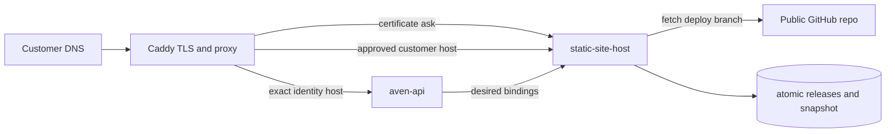

# Static site hosting

## Scope

The first release hosts public GitHub `deploy/*` branches on customer-owned, fully qualified domains. One purchased Aven name may own multiple independent site bindings; every binding has its own repository/deployment branch and its own domain or subdomain. The customer points each domain to the Hetzner host. The `aven.ceo` apex and its subdomains can only be registered through this API by an account whose canonical identity role is `admin`.

The expected repository contract is:

- a source branch such as `next`;
- its generated deployment branch such as `deploy/next`;
- a `dist/index.html` in the deployment branch;
- a `dist/.source-revision` containing the exact 40-character source commit SHA.

Only public GitHub `owner/repository` identifiers are accepted. Clone URLs are derived, not supplied by users.

## Runtime boundaries



The host has no database, Caddy-admin, Hetzner, or DNS-provider credential. It receives a narrow bearer-protected directory from `aven-api`. That directory carries an API-derived `owner_is_admin` authorization bit, which the host requires independently for the `aven.ceo` apex and its subdomains. Demoting the owner removes those bindings from the next directory reconciliation: Caddy authorization is withdrawn and the sites go offline, although their bindings and artifacts remain recoverable by re-promoting the owner. The account-administration tool therefore inventories these dependencies and requires an explicit resource-suspension override. Caddy's on-demand TLS ask endpoint authorizes only a currently active exact hostname.

Caddy does not depend on the identity container health check. The site host persists its last-known-good active routing set and release paths, so an already deployed site can be served after restart while identity is unavailable. Identity availability is required only to add, remove, or update a mapping. A failed fetch or invalid new artifact never replaces the active release.

## DNS verification

Creating a binding returns a one-time raw token. The database stores only its SHA-256 hash. The customer creates:

```text
_aven-site.<customer-domain>  TXT  <returned token>
<customer-domain>             A    <next Hetzner IPv4>
```

If the domain has AAAA records, every address must be listed in `SITE_HOST_ALLOWED_IPV6`. Every A and AAAA response must point to an allowed host address; mixed/CDN address sets are rejected. Caddy cannot request a certificate until verification and a successful artifact sync have completed.

## Configure a binding

The authenticated identity webapp exposes the manager at `/sites`. Mutations require completed passkey enrollment. Its transport-neutral types and client live in `@avenos/aven-hosting`, so the Tauri app can reuse the same contract later.

To create a binding directly:

```http
POST /api/sites
Content-Type: application/json

{
  "name": "purchased-name",
  "hostname": "www.customer.example",
  "repository": "myavenceo/avenceo",
  "sourceBranch": "next",
  "deploymentBranch": "deploy/next"
}
```

The response contains a stable `site.id`, `dns.txtName`, the one-time `dns.txtValue`, and the host A/AAAA addresses. Editing a binding rotates the token and temporarily returns that binding to `awaiting_dns`.

- `GET /api/sites` returns current status and active revisions.
- `PUT /api/sites/:siteId` edits exactly one binding.
- `DELETE /api/sites/:siteId` withdraws exactly one binding.
- Revoking the purchased name removes all of that name's bindings from the host directory and therefore from Caddy authorization on the host's next successful reconciliation.

## GitHub `next` environment

The `release-next` workflow publishes `ghcr.io/myavenceo/aven-static-site-host` by immutable digest and deploys it with the identity stack. Add this required environment secret:

- `SITE_HOST_DIRECTORY_BEARER_TOKEN`: a unique 32–128 character URL-safe random value.

Optional environment variables are:

- `SITE_HOST_ALLOWED_IPV6`: comma-separated Hetzner IPv6 addresses; leave empty if the service should reject all AAAA records.
- `SITE_HOST_POLL_SECONDS`: defaults to `60`.
- `SITE_HOST_DNS_GRACE_SECONDS`: defaults to `86400` for already verified sites.
- `SITE_HOST_MAX_FILES`: defaults to `10000` files per deployed `dist` tree.
- `SITE_HOST_MAX_BYTES`: defaults to `268435456` bytes (256 MiB) per deployed `dist` tree.
- `SITE_HOST_MAX_CONCURRENT_SYNCS`: defaults to `4` to bound concurrent Git and DNS work.

The workflow obtains `SITE_HOST_ALLOWED_IPV4` from the Pulumi host output. Persistent releases live in `/var/lib/aven/static-sites`, owned by container UID/GID `10003`.

## Next smoke test

1. Merge the branch through the normal `main` to `next` path and confirm all four immutable images deploy.
2. Open `/sites` in the next identity webapp and configure a purchased test name using the public `avenCEO` repository's `next` and `deploy/next` branches.
3. Add the returned TXT record and point a customer-controlled test domain's A record to the next Hetzner IPv4. For the operator path, promote the test account with `tools/account-admin`, bind either `aven.ceo` for a planned apex cutover or a non-infrastructure subdomain, and create the equivalent records in the operator-managed `aven.ceo` zone. Keep `next.aven.ceo` reserved as the identity environment origin.
4. Wait for one poll interval, then confirm `GET /api/sites` reports `active` and that source/artifact revisions match the repository.
5. Request the site over HTTPS and directly request a client-side SPA route. Both must return the site. `/internal/*` must return 404, and an unknown host must either be refused during TLS issuance or return 404 if it already has a cached certificate.
6. Stop `aven-api`, restart Caddy and `static-site-host`, and confirm the active static site remains available from the persisted snapshot.
7. Add a second repository/domain under the same purchased name and confirm both are served independently.
8. Restore identity, remove one binding, wait one poll interval, and confirm only that host is no longer authorized.

The first live certificate request should happen only after DNS has propagated; Let's Encrypt issuance is externally rate-limited.
