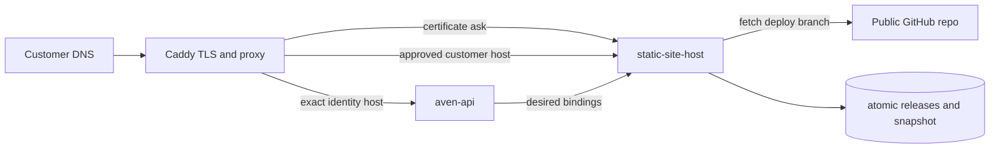

# Static site hosting

## Scope

The first release hosts one public GitHub `deploy/*` branch for one purchased Aven name on one customer-owned, fully qualified domain. The customer points that domain to the Hetzner host. `aven.ceo` and every subdomain below it remain operator-owned and cannot be registered through this API.

The expected repository contract is:

- a source branch such as `next`;
- its generated deployment branch such as `deploy/next`;
- a `dist/index.html` in the deployment branch;
- a `dist/.source-revision` containing the exact 40-character source commit SHA.

Only public GitHub `owner/repository` identifiers are accepted. Clone URLs are derived, not supplied by users.

## Runtime boundaries



The host has no database, Caddy-admin, Hetzner, or DNS-provider credential. It receives a narrow bearer-protected directory from `aven-api`. Caddy's on-demand TLS ask endpoint authorizes only a currently active exact hostname.

Caddy does not depend on the identity container health check. The site host persists its last-known-good active routing set and release paths, so an already deployed site can be served after restart while identity is unavailable. Identity availability is required only to add, remove, or update a mapping. A failed fetch or invalid new artifact never replaces the active release.

## DNS verification

Creating a binding returns a one-time raw token. The database stores only its SHA-256 hash. The customer creates:

```text
_aven-site.<customer-domain>  TXT  <returned token>
<customer-domain>             A    <next Hetzner IPv4>
```

If the domain has AAAA records, every address must be listed in `SITE_HOST_ALLOWED_IPV6`. Every A and AAAA response must point to an allowed host address; mixed/CDN address sets are rejected. Caddy cannot request a certificate until verification and a successful artifact sync have completed.

## Configure a binding

With an authenticated, email-verified identity session:

```http
PUT /api/sites
Content-Type: application/json

{
  "name": "purchased-name",
  "hostname": "www.customer.example",
  "repository": "myavenceo/avenceo",
  "sourceBranch": "next",
  "deploymentBranch": "deploy/next"
}
```

The response contains `dns.txtName` and the one-time `dns.txtValue`. Reconfiguring the name rotates the token and temporarily returns it to `awaiting_dns`.

- `GET /api/sites` returns current status and active revisions.
- `DELETE /api/sites` with `{ "name": "purchased-name" }` withdraws the mapping.
- Revoking the purchased name automatically removes it from the host directory and therefore from Caddy authorization.

## GitHub `next` environment

The `release-next` workflow publishes `ghcr.io/myavenceo/aven-static-site-host` by immutable digest and deploys it with the identity stack. Add this required environment secret:

- `SITE_HOST_DIRECTORY_BEARER_TOKEN`: a unique 32–128 character URL-safe random value.

Optional environment variables are:

- `SITE_HOST_ALLOWED_IPV6`: comma-separated Hetzner IPv6 addresses; leave empty if the service should reject all AAAA records.
- `SITE_HOST_POLL_SECONDS`: defaults to `60`.
- `SITE_HOST_DNS_GRACE_SECONDS`: defaults to `86400` for already verified sites.

The workflow obtains `SITE_HOST_ALLOWED_IPV4` from the Pulumi host output. Persistent releases live in `/var/lib/aven/static-sites`, owned by container UID/GID `10003`.

## Next smoke test

1. Merge the branch through the normal `main` to `next` path and confirm all four immutable images deploy.
2. Configure a purchased test name through `PUT /api/sites`, using the public `avenCEO` repository's `next` and `deploy/next` branches.
3. Add the returned TXT record and point a customer-controlled test domain's A record to the next Hetzner IPv4. Do not use `next.aven.ceo`; it is intentionally reserved as an operator origin.
4. Wait for one poll interval, then confirm `GET /api/sites` reports `active` and that source/artifact revisions match the repository.
5. Request the site over HTTPS and directly request a client-side SPA route. Both must return the site. `/internal/*` must return 404, and an unknown host must either be refused during TLS issuance or return 404 if it already has a cached certificate.
6. Stop `aven-api`, restart Caddy and `static-site-host`, and confirm the active static site remains available from the persisted snapshot.
7. Restore identity, remove the binding, wait one poll interval, and confirm the host is no longer authorized.

The first live certificate request should happen only after DNS has propagated; Let's Encrypt issuance is externally rate-limited.
