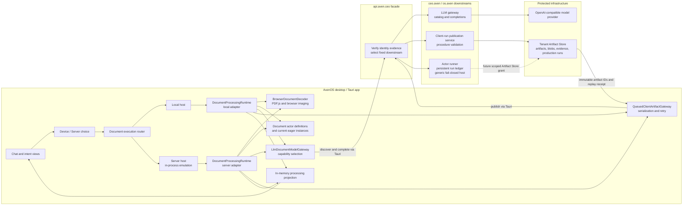
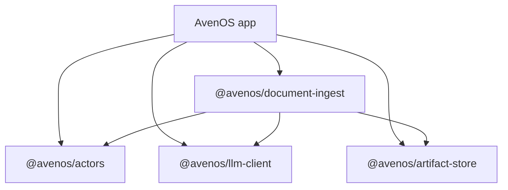
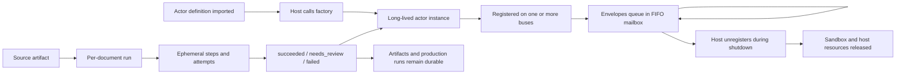
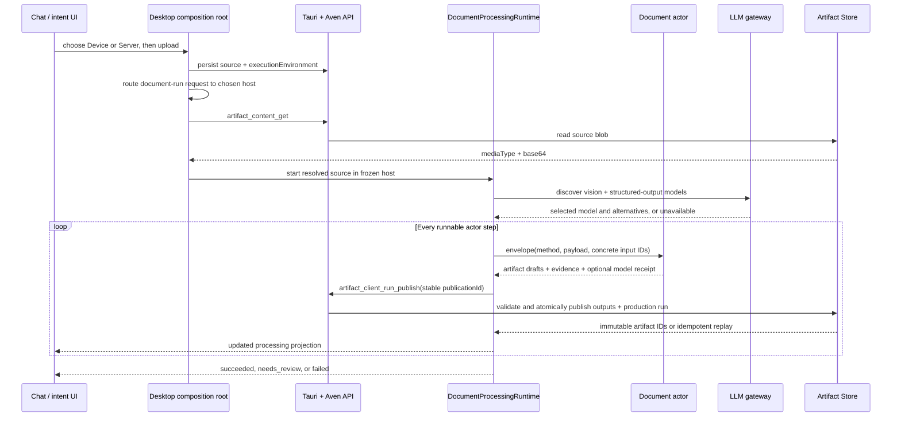
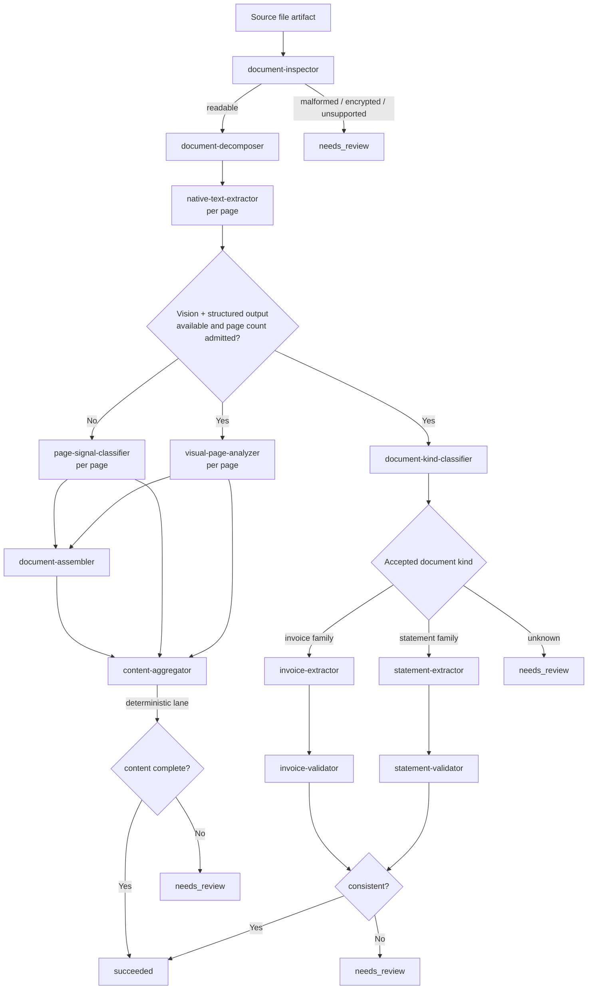

# Document ingest system architecture

## Purpose

This document maps the current executable document-ingestion system: how the user
chooses device or server placement, how the selected host runs document actors through
the authenticated LLM gateway, how both placements publish to one Artifact Store, and
how progress returns to the UI.

The server host currently runs as a separate in-process emulation inside the desktop
app. That is a tested client boundary, not a claim of remote document execution. A
separate authenticated actor-runner service now proves the remote HTTP and trust
boundary and persists its run ledger in customer PostgreSQL, but it does not execute
this document graph. The normative protocol and the steps that connect those two
halves are specified in
[`actor-runtime-formal-spec.md`](./actor-runtime-formal-spec.md).

Use it to answer “where does this responsibility live?” before changing the system.
The linked component guides contain the detailed wire contracts and operator setup.

## The whole system



The selected host owns current orchestration and document understanding. The
`api.aven.ceo` facade verifies identity evidence and selects fixed downstreams. The LLM
downstream owns provider credentials and model capability enforcement; the artifact
downstream owns tenant resolution and publication validation. The Artifact Store owns
durable values and successful provenance. In the completed remote path, the facade
admits the run and the server runner replaces only the in-process host transport.

## Architectural layers

| Layer | Owns | Must not own |
| --- | --- | --- |
| `@avenos/actors` | Actor manifests, mailboxes, envelopes, bus, predicates, sandbox, capability planner | Document logic, Tauri, Svelte, persistence, provider transport |
| `@avenos/llm-client` | Transport-neutral model catalog and completion contracts | Authentication implementation, model policy, prompts, provider credentials |
| `@avenos/artifact-store` | Client-run and processing contracts, queued/retry publication decorator | Document orchestration, UI state, Tauri commands |
| `@avenos/document-ingest` | Document actor catalog, prompts/schemas, model selection, host-neutral run adapter, current execution DAG, publication identities | Browser/PDF.js, Svelte, Tauri, direct provider or Artifact Store access |
| Desktop adapters | Browser decoding, Tauri transport, singleton wiring, UI projection updates | Domain contracts and actor-specific transformations |
| Aven API facade | Authentication verification, fixed downstream routing, and credential replacement | Client UI state, actor execution, product policy, or caller-selected physical routes |
| LLM and artifact downstreams | Model transport, tenant artifact access, publication validation, and product/data policy | Identity issuance or document orchestration |
| Actor runner | `os.aven` run protocol, independent identity verification, customer-scoped SQL run ledger, and generic server host composition; its application catalog is currently empty | Identity issuance, product entitlement ownership, or document-specific routing |
| Artifact Store | Immutable artifacts/blobs, evidence, production-run receipts, idempotent replay | Delivery leases, mutable progress, model selection |

This layering is what allows the same actors to run in a future headless host: replace
the browser decoder and Tauri transports, not the actor implementations or lineage
model.

## Package dependency direction



The reusable packages do not import the app. Compatibility files under
`app/src/lib/actors` and `app/src/lib/artifacts` re-export package APIs while older app
imports migrate.

## Desktop composition

`app/src/lib/artifacts/client-document-processing.ts` is the desktop composition root.
At module initialization it:

1. creates one `LlmDocumentModelGateway` backed by the generic Tauri LLM transport;
2. creates local document actors and registers them on the application bus for
   wholesale discovery;
3. creates a separate actor set for the in-process server emulation;
4. creates one queued Artifact Store gateway around the raw Tauri publication command;
5. constructs local and emulated-server `DocumentProcessingRuntime` adapters;
6. wraps them in strict-JSON execution hosts and a placement-freezing router; and
7. connects routed projection changes to the chat actor and intent store.

Each processing runtime registers its own actors on a private `MessageBus`. The
application bus exposes the local set to the current actor explorer; the private buses
keep the two emulated placements isolated. This eager construction is transitional.
The generic runtime will materialize authorized factory offers per plan.

## Lifecycles

There are four related lifecycles. Treating them as one is the easiest way to leak
actors, duplicate work, or mistake an in-memory projection for durable state.

### 1. Actor definition lifecycle

An actor directory contains a factory and manifest definition. Importing the module
does not create an actor. The manifest ID and method names are durable protocol
identifiers; the factory is ordinary code that can create a local instance in a
desktop or headless host.

### 2. Actor instance lifecycle

In the desktop app, instances are created when the document-processing composition
module is first evaluated:

```text
client-document-processing module loads
  -> create one model gateway
  -> create local and emulated-server actor sets
  -> construct up to 12 Actor instances per host
  -> register local instances on the app bus
  -> register each host's instances on its private runtime bus
```

The app uses `singleton(...)`, backed by `globalThis`, for the gateway, actor set,
publication gateway, and runtime. This prevents Vite hot-module replacement from
creating split-brain bus generations. In production, normal module initialization
creates them once.

Actor instances are **not yet** spawned per plan, upload, page, stage, attempt, or
envelope. They are long-lived host workers. Each has a runtime UUID and a FIFO mailbox; one instance
processes one message at a time. Multiple document runs may exist concurrently, but
messages reaching the same actor instance serialize through that mailbox. Different
actor instances can work independently, while the current coordinator itself executes
one document's steps in an explicit order.

The app always supplies a `DocumentModelGateway`, so it constructs all twelve actors.
Whether the four model actors are used is decided per document from live catalog
availability and the admitted page count. A headless host may omit the model gateway,
in which case the registry constructs only the deterministic actors.

### 3. Document run lifecycle

`DocumentExecutionRouter.start(request)` first freezes the selected environment and
routes to exactly one host. The host JSON-round-trips the request, resolves source
bytes by artifact ID, and calls its current `DocumentProcessingRuntime`. That runtime:

1. deduplicates concurrent starts by source artifact ID;
2. creates an in-memory processing presentation and stable case ID;
3. discovers current model availability;
4. invokes and publishes steps until a terminal case state is reached; and
5. removes the source from the active-run map when the promise settles.

Successful and `needs_review` presentations remain cached in memory and a repeated
`start` returns that projection. A failed presentation may be started again. After a
process restart the cache is empty, but stable publication identities make already
committed steps replayable.

### 4. Envelope and step lifecycle

For every step, the runtime creates one envelope and sends it through the private bus.
The target actor queues it, runs its handler, and returns a structured result. The
runtime then enters a separate publication phase. The step is terminally successful
only after Artifact Store publication returns immutable output IDs.

Actor execution may be retried for a model-backed method. Publication may be retried
without repeating successful actor execution. The envelope and attempt are ephemeral;
the committed artifacts and production run are durable.

### Winding down

Completing a document run does not tear down actor instances. They remain registered
and ready for the next document. The current desktop composition has no dynamic
document-actor shutdown path; application/process shutdown releases the instances.

The generic `MessageBus.unregister(ref)` operation removes an actor and calls
`actor.dispose()`, which releases a QuickJS sandbox session when present. A future
dynamic or headless host must explicitly unregister/dispose actors during host
shutdown, stop admitting new envelopes, drain or reject queued work, and close its
transport resources. Each local document **actor instance** is currently registered
with both the application discovery bus and its host's private execution bus. The
desktop composition root must therefore coordinate removal from both registries while
calling `dispose` exactly once. `DocumentProcessingRuntime` does not yet expose
`close`, drain, cancellation, or lease APIs.



## End-to-end upload lifecycle

The current lane starts after the source file already exists as an Artifact Store
artifact marked with `sourceKind: client-actor-ingest`. New sources also carry the
captured `executionEnvironment` as a temporary restart hint. The eventual generic run
record replaces both fields as the authority for execution ownership and placement.



The source bytes may be decoded locally, but every downstream dependency is bound to
the immutable artifact IDs returned by publication. A local draft is never considered
a completed input.

## Actor graph

Each directory under `libs/aven-document-ingest/src/actors` contains one actor. The
registry creates the standard graph; the runtime chooses the deterministic or model
path from model availability and admitted page count.



The finance validator actors are deterministic and deliberately separate from model
extraction. A plausible model result is not treated as a valid invoice or statement
until the relevant rule set has run.

This graph describes the current coordinator. Its encrypted branch still ends in
`needs_review`; the conforming generic runner replaces that branch with the durable
password continuation defined in the formal specification. Likewise, XRechnung is
added through observation and replanning, never another branch in this coordinator.

## What `DocumentProcessingRuntime` is

The runtime is a document-application coordinator built on generic actor and Artifact
Store primitives. It is intentionally more capable than a simple bus, but it is not yet
a general skill runner.

### Current capabilities

- creates one run projection per source and suppresses duplicate concurrent starts;
- discovers model availability and applies page-admission policy;
- dispatches concrete actor methods through ordinary envelopes;
- executes serial per-page extraction/classification and finance-family branching;
- records dependency keys and stage/attempt states for explanation and the UI;
- retries model execution independently from publication;
- retains a successful actor result while publication is retrying;
- derives stable publication IDs from the source, stage, procedure, and bound inputs;
- replaces local output keys with immutable Artifact Store IDs; and
- returns honest `succeeded`, `needs_review`, or `failed` outcomes.

### What remains document-specific

The runtime currently names document actor methods, stage keys, artifact types, page
loops, finance taxonomies, retryable model methods, branch rules, and presentation
outcomes directly in TypeScript. Its `DocumentActors` interface also has named fields
such as `extractInvoice` and `validateStatement`.

Its `dependsOn` values currently describe the graph for projection and explanation;
ordinary TypeScript control flow actually schedules the steps. They are not consumed
by a generic dependency scheduler. Page loops are serial today, although the actor and
artifact contracts do not require a future host to keep independent pages serial.

That means adding a new document stage or branch still requires editing the runtime.
The actor manifests make capabilities discoverable, but the runtime does not inspect
those facts to synthesize this pipeline and does not execute the planner's
`AdHocProgram`.

This is a useful boundary rather than hidden generality: document admission,
page-level fan-out, accepted-kind thresholds, and deterministic validation are current
product policy. Pretending the coordinator is already generic would move those
decisions into implicit conventions.

### Extensibility path

There are three reasonable levels of extension:

1. **Extend the temporary coordinator only for current parity.** Add its actor
   directory, server publication contract, registry entry, and explicit runtime step.
   Do not use this path for XRechnung or another capability intended to prove generic
   discovery.
2. **Make the document recipe declarative.** Extract stage descriptions—method,
   required slots, output bindings, retry class, condition, and presentation mapping—
   while retaining document-specific branch functions. This can remove repetitive
   `#step` calls without inventing a universal runner.
3. **Build the general skill runtime.** Accept a frozen planner program, persist a run
   and attempts, bind artifact slots generically, lease runnable steps, support gates
   and effect semantics, and replan only unfinished work. That belongs above
   `@avenos/actors` and `@avenos/artifact-store`, not inside this document package.

The current runtime is a good reference implementation for level three's invariants:
separate execution/publication retry domains, immutable outputs, stable idempotency,
and honest terminal states.

## One actor step and its commit boundary

An actor step has two independent phases:

```text
execution
  envelope -> actor handler -> DocumentActorResult

publication
  stable publication ID + inputs + drafts + evidence
    -> authenticated client-run API
    -> atomic Artifact Store outputs and production-run receipt
```

`DocumentActorResult` contains a procedure key, artifact drafts, evidence, and an
optional model receipt. It does not contain durable output IDs. The server verifies the
procedure key, exact input/output roles, blob rules, evidence, and tenant before
returning materialized artifact IDs.

The runtime marks a stage successful only after publication succeeds. This prevents a
downstream actor from consuming an output that exists only in client memory.

## How inputs, outputs, and schemas are bound

Binding happens at three different layers. They complement one another; none replaces
the others.

### 1. Logical capability binding

Actor methods advertise Prolog-shaped `requires` and `produces` predicates:

```ts
requires: ['file(F)', 'page(F, P)']
produces: ['extracted_text(F, P, T)', 'text_layout(F, P, L)']
```

Unification connects symbolic variables such as `F` and `P`, derives graph edges, and
lets the planner reason about whether a goal is reachable. These predicates describe
logical availability. They are not JSON Schemas, do not validate payload fields, and
do not automatically construct a runtime envelope.

`capabilitiesFromManifests` normalizes these method contracts for planning. The current
document coordinator uses the same contracts for discovery but binds its executable
steps explicitly.

### 2. Runtime value and artifact-slot binding

For a concrete step, `DocumentProcessingRuntime` supplies two parallel inputs:

```ts
{
  method: 'document_extract_native_text',
  payload: { page: decodedPage },
  inputs: [
    { role: 'source', ordinal: 0, artifactId: sourceId },
    { role: 'page', ordinal: 0, artifactId: pageArtifactId }
  ]
}
```

- `payload` contains the in-memory values the local handler needs. TypeScript domain
  interfaces describe these values, and the handler performs fail-closed runtime
  checks at trust boundaries.
- `inputs` binds semantic roles and dense ordinals to already-published Artifact Store
  IDs. These bindings become production-run lineage and determine the stable
  publication identity.
- `dependsOn` names execution-stage dependencies for projection and explanation. The
  current coordinator's call order performs scheduling; `dependsOn` does not schedule
  work and does not replace artifact input bindings.

The actor returns drafts. Each draft binds:

```ts
{
  localKey: 'text',
  typeKey: 'docs.extracted-text',
  typeVersion: 1,
  payload: { method: 'native', pageCount: 1, complete: true },
  output: { role: 'text', ordinal: 0 },
  blob: { mediaType: 'text/plain; charset=utf-8', base64: '...' }
}
```

`localKey` is scoped to this publication and lets evidence point to an output before a
durable ID exists. `typeKey` and `typeVersion` select the registered artifact schema.
The output role and ordinal bind the artifact to the procedure's output slot. After
publication, `materialize` replaces each local key with the returned artifact ID, and
those IDs are used in downstream `inputs`.

### 3. Publication procedure and Artifact Store schema binding

The client-run publication contract requires an allowlisted descriptor for every
client procedure. A descriptor binds:

- `procedureKey` to the attributed actor ID and deterministic/model execution class;
- allowed input roles, minimum/maximum cardinality, and dense ordinals;
- exact parameter keys, including model receipt requirements;
- exact output local keys, type keys, roles, ordinals, and blob policy; and
- additional semantic checks such as page number, classification level, extraction
  method, or paired text/layout cardinality.

For example, `client.extract-native-text` requires exactly one `source` and one `page`
input, one page parameter, and exactly `text` and `layout` outputs with their expected
types and blob rules. A client cannot relabel an arbitrary output as that procedure.

The actor already returns the literal `procedureKey` expected by that contract. The
current repository does not contain the publication downstream or its descriptor table, so
an integrated deployment must restore those descriptors before client publication can
succeed. A missing or mismatched descriptor must reject the publication.

Actor manifests, runtime step definitions, and publication descriptors form a
three-part protocol. The first two are present here; the third is an explicit
downstream integration requirement. A future contract compiler could generate the
descriptor and runtime slot types from one method-capability definition, but the
current system does not do that automatically.

After this procedure-level validation, the Artifact Store resolves each
`typeKey@version` to an immutable registered type definition and validates the payload
against its canonical JSON Schema and blob/reference policies. Thus the durable schema
authority is the Artifact Store type registry, not the TypeScript interface and not
the model's claim.

Evidence adds a fourth set of bindings within the same publication: output local key
and locator to input role/ordinal and locator. When the publication commits, the Store
can resolve those symbolic references to the concrete output and input artifact IDs.

### Model schema binding

Model-backed actors add an earlier validation layer. `model.ts` maps each model
procedure to a structured-output JSON Schema. The generic LLM gateway sends the schema
using the configured provider profile. The actor then parses and applies semantic
checks—bounds, accepted kinds, required shapes, and grounded evidence—before producing
artifact drafts. Finally, server procedure validation and Artifact Store type-schema
validation run as described above.

For the finance and document-classification outputs, `model.ts` derives its structured
schemas from the Artifact Store conformance definitions. This reduces drift between
what the model is asked to return and what the durable type registry accepts. It still
does not make the provider authoritative: actor checks and Store validation remain
mandatory.

```text
planner predicate contract
  -> explicit runtime payload + artifact role binding
  -> model structured-output schema (model actors only)
  -> actor semantic validation
  -> server procedure slot validation
  -> Artifact Store type-definition schema validation
  -> immutable artifact IDs and provenance
```

This layered binding is deliberate. Planning predicates remain small and composable,
while durable data receives exact schema enforcement at the authority that stores it.

## LLM path

The document package depends on `LlmGatewayClient`, not on Tauri or a provider SDK.
`LlmDocumentModelGateway`:

1. requests models with both `vision` and `structured-output`;
2. keeps all compatible `{ id, label }` alternatives for presentation;
3. selects an explicitly preferred ID or the first operator-ordered match;
4. maps a document procedure to bounded multimodal messages and a JSON Schema; and
5. maps the generic gateway receipt into document provenance.

The desktop adapter supplies `discoverLlmModels` and `completeWithLlm`. Tauri keeps the
Aven session credential outside the webview. The `ceo.aven` LLM downstream resolves
the public model ID to the private provider deployment and credential after the facade
authenticates and routes the request.

The actors never see provider secrets. Document contents are treated as untrusted data,
and structured responses are validated again by actor code before becoming drafts.

## Persistence, retry, and restart behavior

### Stable identities

Every step publication ID is derived from the source artifact, stage, procedure, and
ordered concrete input artifact IDs. Repeating a committed step therefore returns an
Artifact Store replay rather than creating duplicate lineage.

The generic LLM gateway also derives a stable request key from the canonical request.
If a provider result was obtained but Artifact Store publication failed, publication is
retried without executing the actor or model again during that run.

### Separate retry domains

- Model-backed actor execution gets bounded retries because transient inference failure
  may recover.
- Deterministic actor execution fails immediately on the same invalid input.
- Artifact publication is serialized per client and retries only declared transient
  transport, availability, or upload-admission failures.
- A successful actor result is retained while its publication retries.

### What is durable

Artifacts, blobs, evidence, production runs, public model identity, request/response
receipt fields, and stable publication IDs are durable. The current processing
presentation is an in-memory projection. After a restart, running again from the source
replays committed step publications and reconstructs the remaining lineage; the UI
projection itself is not yet a durable run record.

A future general skill runner should persist plan/run state separately, using Artifact
Store production runs as successful facts rather than making mutable progress an
artifact.

## UI projection

`DocumentProcessingRuntime` emits an `ArtifactProcessingPresentation` whenever a stage
or case changes. The desktop composition root sends a clone to:

- the chat actor, which updates the artifact card; and
- the intent store, which updates the intent/file processing state.

The projection contains stage keys, dependencies, attempts, terminal codes, derived
artifact IDs, warnings, selected model metadata, and the case state. It is a view over
execution, not the source of truth for artifacts or provenance.

## Server responsibilities

The desktop adapters consume two generic avenCEO data-plane APIs. Their clients and
contracts are present here; after the infrastructure split, their owning LLM and
artifact downstream implementations are not part of the current deployment and must be wired
back through the facade before an integrated deployment. The actor-run API is present
as a separate service, but is not yet the document executor.

### LLM gateway

```text
GET  /api/llm/models
POST /api/llm/completions
GET  /api/llm/v1/models
POST /api/llm/v1/chat/completions
```

It authenticates verified users, lists capability-matching models, enforces that the
chosen public model supports the request, protects provider credentials, bounds input
and output, and returns a provenance receipt. It does not own document prompts,
workflow, retries, validation, artifact publication, or tool execution.

All catalog identities, policies, prompts, and capabilities which invoke this gateway
belong to `ceo.aven`. The gateway's OpenAI-compatible surface does not place any LLM
interaction under `id.aven` or the neutral `os.aven` runtime authority.

### Client-run publication

```text
POST /api/artifacts/client-runs/[publicationId]
```

It resolves the tenant, validates an allowlisted client procedure, checks exact
artifact slots and evidence, uploads blobs, and atomically publishes outputs and the
production-run receipt. It does not trust the client merely because the client names a
built-in actor.

`sourceKind: client-actor-ingest` currently identifies sources whose restart behavior
belongs to the desktop document adapter. The former feed-driven Artifact Processor has
been removed, so there is no competing server pipeline in the current system. The marker is
removed once admitted actor runs become the sole owner of processing.

## Actor discovery and planning

The target generic registry, dynamic factory lifecycle, principal-scoped authorization,
staged replanning, encrypted-PDF continuation, and XRechnung/OCR substitution are
specified in
[`generic-actor-registry-and-runtime.md`](./generic-actor-registry-and-runtime.md). The
normative runtime and cutover contracts are in
[`actor-runtime-formal-spec.md`](./actor-runtime-formal-spec.md).
The evidence model that separates portable runtime conformance, real document
acceptance, and live-provider smoke tests is in
[`actor-runtime-proof-strategy.md`](./actor-runtime-proof-strategy.md).

Every actor method advertises `requires` and guaranteed `produces` predicates. The
actor registry makes actors visible wholesale, and
`@avenos/actors.capabilitiesFromManifests` turns their manifests into planner-ready
method capabilities.

The current document pipeline does **not** execute a generated plan. Its coordinator is
an explicit, tested DAG because its branching, page fan-out, model admission, and
validation policy are product behavior. The separate capability planner proves that a
future skill runtime can synthesize ad-hoc programs from the same method contracts.
Generated plans will still need a durable run layer and the same artifact publication
boundary used here.

## Source map

| Path | Responsibility |
| --- | --- |
| `libs/aven-actors` | Actor runtime, registry primitives, predicates, sandbox, planner |
| `libs/aven-llm-client` | Generic LLM catalog/completion client contracts |
| `libs/aven-artifact-store/src/client-runs.ts` | Client publication contracts and queued gateway |
| `libs/aven-artifact-store/src/processing.ts` | Shared processing projection contracts |
| `libs/aven-document-ingest/src/actors/*/` | One directory per actor implementation |
| `libs/aven-document-ingest/src/actors/registry.ts` | Standard actor construction and inventory |
| `libs/aven-document-ingest/src/shared.ts` | Cross-actor document contracts and pure helpers |
| `libs/aven-document-ingest/src/model.ts` | Document prompts, schemas, and model port |
| `libs/aven-document-ingest/src/llm-gateway.ts` | Capability-based document model adapter |
| `libs/aven-document-ingest/src/execution.ts` | Placement-frozen document run and host boundary |
| `libs/aven-document-ingest/src/runtime.ts` | DAG execution, retries, publication IDs, projections |
| `app/src/lib/artifacts/browser-document-decoder.ts` | PDF.js/browser host adapter |
| `app/src/lib/actors/document-llm-gateway.ts` | Tauri LLM host adapter |
| `app/src/lib/artifacts/client-document-processing.ts` | Desktop composition root |
| `app/src/lib/models/gateway.ts` | Generic Tauri LLM transport |
| `services/aven-api` | Split authenticated facade and fixed downstream allowlist |
| `services/actor-runner` | Authenticated remote run boundary, SQL run ledger, recovery, and generic fail-closed execution host |
| `services/artifact-store` | Artifact Store service and conformance contracts |

## Safe extension checklist

When extending the system, change the layer that owns the decision:

- **New actor:** add one actor directory, method contract, factory export, registry
  entry, publication procedure contract, inventory entry, and focused tests.
- **New document type:** update trusted taxonomy/schema and prompts, add or reuse an
  extractor, keep deterministic validation separate, and update server publication
  allowlists.
- **New model:** add a catalog entry and provider credential; do not embed provider
  identity in an actor.
- **Headless execution:** implement decoder, LLM client, and Artifact Store gateway
  ports; reuse the document package unchanged.
- **Generated skill execution:** consume method capabilities in the planner, freeze the
  plan, persist a run outside the Artifact Store, and retain the existing atomic step
  publication boundary.

Before merging, run package type checking, document actor tests, the complete app test
suite, Svelte check, and the API verification workflow when server publication
contracts change.

## Related guides

- [Document actor catalog](../libs/aven-document-ingest/src/actors/README.md)
- [Document ingest package](../libs/aven-document-ingest/README.md)
- [Actor runtime proof strategy](actor-runtime-proof-strategy.md)
- [Client-owned document ingestion](client-document-ingest.md)
- [Generic authenticated LLM gateway](llm-gateway.md)
- [Actor skills and ad-hoc problem solving](actor-skills-and-problem-solving.md)
