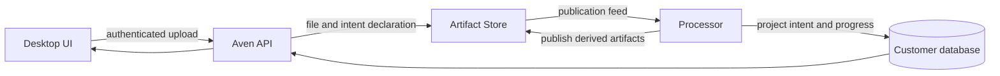

# Intent system overview

Status: current implementation on `feat/persistent-intents` (24 August 2026)

## What an intent is

An intent is a tenant-local, persistent work stream around one matter. It combines:

- an ordered history of contributions from the human, agent, skills, and system;
- a short title and routing summary, so the global input can select the right intent;
- the artifacts that belong to the work; and
- the current state of the skill doing the work.

The first real intent trigger is a file upload. Dropping a file creates a new intent
with the uploaded file as its source artifact and one visible **File** skill. Document
inspection, page decomposition, OCR, classification, extraction, and validation are
stages of that skill, not separate skills.

## How a file becomes an intent



1. The desktop creates stable upload, publication, and intent IDs before sending the
   file. It immediately opens a provisional intent and shows upload progress.
2. Aven API authenticates the user and resolves that user's customer database and
   artifact scope. The UI never receives service credentials.
3. Aven API atomically publishes the source file and an `intent.declaration@1` artifact.
   A retry uses the same identities, so an ambiguous network response cannot create a
   duplicate intent.
4. The Processor consumes the Artifact Store publication feed and projects the intent
   into the `aven_intents` schema in the customer's database. Projection writes and
   feed-cursor advancement share one transaction, making replay safe.
5. The existing file-processing pipeline runs. Each immutable output is linked to the
   intent, while the single File skill records the current stage, presentation, and
   warnings.
6. The UI refreshes the authoritative projection. It shows the narrowest known label
   (for example, `PDF`, then `Document`, then `Invoice`), live processing state, and all
   source and derived artifacts.

Human and agent chat messages are appended as ordered, idempotent contributions. They
reload with the intent after an application restart.

## Ownership and source of truth

| Part | Owns |
| --- | --- |
| Artifact Store | Immutable source bytes, derived artifact payloads, artifact types, and publication order |
| Processor Intent component | Intent projection, ordered contributions, artifact membership, File-skill state, and feed cursor |
| Aven API | User authentication, tenant/scope resolution, authorization boundary, and calls to internal services |
| Tauri bridge | Authenticated desktop transport and bounded artifact preview; no service credentials |
| UI | Presentation plus temporary upload progress until persistent state is readable |

Customer isolation follows the existing database-per-customer model. An intent's title,
summary, status, artifacts, and File-skill presentation can be rebuilt from durable
customer data and Artifact Store publications.

## What the UI does now

- Persistent file intents load alongside the existing demo intents.
- The right rail shows one File skill and every artifact produced for that intent.
- The intent title and type follow the latest, most-specific processor presentation.
- Clicking an original artifact previews supported image, PDF, or text content.
- Clicking a derived artifact shows its exact JSON payload; unsupported content falls
  back to a safe metadata view.
- `needs_review` appears as waiting, and terminal processing failure appears as error.
  On partial failure, the last presentable result remains visible with a warning.
- The routing context contains the intent title, state, and short summary so the global
  composer can dispatch a message to an existing intent.

## Current boundary

File-triggered intents, their contribution history, File skill, and artifact list are
persistent. The preinstalled sample intents, their other skills, gates, and unrelated
workflows remain demo data. General intent lifecycle actions such as arbitrary create,
merge, archive, restore, and delete still modify the in-memory prototype and are not
yet durable. Autonomous agent or skill execution beyond chat and the current artifact
processor is also outside this slice.

## Run it locally

```bash
bun run dev:api:artifacts
bun run test:persistent-intent:smoke
bun run dev:app:linux
```

The smoke test publishes a mock invoice, waits for processing, verifies that derived
artifacts belong to the intent, and appends a durable contribution.

For design rationale and guarantees, see
[Persistent intent architecture](../PERSISTENT-INTENT-ARCHITECTURE.md). For the exact
implemented slice and verification results, see
[Persistent intent implementation report](../PERSISTENT-INTENT-IMPLEMENTATION-REPORT.md).
