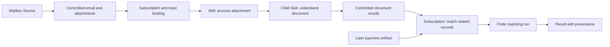

# Skill Studio: discover possibilities and build reusable programs

Status: initial vertical slice implemented. The target design below includes
future functionality; the following section is the authority for current coverage.

Skill Studio lets a person and their Aven turn available material into useful work.
Start with any artifact, explore possible outcomes, shape a program together, and
save it as a Skill. The same Skill can run once, be called by another Skill, or
handle artifacts arriving from a monitor.

The central object is a **partially specified program**. Some steps are fixed;
others describe an outcome and let the solver find the steps. A person can accept,
replace, or constrain a proposed section. The Aven uses the same structured edits.
Saving preserves the program and its policy as an immutable artifact.

This document owns the Studio experience and composition contracts.
[Skills and goal-directed problem solving](actor-skills-and-problem-solving.md)
owns the vocabulary; the [Actor runtime protocol](actor-runtime-formal-spec.md)
owns execution and authorization. The
[Artifact Store core](../services/artifact-store/artifact-store-spec/ARTIFACT-STORE-MINIMAL-CORE.md)
owns immutable occurrences, composition references, production receipts, and
publication history. Extensions below must preserve those boundaries.

The [shared Actor integration specification](skill-studio-shared-runtime.md) owns
the wider implementation: one authorized catalog and runtime, general bindings,
visual Skill previews in the artifact library, and a clean cutover without legacy
compatibility. Its full all-Actor runtime and continuous Source gates are not met.

## Implemented first slice

The native client's **Skills** surface now uses the customer-backed Studio API.
The native environment rail selects one owned customer environment for the signed-in
session. Studio requests, Actor runs, drafts, and artifact previews follow that
selection. Switching clears the in-memory Studio snapshot and selected Skill or
artifact, then reloads the new customer's data; it does not start a Source or grant
unattended access to another environment.
It supports artifact exploration, solver-filled goals, fixed steps, exact nested
Skill references, revision-checked drafts, immutable `studio.skill@1` publication,
execution, provenance inspection, and planning-only budget comparisons. The
Artifact browser can open any selected artifact in Studio. Unknown types remain
inspectable and report that no installed route is available.

The Artifact library also has a Skills filter and a read-only visual preview of a
selected saved Skill: its exact artifact revision, named interface, authored route,
nested child reference and current limits. This preview does not run the solver,
Actor, model or subscription. Its exact-revision Open, Use and Prepare actions
currently apply to active `studio.skill@1` artifacts only; a v2 card is honestly
preview-only until the shared editor and runtime are installed. File previews
continue to use the file viewer.

The next foundation exists in this worktree but is **not production coverage**:
the registry inventories zero-output methods, the `studio.skill@2` parser checks
closed named-port definitions and installed method contracts, and a trusted-host
authorized catalog can be supplied to the shared Studio/agent read boundary.
The production Actor host has no installed general catalog or execution adapters;
the new catalog call fails explicitly as unconfigured. The portable executor has
a tested live-instance resolver, but still lacks named result publications,
fenced durable attempts, review, protected ingress and general Store integration.

The initial catalog contains document understanding through the existing document
Actor pipeline and a deterministic brief derived from its committed report.
Understanding is an observation: a successful run does not promise that the
document contained an invoice or yielded complete findings. Model assistance is
off by default. A parent cannot grant a child more model authority than it has.

The agent's `studio_*` tools use the same native transport, server validation and
draft revisions as the UI. Both can inspect the full definition, change bindings,
nest Skills, compare plans, publish, run, and control connections. Run cancellation
and explicit retry retain the existing Actor Runner lifecycle.

The synthetic mailbox commits an RFC 822 email and text attachment. Source-filtered
and generic artifact subscriptions can start published Skills, including follow-on
Skills consuming derived outputs. Definitions are immutable artifacts; mutable
draft heads, activation cursors and delivery intents live in the customer Actor
schema. Feed progress and delivery intent are committed together. Stable activation
and invocation identities prevent an acknowledgement retry from becoming a new run;
two explicit activations or child call sites remain different occurrences.
Admission records a canonical resolved-program digest. Resume refuses a changed
resolution rather than silently selecting a new route.

Important limits:

- Dispatch advances only under fresh authenticated requests: while Studio is
  visible, or when the agent explicitly syncs it. Closing all clients stops
  dispatch, not persistence. This is **not an unattended mailbox worker**.
- Sources are synthetic only. Live IMAP/HTTP supervision, mailbox credentials,
  service identities and durable source leases remain future work.
- Subscriptions bind one arriving artifact plus explicitly fixed companions.
  Related-artifact joins, waiting bindings, collections and time windows are not
  implemented. Enable starts after the current feed high-water mark; pause/resume
  keeps the cursor and catches up. A delivery batch selected before pause can finish
  admission; already accepted runs are not cancelled by pause.
- Review nodes can be saved in drafts but cannot be published for execution.
  Arbitrary effects, child parameter ports, device execution and saved scenario
  artifacts are not implemented.
- Discovery is bounded to the installed catalog and the first 128 shelf/library
  entries. Any exact artifact ID remains addressable. It does not enumerate every
  Actor on the bus or claim to exhaust all possible business outcomes.
- Programs have at most 16 inputs, 32 authored steps, 64 compiled capability calls
  and eight nesting levels. The call budget counts Studio capability invocations,
  not internal document Actors, model tokens or elapsed time. Dispatch reads eight
  complete publications per connection per sync, keeps up to 256 pending deliveries
  per subject in its admission check, and limits each admission batch to 32.
  These checks are not a global multi-server resource quota.

The complete synthetic path, duplicate capture, concurrent sync, restart,
pause/resume, draft conflicts and nested provenance have focused PostgreSQL and
production Artifact Store tests. Browser tests cover the real Svelte screen with
only native IPC simulated. See [build and test](operations/build-and-test.md).

## Target design

The remainder describes the intended wider system. Features not listed above
must not be inferred to be available in the first slice.

## A concrete experience

Select a captured email. The Studio shows its attachments and a few relevant
possibilities: understand its documents, look for related records, or use an
existing Skill. Pick an attachment and an outcome. The proposed route shows what
can be established now and where an observation or decision is still needed.

Keep the document-understanding section and save it inside a reusable Skill.
Connect its results to a matching Skill that also needs a payment record. Reuse
the understanding section in another program without copying its internals.
Connect the first Skill to a mailbox, preview the matching captures, then enable
future processing under a bounded policy.

If the payment has not arrived, the connection preserves the waiting work. A later
payment artifact can make it ready. The Aven can explain that waiting state,
compare alternatives, and propose a change that opens in the person's Studio.

The drawing can collapse nested work into one card. Its underlying identities
remain available. Source capture, admission, and each run have their own lifetime
and failure state.

## The product surface

The default view keeps the selected material, proposed outcome, and next action
visible. It does not require a sentence, predicate, JSON, or drawn wire.

| Surface | What stays visible | What opens on demand |
| --- | --- | --- |
| Explore | Artifact shelf, useful outcomes, missing ingredients | Evidence, discovery limits, available implementations |
| Shape | One selected route, compact steps, alternatives | Typed inputs, parameters, nested programs, constraints |
| Activity | Active Sources, waiting work, runs needing attention | Capture history, attempts, decisions, complete provenance |
| Artifact library | Skill name, input/output chips, compact program preview | Named ports, nested Skills, effects, exact revision and provenance |

These are views of the same selected work, not disconnected editors. Switching
between them preserves the draft, selected artifacts, and navigation context.
An artifact can open directly into Explore; an agent proposal opens directly
into its draft and changes.

Use restrained color, clear shapes, short labels, and generous spacing. Show a
few ranked possibilities initially and offer further exploration. The agent can
page the full authorized search space without putting every node on the canvas.
Expand one nested section or inspector at a time.

A Skill is previewable directly in Artifacts even though it has no file blob. Its
preview renders the exact saved definition, not a speculative solver result or a
mutable draft head. Opening it does not execute, plan, or advance subscriptions.
The [artifact preview contract](skill-studio-shared-runtime.md#skill-previews-in-the-artifact-library)
defines cards, expanded views, actions, access checks, and incomplete dependencies.

A route card summarizes inputs, expected result, conditional observations,
placement, measured or unknown cost, and significant effects. Selecting an
alternative shows only meaningful differences. Dragging is optional; selection,
search, and keyboard commands can express every operation.

| Situation | Required response |
| --- | --- |
| Empty workspace | Offer recent artifacts, saved Skills, and connected Sources |
| Search in progress | Preserve the current route; allow editing and cancellation |
| No usable route | Identify the missing input or constraint and offer a relevant change |
| Observation required | Show the next observation and possible declared outcomes |
| Waiting for another artifact | Name the missing input and show what can wake the work |
| Waiting for a decision | Open the exact question with its evidence |
| Failed or disconnected | Retain the program and offer a specific recovery action |
| Draft conflict or stale preview | Show the changed fields or route and preserve both edits |

An unknown or denied capability must not leak through a suggestion. When no next
action is available, retain the draft and give a short explanation. Do not suggest
retrying a permanent denial.

Color and motion supplement labels. Keyboard access, focus order, readable
contrast, screen-reader descriptions, reduced motion, and small-window layouts
are first-release requirements. Source activation summarizes scope, backlog,
limits, and effects through compact choices.

## Shared definitions and records

Skills, Sources, subscriptions, and optionally saved scenarios are distinct typed
artifact families in the same customer library. Their exact keys and versions
must be registered through the existing source-controlled type path before use.

| Object | Durable meaning |
| --- | --- |
| Skill definition | Typed interface, program body, parameters, outcome, policy |
| Source definition | Resource identity, capture behavior, output contract, credential reference |
| Subscription definition | Artifact selector, input bindings, target Skill revision, execution policy |
| Scenario definition | Baseline, hypothetical changes, comparison, attribution |
| Activation | Why work was requested, exact definitions, resolved inputs, authority |
| Run | Selected plan segments, invocations, attempts, continuations, committed results |

Logical identities group revisions. Artifact IDs identify exact immutable
revisions. Labels and current heads are indexes, never execution identities.
Every child Skill reference pins an exact artifact revision. A missing
implementation affects execution availability, not permission to inspect a saved
definition.

An edit publishes a new definition with the predecessor as a producer-run input
and records the author, agent principal where applicable, and initiating Intent.
Composition references describe exact included definitions; they do not mean
approval, causation, or current selection. All inputs and structural references
stay inside one Artifact Store scope.

The Studio application owns revision-checked draft and published heads, Source
controls, subscription activation records, delivery intents, and waiting bindings.
These are durable application records with audit history. They cannot all be
reconstructed from definition artifacts alone. Search and opportunity indexes
are disposable projections; heads, activation decisions, and delivery state are
not. Their backup and eventual export must accompany definitions and run state.

The client and server use the same authorized library. Saved revisions and shared
drafts do not depend on a particular device. Offline execution and cross-scope
transfer require separate contracts.

## One program model for manual and solved work

A Skill has named, typed input and output ports, parameter schemas, an outcome
contract, policy bounds, and a declarative body. Ports carry artifact occurrences
or typed values derived from declared inputs. They specify required, optional, or
collection cardinality and the evidence accepted by the consumer.

The program body uses three concepts:

| Element | Meaning |
| --- | --- |
| Invoke | Call a capability or an exact child Skill revision with explicit bindings |
| Achieve | Ask the solver to establish a typed goal or bounded exploration result |
| Review | Obtain a typed human decision before dependent work becomes ready |

These compile into existing Actor execution contracts; they do not introduce
another bus protocol. Review uses durable continuations. Achieve uses the shared
solver. Invoking a child preserves an invocation boundary even if execution
internally expands into leaf capabilities.

Each element has a stable identity inside its definition. Bindings name input
ports, parameters, or earlier outputs. A checked binding language permits named
fields and registered conversions; it does not embed scripts or arbitrary code.
Calling the same child twice creates two call sites with independent parameters.

Branches depend on declared observation outcomes. Collection processing operates
on an exact, sealed membership list so a join knows when its inputs are complete.
The schema reserves those meanings from the start; the first authoring slice can
support scalar bindings and one level of child invocation. Existing document
fan-out may remain inside its installed adapter until generic collections work.

The compiler checks bindings, schemas, child revisions, cycles, reachable goals,
required reviews, placement, and transitive effects. Skill authors cannot turn an
effecting child into a non-effecting parent by changing a label. Unknown effect
metadata makes the relevant route unavailable.

A solver may refine an Achieve section within its admitted boundaries. It must
preserve fixed invocations, hard exclusions, required reviews, and bound inputs.
A preference may change a route; a hard restriction cannot disappear during a
replan. Unsupported constructs receive a structured validation result.

## Truthful discovery and planning

The explorer starts from any authorized artifact occurrence and resolves its
registered type, contents needed for inspection, and trusted fact projectors.
A projector establishes typed assertions with evidence references; it does not
make every schema-valid statement true.

A planning fact identifies its supporting artifact, projector version, relevant
evidence or decision, and any applicability or freshness condition. Conflicting
interpretations remain visible. A domain resolver can establish which observation
satisfies a particular requirement; the explorer does not silently select the
newest artifact or treat an old HTTP observation as current.

Discovery uses an authorized capability and Skill catalog plus a bounded index of
related artifacts. It exposes:

- routes whose prerequisites are established;
- routes conditional on a named observation or decision;
- possibilities requiring another input, connection, placement, or implementation;
- search exhaustion, incomplete indexing, and unsupported types.

It reports the exact scope, catalog, index boundary, relevance policy, and search
budget. Further pages extend that recorded search or explicitly start a refreshed
one. An unsupported type still opens in the Studio and explains its gap. Free text
can find or propose a typed goal; execution uses validated goals and bindings.

### Guaranteed and conditional outputs

The logical planner and observation runtime need a shared output contract before
their catalogs can drive Studio previews:

- Guaranteed outputs describe what every successful invocation establishes.
- Observation outputs describe a typed report and the possible declared cases.
- Case-specific facts become usable only after the committed report establishes
  that case.
- Undescribed outcomes stop preview expansion at the observation boundary.

For example, inspecting a PDF can guarantee an inspection report. Readability,
page membership, and successful invoice extraction remain conditional. A plan
must not assume them because they appear among possible outputs.

The current logical planner treats declared outputs as guaranteed, while the
document observation runtime projects a subset after execution. A compiler or
adapter must reconcile those meanings. Ranked alternatives and explanations also
extend today's single-result logical solve. Neither is an existing guarantee.

### From preview to run

A preview records exact inputs, program and catalog revisions, projected evidence,
constraints, selected route, and policy bounds. Starting resolves current authority
and revalidates the request. The selected route is either retained or its
permitted changes are explained; a preview itself grants no execution authority.

Each observation commits before the unfinished section is replanned. The activity
view retains earlier proposals and shows the actual observation and new segment.
Policy can authorize bounded automatic replanning. Widening effects, placement,
scope, or a hard budget needs new authority.

## Nesting, execution identity, and provenance

A parent invocation and every child call receive durable identities. A retry
retains its invocation identity; a new activation or repeated call is new work.
Parent cancellation propagates to active children, and committed outputs remain.
A parent checkpoint records admitted child identities before continuing so a
restart does not spawn them again.

Child completion has a typed result: established outputs, partial observations,
waiting state, or failure. A parent cannot treat a partial child as proof of its
requested goal. Policy and artifact access are checked at the child boundary and
again at effecting invocations.

Budgets are shared across a run and its descendants, including retries. Reserve
capacity before work and reconcile actual usage afterward. Children do not each
receive a fresh copy of the parent's budget. Subscriptions additionally have
limits over time; concurrency alone does not cap cost. A strict cost ceiling
requires a supported upper bound before admission, or the work waits for a
different policy. Unknown estimates stay unknown.

The provenance chain includes source capture, exact definition revisions,
activation, parent and child calls, observations, decisions, implementations,
and production receipts. Each result exposes its producer and declared inputs;
reverse navigation shows consumers. Access applies at every hop.

Program and activation evidence must be committed before result publications use
it as an input. Source capture uses its already committed Source definition as
an input to the capture receipt. Raw email and attachment membership is preserved
in that atomic capture publication. Runtime attempts remain operational records;
failed or uncertain attempts never become successful production receipts.

Current document execution derives publication identities primarily from the
source artifact and adapter settings and can reuse earlier publications. Studio
integration must instead distinguish activation, call site, exact program, and
input bindings. Publication IDs remain stable for retries of that invocation.
Reusing a prior result is an explicit operation referencing its original producer;
it never silently attributes an old output to a new Skill run.

## Sources: durable monitors with bounded capture work

A Source describes a continuing observation of a resource. Its logical identity
survives worker replacement. A supervisor discovers enabled Sources after restart,
claims fenced ownership, and schedules bounded capture attempts. An IMAP
connection may stay open; checkpoints and capture identities remain durable.

The definition includes resource identity, output contract, capture rule,
placement, timing and resource limits, and a non-secret credential reference.
The operational ledger owns enablement, leases, cursors, retries, and acquisition
progress. Trusted coordinators own Artifact Store publication.

IMAP capture identifies the account, folder, UIDVALIDITY generation, and message
UID. It records a delivery ledger rather than treating the highest observed UID
as proof that every earlier message committed. UIDVALIDITY changes require a
defined rescan and reconciliation outcome; they are not ordinary retries.

HTTP capture uses one admitted target and request contract, conditional requests
where supported, and an explicit emission rule. An unchanged response can update
operational freshness without emitting another content artifact. A rule may
instead record every observation. Egress, response size, scheduling, and credential
use stay within the Source's authority.

Each acquisition persists its identity and publication intent before publication.
Fetched bytes required for a pending commit must be recoverable. If the remote
resource disappears or changes before capture can be completed, record that
outcome rather than manufacturing continuity. Retry of a committed capture
resolves the same publication.

After commit, the dispatcher derives the emission from complete publication
membership and the capture receipt. It records exact Source revision, remote
occurrence, output IDs, and feed position. Bus notifications can wake consumers,
but the publication feed remains their durable input.

Connections bind a stable Source identity and an explicitly accepted capture/output
contract. Every capture records its exact configuration revision. Timing changes
or credential rotation for the same remote identity may preserve that contract.
Changing the mailbox, target, scope, output meaning, or capture rule requires a
new contract and an explicit connection update. The Studio shows affected
connections before that change becomes active. The cutover declares whether to
drain or stop in-flight captures. Any late capture retains its original revision
and is matched against an explicitly accepted contract; an unmatched capture
remains visible rather than being relabelled as a new-contract emission.

Unattended supervision and renewable mailbox/HTTP delegation are new work.
Discovery uses bounded platform grants and component roles, not arbitrary access
to every customer database. Existing transport and secret boundaries remain in
the [IMAP prototype guide](operations/imap-pdf-prototype.md) and
[HTTP resource design](http-resource-actors.md). The current prototype and HTTP
exchange path do not provide this supervisor.

## Subscriptions: bind artifacts, then admit work

A subscription observes committed artifact publications. It may restrict matches
to a Source, a producing Skill, a type/version, or a registered fact selector.
This allows source-to-Skill and Skill-to-Skill connections through one mechanism.

The definition pins the target Skill revision and specifies each input binding:

| Binding | Resolution |
| --- | --- |
| Trigger member | Exact artifact or member selected from the triggering publication |
| Fixed input | Exact existing artifact occurrence |
| Related input | Bounded lookup with explicit correlation and evidence requirements |

A related-input rule declares its matching key, cardinality, time window or
freshness rule, and behavior for no match or several matches. Ambiguity becomes
a review or waiting state. The default never chooses an arbitrary matching record.

An admission candidate has a stable anchor, such as the triggering invoice
occurrence. Missing inputs create durable waiting work indexed by the relevant
requirements. Later publications can wake that candidate even when they were
produced by another Source or Skill. Before admission, bindings may be completed;
after admission, exact inputs are frozen.

The default admits once when that candidate becomes ready. It does not rerun on
every subsequent matching artifact. A rule that intentionally reacts to each new
combination must declare that behavior and its bounds. First-release connections
may allow only trigger and fixed bindings, returning a clear unsupported result
for related-input rules until durable waiting and lookup are implemented.

### Activation, pause, update, and replay

An activation record binds a subscription revision, an execution generation, and
its effective publication interval. The default starts after the current feed
high-water mark. Historical processing requires a selected, bounded range.

Pause stops new admissions and retains delivery state. Resume continues the same
generation and defaults to processing its retained backlog. Skipping that backlog
is an explicit control decision with a recorded cutoff. Already admitted runs
use their own cancellation controls.

A rule or target Skill update creates a new generation with an explicit cutover.
Earlier publications retain their recorded interpretation; the update does not
silently reprocess history. Normal delivery retries use the existing generation.
Intentional reprocessing creates a new generation for the requested range.

Candidate identity includes scope, subscription, execution generation, and anchor
or declared correlation window. Admission binds the exact rule, Skill, and full
input set and rejects conflicting reuse. Source configuration revisions remain
part of capture provenance without automatically creating new work generations.

### Durable dispatch

The consumer applies a complete publication by committing its checkpoint together
with candidate updates and pending delivery intents in one application transaction.
It then submits deliveries to the runner using stable idempotency keys. Runner
admission and acknowledgement are independently retryable. A lost response does
not lose work or create another activation.

A blocked, rejected, or malformed delivery keeps its own visible record and does
not prevent unrelated publications from advancing. Queues, active work, waiting
candidates, and retries have explicit bounds. An exhausted limit pauses admission
with a specific reason while committed artifacts remain available.

Triggers carry their causal ancestry. Initial connections reject cycles and
self-triggering paths; any later loop feature needs explicit hop and total-work
bounds. A derived artifact must not accidentally recreate its own ancestor work.

Source capture and downstream processing fail independently. A failed Skill does
not invalidate a captured email. Store recovery epochs, customer movement, and
execution barriers also apply to consumers and pending deliveries. They must not
replay through a changed history without the reconciliation defined by the
[recovery handbook](operations/backup-and-recovery.md).

## Agent collaboration and what-if exploration

The client and agent use one planning and authoring service. The proposed tool
surface groups operations by intent, with typed inputs and structured results:

| Operation | Result |
| --- | --- |
| Explore | Opportunities, missing inputs, evidence, continuation cursor |
| Plan and compare | Checked routes or scenario differences with explicit assumptions |
| Inspect | Definitions, drafts, runs, Sources, subscriptions, bindings, provenance |
| Edit | Revision-checked semantic changes and a compact diff |
| Publish | An immutable definition revision with attribution |
| Start or connect | A manual activation or checked subscription proposal/admission |
| Control | Source and subscription edits, pause/resume, bounded replay, run continuation/cancellation |

Edits refer to stable program elements and draft revisions. The agent can add a
child, fill an open goal, replace a binding, or change a Source using the same
operations as the visual editor. Concurrent edits produce a conflict with the
changed fields; neither participant silently overwrites the other.

Each result gives a reference the client can open, explanations of unavailable
choices, and relevant next actions. The agent can batch proposed changes and
scenario variants rather than emulating individual gestures. It cannot inspect
material outside its authority or mutate immutable history.

A scenario freezes exact source and related artifacts, projected facts and
projector versions, retained catalog content/version, program, constraints,
evaluation time, and policy context. What-if changes apply to an isolated overlay.
Comparison reports changed routes, requirements, limits, and uncertain outcomes.

The default simulation is logical planning with hypothetical facts, not execution
of Actors. It spends no Actor/model budget, performs no external observation, and
publishes no result artifacts. Saving a scenario is a separate explicit publication.
A report may compare an assumed successful extraction with an assumed failure;
it must never claim to predict what an unseen document contains.

Scenario artifacts preserve their baseline and assumptions as scenario data,
excluded from normal evidence projection. Starting real work rebinds assumptions
to committed evidence or schedules an authorized observation. Attribution to the
scenario can explain a decision but cannot prove the assumed facts.

Inspection and drafting use the caller's existing delegation. Publishing, running,
and unattended processing use the same admission policy for client and agent.
Require human input where that policy requires it; do not add a confirmation for
every agent edit. Actor and artifact-type implementations remain versioned,
source-controlled installations, not mutable canvas objects.

## Implementation ownership

Logical ownership should be established before choosing new service boundaries:

| Owner | Responsibility |
| --- | --- |
| Shared Studio model/compiler | Definitions, bindings, validation, explanations, scenario overlays |
| Studio application | Drafts/heads, catalog and fact indexes, previews, control records, client/agent API |
| Source supervisor and dispatcher | Capture ledger, fenced workers, publication consumption, candidates, delivery intents |
| Existing runner with extensions | Activation admission, plan segments, nested calls, policy, continuations, execution |
| Existing Artifact Store and adapters | Immutable definitions, inputs, outputs, receipts, scope-local lineage |
| Intent Service | Human/agent working context and links to the requested work |

The Studio application and dispatcher may initially share a deployment. Their
transactional ownership must still be explicit. No new global registry or general
workflow engine is necessary. New durable records join the
[customer database platform](customer-database-platform.md) with narrow roles and
migration/recovery coverage.

The start protocol needs authored Skill revision and activation binding. The
compiler needs honest observational outcomes and nested call support. The
document adapter needs invocation-specific publication identity and additional
provenance inputs. The Source supervisor needs proactive customer discovery and
renewable unattended authority. These are implementation prerequisites, not
features already supplied by the repository.

## Delivery: shared Actors before protocol-specific expansion

The first implemented slice proves the synthetic email, nested document Skill, and
subscribed brief path described at the top of this document. The next delivery
replaces its fixed catalog rather than adding more Studio-specific actor branches.

Follow the [implementation sequence and acceptance gates](skill-studio-shared-runtime.md#12-implementation-sequence-and-file-ownership):

1. Inventory installed Actor methods and define the shared authorized catalog and
   richer program contracts.
2. Build generic authoring and visual Skill previews in Artifacts from those same
   contracts; give the agent the same structured operations.
3. Configure durable generic execution, application policy, publication recovery,
   and fencing before enabling new execution families.
4. Prove observations, optional/collection results, nested review, protected inputs,
   shared budgets, and full provenance.
5. Integrate document and client Actor families and protected HTTP capabilities,
   with explicit Device/Server placement and independent-package conformance.
6. Add supervised Sources and bounded unattended subscriptions only after their
   delegation, credential, restart, and revocation contracts pass.

This is a clean-cut implementation: legacy program readers, adapters, and data
conversion are not required. Immutable history is never rewritten to pretend it
uses the new contract, and resetting an existing environment requires explicit
authorization. Related-input joins, saved scenarios, and calibrated ranking remain
separate expansions after the shared runtime works.
