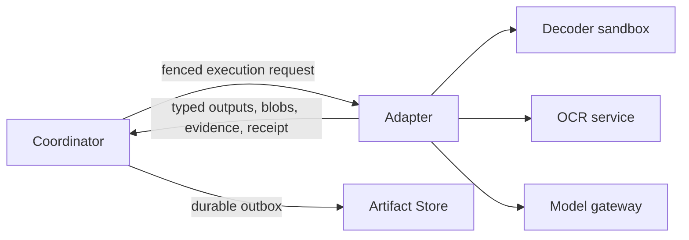

# Artifact processing adapter implementation draft

Status: design draft for replacing the local mock executors with real adapters

Date: 23 August 2026

Implementation checkpoint: the local processor now implements the Phase 0 lease
heartbeat, typed adapter failures, model-call ledger schema, and bounded decoder runner,
plus the Phase 1 inspection, decomposition, native PDF text/layout, assembly, and
deterministic aggregation path for PDF, PNG, and JPEG. The decoder child is credential-
free and bounded but still shares the processor network namespace; page rendering,
OCR, vision/LLM adapters, paid-call ledger operations, and a separate decoder sandbox
remain unimplemented. See the implementation report for verified behavior and exact
limits.

Related documents:

- [ARTIFACT-PROCESSING-CONCEPT.md](ARTIFACT-PROCESSING-CONCEPT.md)
- [ARTIFACT-PROCESSING-IMPLEMENTATION-REPORT.md](ARTIFACT-PROCESSING-IMPLEMENTATION-REPORT.md)

## Recommendation

Keep the coordinator, planner, Artifact Store publication path, and presentation
projection independent of concrete parsing and model technology. Implement real
capabilities as small adapters behind the existing executor envelope. Use deterministic
software for byte inspection, page identity, native text, assembly, and validation. Use
models only for semantic questions deterministic software cannot answer reliably: page
visual understanding, document-kind classification, and domain extraction.

The first real vertical should support PDF, JPEG, and PNG and end at an invoice
candidate plus deterministic validation. Replace adapters from the outside in:

```text
real inspection and decomposition
  -> real page rendering and native text
  -> real OCR
  -> real page analysis
  -> real document classifier
  -> real invoice extractor
  -> deterministic validator
```

Do not replace the mock pipeline with one large vision-model call. That would discard
the page retry boundary, duplicate expensive image input, weaken provenance, and
recreate the mutable all-or-nothing job from `avenCEO-tools`.

## Findings from `avenCEO-tools`

The implementation reviewed is in
`/home/daniel/src/jaensen/avenCEO-tools/src/lib/{ingest,server/ingest}` and its tests.
It is a useful prototype with a strong validation layer, but its runtime shape should
not be copied wholesale.

### Patterns to retain

| Existing pattern | How to carry it forward |
| --- | --- |
| Byte signatures take precedence over declared media type and extension | Make this the first deterministic inspection rule and report disagreements |
| PDF page count is checked and excessive documents are rejected rather than truncated | Keep an explicit page-limit outcome; never silently omit pages |
| Classification and extraction are separate model calls | Keep separate typed artifacts and source-controlled routing between them |
| Function schemas recursively require fields and reject extra properties | Reuse strict closed schemas, with nullable unknown fields where necessary |
| Exactly one forced tool call, temperature zero, and a request timeout | Keep these as baseline provider controls, not as proof of determinism |
| Low classification confidence becomes `unclear` | Keep the conservative outcome, but make thresholds policy rather than prompt logic |
| Model output is schema-checked and then independently consistency-checked | Preserve this separation; schema validity is not factual correctness |
| Consistency reports distinguish `PASS`, `FAIL`, and `UNKNOWN` | Preserve the vocabulary, rule IDs, coverage, and non-mutating validation |
| Contradictory extracted data is retained and warned about rather than silently repaired | Publish the candidate and validation report as separate immutable artifacts |
| Corrections say that document contents are data, not instructions | Keep the instruction, while enforcing it structurally through powerless model tools |
| Worker parallelism, page count, model timeout, and retry count are bounded | Move all bounds into versioned procedure policy and resource-class admission |

The invoice and statement consistency code is particularly valuable. It checks totals,
tax arithmetic, signs, line aggregation, dates, identity anchors, IBAN syntax, statement
balances, document profiles, and coverage without rewriting provider output. Port that
logic almost mechanically after converting numeric values from binary floating point
to currency plus integer minor units.

### Patterns to replace

| Existing behavior | Problem | Replacement |
| --- | --- | --- |
| Every PDF page is rendered at 144 DPI and all page images are sent for classification and again for extraction | Cost, latency, memory, and retry scope grow with the whole document | Render once per page; reuse bounded representations; select only relevant pages and regions for later calls |
| One model sees the whole document before page semantics are known | Photograph-only, mixed, blank, and text pages have no independent result | Classify every logical page, then aggregate |
| The classifier returns `extraction_tool` | A probabilistic model controls execution | Classifier returns taxonomy claims only; source-controlled planner chooses adapters |
| Confidence is a model-generated float used directly for routing | Model confidence is not calibrated and varies by provider | Store integer score plus calibration identity; route with versioned policy and deterministic quality signals |
| Raw provider envelopes, errors, and correction prompts are stored | Privacy, prompt leakage, uncontrolled size, and provider coupling | Store validated typed output and a bounded receipt; keep sensitive diagnostics short-lived and access-controlled |
| Financial values are ordinary JSON numbers | Floating-point arithmetic is unsuitable for authoritative money | Parse decimal strings and publish integer minor units plus currency |
| Extracted fields have no offsets or boxes | A reviewer cannot verify where a value came from | Require evidence block IDs and resolve them to text byte ranges and page regions |
| `pdftoppm` and `pdfinfo` run with no child timeout, output bound, pixel bound, or process sandbox | Malformed input can consume excessive resources or exploit a decoder | Run fixed binaries in a no-network decoder sandbox with CPU, memory, process, output, and wall-clock limits |
| Text input is silently sliced at 250,000 characters | Completeness is ambiguous | Fail with a stable limit or publish an explicitly incomplete coverage map |
| Retryability is inferred with a regex over error messages | Provider message changes can cause the wrong terminal behavior | Return typed adapter errors with explicit retry class |
| A ten-minute lease has no heartbeat or fencing on completion | A slow or duplicated worker can publish stale work | Heartbeat leases, fence attempts, and reject stale completion |
| A crash after the model replies but before completion can repeat the paid call | At-least-once execution can multiply cost | Add a durable, content-addressed model-call ledger and provider idempotency key |

## Adapter boundary

An adapter is a bounded semantic function. It never plans follow-up work, updates UI
state, chooses another adapter, writes coordinator tables, or publishes directly to the
Artifact Store. It receives immutable inputs and returns a publication proposal.



Every execution request should contain:

- scope, case, step, attempt, and fencing identities;
- procedure key, contract version, and descriptor digest;
- exact input artifact IDs and expected content digests;
- canonical parameters and resource limits;
- an absolute deadline and cancellation signal;
- an output-size budget;
- handles to already materialized inputs and bounded scratch space.

Every successful response should contain only:

- closed-schema output artifacts and bounded blobs;
- output-to-input evidence intents;
- a bounded receipt with engine/model identity, implementation digest, prompt digest,
  request digest, duration, token/pixel/page counts, and finish reason;
- coverage and explicit omissions;
- no provider chain of thought, arbitrary logs, or hidden follow-up request.

Each adapter error must be typed:

```text
unsupported       known input or feature is outside the contract; terminal
invalid-input     bytes or upstream artifacts violate the contract; terminal
limit-exceeded    a resource bound was reached; terminal or review by policy
unsafe-input      decoder or security policy rejected the input; terminal
provider-refused  model could not safely answer; terminal needs-review outcome
invalid-output    provider output failed schema/evidence validation; bounded retry
throttled         provider admission or 429; retry with backoff
unavailable       transport or provider 5xx; retry with backoff
deadline-exceeded local or remote deadline; retry only if budget remains
cancelled         tenant/operator cancellation; terminal cancellation
internal          adapter defect; bounded retry then dead-letter
```

Do not derive these classes from message text. Provider clients map status, SDK error,
and finish reason to this vocabulary.

## Shared runtime components

### Decoder sandbox

All parsers and renderers process hostile bytes outside the coordinator. Use a small
rootless container or equivalent process boundary with:

- no network namespace and no inherited service credentials;
- read-only root filesystem, fresh bounded `tmpfs`, non-root UID, no capabilities,
  `no-new-privileges`, restrictive syscalls, and a low PID limit;
- fixed executable and argument construction without a shell;
- CPU, RSS, file-size, open-file, output-byte, and wall-clock limits;
- process-group termination on timeout or cancellation;
- bounded stdout/stderr capture with sanitized stable errors;
- input mounted read-only and output copied only after validation;
- decoder version and binary digest recorded in the receipt.

Pin and patch the PDF and image engines. Malware scanning can add defense in depth, but
a clean scan never replaces decoder isolation.

### Model gateway

All local and remote calls should pass through one narrow gateway. Adapters provide a
prompt-template identity, strict response schema, allowed input parts, and deadline;
they do not construct arbitrary provider requests.

The gateway should enforce:

- an allowlisted provider origin and model deployment;
- TLS for remote providers and explicit data residency/retention approval;
- per-tenant concurrency, token, image, daily-cost, and request-size budgets;
- strict structured output or one forced powerless function;
- one response, no parallel tool calls, and no model-selected URLs or tools;
- temperature zero and provider seed when available, while treating output as
  nondeterministic;
- maximum output tokens and bounded response bytes;
- typed timeouts, retry hints, circuit breaking, and backoff with jitter;
- request and response validation before returning to the adapter;
- bounded metrics without document text, images, credentials, or prompts in logs.

To avoid paying twice after a crash, add a per-customer durable model-call ledger before
enabling paid models. Its key should cover procedure contract, input artifact digests,
canonical parameters, prompt digest, model deployment, and adapter implementation
digest. The first worker owns a leased call; later workers wait, reuse the validated
structured result, or take over an expired lease. Send that key as provider idempotency
key where supported. Reuse is allowed only for the exact key within one customer.

Persist the validated structured response needed to resume publication, not an
unbounded provider envelope. A short-lived encrypted diagnostic sample may be enabled
in explicit development environments, with a hard TTL and no production default.

### Grounded model input

Treat document text and pixels as untrusted data. A model invocation has no side-effect
tools and cannot select the next procedure. Its output can only satisfy one closed
schema.

Models should not invent offsets or return a quote that is then trusted. Before the
call, assign compact, unpredictable IDs to trusted input units:

```text
p002-b017 -> text block, UTF-8 bytes 1840..1912, page 2, bbox ...
p002-r004 -> detected visual region, page 2, bbox ...
```

Classification and extraction return these IDs beside every material claim. The
adapter resolves them against the exact input manifest. Unknown IDs, IDs from an unseen
page, or values unsupported by cited text fail validation. Resolved IDs become Artifact
Store byte-range and page-region evidence. The model never controls an artifact ID,
locator kind, page number, or raw coordinate.

## Adapter specifications

### 1. Technical inspection

Procedure: `core.inspect-file@1`. Inputs: `core.file@1` and exact blob. Output:
`core.file-inspection@1`.

Stream and recheck the declared digest/length. Detect type from bounded magic bytes;
declared type and extension are hints whose disagreement is reported. For supported
containers, use a metadata-only sandbox parser for page count, encryption, dimensions,
rotation, and native-text presence. Reject active, encrypted, or invalid inputs with
stable outcomes; never guess passwords or execute embedded content.

Read a bounded prefix before parsing and cache by blob and inspector digests. Bound file
bytes, parser CPU/RSS/output/time, page and object counts, decompression ratio, nesting,
and dimensions. A PDF signature does not by itself prove structural readability.

### 2. Logical page decomposition

Procedure: `docs.decompose-pages@1`. Inputs: file and accepted inspection. Outputs:
ordered `docs.page@1` artifacts and bounded `core.bundle@1` page batches.

Read page metadata in the sandbox and publish logical identities without copying each
page into a new blob. Use deterministic page numbers, rotation, and normalized geometry.
Return `page-limit-exceeded` rather than truncating. Decompose in fixed batches, for
example 32 pages, so work and publication remain bounded. Each page root points to its
complete source page region; bundles preserve duplicates and blank pages.

### 3. Page rendering

Procedure: `docs.render-page@1`. Inputs: source and one page. Output: normally an
ephemeral validated raster handle; publish `docs.page-render@1` only when reuse justifies
durable storage.

Render exactly one page in the no-network sandbox. Apply rotation, flatten transparency
onto a known background, use a pinned color space, strip metadata, and encode with a
versioned bounded profile. Make thumbnail and detail renders only when required. Cache
by source digest, page occurrence, render profile, and engine digest. Pass file/stream
handles internally; base64 only at a provider boundary. Bound dimensions, total pixels,
DPI, encoded bytes, time, and memory, and validate the result image.

### 4. Native page text

Procedure: `docs.extract-native-text@1`. Inputs: source and page. Outputs: page
`docs.extracted-text@1`, `docs.text-layout@1`, and quality signals.

Extract Unicode blocks, word/glyph geometry, reading-order hints, and coverage in the
sandbox. Build UTF-8 text and layout together so offsets address final UTF-8 bytes, not
UTF-16 or pre-normalized text. Prefer this cheaper path before OCR. Keep source block
boundaries and minimal versioned normalization; never repair numbers or dates. Detect
invisible/broken text, bad character maps, replacement characters, and low coverage so
the planner can add OCR rather than trust garbage.

### 5. OCR

Procedure: `docs.ocr-page@1`. Inputs: validated render, page classification, and native
quality. Outputs: page text/layout, language candidates, and OCR quality.

Run a pinned OCR engine in a bounded worker. Detect orientation/script, then perform one
pass with a small allowlisted language set from tenant/document hints. Return word and
line boxes and integer quality scores. On hybrid pages OCR only missing/defective regions
and distinguish native from OCR spans.

Avoid OCR on good native text and blank/photograph-only pages. Cache by render plus
engine/language/config digest. GPU batching is allowed for utilization, but each page
remains independently acknowledgeable. Do not use a general LLM as primary OCR: a
dedicated engine gives more stable geometry, lower cost, and better provenance. Bound
pixels, output text, runtime, and language/config input.

### 6. Page content analysis

Procedure: `core.analyze-page-content@1`. Inputs: page, deterministic signals, bounded
render, and text blocks. Outputs: page `core.content-classification@1` and optional
`core.content-description@1`.

Use a cascade:

1. Rules resolve blank, strong native-text, and obvious raster-only pages.
2. A small local image classifier may resolve broad facets cheaply.
3. Use a vision model only for ambiguous semantic facets: photograph, diagram, chart,
   illustration, table, handwriting, or mixed composition.

The result is multi-label; text plus a photograph retains both. A single call may return
classification and bounded visual description, but never OCR or domain extraction. Use
a thumbnail for composition and detail crops only when necessary. Provider micro-batch
failure must split into page retries. Combine model claims without erasing deterministic
facts; record `rule`, `model`, or `fallback`, calibration identity, and grounded region
IDs. The model has no tools or URLs.

### 7. Document representation assembly

Procedure: `docs.assemble-document-representation@1`. Inputs: ordered bundle and page
text/layout/classifications/descriptions. Outputs: document text/layout and coverage.

This is deterministic. Stream page blobs in order with stable separators and translate
page ranges into final UTF-8 byte space. List every page as `text`, `visual-only`,
`blank`, `failed`, or `omitted-by-limit`; a page cannot disappear. Enforce document
output limits or publish an explicitly incomplete coverage artifact when policy permits.

### 8. Refined whole-file content

Procedure: `core.aggregate-content-classification@1`. Inputs: broad result, all page
classifications, coverage, and descriptions. Output: refined file classification.

Use deterministic aggregation rather than an LLM. Any textual page makes a paged source
a document; material text plus visual facets can yield `mixed`; a standalone camera
image can remain `image`. Publish only when every page has an outcome, including honest
`unknown`. Otherwise retain the broad UI result and surface a page warning.

### 9. Document-kind classification

Procedure: `core.classify-document-kind@1`. Inputs: coverage, bounded text blocks, page
classifications, and descriptions; full page images are not the default. Output:
`core.document-classification@1` with kind, family, integer score, alternatives, reason,
resolution mode, and evidence IDs.

Apply deterministic exclusions/high-precision rules first, including explicit “not an
invoice”, executed-payment wording, statement markers, and unsupported profiles. Build
a bounded manifest of page titles, high-signal blocks, visual summaries, and coverage.
Add representative thumbnails only for genuinely visual ambiguity. Ask the model for
taxonomy leaves and evidence IDs, never an extractor. Validate taxonomy, evidence, and
contradictions; route low-quality/low-calibrated results to `unknown`.

Most born-digital invoices should classify from text/layout without resending all
pixels. Start cheap and escalate ambiguous cases only. Treat self-reported score as one
signal, not probability. Calibrate each model/taxonomy version on held-out data and
track per-kind precision, recall, abstention, and calibration. High-impact routes favor
precision and honest abstention.

### 10. Invoice extraction

Procedure: `bookkeeping.extract-invoice@1`. Inputs: accepted classification,
text/layout, selected descriptions, and only necessary page crops. Output:
`bookkeeping.invoice-candidate@1` plus field evidence.

Use a grounded staged implementation:

1. Deterministic parsers propose dates, currencies, decimal amounts, VAT IDs, IBANs,
   references, and table cells with evidence block IDs.
2. A domain LLM resolves roles and relationships—supplier/buyer, invoice number,
   totals, tax rows, due date, and line structure—from the candidate manifest and text.
3. Strict output uses decimal strings and cites evidence IDs for every material field.
   Unknown fields remain null; business completeness never justifies guessing.
4. Parse decimals deterministically into ISO currency plus integer minor units, validate
   dates/identifiers and evidence, and emit the candidate.
5. Never repair arithmetic; the validator reports contradictions.

Select one coherent source table before line extraction; do not combine summary and
detail rows. Cite row/cell regions for line data. Source-controlled subtype policy
handles credit notes, receipts, self-issued receipts, mandates, offers, and reminders;
the model cannot turn evidence-only material into a payable.

Start with text/candidate spans and request small visual crops only for ambiguous layout,
handwriting, or tables. Reuse provider context only through a privacy-safe exact-version
cache; correctness cannot depend on an opaque conversation. Do not send unrelated pages
or tenant context.

### 11. Statement extraction

Procedure: `banking.extract-statement@1`, after invoices are stable. Use deterministic
table segmentation and row IDs, then an LLM only for column-role mapping and ambiguous
multiline association. Preserve booking/value dates, original amount/currency, balance,
and source row/region. Long statements use page/row batches and deterministic assembly,
never one hundred-page call. Port statement balance and payment-receipt rules from
`avenCEO-tools`.

### 12. Deterministic domain validation

Procedure: `bookkeeping.validate-invoice@1`. Input: candidate and subtype policy. Output:
`bookkeeping.invoice-validation@1`.

Port the finance consistency families, but convert money to integer minor units first.
Give every rule a stable ID/version/severity and candidate JSON pointers. Use integer
currency tolerances; distinguish `UNKNOWN` from `PASS`; preserve candidate values on
failure; and report coverage, consistency, and plausibility separately. Classification,
evidence quality, validation, and human review remain separate signals. This pure
adapter should have property tests, golden fixtures, and deterministic replay.

### 13. Presentation projection

The projector is not inference. It selects the narrowest acknowledged presentable state
under source-controlled precedence. A failed OCR, classifier, or extractor leaves the
prior type/summary intact and adds a stable warning. Rebuilding a projection must never
rerun a decoder or model.

## Expected model-call strategy

| Situation | Model work |
| --- | --- |
| Born-digital, unambiguous invoice | Document classifier plus invoice extractor; page analysis may be deterministic |
| Scanned invoice | Dedicated OCR per required page, then classifier and extractor |
| Mixed page with photo/chart | One page-analysis vision call for that page, then bounded description downstream |
| Ambiguous document kind | Cheap classifier, then one stronger call if policy permits |
| Unclear or unsupported document | Classifier abstains; no domain extraction |

Classification and extraction remain separate even if one provider can return both.
The accepted classification is a durable policy boundary and permits another extractor,
model, or review route without repeating earlier stages.

## Correctness and evaluation

Maintain a versioned, access-controlled evaluation corpus whose expected outputs include
evidence, not just values. It must cover:

- born-digital, scanned, hybrid, rotated, skewed, photographed, handwritten, blank,
  mixed photo/text, and corrupt pages;
- German and English initially, with locale decimal/date forms;
- every initial taxonomy kind plus ambiguous negatives;
- summary plus detail tables, repeated headers, multi-page lines, deposits, withholding,
  reverse charge, zero tax, currencies, tips, paid invoices, and prompt-like text;
- oversized, compressed, huge-dimension, encrypted, malformed, and crash fixtures.

| Adapter | Primary measures |
| --- | --- |
| Inspection | type/page/encryption accuracy, malformed outcome, resource ceiling |
| Native/OCR text | word error, reading order, layout IoU, coverage, offset validity |
| Page analysis | per-facet precision/recall, mixed-page recall, abstention, grounding |
| Document classification | per-kind precision/recall, confusion, calibration, abstention |
| Invoice extraction | field/table accuracy and evidence precision/recall |
| Validation | golden outcomes, mutation absence, integer arithmetic properties |
| End to end | terminal state, latency, cost, retry amplification, evidence navigation |

Routing-sensitive kinds should optimize for high precision and abstention rather than
maximum coverage. Model upgrades require shadow evaluation and deliberate versioned
rollout.

## Reliability test matrix

Each adapter needs tests for:

- exact replay with the same request and implementation digest;
- worker death before/during/after a provider call and through every publication window;
- stale lease/fencing rejection and heartbeat loss;
- cancellation killing local child process groups;
- provider 400/refusal, 408, 429, 5xx, malformed JSON, wrong tool, extra fields, missing
  evidence, excessive response, and partial stream;
- model-call-ledger takeover/reuse without a duplicate paid call;
- output and temporary-file cleanup after every failure;
- cross-customer cache, credential, log, database-header, and artifact denial;
- deterministic terminal outcome after retry exhaustion;
- retention of the last valid presentation after downstream failure.

Provide fault injection at adapter boundaries locally instead of waiting for real
provider failures.

## Resource policy

Exact values require measurement, but every descriptor must define them before use:

| Resource | Policy shape |
| --- | --- |
| Uploaded bytes | Existing store limit plus possibly lower format-specific limit |
| PDF pages | Hard explicit release limit; no truncation |
| Render pixels | Per-page and per-case ceilings with fixed profiles |
| Native/OCR text | Per-page/document byte ceilings and explicit coverage |
| Decoder | CPU, RSS, PIDs, files, output bytes, and wall-clock |
| Model input/output | Text tokens, images, pixels, pages/crops, output tokens/bytes |
| Concurrency | Separate decoder, OCR, vision, and LLM resource pools |
| Cost | Per-call estimate, customer budget, and circuit breaker |

Admission occurs before expensive work. Limits belong in procedure descriptors and run
parameters so historical results remain explainable.

## Implementation order

### Phase 0: before paid inference

1. Freeze executor request/response DTOs and typed errors.
2. Add lease heartbeat and cancellation.
3. Add the per-customer model-call ledger and bounded receipts.
4. Add sandbox runner, metrics, fault injection, and adapter conformance tests.
5. Add Artifact Store evidence/graph reads for supported provenance testing.

### Phase 1: deterministic representation

1. Real inspection and page decomposition.
2. Sandboxed page rendering.
3. Native page text/layout.
4. Deterministic assembly/coverage.

Keep semantics mocked. This proves the highest-risk hostile-file boundary first.

### Phase 2: page understanding

1. OCR with word boxes and quality.
2. Deterministic page signals.
3. Vision analysis only where signals are insufficient.
4. Whole-file aggregation.

### Phase 3: document semantics

1. Port finance taxonomy without model routing.
2. Grounded document classification with abstention.
3. Grounded invoice extraction with decimal-string input/minor-unit output.
4. Port deterministic invoice validation.
5. Run in shadow mode with no financial action.

### Phase 4: review and rollout

1. Field evidence navigation and immutable human decisions.
2. Calibrate thresholds on held-out representative data.
3. Approve remote-provider privacy or deploy local models.
4. Enable per customer with budgets, kill switch, dashboards, and rollback.

## Definition of done for the invoice vertical

The real vertical is ready for opt-in shadow use only when:

- hostile/corrupt inputs stay within every limit;
- no worker/model can select a procedure or perform a side effect;
- every material invoice field resolves to original-source evidence;
- unknown/unsupported files reach explicit presentable terminal states;
- paid calls are not duplicated across tested crash windows;
- provider/decoder failures converge to stable retry or terminal codes;
- monetary arithmetic uses integer minor units;
- validation never mutates the candidate;
- cross-customer isolation and provider privacy controls pass review;
- UI retains the original and last valid representation after any stage fails;
- accuracy, abstention, latency, and cost meet approved rollout thresholds.

The best immediate coding step is Phase 0 plus real technical inspection. It gives
every later adapter a safe, typed, measurable foundation without committing to one OCR
engine, model provider, or vision model.
