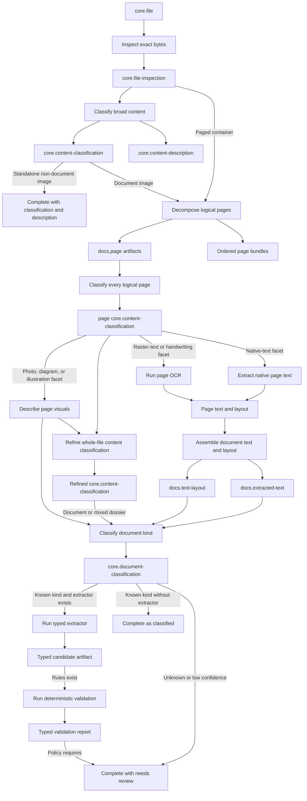
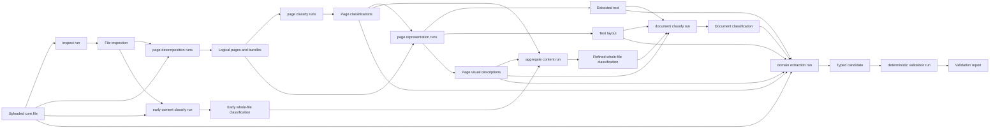
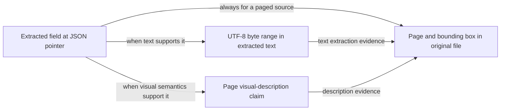
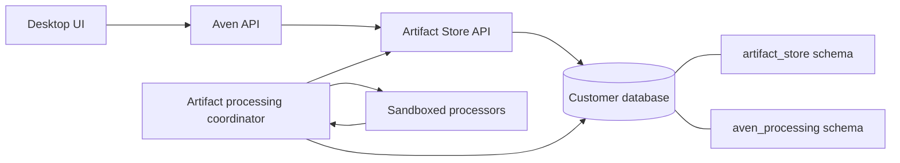
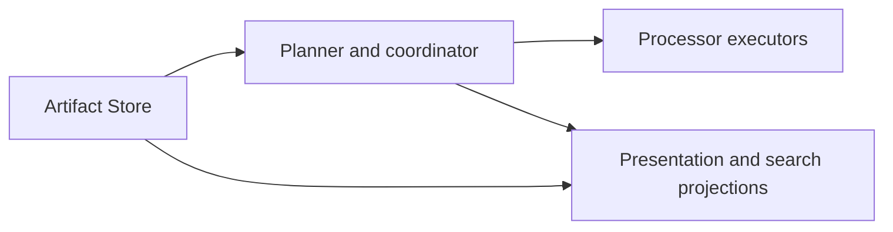
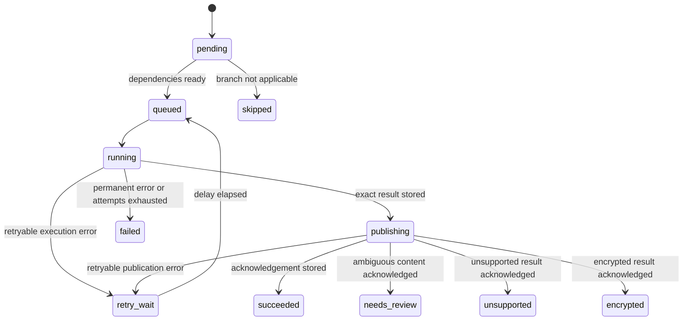

# Artifact understanding and extraction concept

Status: concept; the complete local mock skeleton is implemented and verified

Date: 23 August 2026

Implementation status and remaining production work:
[ARTIFACT-PROCESSING-IMPLEMENTATION-REPORT.md](ARTIFACT-PROCESSING-IMPLEMENTATION-REPORT.md).

## Summary

An uploaded `core.file@1` should become the immutable starting point of an asynchronous,
bounded processing pipeline. The pipeline first establishes what the bytes actually
are, then what kind of content they contain, then extracts a useful representation,
then classifies a document more specifically, and only then invokes a type-specific
extractor.

```text
uploaded file
  -> technical inspection
  -> broad content classification
  -> logical page decomposition and per-page content classification
  -> representation extraction when useful
  -> document classification when it is a document
  -> type-specific extraction when a matching extractor exists
  -> deterministic validation when domain rules exist
  -> human review when confidence or policy requires it
```

Every durable result is a new immutable artifact produced by a recorded production
run. Processing status, retries, leases, progress, and errors are mutable operational
state outside the Artifact Store. A failed or unsupported processor never damages or
hides the uploaded file.

The recommended first implementation is intentionally narrow: PDF, JPEG, and PNG;
logical page decomposition; multi-label page classification; photo-versus-document
classification; native PDF text extraction with OCR fallback; bounded visual page
description; document classification into a small vocabulary; and one invoice
extractor. It uses a small static plan, but the persisted unit of work is already a case
containing versioned, independently retryable steps. This proves the architecture
without building a workflow platform or making a later one impossible.

## Goals

- Turn a successfully uploaded file into increasingly useful, typed artifacts.
- Preserve the exact source bytes and complete derivation lineage.
- Give every extracted field and material summary claim an exact, navigable pointer to
  its supporting location in the original file.
- Let the UI progressively refine one stable file card to the latest trustworthy,
  narrowest whole-file type without losing the original name or artifact identity.
- Treat `unknown`, `unsupported`, `encrypted`, and `needs review` as explicit known
  outcomes rather than ambiguous failures.
- Make every crash window retryable or reconcilable to a known terminal state.
- Keep customer content, processing state, and derived outputs inside that customer's
  database boundary.
- Allow deterministic parsers, OCR engines, vision models, and language models to be
  replaced independently.
- Never let classification or extraction directly authorize an external action.

## Non-goals

- A user-programmable workflow or DAG engine, dynamic procedure marketplace, or visual
  workflow builder. An internal dependency model between processing steps is still
  required so the spike does not encode a linear pipeline into its database schema.
- Supporting every file type in the first release.
- Virus-clean certification, legal-document verification, or bookkeeping correctness.
- Automatically sending messages, making payments, filing documents, or changing
  records based on extracted data.
- Mutating an earlier classification when a better model or a human disagrees.
- Making the Artifact Store itself execute parsers or models.

## Backtest against the existing avenCEO-tools pipeline

This concept was backtested on 23 August 2026 against the implemented document-ingest,
classification, extraction, consistency, review, search, tenancy, and recovery paths in
`/home/daniel/src/jaensen/avenCEO-tools` at commit `002fe9a`. That repository is a real
finance-document workflow, not merely an earlier proposal, so it is useful evidence
about both product behavior and failure modes.

The verdict is that the concept still holds and its architectural boundaries should not
be weakened. The existing implementation contains several good local patterns worth
reusing, but its central mutable document job is not a safe foundation for the broader
artifact-processing system.

| Existing behavior | Lesson for this concept |
| --- | --- |
| Byte-signature media detection before declared type or extension | Reuse the ordering, with bounded parsing and a typed inspection artifact |
| PDF page-count rejection without truncation and restrictive temporary files | Preserve the hard limit and isolation; publish logical pages instead of one in-memory page array |
| Separate strict classification and extraction model calls | Preserve closed, schema-validated calls and the explicit `unknown` result |
| Detailed invoice and statement consistency rules | Add a separate deterministic validation step and immutable evaluation output |
| Optimistic revision checks for human review | Keep mutable preferred pointers as a projection, while publishing review decisions immutably |
| Original-versus-parsed UI and compact kind, party, date, amount, and warning metadata | Preserve these useful views and add progressive states plus exact evidence navigation |
| One whole-document job renders every page and sends all page images together | Reject this scaling and retry boundary; decompose pages and process bounded batches |
| A unique staged-document hash collapses equal-byte uploads | Reject digest-as-occurrence identity; identical bytes may have distinct artifact IDs and provenance |
| Classification, extraction, review, warnings, and status mutate one row | Keep immutable facts, operational execution state, and rebuildable projections separate |
| The classifier returns the extraction tool name | Reject model-controlled routing; the planner maps an accepted kind to source-controlled processors |
| Completion does not fence the worker that owns the lease | Require an attempt fencing token at the outbox commit boundary |
| Text input is silently sliced at 250,000 characters | Never claim completeness after truncation; fail or publish an explicit partial result with omitted ranges |
| Attempts retain raw provider responses, prompts, and errors | Retain only validated typed results, prompt/model identities, bounded receipts, and safe error codes |
| Extracted money is represented with JSON floating-point numbers | Use currency plus integer minor units in new financial contracts |

The older taxonomy also demonstrates that `invoice`, `receipt`, and `statement` alone
are too coarse for useful finance behavior. Credit notes, self-issued receipts
(`Eigenbeleg`), mandates, order confirmations, offers, reminders, and payment receipts
must remain distinguishable. In particular, an offer or reminder can look invoice-like
without being authority to create a payable. Classification therefore informs
presentation and extractor selection only; deterministic policy and human decisions
remain separate.

The existing repository's own
`artifact-store-spec/ARTIFACT-STORE-REPOSITORY-BACKTEST.md` reaches the same storage
conclusion: keep one Artifact Store schema in each customer database, but decompose the
current mutable aggregate rather than renaming its tables. This processing concept
builds on that conclusion and extends it with page identity, field evidence, fenced
publication, and rebuildable presentation.

The implementation evidence reviewed includes
`src/lib/server/ingest/{storage,worker,model,repository}.ts`,
`src/lib/ingest/{contracts,validation,consistency}.ts`, the invoice and statement
consistency modules and tests, the ingest migrations, and the original/parsed document
UI and search-presentation code. No durable logical-page artifact, field-to-source
bounding box, or independently retryable page pipeline exists there today.

As a focused behavioral check, the consistency, document-search-presentation, and
runtime-security suites passed all 36 tests in this environment. The selected ingest
suite did not load because this Bun runtime does not export the repository's expected
`node:process.loadEnvFile`; that is a test-runtime compatibility failure before any
ingest assertion, not evidence for or against the processing design.

## Processing model

### The stages



#### 1. Technical inspection

Inspection uses the bytes, not the filename or client-declared media type, to determine
the container and media type. It performs bounded parsing and records facts such as:

- detected media type and container;
- whether the file is structurally readable;
- page count and dimensions where cheaply available;
- whether a PDF is encrypted;
- whether a PDF has a usable native text layer; and
- a stable outcome such as `ok`, `malformed`, `encrypted`, or `unsupported`.

The uploaded `core.file@1` is never updated. Inspection produces a new
`core.file-inspection@1` artifact. This matters because the currently deployed
`core.file@1` schema contains the original name, declared media type, and source kind,
but deliberately does not claim to know the detected type.

#### 2. Broad content classification

The next question is not yet "is this an invoice?" It is "what kind of content is
this?" A small first vocabulary is enough:

- `document`;
- `image`;
- `text`;
- `structured-data`;
- `audio`;
- `video`;
- `archive`;
- `other`; and
- `unknown`.

For an image, a second value can describe `photo`, `document-scan`, `screenshot`,
`illustration`, `diagram`, `mixed`, or `unknown`. A PDF always enters the paged
inspection path; its container is not enough to decide that every page is a textual
document. An ordinary image enters that path only when it appears to contain a
document.

Deterministic inspection should decide everything it can. A bounded visual classifier
is used only where byte structure is insufficient. The result is a proposed new
`core.content-classification@1` artifact with confidence, alternatives, reason, and
resolution mode.

The same run may also publish a separate `core.content-description@1`: a bounded,
plain-language description and small topic list answering what the image or document
appears to be about. Keeping this separate prevents free-form prose from becoming a
routing contract. A photograph can stop successfully with both its structured
classification and useful description. A document description can be refined later
from extracted text; the later result is another derived artifact, not an edit.

#### 3. Logical page decomposition

Page decomposition is useful enough to include in the first spike. It gives page-level
identity, navigation, evidence, retry, and parallel processing without changing the
whole document's identity.

For every supported paged document, a deterministic splitter publishes one
`docs.page@1` artifact per logical source page. A page artifact has no copied source
blob. Its small payload records at least the one-based source page number, rotation,
and bounded geometry metadata. Text availability, visual kind, OCR state, and other
evolving knowledge are separate derived artifacts or projections. The decomposition
run takes the original `core.file@1` as input, and evidence maps the page artifact root
to the complete corresponding `page-region` in that file.

The ordered pages are grouped using the already registered `core.bundle@1` with a
source-controlled purpose such as `document-pages`. The source file remains the root
occurrence; the bundle is a frozen derived composition, not a replacement document.

The store permits at most 64 artifacts in one publication and `core.bundle@1` permits
at most 64 members. The splitter therefore uses deterministic batches rather than
assuming every document fits one run:

```text
pages 1..32   -> 32 docs.page artifacts + page-batch bundle
pages 33..64 -> 32 docs.page artifacts + page-batch bundle
batch bundles -> one document-pages root bundle
```

Batch size is a processor-contract parameter fixed for a procedure version. Step keys,
publication UUIDs, local keys, and page numbers are assigned deterministically and the
exact publication intents are persisted before publication. A retry cannot create a
second page occurrence for the same planned decomposition.

Each batch is one independently retryable logical step. It publishes its pages and one
leaf bundle atomically. A final assembly step depends on every batch acknowledgement and
publishes the root `document-pages` bundle over the leaf bundles. A failed batch leaves
already acknowledged batches usable and visible with a partial-processing warning; it
cannot produce a falsely complete root bundle.

The spike sets an explicit maximum supported page count. A document over that bound
ends in a known `page-limit-exceeded` outcome; it is never silently truncated. Bounded
hierarchical bundles can raise the limit later without redefining existing pages or
bundles.

`docs.page@1` is a logical slice, not necessarily a rendered image. A processor can
render it temporarily from the original file. If repeated visual processing makes
durable renders worthwhile, a separate `docs.page-render@1` artifact stores a bounded,
normalized image produced from that page. Separating logical pages from renders avoids
making one DPI, color profile, or image encoding part of permanent page identity.

For a single document image, decomposition produces one page. A normal standalone
photograph does not become a document page merely because it can be represented as an
image. A photograph embedded as a PDF page is nevertheless a real logical page and must
be understood as such.

#### 4. Page-level content classification

A logical page is a location, not a promise of text. Every page receives a committed
page-level `core.content-classification@1` result before representation extraction is
considered complete. A PDF can contain a cover photograph, native text, scanned text,
charts, drawings, blank separators, and mixed pages in any order.

The page result is deliberately multi-label. It has one bounded primary kind such as
`document`, `image`, `mixed`, `blank`, or `unknown`, plus zero or more independently
confident facets:

- `native-text`;
- `raster-text`;
- `handwriting`;
- `photograph`;
- `illustration`;
- `diagram`;
- `chart`;
- `table`.

Because `core.content-classification@1` is proposed rather than registered, its first
schema should support these bounded optional facets as well as the primary kind,
confidence, alternatives, reason, and resolution mode. The classified subject remains
an exact production-run input, so the same type can describe a whole file or one
logical page without embedding subject identity in the payload.

These facets describe observed content; they are not commands. The source-controlled
planner maps them to work. A mixed page may therefore run native extraction, targeted
OCR, and visual description in parallel. Treating the categories as mutually exclusive
would lose a caption on a photograph, text inside a diagram, or an embedded product
photo on an invoice.

Cheap deterministic signals come first: native-text presence and coverage, raster and
vector object coverage, page dimensions, and a conservative blank-page check. A
bounded visual classifier resolves what those signals cannot. Every result records
whether it was resolved by rule, model, human, or fallback and carries page-local
evidence. The processor may render a bounded temporary page image, but the render is
not durable identity unless a separate `docs.page-render@1` is intentionally published.

These are semantic boundaries, not a requirement for one model call per artifact. In
the spike, one bounded page-analysis adapter may publish both the page classification
and a visual description when visual inference is needed. Native text extraction and
OCR remain separate retryable capabilities. Visual inference still handles one bounded
page at a time; only deterministic metadata inspection may operate on a page batch.

The early whole-file broad classification remains useful for fast UI feedback and
initial branching, but it is provisional knowledge. Once page classifications and
bounded visual descriptions exist, an aggregation run may publish a newer whole-file
`core.content-classification@1`. This is important for PDFs: the container alone does
not prove that the file is a textual document; it might be a photo collection, slide
deck, technical drawing set, or mixed dossier. The later result does not mutate the
earlier classification.

Aggregation remains bounded. Page-classification outputs are grouped in deterministic
ordered leaf bundles and, when necessary, a hierarchical root bundle using the same
pattern as logical pages. A whole-file refinement consumes the exact root bundle rather
than an unbounded input list. It is published only when every page has a successful
classification, including honest `unknown` results. If a page classifier exhausts its
retries, the UI retains the early whole-file classification, exposes all successful
page results, and shows the known page failure; it does not publish a falsely complete
aggregate.

For a one-page document image, the planner may reuse compatible facts from the initial
whole-image classification rather than repeat an expensive model call. It must still
publish or bind a page-level result to the exact `docs.page@1` input so page lineage and
presentation remain uniform.

The spike does not need to turn every photograph, chart, or text block into another
artifact. Page identity plus multi-label facets and precise evidence regions are enough
for routing and presentation. Reusable region or figure artifacts can be added later
when a concrete consumer needs independent identity; this avoids premature recursive
decomposition.

#### 5. Representation extraction

Document classification and domain extraction should consume every useful bounded
representation, not assume that text is the only information on a page and not
repeatedly parse the original file.

- For a digital PDF, extract its native text first.
- For a scanned PDF or document image, run OCR.
- For a hybrid PDF, retain native text and OCR only pages or regions that need it.
- For photographs, diagrams, charts, and illustrations, publish a bounded page-level
  `core.content-description@1` with page-region evidence.
- For a mixed page, preserve both its text/layout and visual description; neither is a
  substitute for the other.
- Preserve page boundaries and a coordinate mapping so later field evidence can point
  back to text ranges or page regions.
- Bound page count, rendered pixels, output characters, runtime, and memory.
- Never silently slice text or omit pages. A bounded partial result must identify every
  omitted page or range and declare itself incomplete; otherwise the step fails with a
  stable limit outcome.

The current catalog proposes `ocr.text@1`, but that name and schema only describe OCR.
It cannot honestly represent native or hybrid PDF extraction. Because it is not among
the types registered by the deployed Artifact Store, the contract can still be fixed
without an immutable migration. The recommendation is to replace it before
registration with `docs.extracted-text@1`, whose required blob contains normalized
UTF-8 text and whose payload records `native`, `ocr`, or `hybrid`, language, page count,
character count, and coordinate space. Exact engine and implementation identity belong
in the production-run receipt.

The same extraction publication should produce a sibling `docs.text-layout@1` artifact
whose bounded blob maps UTF-8 byte spans in the text artifact to one-based pages and
normalized bounding boxes in the source. The layout artifact structurally identifies
the exact text artifact it describes. Keeping the layout as a sibling avoids bloating
the text payload and ensures the map survives worker restarts, reprocessing, and later
domain extraction.

Page artifacts and page classifications make representation extraction naturally
incremental. Native extraction, OCR, and visual description can run per page, retry
only the failed branch, and publish page-level results. A bounded assembly step then
creates the document-level `docs.extracted-text@1` and
`docs.text-layout@1` views consumed by whole-document classification and extraction.
Page-level results retain evidence directly to their source page.

Document text assembly never invents text for visual-only or blank pages. Its assembly
result records every page: text artifact IDs where present and explicit
`no-text`, `failed`, or `omitted-by-limit` outcomes otherwise. Whole-document
classification consumes this coverage map plus the page classifications and bounded
visual descriptions, so a photograph-only page cannot disappear merely because it
contributed no OCR text.

#### 6. Document classification

Once the available page text, classifications, and visual descriptions exist, classify
the document with a small, versioned, layered vocabulary. The classification artifact
stores the accepted leaf in its existing `resolvedKind`; the snapshotted taxonomy maps
that leaf to a broad family for routing and presentation. This keeps routing simple
while preserving the narrowest useful whole-document meaning. The initial families and
useful leaves are:

| Family | Initial leaf kinds |
| --- | --- |
| `invoice-family` | `invoice`, `credit-note`, `receipt`, `self-issued-receipt`, `mandate`, `order-confirmation`, `offer`, `reminder` |
| `statement-family` | `bank-statement`, `payment-receipt` |
| `correspondence` | `letter` |
| `agreement` | `contract` |
| Fallback | `other-document`, `unknown` |

This is not a complete universal taxonomy. It preserves distinctions already proven
useful by the finance workflow while allowing the first UI and router to operate on a
few families. A new leaf kind is a taxonomy/policy version change, not an edit to old
classification artifacts.

The existing planned `core.document-classification@1` shape is a good fit. It already
supports raw and resolved kinds, confidence, alternatives, a reason, and the explicit
`unknown` result. The taxonomy, thresholds, prompt, model, and implementation version
are recorded in run parameters and implementation metadata; they are not hidden global
configuration.

Classification is a claim, not truth. A human correction publishes a new decision or
classification artifact and can trigger a new extraction run. It never edits or
deletes the model's earlier result.

#### 7. Type-specific extraction

A source-controlled router maps an accepted resolved document family or leaf kind to an
extractor. The classifier returns kinds and evidence only; it never returns a procedure
name. Do not add a dynamic workflow registry for the first release.

| Document kind | First useful output |
| --- | --- |
| `invoice` | `bookkeeping.invoice-candidate@1` |
| `bank-statement` | `banking.statement@1` and transaction candidates |
| `contract` | `contracts.contract@1` candidate |
| `receipt` | a new `bookkeeping.receipt-candidate@1` |
| `letter` | a new `docs.letter-facts@1` or an `intent.declaration@1` |

Outputs should be named as candidates wherever correctness still requires validation.
Each meaningful field should carry evidence into the source text or page region. For
example, invoice number, supplier, total, currency, due date, and each tax line should
be traceable to the exact input location.

Financial amounts in new contracts use an ISO currency plus integer minor units. They
must not use binary floating-point JSON numbers for authoritative arithmetic. Unknown
or absent values remain explicitly null or absent according to the type contract; an
extractor must not guess merely to satisfy a required field.

If a document is confidently classified but no extractor exists, processing completes
successfully with `classified-no-extractor`. Classification itself is already useful.

#### 8. Deterministic validation and review

Schema validation proves only that an extractor returned the expected shape. When
domain rules exist, a separate deterministic processor consumes the typed candidate and
publishes a versioned validation report. It does not rewrite, repair, or silently lower
the values that were extracted.

The finance implementation provides a useful minimal result vocabulary:

- `PASS` when a rule was evaluated and satisfied;
- `FAIL` when it was evaluated and contradicted;
- `UNKNOWN` when required operands were missing or the rule was not evaluable.

Each check records a stable rule ID and ruleset version, severity, affected JSON
pointers, bounded operands, tolerance where relevant, and a safe explanation. The
report records coverage separately from consistency so that many unavailable operands
cannot accidentally produce a high score. Candidate confidence, validation outcome,
and human acceptance remain distinct signals.

For the first invoice slice this may be
`bookkeeping.invoice-validation@1`; a more generic validation-report type should be
introduced only when at least two domains have genuinely compatible semantics. Offers,
order confirmations, and reminders must produce an explicit evidence-only policy result
and never become payables merely because they share an invoice extractor.

A human correction or review publishes an immutable decision artifact referring to the
exact candidate and validation report. In the same transaction, the application may
advance a mutable preferred-result pointer using an expected projection revision. A
stale reviewer receives a conflict and cannot overwrite a newer decision.

## Artifact lineage

The Artifact Store's existing production-run model is the authority for derivation:



Every run records:

- exact input artifact IDs and roles;
- procedure key and version;
- initiator and executor;
- bounded parameters;
- implementation identity, including model or engine version and prompt digest;
- a receipt containing timings and safe outcome metadata; and
- output-to-input evidence where applicable.

This provides a clean answer to "where did this value come from?" and permits a newer
processor to publish a better result without changing history.

### Evidence must resolve to the original file

Evidence is a required product feature, not optional debugging metadata. A user must be
able to select an extracted value and see the exact place in the uploaded document that
supports it.

The implemented Artifact Store contract already has four immutable locator kinds:

| Locator | Meaning | Primary use here |
| --- | --- | --- |
| `artifact-root` | The complete artifact | Whole-image or whole-document classification |
| `json-pointer` | RFC 6901 path into an artifact payload | The output field being supported, such as `/invoiceNumber` |
| `byte-range` | Half-open `[start, endExclusive)` UTF-8 byte offsets in a primary blob | Exact span in extracted text or an original text file |
| `page-region` | One-based page plus normalized integer bounding box | Exact area in the original PDF or image |

`page-region` coordinates are millionths of page width and height. For example, the
whole first page is page `1` with `x=0`, `y=0`, `width=1000000`, and
`height=1000000`. This avoids floating-point and rendering-size differences. A plain
image is treated as a one-page document for this purpose.

The draft artifact-type catalog currently mentions a Unicode-code-point
`text-range`. That locator is not present in the implemented version-1 kernel. The
processing contract should use the normative UTF-8 `byte-range` now and correct the
catalog before registering the generalized extracted-text type. Adding a genuinely
different locator later requires a new command/profile version rather than silently
changing offset semantics.

#### Required evidence chain

Each `docs.page@1` root is grounded directly in the corresponding whole-page
`page-region` of the original `core.file@1`. Page-local runs can take that page artifact
as their semantic input, while their evidence still resolves through the decomposition
run—or directly through an additional original-file input—to the uploaded bytes.

Text extraction must publish both `docs.extracted-text@1` and its exact
`docs.text-layout@1` sibling. The layout maps bounded UTF-8 byte spans to page regions.
For meaningful produced spans, the extraction run can therefore publish evidence from
a `byte-range` in the text output back to a `page-region` in the original
`core.file@1`.

Each material page-description claim points directly to the supporting `page-region` in
the original file. Page classification may cite the whole page for a primary kind, but
individual facets should use tighter regions when the classifier can support them
reliably.

Domain extraction must include the original file and every exact representation it
actually used—text, text layout, page classification, or page visual description—as
explicit run inputs. For each material output field it publishes:

1. an output `json-pointer` identifying the extracted field;
2. at least one direct locator in the original input, normally a `page-region`; and
3. when extracted text supports the field, an additional input `byte-range` identifying
   the exact text plus the layout evidence that maps it back to the original page.

Multiple pieces of evidence may support one field. For example, an invoice total may
point to both the total label and amount, while a summary sentence may point to several
regions. Evidence order is stable and retained with the production run.



The direct original-file pointer is required for values displayed as extracted facts;
text is not required when the fact is genuinely visual. The text and description hops
remain useful for copying, search, and auditing the extractor. If an engine cannot
produce reliable geometry, the value is marked `ungrounded` and the UI must say so; it
must not show the value with the same confidence treatment as grounded data.

Classification and descriptions follow the same rule at an appropriate granularity:

- photo-versus-document classification may cite the whole image;
- document-kind classification should cite decisive page regions or text ranges;
- each short-summary claim should cite one or more supporting ranges or regions; and
- a whole-document synthesized judgment may use `artifact-root`, visibly labelled as
  whole-document evidence rather than pretending to have a precise quote.

Evidence locators live in the Artifact Store evidence relation, not embedded ad hoc in
candidate payloads. This keeps domain schemas clean and lets the Aven API resolve a
consistent provenance envelope for every artifact type.

## Runtime architecture and boundaries

Processing should be a separate service, not part of the Artifact Store kernel and not
a background loop inside the web-serving Aven API process.



### Existing-system interaction points

- **Desktop app:** upload remains unchanged. After commit, the attachment card can
  display a separate processing state and later link derived artifact IDs.
- **Aven API:** remains the authenticated user-facing boundary. It exposes sanitized
  processing status and explicit retry or review commands, but does not stream source
  bytes through the webview.
- **Artifact Store:** stores source bytes, derived artifacts, production runs, evidence,
  and publication history. It does not schedule work or run untrusted parsers.
- **Environment provisioner:** creates and grants an `aven_processing` schema alongside
  `artifact_store` in each customer database.
- **Processing coordinator:** discovers files, owns leases and the durable publication
  outbox, invokes processors, validates their closed outputs, and is the sole publisher
  of processing results.
- **Sandboxed processors:** receive only the bounded input needed for one attempt. They
  have no Artifact Store credential, customer-database credential, user session, or
  authority to perform external actions.

The coordinator can be packaged as another entry point from the Aven API service image,
similar operationally to the existing email and environment workers. It should still
run as its own Compose service and process. CPU-heavy or less trusted parsers run in a
separate process or container behind a narrow interface.

## Evolutionary architecture

The spike should be small in supported behavior, not accidental in its boundaries. The
following contracts are worth establishing now because they remain useful when the
system later processes long documents, spreadsheets, email containers, audio, video,
archives, or domain-specific material.

### Four layers that must remain separate



1. **Artifact Store:** immutable bytes, typed results, production runs, evidence, and
   ordered publication history. It knows nothing about queues or which processor should
   run next.
2. **Planner and coordinator:** policy, dependency planning, leases, attempts, durable
   outbox, publication, and reconciliation. It never interprets document contents
   itself.
3. **Processor executors:** bounded technical capabilities such as sniffing, rendering,
   OCR, classification, or invoice extraction. They do not schedule follow-up work or
   publish artifacts.
4. **Projections:** preferred UI presentation, warnings, evidence navigation, search,
   and later embeddings. Every projection is rebuildable from authoritative artifacts
   plus explicitly retained operational state.

Keeping these four layers separate is more important than deciding whether the first
executor is Rust, TypeScript, Python, a local model, or a remote provider.

### Versioned processor descriptors

Every processor is selected through a source-controlled descriptor, even if the first
implementation is just a function in the coordinator repository. A descriptor declares:

- stable procedure key and procedure-contract version;
- named input roles and allowed exact artifact type versions;
- named output roles and exact artifact type versions;
- parameter, implementation, receipt, and output schema digests;
- required evidence coverage;
- resource class and hard input/output limits;
- privacy capability such as `local-only` or `remote-content`; and
- whether the processor is deterministic, stochastic, or externally dependent.

The spike loads this catalog from source. A server-side procedure registry can be added
later if independently deployed producers need runtime discovery. Existing production
runs keep their exact procedure version and do not depend on the current catalog.

### A small planner behind a stable interface

The planner receives the exact source artifact, current committed knowledge, plan key,
plan version, and policy snapshot. It returns the bounded desired set of logical steps
and dependencies for that point in the case. It does not execute them.

For the spike, the plan is source-controlled and almost linear:

```text
inspect -> broad classification
inspect -> page batches for paged containers
page batch acknowledgement -> classification of every logical page
broad document-image classification -> one logical page -> page classification
```

The planner runs level-triggered when a case is created and after an acknowledgement or
human decision changes committed knowledge. It inserts missing steps by stable semantic
key and never deletes or rewrites a started step. This avoids inventing a condition
expression language: after a page classification commits, ordinary planner code adds
the text, OCR, and visual branches implied by its committed facets; after a standalone
`photo` commits, it records that the document branch is not applicable. Replaying the
same knowledge produces no new rows.

Later plan versions can add text extraction, document classification, summary, and
invoice extraction. Still later they can fan out pages, run table and entity extraction
in parallel, or pause one branch for review. Those changes create new plan versions and
new processing cases; they do not reinterpret earlier cases.

The plan representation needs only:

```text
plan key and version
source artifact ID
step key
procedure descriptor digest
input bindings
dependency step keys
policy artifact or policy digest
resource class
```

This is an internal execution plan, not a user-authored workflow language. No loops,
expressions, arbitrary code, or dynamic network destinations are needed.

### Case, step, attempt, and publication are different identities

Do not model the entire future pipeline as one job row with a mutable `stage` string.
Persist these concepts separately:

| Concept | Stable identity | Meaning |
| --- | --- | --- |
| Processing case | case UUID plus unique trigger key | One requested plan/policy interpretation of one occurrence |
| Logical step | case + stable step key | One semantic procedure application in the plan |
| Attempt | step + attempt number | One lease-bound execution that may fail or repeat |
| Publication intent | stable publication UUID + exact bytes | The immutable result waiting for acknowledgement |

Automatic discovery uses a trigger key derived from source artifact, plan key/version,
and policy identity, making it idempotent. A deliberate reprocessing request receives a
new trigger key and case UUID, so it can coexist with history without weakening retry
identity.

The minimal per-customer schema therefore has:

- `processing_cases` for source, plan, aggregate state, and policy identity;
- `processing_steps` for logical work, dependency readiness, and terminal outcome;
- `processing_step_dependencies` for explicit edges;
- `processing_attempts` for leases, timings, executor identity, and safe errors;
- `processing_outbox` for exact generated bytes and Artifact Store intent;
- `processing_acknowledgements` for verified publication results; and
- `processing_feed_cursors` for epoch-aware discovery.

This is a few boring relational tables, not a workflow engine. In Slice 1 each case has
only inspection, broad-classification, and applicable page-decomposition steps. The
separation prevents later parallelism, partial retry, or human review from requiring a
destructive migration of one overloaded jobs table.

### Narrow executor protocol

The coordinator invokes every processor through the same versioned request/response
envelope. The transport may initially be an in-process adapter and later become local
IPC, a subprocess, or a private service without changing the semantic contract.

A request contains only:

- case, step, and attempt IDs plus an opaque attempt fencing token;
- procedure key/version and descriptor digest;
- exact input artifact IDs, type versions, digests, and read-only materializations;
- bounded parameters and policy identity;
- required output and evidence contracts; and
- deadline and resource limits.

A response contains either a closed success result or a typed safe failure. Success
contains candidate output payloads/blobs, implementation receipt, and evidence
locators. It cannot select database, scope, artifact IDs, publication IDs, credentials,
follow-up processors, or external actions. The coordinator validates the response and
assigns all store identity.

Provider envelopes, chain-of-thought-like content, full prompts, and arbitrary raw
responses are not stored as attempt history. The durable record contains the validated
typed result, source-controlled prompt identity or digest, model/engine identity,
bounded token/cost/timing metadata, and a safe error code. A deliberately retained
customer-visible explanation must itself pass a bounded schema and content policy.

Use JSON Schema plus golden protocol fixtures at this boundary so executors can later
be implemented in different languages without sharing coordinator internals.

### Whole files and decomposition

The source `core.file@1` always remains the root occurrence shown in the main UI. The
initial page splitter produces bounded batches of `docs.page@1` artifacts and groups
them with `core.bundle@1`. The same pattern can later produce attachment, sheet,
section, table, or media-segment artifacts. Production runs record derivation from the
original file; bundle membership records frozen composition.

Derived parts get their own processing cases when useful, but their classifications do
not silently replace the whole-file presentation. The UI can drill into them beneath
the root card. The page splitter already uses bounded hierarchical bundles when the
current `core.bundle@1` limit of 64 members is exceeded. A later domain-specific bundle
type can add stronger semantics without changing existing bundle meaning.

### Version axes stay explicit

The system will evolve along several independent axes. Do not collapse them into one
application version:

| Version | Changes when |
| --- | --- |
| Artifact type version | Typed content contract changes |
| Procedure-contract version | Input/output/evidence semantics change |
| Implementation identity | Code, engine, model, or prompt changes |
| Plan version | Step selection or dependencies change |
| Policy identity | Taxonomy, thresholds, privacy, or routing policy changes |
| Projection version | Preferred presentation or search mapping changes |

A retry keeps every semantic version fixed. Deliberate reprocessing creates a new case
under a new trigger identity and publishes new immutable runs and outputs.

### Scaling seams without premature infrastructure

- PostgreSQL leasing is sufficient initially; queue transport can change later because
  the database case/step state remains authoritative.
- Polling the Artifact Store feed is sufficient initially; notifications may reduce
  latency later but never replace epoch-aware replay.
- One coordinator instance is sufficient initially; leases and unique semantic keys
  allow horizontal replicas later.
- One executor process is sufficient initially; resource classes allow CPU, GPU, local,
  and remote pools later.
- Static per-tenant concurrency limits are sufficient initially; fair scheduling and
  cost budgets can be added without changing processor or artifact contracts.
- Source-controlled descriptors are sufficient initially; runtime discovery remains an
  extension, not a prerequisite.

The intended growth paths then have an explicit home:

| Later capability | Existing seam |
| --- | --- |
| More file and document types | New versioned artifact types and processor descriptors |
| Sheet, attachment, section, or media splitting | The page-splitter pattern, multi-output runs, and `core.bundle` |
| Several extractors in parallel | Independent ready steps and resource classes |
| Human correction or approval | Decision artifact followed by level-triggered replanning |
| Better models or prompts | New implementation identity and deliberate reprocessing case |
| OCR, CPU, and GPU worker pools | Same executor envelope routed by resource class |
| Search and embeddings | Independent feed-driven projection |
| Runtime processor discovery | Procedure-contract registry extension |
| Very large generated blobs | Artifact Store blob-backend extension |
| Retention, restriction, and erasure | Content-lifecycle extension plus processing-schema cleanup |

Processing introduces temporary copies and possibly external-provider disclosure, so a
content-lifecycle policy must eventually cover outbox bytes, executor workspaces,
provider retention, projections, backups, and logs as well as Artifact Store content.
That policy remains outside artifact identity, but the tenant-local schema and explicit
executor boundary give it concrete places to enforce restriction and cleanup.

### Anti-dead-end rules

The spike must not:

- mutate `core.file@1` with the latest type, summary, or processing status;
- store the preferred UI representation as authoritative artifact content;
- encode all stages and attempts in one mutable row;
- make database stage names a closed enum that requires a migration for each processor;
- let an executor publish directly or choose follow-up work;
- accept an executor result after its attempt lease or fencing token is no longer
  current;
- assume every logical page is text-only or force a mixed page into one exclusive
  processing branch;
- let the UI infer precedence or evidence by walking arbitrary lineage itself;
- bind processor contracts to one model vendor, runtime language, or queue product;
- use blob digest as occurrence, case, or cross-customer cache identity;
- put extracted business data into logs, metrics, or the central control database; or
- rely on a best-effort upload callback without feed reconciliation.

## Reliable scheduling without a workflow engine

Use the source-controlled planner to create a processing case with a small set of
logical steps. The coordinator claims only steps whose declared dependencies have
reached the required outcome. The first version does not execute arbitrary graphs, but
its persistence model does not assume there can only ever be one linear stage.

### Discovery

The coordinator consumes the Artifact Store publication feed for each ready customer
scope and filters for new root `core.file@1` occurrences. In one customer-database
transaction it:

1. inserts an idempotent processing case keyed by scope, source artifact, and plan
   key/version;
2. persists the planner's logical steps and dependency edges; and
3. advances that scope's durable feed cursor.

If it crashes before the transaction, the feed item is read again. If it crashes after
the transaction, the case, steps, and cursor all exist. The unique key turns replay
into a no-op. No upload-to-queue dual-write is required.

The same level-triggered discovery runs at startup and periodically. A temporary worker
outage therefore delays processing but cannot permanently lose an uploaded file.

### Step and case state



Logical steps use the state machine above. Lease owner, lease expiry, heartbeat,
attempt number, timings, executor identity, and safe errors belong to separate attempt
rows. Expired attempts make their step eligible for another attempt. Errors containing
document text, model prompts, credentials, or raw provider responses are never placed
in logs, attempt rows, or the central control database.

Claiming an attempt creates an unpredictable fencing token and a bounded lease. A
running executor must heartbeat before expiry, but heartbeat is only liveness, not
publication authority. The transaction that writes the durable outbox verifies that
the attempt is still the step's active attempt, the token matches, the lease has not
expired, and the step is still `running`. A late response from an expired or superseded
attempt is rejected without changing the step. This prevents two workers from
publishing different valid-looking results after lease recovery.

The case state is a deterministic aggregate over its steps: active while any required
step can converge, `needs_review` when a required branch awaits a person, successful
when every applicable branch has a known successful or intentional-stop outcome, and
failed only when a required branch has a terminal failure. An unsupported optional
branch does not erase successful knowledge produced by earlier steps.

Processor execution is at least once: a crash after a remote model answered but before
the output transaction committed can repeat that call and its cost. Publication is
idempotent: once exact output reaches the outbox, every retry publishes the same intent
under the same UUID. This is the smallest honest guarantee without making an external
model call transactional.

Suggested terminal outcomes include:

| State | Meaning | Retry automatically? |
| --- | --- | --- |
| `succeeded` | The logical step reached durable acknowledgement | No |
| `skipped` | Planner established that this branch does not apply | No |
| `needs_review` | A valid result exists but policy confidence was not met | No |
| `unsupported` | The media/container is outside the current supported set | No |
| `encrypted` | Content needs a user-supplied password or replacement file | No |
| `failed` | A permanent error occurred or bounded retries were exhausted | No |

`unknown` is normally a successful classification value and may lead to
`needs_review`; it is not a processor crash.

### Durable output and publication

Processors do not publish directly. After successful execution, the coordinator stores
the exact validated output, generated blob bytes, production-run intent, and stable
publication UUID in a durable outbox inside the customer's `aven_processing` schema.
That fenced transaction also advances the logical step to `publishing`.

The publisher then:

1. obtains fresh upload claims for generated blobs;
2. submits the exact stored immutable publication intent;
3. verifies the Artifact Store response; and
4. stores the compact acknowledgement before marking the logical step successful.

An expiring upload claim is transfer authority and never becomes the durable outbox.
Publication retries use the same publication UUID and exact intent. A replay returns
the same result; a conflict is terminal drift requiring investigation.

Temporary generated bytes can be removed from the processing schema only after the
acknowledgement is durable and the Artifact Store can serve the corresponding artifact.
When acknowledgement is stored, the coordinator resolves newly satisfied dependency
edges and makes their steps eligible. Processors never perform this scheduling.

### Reconciliation

At startup and periodically, the coordinator checks:

- publication-feed cursors and undiscovered source files;
- cases whose persisted plan or policy identity is missing or invalid;
- steps that became dependency-ready but were not queued;
- expired attempts and leases;
- `publishing` outbox entries without acknowledgements;
- acknowledged publications whose step or case projection is not terminal;
- terminal-success steps whose expected output acknowledgement is absent; and
- steps stuck beyond their deadline.

Each case, step, attempt, and publication is thereby classified as queued, actively
converging, retryable, successfully complete, a known user decision, a known
unsupported case, or terminally failed. Health reports aggregate counts and oldest age
without exposing customer identifiers or content.

The feed checkpoint includes the Artifact Store epoch as well as its sequence. An
unexpected epoch change fences processing for that scope and enters an explicit
`reconciliation-required` state. The coordinator must use the store's recovery or
snapshot/bootstrap contract to enumerate retained source artifacts and recreate
idempotent cases and steps before accepting a cursor in the new epoch. It must never silently
restart from sequence zero and call that healthy.

Suspension stops new claims and publication. An already-running sandbox may finish, but
its result remains unpublished until the customer environment is ready again or is
discarded by policy. Lease recovery must therefore distinguish suspension from worker
failure and avoid burning retry attempts while access is intentionally fenced.

Two uploads with identical bytes remain two `core.file@1` occurrences and receive
occurrence-specific lineage. A future same-scope processing cache may reuse computation
only under a procedure-specific equivalence contract; it still publishes a new output
occurrence and run bound to the current source. Cross-customer cache hits are forbidden.

## Confidence and routing policy

Do not bury thresholds in model prompts. The processing version must snapshot:

- the allowed taxonomy;
- confidence thresholds;
- whether visual evidence is required;
- the below-threshold action;
- extractor routing; and
- model and prompt identities.

A simple initial policy is:

1. High-confidence broad classification follows the matching branch.
2. Low-confidence broad classification ends as `unknown` and `needs_review`.
3. A known document kind runs an extractor only above its configured threshold.
4. A classifier may not select a processor or high-impact action. The
   source-controlled planner maps an accepted family or kind to an extractor.
5. Extracted data remains a candidate until deterministic checks and downstream policy
   or a human accepts it.

The exact numeric thresholds should be calibrated against a representative test corpus,
not guessed in this document.

## Security and privacy

### Untrusted-file handling

- Never trust filename extensions, declared media types, PDF metadata, or embedded
  instructions.
- Never execute macros, JavaScript, attachments, fonts, binaries, or active PDF content.
- Run parsers with memory, CPU, wall-clock, page-count, recursion, decompression, and
  rendered-pixel limits.
- Do not recursively unpack archives in the first release.
- Treat malformed files, decompression bombs, oversized images, and parser crashes as
  bounded outcomes.
- Keep parser processes isolated and disposable; a parser crash must not crash the
  coordinator or Artifact Store.

Malware scanning can be added as a dedicated inspection stage, but a negative scan is
not proof that a file is safe to execute. avenOS should continue treating stored files
as passive bytes.

### Model isolation

Document text is untrusted data, including text that says "ignore previous
instructions" or asks the model to call a tool. Classifier and extractor invocations:

- have no tool or action capability;
- use closed, schema-validated outputs;
- receive only the pages or text required by the stage;
- have strict token, output, and time limits;
- cannot choose URLs, credentials, databases, scopes, or publisher identities; and
- cannot turn extracted text into system instructions.

If a remote model provider is used, provider choice must be an explicit deployment and
privacy-policy decision. Raw customer content must not silently leave the deployment.
Retention, training, region, encryption, and deletion guarantees need to be known before
enabling that adapter. A local adapter remains possible behind the same interface.

### Tenant and authority boundaries

- Database name and scope are resolved from the provisioned customer environment, never
  supplied by a processor or desktop request.
- Processing cases, steps, attempts, outbox payloads, and temporary generated bytes live
  in the same customer database as the source artifacts.
- The coordinator receives a distinct internal identity and only the read/publish
  operations it needs.
- Sandboxed processors receive no store or database credentials.
- Suspension fences new processing and publication in the same way it fences uploads.
- Logs and metrics contain IDs, stage names, timings, sizes, and safe error codes, not
  source content or extracted fields.

## User experience

### Progressive whole-file presentation

The uploaded file keeps one stable card and source artifact ID. Its presentation is a
mutable projection over immutable results and becomes more specific as trustworthy
knowledge arrives:

```text
generic file
  -> PDF
  -> scanned document
  -> invoice
  -> invoice with summary, total, supplier, and due date
```

The displayed primary type describes the whole uploaded file. `Invoice` is therefore a
valid final primary type even after the invoice is decomposed into supplier, amount,
tax lines, line items, and payment details. Those narrower values enrich the invoice
card; they do not replace its primary type. The same rule keeps a bank statement a
`Bank statement` after transaction artifacts are produced.

Example presentations are:

| Latest trustworthy knowledge | Primary card | Enrichment |
| --- | --- | --- |
| Upload only | File | Original name and size |
| Header inspection | PDF document | Media type and page count |
| Page decomposition | PDF document | Ordered page rail with per-page processing state |
| Page classification | PDF document | Per-page text, photo, diagram, table, or mixed indicators |
| Broad visual classification | Document scan | Language or text availability |
| Document classification | Invoice | Classification confidence |
| Domain extraction | Invoice | Short summary, supplier, total, currency, due date |
| Image classification | Photo | Short visual description and topics |

The projection resolver is deterministic and versioned. It applies these rules:

1. Consider only committed results derived from the exact source artifact.
2. Exclude failed, superseded, below-policy, or schema-invalid results.
3. Prefer an accepted human correction over model or rule classifications.
4. Otherwise choose the highest-specificity classification that describes the whole
   file and meets its snapshotted confidence policy.
5. Within the same specificity, prefer the latest accepted pipeline/run version by
   committed sequence, not wall-clock arrival time.
6. Treat domain extraction as enrichment unless it produces a more specific
   whole-file classification.
7. Always retain the original filename and source artifact ID in the presentation.

This is "latest and narrowest" without assuming that knowledge can only move forward.
A later human correction can change `Invoice` to `Contract`, and invalidating a bad
classification can deliberately fall back to the last trustworthy `Document` view.
The preferred presentation is a rebuildable projection, never a mutable field on the
source artifact.

Once page bundles are acknowledged, the card can expose an ordered page rail. Selecting
a logical page opens that page in the original file; a durable page render is not
required. Page-level classification, OCR state, warnings, and extracted facts appear
under the page while the primary card continues to describe the whole document.

### Graceful degradation and warnings

Processing state is separate from presentation state. A stage failure preserves the
last presentable form and adds a warning triangle:

| Failure | Card remains | Warning example |
| --- | --- | --- |
| Header inspection failed | File | `The file type could not be verified` |
| One page batch failed | PDF document with available pages | `Some pages are not ready` |
| One page classification failed | PDF document with classified pages | `One page could not be understood` |
| OCR failed after broad classification | Document scan | `Text extraction failed` |
| Page visual description failed | Document with classified page | `Visual details could not be described` |
| Document classifier failed | Document | `The document type could not be determined` |
| Invoice extractor failed | Invoice | `Invoice details could not be extracted` |
| Some fields lack source geometry | Invoice with grounded fields | `Some values have no precise source location` |

Hovering or focusing the warning shows a safe, human-readable reason and whether retry
is available. It does not reveal stack traces, provider responses, local paths, or
credentials. Multiple failures can be shown as one icon with a short ordered list.
When a later retry succeeds, the active warning clears while operational history remains
available to operators.

An `Ask Aven` action can open the normal chat with the source artifact ID, last known
presentation, failed stage, and safe reason already referenced. It does not
automatically invoke the model and does not feed it raw internal errors. The assistant
may explain the state, suggest a retry or replacement file, and use already committed
artifacts; it must not invent missing extracted data.

For a photo, `Photo detected` with a description is a successful endpoint. For an
unsupported file, `Uploaded safely; automatic processing is not available for this
file type` is clearer than a generic failure. For an encrypted PDF, the user can later
provide a password through an explicit short-lived flow; passwords must never enter
artifact payloads, processing rows, model context, or logs.

### Evidence interaction

Every presented extracted value exposes its provenance:

- hovering a value previews page number and source excerpt;
- selecting it opens the original document at the page and highlights the bounding
  box;
- text-only sources scroll to and select the exact UTF-8 byte range through a decoded
  offset map;
- summaries expose evidence per sentence or claim, not one misleading pointer for all
  prose; and
- whole-document evidence is explicitly labelled as such.

The UI never accepts arbitrary coordinates from model text. Aven API resolves and
validates Artifact Store evidence into a bounded presentation envelope containing the
source artifact ID, locator kind, page/offset coordinates, optional safe excerpt, and
the evidence path through intermediate artifacts. Missing or unauthorized evidence
fails closed and produces an `Evidence unavailable` warning rather than a broken link.

The existing upload card should not imply that processing is part of upload atomicity.
The UI obtains presentation, warnings, and evidence from the Aven API projection, not
by interpreting worker logs. A minimal response contains:

- source artifact ID and original name;
- projection and pipeline versions;
- preferred whole-file type, icon, label, confidence, and producing artifact ID;
- short summary and bounded important metadata with evidence envelopes;
- current processing stage and state;
- safe warning code, message, and retryability;
- derived artifact IDs; and
- whether user review is required.

## Minimal implementation sequence

### Slice 1: reliable walking skeleton

1. Freeze a minimal processor descriptor and executor envelope with JSON Schemas and
   cross-language golden fixtures.
2. Add the per-customer `aven_processing` case, step, dependency, attempt, cursor,
   outbox, and acknowledgement tables through environment provisioning.
3. Add the static Slice 1 planner. It creates inspection, broad-classification,
   applicable page-batch, page-bundle assembly, and per-page-classification steps using
   the same persisted plan contract later versions will use.
4. Add one processing-coordinator service with dependency readiness, leases, startup
   reconciliation, health, and Artifact Store feed consumption.
5. Register `core.file-inspection@1`, `docs.page@1`,
   `core.content-classification@1`, and the optional `core.content-description@1`
   output. Freeze bounded page facets in the content-classification schema. Reuse the
   registered `core.bundle@1` for bounded ordered page composition.
6. Inspect PDF, JPEG, and PNG safely and publish an inspection run through an adapter
   implementing the executor contract.
7. Add deterministic page-batch and root-bundle processors with exact whole-page
   evidence and explicit page-count limits.
8. Add a classifier adapter that publishes an early whole-file classification and one
   multi-label classification for every logical page, using deterministic page signals
   before visual inference. Aggregate terminal page results into a refined whole-file
   classification with explicit coverage.
9. Add the deterministic preferred-presentation projection with last-presentable
   fallback and safe warnings.
10. Expose read-only processing status and evidence through Aven API and update the
   existing upload card progressively.

This slice proves discovery, isolation, bounded fan-out, partial retry, atomic batch
publication, replay, and UI convergence before OCR or a domain model is introduced.

### Slice 2: reusable document text

1. Finalize and register `docs.extracted-text@1` instead of the current narrow
   `ocr.text@1` proposal.
2. Define and register its sibling `docs.text-layout@1` span-to-page geometry contract.
3. Route from committed page facets: extract native text, use OCR for raster text or
   handwriting, and create a bounded visual description for photographs, diagrams,
   charts, and illustrations. Mixed pages may execute several branches.
4. Make every page branch independently retryable and assemble acknowledged page text
   into document-level extracted-text and layout artifacts without hiding visual-only,
   failed, or missing pages.
5. Publish the extracted text blob, layout blob, run receipt, and the
   UTF-8-byte-to-page-region coordinate mapping required to resolve original-source
   evidence.
6. Add size, page, pixel, timeout, partial-page, and malformed-input tests.

### Slice 3: document classification

1. Register `core.document-classification@1` after locking the initial family and leaf
   vocabulary.
2. Classify from extracted text plus bounded visual context.
3. Publish confidence, alternatives, reason, and decisive source evidence.
4. Route accepted kinds through a source-controlled mapping; assert that model output
   cannot name a processor.
5. Add the correction/review flow for below-threshold results.

### Slice 4: one complete extractor

Start with `bookkeeping.invoice-candidate@1` because it exercises scalar fields, money,
dates, parties, line items, and field-level evidence. Require review; do not create a
payment or posting request. Add a deterministic, versioned invoice validation report
with `PASS`, `FAIL`, and `UNKNOWN` checks, explicit coverage, integer minor-unit
arithmetic, and evidence-only outcomes for non-payable invoice-family documents. Only
after this path is reliable should receipt, statement, letter, and contract extractors
be added. The slice is incomplete until selecting every displayed material invoice
value can highlight its original page region.

## Verification strategy

Maintain a small, synthetic, source-controlled corpus containing:

- a normal photo;
- a document photo;
- a screenshot;
- a native-text PDF invoice;
- a scanned PDF invoice;
- a mixed native/scanned PDF;
- a PDF containing a full-page photograph;
- a native-text page with an embedded photograph and caption;
- a scanned page containing a diagram and text;
- a chart-only page, a blank page, and a handwritten page;
- synthetic PDFs with 1, 32, 33, 64, 65, and maximum-plus-one pages;
- rotated and differently sized pages;
- a receipt, statement, letter, and contract;
- a credit note, self-issued receipt, mandate, order confirmation, offer, reminder, and
  payment receipt;
- an encrypted PDF;
- a malformed PDF;
- a file whose extension disagrees with its bytes;
- an oversized-dimension image; and
- an unsupported archive.

Test not only result quality but every crash boundary:

- after feed read but before case and step insertion;
- after case and step insertion but before cursor advance;
- after processor completion but before outbox commit;
- after an attempt lease expires but before its late processor response arrives;
- while an old and replacement attempt both return schema-valid but different results;
- after some page batches commit but before the final page bundle;
- after blob upload but before publication;
- after publication but before acknowledgement;
- after acknowledgement but before terminal step and case projection updates; and
- while a lease expires or a customer environment is suspended.

Acceptance requires that each case converges to one documented state and duplicate
processing never creates an ambiguous publication. After losing the processing schema,
Artifact Store replay must recreate the same committed-knowledge presentation and
safely rediscover unresolved work. Attempt history and old operational errors are not
fabricated from artifact history.

Quality tests also assert that no over-limit page or text range disappears silently,
`UNKNOWN` validation checks do not count as passes, offers and reminders do not create
payable authority, and all authoritative financial arithmetic uses integer minor
units. Every logical page must have a classification or an explicit failed state;
mixed-page fixtures must schedule all applicable branches, and visual-only pages must
remain inputs to whole-document classification. Processor fixtures include
prompt-injection text and malformed otherwise-valid JSON envelopes.

The Slice 1 architecture test should also add a fixture-only processor and an extra
parallel branch. The coordinator must schedule and reconcile them without a database
migration or a new state-machine code path. A fake out-of-process executor should pass
the same golden protocol fixtures as the in-process adapters. These tests demonstrate
the extension seams without shipping extra production behavior.

## Decisions to make before implementation

1. Confirm replacing the not-yet-registered `ocr.text@1` proposal with the generic
   `docs.extracted-text@1` contract.
2. Choose the first classifier and OCR adapters and decide whether production permits
   remote processing of customer content.
3. Freeze the first broad-content and document-kind vocabularies.
4. Define calibrated confidence policies and which states require human review.
5. Decide whether encrypted-document password handling belongs in the first document
   slice or remains an explicit unsupported outcome.
6. Freeze the preferred-presentation specificity rules and the minimum evidence
   coverage required before extracted metadata is presented without a warning.
7. Freeze the minimal planner, processor-descriptor, and executor-envelope contracts;
   keep dynamic procedure registration and user-authored workflows explicitly deferred.
8. Freeze the minimal `docs.page@1` contract, deterministic page-batch size, maximum
   supported page count, page-classification facets, and policy for durable page
   renders.
9. Freeze the first invoice candidate and validation contracts, including minor-unit
   money, `PASS`/`FAIL`/`UNKNOWN`, coverage, and review semantics.

None of the model-provider or taxonomy decisions blocks building the reliable feed,
case/step scheduler, executor contract, outbox, publication, and status skeleton first.

## Recommendation

Build Slice 1 next. It creates the durable processing backbone and produces useful
whole-file and per-page content classifications without coupling the architecture to
one OCR engine, model provider, runtime language, queue, or permanently linear
pipeline. Then add per-page text and visual representations followed by document
classification. Treat domain extractors as versioned processor descriptors selected by
a static planner, beginning with invoices.

This keeps the implementation small while preserving the important long-term shape:
one immutable source, one versioned plan, independently retryable logical steps, one
coordinator publisher, replaceable executors, and rebuildable projections.
