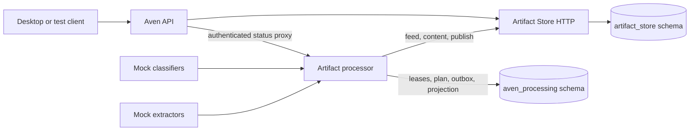
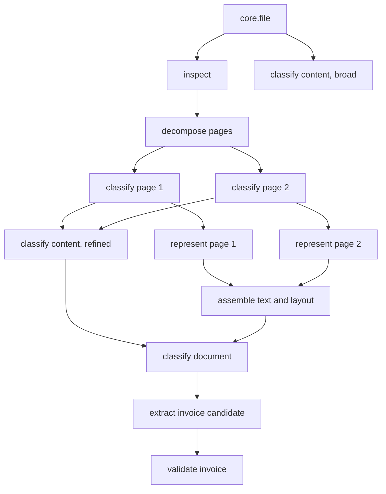

# Artifact processing spike: implementation report

Status: deterministic processing is complete and end-to-end verified locally. The
multi-tenant lifecycle and `next` deployment path were added later on 2026-08-23. This
is still not a real semantic classifier or extractor.

## Deployment checkpoint

The deployment is no longer fixed to one local database. Aven API now exposes a
Compose-network-only authenticated directory of ready customer database/scope pairs.
The Processor validates every pair against that directory, opens bounded per-customer
pools with the restricted `aven_artifact_processor` role, and reports not-ready when a
listed tenant has not passed or is failing its runtime probe.

The environment worker creates and rotates the Processor role, installs schema version
5 and the exact scope through a separate provisioner credential, records rollout state,
and revokes/terminates both Store and Processor access on suspension. The production
Compose overlay, `release-next` workflow, aggregate health endpoint, Caddy internal-path
deny rule, and GitHub Environment documentation now include the Processor. Version 5
preserves the old intent projection only for the Intent Service handoff and revokes the
Processor runtime's access to it.

The verified existing-data upgrade converged an already-owned local customer to schema
version 5, produced a one-entry tenant directory, passed tenant-mode routing checks,
and returned `artifactProcessing=available` with no pending, failed, expired, or drifted
environments.

The proposed production replacements for the mock executors are specified in
[ARTIFACT-PROCESSING-ADAPTER-DRAFT.md](ARTIFACT-PROCESSING-ADAPTER-DRAFT.md). That
draft backtests the adapter design against the earlier `avenCEO-tools` LLM pipeline
and defines the reliability, grounding, security, and evaluation boundaries for each
real adapter.

## Real adapter checkpoint

The local processor now has a production-shaped deterministic path for ordinary
`desktop-drop` uploads while retaining the full semantic mock path. The implemented
real procedures are:

| Procedure | Current implementation |
| --- | --- |
| `core.inspect-file` | Verifies immutable length/digest, detects PDF/PNG/JPEG from bytes, structurally checks images, and runs bounded `pdfinfo` for PDFs |
| `docs.decompose-pages` | Publishes ordered logical page identities and normalized geometry without copying page blobs |
| `docs.extract-native-text` | Runs bounded `pdftotext -bbox`, builds UTF-8 text and word bounding boxes; images produce an honest empty native layer |
| `core.classify-page-signals` | Deterministically distinguishes native-text pages, supported image sources, and pages requiring OCR/vision |
| `docs.assemble-document-representation` | Streams page text in order with explicit completeness and document byte limits |
| `core.aggregate-content-classification` | Deterministically aggregates every page outcome without an LLM |

Adapter failures now use stable classes (`unsupported`, `invalid-input`,
`limit-exceeded`, `unsafe-input`, `unavailable`, `deadline-exceeded`, `internal`, and
`invalid-output`) with explicit retry policy. Attempt leases heartbeat while blocking
adapter work runs, and completion remains fenced. Migration 2 adds the per-customer,
exact-request model-call ledger required before paid inference; no model calls use it
yet.

The decoder runner uses fixed allowlisted programs without a shell, clears the child
environment, provides fresh bounded scratch space, caps stdout/stderr, enforces a
15-second deadline, validates converter XML with a node limit, and inherits the local
container's read-only filesystem, dropped capabilities, `no-new-privileges`, memory,
PID, and temporary-storage bounds. It still shares the processor network namespace and
is therefore not the final no-network decoder sandbox described in the adapter draft.

The current page limit is deliberately 63. Decomposition publishes all pages plus one
bundle in a single atomic publication, whose store limit is 64 artifacts. Larger PDFs
fail explicitly rather than being truncated; durable batched decomposition must land
before increasing the limit.

The following additional local checks passed:

```text
cargo test -p aven-artifact-processor --all-features
cargo clippy -p aven-artifact-processor --all-targets --all-features -- -D warnings
bun run artifact-processing:real-smoke
bun run artifact-processing:real-pdf-smoke
bun run artifact-processing:real-unsupported-smoke
```

Both real smokes declare the wrong MIME type intentionally. The PNG converged through
six durable stages to `image`; the one-page born-digital PDF converged through six
durable stages to `document`, with native text and layout artifacts. Existing semantic
mock success and failure smokes also remained green. An unsupported real file converged
to `needs_review` after inspection, retained its presentable representation, and
exposed a stable `file-unsupported` warning.

## What now exists

The spike implements the full control path described in
[ARTIFACT-PROCESSING-CONCEPT.md](ARTIFACT-PROCESSING-CONCEPT.md): discovery, planning,
page decomposition, per-page multimodal classification, per-page representation,
whole-document refinement, document classification, typed extraction, validation,
presentation projection, and explicit terminal success or failure.

It adds a separate Rust process, `aven-artifact-processor`, beside the Artifact Store.
The process has its own `aven_processing` schema in the same customer database and a
dedicated `aven_artifact_processor` database role. It reads and publishes artifacts
only through the Artifact Store HTTP contract. Direct SQL is limited to coordinator
state and projections; the processor cannot bypass Artifact Store validation for
artifact data.



The local mock gate remains fail-closed: only `core.file@1` roots with
`payload.sourceKind == "processing-mock"` enter semantic mocks. New `desktop-drop` and
`processing-real` roots enter the deterministic real path. `compose-smoke` stays
excluded. The production deployment uses the same deliberately narrow trigger policy.
Broader ingestion policy remains deferred until real adapters and evaluation gates
exist.

## Executed plan

For the two-page smoke fixture the coordinator materializes this dependency graph:



Every page is classified independently and may have several facets. The verified
fixture contains a table on page 1 and both text and a photograph on page 2. A page is
therefore not assumed to be text-only just because it belongs to a document.

The mocks currently implement these procedure keys:

| Procedure | Main output |
| --- | --- |
| `mock.inspect` | `core.file-inspection@1` |
| `mock.classify-content` | broad `core.content-classification@1` |
| `mock.decompose-pages` | `docs.page@1` plus `core.bundle@1` |
| `mock.classify-page` | page `core.content-classification@1` and optional visual description |
| `mock.represent-page` | `docs.extracted-text@1` and `docs.text-layout@1` |
| `mock.refine-content` | aggregate `core.content-classification@1` |
| `mock.assemble-text` | document text and layout |
| `mock.classify-document` | `core.document-classification@1` |
| `mock.extract-invoice` | `bookkeeping.invoice-candidate@1` |
| `mock.validate-invoice` | `bookkeeping.invoice-validation@1` |

Confidence is stored as integer basis points, and monetary values are integer minor
units. This respects Artifact JSON's no-floating-point rule.

## Provenance and original-document pointers

Derived facts are published as normal immutable Artifact Store run outputs. Run inputs
identify the exact source and intermediate artifacts. Evidence records link an output
artifact or JSON pointer back to an input artifact root, byte range, or normalized page
region. Text layout uses byte offsets plus page bounding boxes.

The successful E2E case persisted 23 evidence records for 18 derived artifacts. Its
locators include page regions and output byte ranges; invoice fields are individually
addressed by JSON pointer. The current mock invoice extractor points each field to the
whole first-page region because it has no real token-level model. A real extractor must
narrow these to text spans and/or field bounding boxes. The storage model and evidence
publication path already support that replacement.

The Artifact Store does not yet expose an evidence-read endpoint. Provenance is
persisted and constrained, but a UI evidence viewer needs a bounded graph/evidence read
API before it can navigate these pointers.

## Presentation behavior

`processing_presentations` is a replaceable projection over immutable outputs. It
starts at `file`, then prefers the latest narrower result:

```text
file -> detected media type -> document/image/mixed -> invoice -> extracted summary
```

The projection contains the source and case IDs, plan/projection versions, state,
preferred type, label, summary, metadata, warnings, every stage state, and IDs/types of
all derived artifacts. Aven API exposes it only after authenticating the user and
resolving that user's customer scope. The processor also rejects any status request for
a scope other than its configured local scope.

On a terminal stage failure the case becomes `failed`, remaining unstarted work becomes
`skipped`, and the projection retains its last valid presentable type. It adds a stable
warning code and message rather than removing the artifact or fabricating a narrower
classification.

## Reliability boundaries

Coordinator state transitions are transactional in PostgreSQL.

- Feed discovery and cursor advancement occur in one transaction. The trigger key is
  unique, so replay cannot create a second case for the same source/plan/version.
- A changed Artifact Store epoch rewinds the processing feed cursor to zero. Existing
  trigger keys deduplicate replay while restored/new source artifacts are rediscovered.
- Steps have explicit dependencies. Only dependency-complete steps become queueable.
- Execution uses leases, immutable attempt identities, and fencing tokens. Expired work
  is retried and eventually becomes a terminal error after the configured cap.
- Output publication uses a durable outbox. Generated blob bytes, upload claim IDs, the
  exact publication intent, and publication ID are saved before HTTP publication.
- A crash before the outbox changes to `publishing` safely replays staged upload claims.
  A crash after publication replays the same Artifact Store publication ID and receives
  the same result.
- Artifact Store transport/server failures are durably retried with a finite cap;
  permanent 4xx rejection fails immediately. Exhaustion produces a known failed case.
- Acknowledgement stores the returned output identities and advances the step in one
  transaction. Planning derives only from acknowledged immutable outputs.
- Projection version is explicit, so it can later be rebuilt without rerunning models.

The remaining hard external failure is loss of the customer PostgreSQL database itself.
As with the Artifact Store, database backup/restore and environment reconciliation are
deployment responsibilities, not solved inside this local spike.

## Security boundaries

- Normal user uploads are excluded from all mock execution.
- The processor has a separate least-privilege runtime login and schema grants.
- Artifact access uses the private Artifact Store bearer token and exact validated
  customer database header inside the Compose network.
- Processor status has a separate bearer and requires an exact current directory
  binding for its database/scope pair.
- Browser/webview code receives neither service credential nor database name.
- Aven API remains the authenticated ownership boundary for UI status reads.
- Mock JSON is bounded to 16 pages, 100,000 text bytes per page, known facet values,
  bounded titles/summaries, and strict unknown-field rejection.

The deployment adds separate status, tenant-directory, provisioner, and database-role
credentials. Static broad service credentials remain a transitional boundary; the
short-lived tenant-grant design in the architecture paper is not implemented yet.

## Verification performed

The following checks passed:

```text
cargo test -p aven-artifact-processor -p aven-artifact-store-core --all-features
bun run --cwd services/aven-api check
bun run test:artifact-processing:smoke
bun run test:artifact-processing:failure-smoke
docker compose ... config --quiet
```

Success-path observations:

- source: two-page mock invoice with text/table and text/photograph pages;
- final case: `succeeded`;
- final preferred type: `invoice`;
- durable stages: 12, all succeeded;
- immutable derived artifacts: 18;
- persisted evidence links: 23;
- summary: `Invoice INV-2026-0815 from ACME GmbH for 11900 EUR minor units.`
- a forced `SIGKILL` of the processor during a fresh smoke case followed by container
  restart still converged to the same 12-stage, 18-artifact success result;
- a deliberately corrupted feed epoch/cursor rewound and replayed to the current store
  epoch and sequence without duplicating cases.

Failure-path observations:

- source: mock document containing a disallowed facet;
- final case: `failed`;
- retained preferred type: `file`;
- warning code: `invalid-input`;
- unstarted downstream step: `skipped` after terminal reconciliation.

The local `app`, Artifact Store, and processor containers were healthy after the final
stack rebuild. The smoke scripts leave their immutable test artifacts in
`cust_artifact_local`; remove the local Compose database volume when a clean fixture is
needed.

## What remains

The deterministic representation slice is working, but these items are intentionally
unfinished:

1. Replace the narrow allowlisted trigger with an authenticated server-owned processing
   policy before accepting additional source kinds. Do not infer broader policy from
   arbitrary client-controlled values.
2. Move PDF/image work into a separate no-network decoder sandbox and add CPU/RSS/file
   limits there. The current bounded child runner is an intentional local intermediate.
3. Add per-page rendering, OCR, visual analysis, grounded document classification, and
   grounded invoice extraction behind the existing procedure boundary.
4. Implement reserve/heartbeat/complete operations over the model-call ledger before
   any paid model call, then add model/prompt receipts, budgets, telemetry, cancellation,
   operator retry/reprocess controls, and a dead-letter view.
5. Expose bounded artifact graph, evidence, and text/layout reads for the UI. Then wire
   the desktop artifact card to poll or subscribe to the authenticated Aven API status
   route and render progress/warnings.
6. Decide whether non-invoice classifications end in `succeeded` or `needs_review` for
   each plan; the mock currently ends an understood non-invoice at `succeeded` without
   extraction.
7. Add concurrency/load, forced lease-expiry, targeted individual outbox crash-window,
   malformed publication, large fixture, and multi-customer isolation tests before
   broad rollout. Whole-process restart recovery and tenant routing are covered by the
   local smoke tests above.
8. Continue schema changes as numbered migrations. Migrations 1, 2, and 3 are
   checksum-pinned and must not be edited after this point.

The next implementation step should be a separate no-network decoder service plus
page rendering and OCR. That closes the remaining hostile-file boundary and gives the
semantic adapters grounded text, geometry, and pixels without changing the durable
coordinator or publication contracts.
