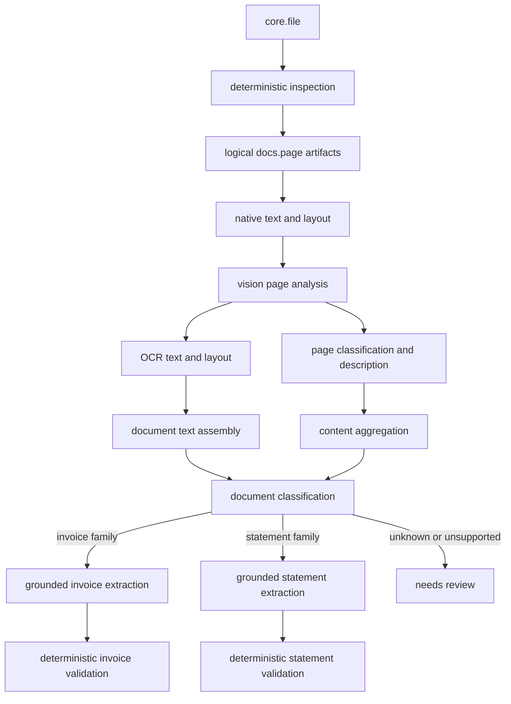
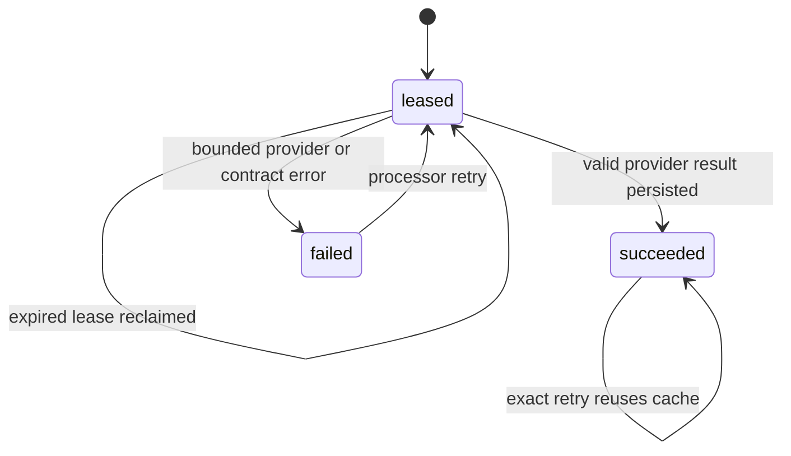

# Vision OCR and finance extraction implementation report

Status: implemented for local verification and the `next` deployment path on
2026-08-23.

## Donor backtest

The current `/home/daniel/src/jaensen/avenCEO-tools` checkout does not contain an
`o4.1`-specific implementation (OpenAI's public model is named `gpt-4.1`). Its current
worker uses `Qwen/Qwen3.6-27B` through an OpenAI-compatible `/chat/completions`
endpoint. Git history contains the same transport from its initial finance-ingest
commit. The useful parts carried forward are:

- page images are the source of truth;
- classification and extraction are separate calls;
- exactly one strict function call is accepted;
- low-confidence classification becomes `unclear`;
- invoice-family and statement-family documents use distinct schemas;
- deterministic consistency checks do not rewrite model output; and
- prompts explicitly reject instructions embedded in documents.

The donor couples all compatible models to one tool-call template and does not publish
OCR or field-level source geometry as first-class artifacts. It also included rejected
provider response text in errors. Those three behaviors were not copied.

## Implemented flow

Every successful box is a separate immutable Artifact Store run. A later failure does
not erase earlier page, text, classification, or presentation artifacts.

### Page vision and OCR

PDF pages are rendered at 144 DPI by an allowlisted Poppler binary using a fresh
temporary directory, cleared environment, no shell, bounded stdout/stderr, and a hard
deadline. PNG and JPEG sources are validated by signature and dimensions. Inputs are
bounded to 40 million pixels per image, 12 MiB per render, 40 MiB across one request,
and the configured page limit.

The model returns:

- complete page text in reading order;
- ordered text blocks whose text must occur in that complete text;
- normalized-millionth bounding boxes for each block;
- language and completeness;
- page kind and facets, including mixed pages and photographs; and
- a short visual summary and topics.

The adapter publishes `docs.extracted-text@1`, `docs.text-layout@1`,
`core.content-classification@1`, and `core.content-description@1`. Text offsets are
UTF-8 byte offsets and layout spans point to exact source pages and boxes.

### Document classification

The supported narrow vocabulary is:

- invoice, credit note, receipt, self-issued receipt, mandate, order confirmation,
  offer, and reminder;
- bank statement and payment receipt; and
- unknown.

A score below 6500 basis points is stored as `unknown` regardless of the raw proposed
kind. Unknown documents stop in `needs_review` while retaining their OCR and page
presentation.

### Invoice extraction

The model publishes both the existing compact
`bookkeeping.invoice-candidate@1` used by the UI and a new additive
`bookkeeping.invoice-details@1`. The details contract preserves parties, issue and
reference fields, signed minor-unit money, line items, tax rows, payment details, and
document subtype. The compact artifact remains the stable presentation projection.

`bookkeeping.validate-invoice@1` independently checks identity and signed
`net + tax = gross`. A contradiction creates a valid candidate plus an inconsistent
validation warning; it does not silently alter monetary values.

### Account-statement extraction

`banking.account-statement-candidate@1` preserves statement subtype, currency,
account identity and address, period, balances, and ordered transactions. Each
transaction retains booking/value dates, signed minor-unit amount, counterparty,
description, original currency amount/rate/surcharge, balance after, and source row.

`banking.validate-statement@1` checks period order, opening balance plus transactions
against closing balance when operands exist, and the one-negative-transaction shape of
a payment receipt. Missing operands produce `UNKNOWN`, never `PASS`.

## Provenance contract

Every accepted evidence edge has a resolving target-relative JSON pointer and an
original-page box. Visibly contiguous line-item, tax, reference, and transaction rows
use one row-level pointer. Provider evidence is a fallible annotation channel: invalid
or unresolved hints are discarded without discarding a schema-valid financial result.
The run receipt records `complete`, `partial`, or `absent` grounding with required,
covered, and missing pointer counts. Partial/absent grounding produces a UI warning and
ungrounded values are explicitly barred from automatic actions.

Boxes that exceed a page edge by at most one percent are clipped as model rounding;
larger overflows and empty boxes are discarded. If OCR blocks contain useful text and
geometry but disagree with the model's aggregate text ordering, the processor rebuilds
canonical text from the blocks and marks that text/layout representation incomplete.
The complete authoritative financial JSON schema is still mandatory.

Evidence edges point from the output JSON pointer to the original `core.file` page
region, not merely to a prompt or provider response. Model geometry is still a model
claim and should be visually reviewable; it is not equivalent to a deterministic PDF
text coordinate.

## Model profiles

The transport is OpenAI-compatible `/chat/completions`; the profile owns model-specific
templates:

| Profile | Input/output behavior | Intended use |
| --- | --- | --- |
| `openai-tools` | strict tool, forced single function, `temperature: 0` | OpenAI-compatible reasoning/vision models with tool calls |
| `openai-json-schema` | strict `response_format.json_schema`, content JSON, `temperature: 0` | models/deployments whose structured-output path is preferred |
| `qwen-tools` | strict forced tool plus `temperature: 0` | Qwen-compatible endpoints such as the donor configuration |
| `generic-json` | JSON-object mode, schema included in the prompt | open endpoints without strict tool/schema support |

The model identifier is never interpreted by business code. A new input/output
template is one new profile implementation; it does not fork invoice or statement
logic. The OpenAI profiles project authoritative schemas onto OpenAI's documented
strict-output subset by removing unsupported length and uniqueness keywords. Returned
data is still checked against the complete authoritative schema locally before
publication, so provider compatibility does not weaken the stored contract.

## Reliability and known state

The per-customer `model_call_ledger` hashes the exact request, model, profile, prompt,
and contract. A call obtains a fenced lease. Every bounded provider attempt receives a
distinct `Idempotency-Key`, while the stable exact-request hash remains the ledger key.
A result is marked reusable only after schema validation and domain materialization;
malformed paid responses cannot poison the exact-request cache. Publication remains a
separate replay-safe outbox operation.

There is an unavoidable narrow duplicate-call window when the provider completed a
request but the process died before persisting the result and the provider ignores the
idempotency header. Publication itself remains exactly replayable by publication ID.
After three processor attempts, a step and case reach a terminal failed state and the
UI retains the last valid presentation with a warning.

Raw provider bodies, prompts, image bytes, and document text are not logged. The
durable model receipt contains only provider/request IDs when supplied, model/profile,
token counts, and the request hash. The API key exists only in the root-owned deployment
environment and Processor process environment.

Rendered pages and extracted text are sent to the configured model endpoint. Enabling
the adapter therefore creates an external customer-data boundary: the `next` endpoint,
account/project retention settings, region, contractual terms, and access controls must
be approved before real customer uploads are processed. HTTPS protects transport but
does not provide a provider-side retention guarantee.

## Explicit bounds and non-guarantees

- Supported source formats remain PDF, PNG, and JPEG.
- Decomposition admits at most 63 pages; paid stages default to 15 pages.
- One extraction admits at most 128 invoice lines and 128 statement transactions.
  Longer statements need the already-planned page/row batch extraction and deterministic
  assembly rather than a larger single model call.
- Artifact Store admits 1024 evidence edges per publication.
- OCR/model geometry can be wrong; schema and range checks prove shape, not semantic
  truth.
- Deterministic checks cover core arithmetic and shape, not full bookkeeping or legal
  correctness.
- The service does not scan files for malware and does not broaden file-format support.
- Existing completed deterministic cases are not automatically rerun, avoiding an
  unbounded surprise bill. A new upload uses the new plan; explicit reprocessing remains
  future control-plane work.

## `next` installation

The exact GitHub Environment inventory and commands are in
[`services/aven-api/docs/github-deployment.md`](../aven-api/docs/github-deployment.md#first-processor-rollout-to-next).
The new conditional secret is `ARTIFACT_PROCESSOR_VISION_API_KEY`: it is required in
`bearer` mode and omitted in `none` mode for an authentication-free open-model
endpoint. Required variables are the enabled flag, HTTPS base URL, model/deployment
name, profile, and auth mode. Page and timeout limits have reviewed defaults.

The release workflow validates all values before host mutation, writes them to the
mode-0600 deployment environment, injects them only into `artifact-processor`, deploys
the immutable Store/Processor image, and retains the previous environment and Compose
files for runtime rollback. Schema changes are additive and are not reversed by
rollback.

## Verification completed

- all Artifact Store Rust workspace tests;
- strict Processor clippy with warnings denied;
- compilation of every model JSON schema;
- synthetic parsing for tool-call and content-JSON response shapes;
- canonicalization tests for useful but inconsistently ordered OCR blocks;
- JPEG tests covering camera trailers and embedded thumbnail EOI markers;
- local Docker end-to-end runs against the synthetic OpenAI-compatible HTTP server:
  one PDF invoice and one PDF account statement each completed all nine stages and
  published their expected typed artifacts and validations;
- Compose/workflow wiring added to pull-request CI and the `next` release validation;
- a real local GPT-4.1/OpenAI-tools run over the original fixture set: 15/15 financial
  documents reached `succeeded`, the camera photograph reached intentional
  `needs_review` after successful inspection/decomposition/page analysis, with no
  processing or harness failures; two correctly narrowed credit notes were rerun after
  updating the assertion from invoice-only to invoice-family and passed with zero
  assertion errors;
- the expanded receipt set exposed three additional adapter-contract failures; all
  three passed after binding extraction to the trusted classified subtype and dropping
  unusable empty evidence hints; and
- persisted extraction runs contain resolving page-region evidence plus explicit
  grounding coverage. Current examples are partial, so the presentation intentionally
  warns instead of implying fully verified automation safety.

The fixture set has no checked-in semantic ground-truth manifest. These runs prove the
real transport, durable orchestration, schemas, subtype consistency, core-field
presence, provenance persistence, warning behavior, and terminal convergence. They do
not independently prove every transcribed value. Adding reviewed expected values for
supplier, identifier, dates, currency, totals, and representative line items is the
remaining requirement for a semantic accuracy regression gate. No real customer
document should be used to create that gate. The account-statement path has synthetic
OpenAI-compatible end-to-end coverage, but there is not yet a reviewed real-model
statement fixture; its semantic accuracy therefore remains unproven.
