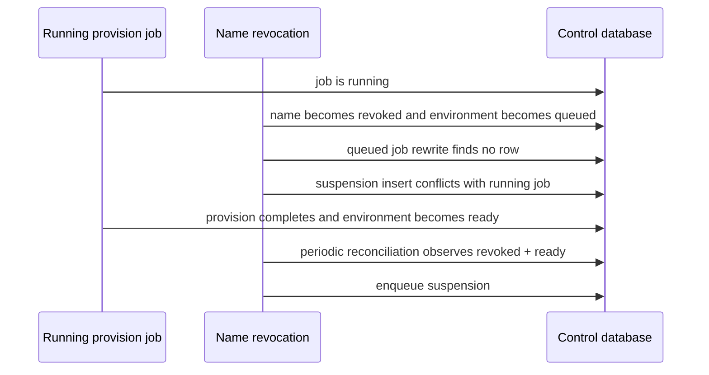
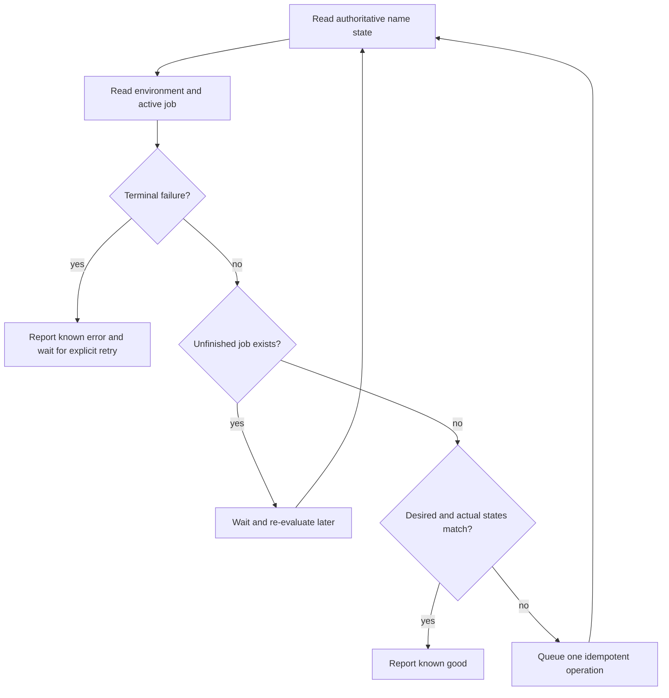
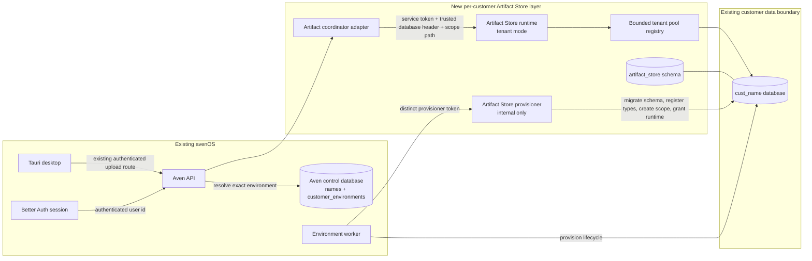
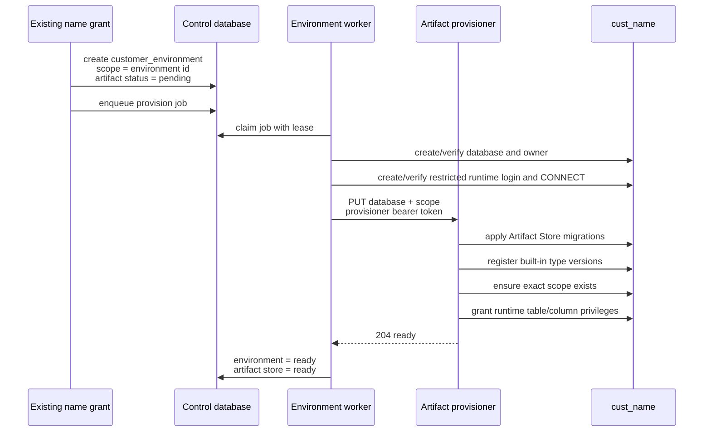
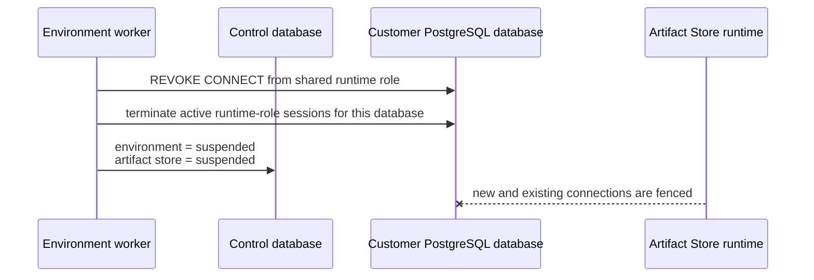
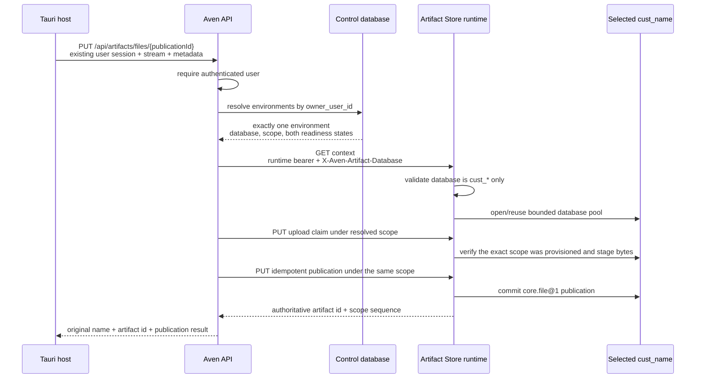
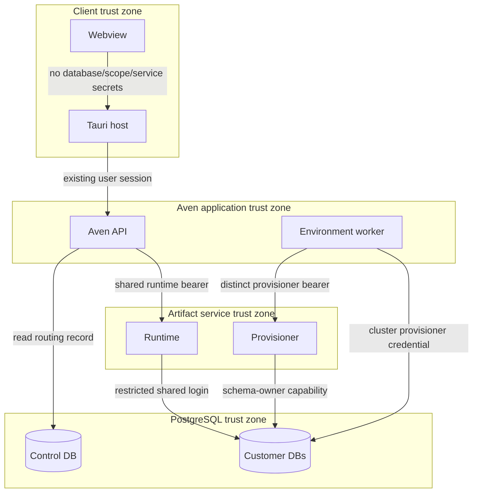
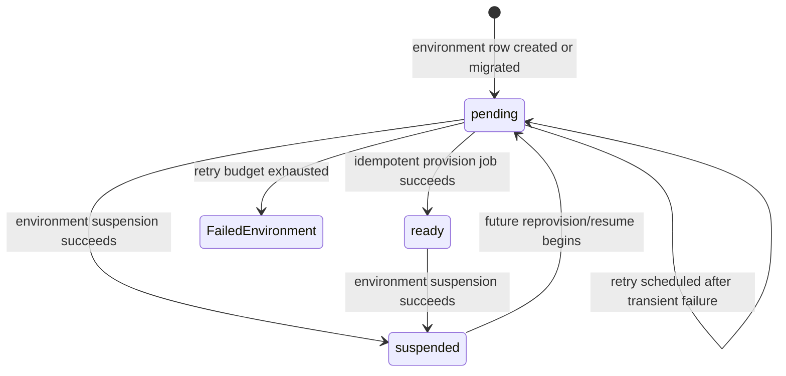
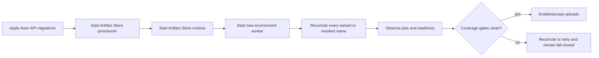

# Per-customer Artifact Store architecture

Status: deployment candidate; the reliability findings below are implemented and
covered by bounded health and reconciliation semantics

Date: 23 August 2026

## Scope

This note describes only the new per-customer Artifact Store layer and the points at
which it touches the existing avenOS system. It does not restate the Artifact Store
kernel, the name-purchase flow, Better Auth, the desktop upload UI, or the general
customer-database design.

The new layer gives each customer environment:

- one `artifact_store` schema inside its existing `cust_*` PostgreSQL database;
- one stable Artifact Store scope, identified by the environment UUID;
- server-side routing from an authenticated Aven API request to that exact database
  and scope; and
- lifecycle coupling to environment provisioning and suspension.

It does not create one Artifact Store process per customer. One runtime process serves
many customer databases through bounded, lazy PostgreSQL pools. A separate internal
provisioner performs schema and privilege changes.

## Final reliability review and resolution

### Verdict

The artifact data path and control plane now converge under the reviewed orderings of
purchase, provisioning, refund, restart, lease expiry, and credential rotation. The
implementation remains intentionally small: the existing environment/job tables are
reconciled periodically, uploads are bounded in process and per scope, and health
classifies every row as known good, converging, known failed, or drifted.

| Property | Current result | Reason |
| --- | --- | --- |
| Exact database and scope routing | Good | Aven API chooses both values and the runtime validates the database grammar and exact installed scope |
| Publication atomicity and replay | Good | The root publication, artifact rows, scope sequence, and claim consumption commit in one PostgreSQL transaction |
| Repeatable schema provisioning | Good | Migrations, type registration, scope creation, and grants are idempotent and detect type-definition drift |
| Fail-closed upload admission | Good | Both environment states must be `ready`; absent databases/scopes and malformed routing fail |
| Existing-environment upgrade | Good | Owned legacy names are backfilled and all desired/actual state is reconciled at startup and periodically |
| Suspension convergence | Good | Name status fences access immediately; an opposite running job is followed by suspension, and absent resources are already converged |
| Credential rotation | Good | Worker initialization validates, rotates, and fences the restricted runtime login independently of tenant work |
| Resource containment | Good for the initial rollout | 25 MiB requests, two concurrent buffers, per-scope claim/staging/logical quotas, a 512 MiB container limit, and orphan cleanup bound use |
| Known operational state | Good | Health probes runtime PostgreSQL access and reports aggregate missing, pending, failed, expired-lease, and drift counts |

### Guarantees that already hold

The following behavior has a sound failure model and should be retained:

1. The client cannot supply the database, scope, publisher, or service credential.
2. A valid database paired with another customer's scope is rejected.
3. An upload claim verifies both declared length and SHA-256 before it is committed.
4. Publication is atomic. A crash before commit leaves no partial publication; a crash
   after commit is resolved by replaying the same publication UUID.
5. Provisioner retries converge when an attempt stopped after any individual migration,
   type, scope, or grant step.
6. Job completion and the environment state update share one control-database
   transaction, so they cannot commit independently.
7. A successfully completed suspension revokes new runtime connections and terminates
   existing runtime-role connections for that database.

The local stack proves this happy path for one existing name and one smoke customer.
Automated integration tests additionally exercise the adverse event orderings below.

### Resolved lifecycle edge cases

#### Suspension can be lost behind a running provision

The job table still permits only one queued or running job per environment. A
revocation rewrites an opposite queued job immediately. If the opposite job is already
running, the reconciler waits for it to reach a terminal state and then queues the
required suspension on the next pass.



Artifact routing joins the name registry and requires `names.status = 'owned'`, so the
commercial revocation fences new publication before database suspension finishes.

#### Suspension assumes resources exist

A queued provision can be changed into a suspension before the customer database or
runtime role exists. The suspension path checks both resources first and treats either
being absent as successful convergence to the inaccessible state.

Suspension is therefore idempotent whether provisioning completed fully, partially,
or not at all.

#### Upgrade discovery and lease recovery repeat

Artifact upgrade discovery, missing-environment backfill, desired-state comparison,
and expired-lease recovery run at initialization and every reconciliation interval.
Initialization errors terminate the process so the container restart policy retries
instead of leaving an inert worker alive.

#### Runtime credential rotation depends on customer work

The restricted `aven_artifact_store` login is created or safety-checked and its
password rotated during worker initialization. Existing sessions for that role are
terminated after rotation. Per-customer jobs only grant or revoke database access and
install the schema.

#### Stored identifiers reach interpolated SQL

New names generate safe identifiers, while existing `database_name` and `owner_role`
values are untrusted stored input until they pass the same grammar.

The TypeScript boundary now validates database name, role name, and scope UUID before
opening PostgreSQL or constructing the internal HTTP route. Matching control-database
CHECK constraints prevent new corrupted routing state.

### Bounded resource policy

The first rollout deliberately keeps buffering simple but bounded: 25 MiB per request,
two admitted upload bodies per runtime, 32 live claims per scope, 100 MiB staged bytes
per scope, and 1 GiB logical published bytes per scope. The runtime container defaults
to 512 MiB. Expired unconsumed claims receive a 24-hour retry grace, after which the
next upload cleanup removes them and any blob not referenced by a claim or artifact.
Quota decisions serialize on the scope row, so concurrent requests cannot each admit
against the same stale total. Cluster-level disk alarms and backups remain operational
infrastructure responsibilities.

### Liveness and observability resolution

PostgreSQL connect, lock, pool acquisition, and statement work now have finite
deadlines, as does the provisioner HTTP call. Lease renewal also refreshes the worker
heartbeat; a lost renewal is logged explicitly. Tenant runtime readiness authenticates
to PostgreSQL, and API health additionally probes `/v1/context` through a ready tenant
when one exists. Public health exposes aggregate counts only. Deployment waits for
Compose health and then requires no missing mappings, terminal failures, expired
leases, or unexplained drift. Queued/running transitions remain visible but are a
healthy, known converging state.

### Simplest reliable convergence model

The setup does not need a second workflow engine or one service per customer. A small,
level-triggered reconciliation loop around the existing tables is enough.

The authoritative desired state already exists:

```text
names.status = owned    -> desired environment state is ready
names.status != owned   -> desired environment state is suspended
```

On startup and periodically thereafter, the reconciler:

1. reclaim expired running-job leases;
2. create missing environments for owned legacy names using `environmentNames()`;
3. compare name state, environment state, Artifact Store state, and unfinished job;
4. enqueue one operation only when no unfinished operation exists;
5. wait for a running opposite operation, then enqueue the newly required operation on
   the next pass;
6. leave exhausted jobs in a visible terminal `failed` state until explicit retry;
7. bootstrap/rotate the global restricted runtime role independently of customer work;
8. publish a reconciliation timestamp and aggregate state counts; and
9. exit the worker on unrecoverable initialization failure so the existing container
   restart policy retries cleanly.

Artifact routing additionally joins `names` and requires `names.status = 'owned'`.
That immediate authorization fence makes a late in-flight provision harmless while
the reconciler performs the eventual database suspension.



This retains the one-unfinished-job constraint. It fixes the lost-suspension race by
making events hints and the database state the durable truth. It also makes repeated
reconciliation harmless and easy to inspect.

### Known-state matrix

| Desired name state | Environment / Artifact Store | Active job | Classification |
| --- | --- | --- | --- |
| `owned` | `ready / ready` | none | Known good |
| `owned` | queued, provisioning, or Artifact Store pending | queued/running provision | Converging |
| `owned` | missing environment | none | Drift; synthesize environment and provision |
| revoked or disputed | `suspended / suspended` | none | Known good and inaccessible |
| revoked or disputed | any non-suspended state | queued/running operation | Converging; Aven API must already deny access |
| either | `failed` or failed job | none | Known error; expose code/message and require explicit retry |
| either | running job with expired lease | running | Drift; reclaim and retry |
| either | desired and actual differ with no job | none | Drift; enqueue the required operation |

There should be no fourth category such as “probably ready.” Every row must be known
good, converging with an owned lease, known failed, or detected as drift awaiting the
next reconciliation pass.

### Implemented release gates

The deployment branch implements these gates:

1. Periodic reconciliation, immediate owned-name authorization checking, and
   no-op-success suspension for absent resources.
2. Stored identifier and scope UUID validation before SQL or HTTP construction.
3. Global runtime-role bootstrap and rotation independently of tenant jobs.
4. Finite PostgreSQL deadlines and truthful heartbeat/lease reporting.
5. Aggregate reconciliation state that makes deployment fail on Artifact Store
   component failure or unexplained drift.
6. Automated coverage for provision replay, the running-provision versus suspension
   race, missing-resource suspension, credential rotation, wrong database/scope, and
   existing-name reconciliation.
7. Bounded upload concurrency, staging/logical quotas, and orphan cleanup.

The existing one-job queue, environment row, Artifact Store status, and provisioner can
all remain. The fixes are about making the existing state level-triggered and bounded,
not adding more infrastructure.

## System boundary



The important boundary is Aven API. The desktop supplies file bytes and file metadata,
but it never chooses a customer database, scope, Artifact Store publisher, or service
credential.

## New records in the existing control plane

The existing `customer_environments` row is the routing authority. Three fields were
added:

| Field | Meaning | Invariant |
| --- | --- | --- |
| `artifact_scope_id` | Stable scope inside the customer database | Non-null, globally unique, and currently equal to the environment UUID |
| `artifact_store_status` | Installation/access state | One of `pending`, `ready`, or `suspended` |
| `artifact_store_schema_version` | Last successfully installed deployment schema | Monotonic integer; access requires the current source-controlled version |

The environment's effective contract is raised to version 2 and records:

```json
{
  "artifactStore": {
    "schemaVersion": 1,
    "scopeId": "<environment UUID>"
  }
}
```

The name remains the commercial/customer identity. The environment row remains the
technical deployment identity. Artifact routing joins the name for current ownership,
then uses the environment row as authority for the validated database name, lifecycle
state, installed schema version, and stable scope.

## Control plane: installation and upgrade

### Newly purchased names

The existing name-grant transaction calls environment provisioning. The new fields and
the existing provision job are created in the same control-database transaction as the
environment record.



The provisioner endpoint is idempotent. Repeating it reapplies forward migrations,
upserts the source-controlled built-in type definitions, inserts the scope with
`ON CONFLICT DO NOTHING`, and reapplies grants.

### Existing customer environments

Database migrations backfill every row already present in `customer_environments`:

1. `artifact_scope_id` is set to the existing environment UUID.
2. The effective contract receives the Artifact Store configuration.
3. `artifact_store_status` starts as `pending`, and the installed schema version starts
   at `0`.
4. At worker startup and periodically, each owned environment whose desired state is
   not satisfied—or whose installed schema version is old—receives one idempotent
   `provision` job when none is unfinished.
5. The ordinary provision path installs the schema and changes both states to `ready`
   only after the provisioner succeeds.

The worker does not mark a row ready optimistically. Upload routing remains closed
while installation is pending, provisioning, suspended, or failed.

### Suspension

Suspension is coupled to the existing environment suspension job:



After the suspension job succeeds, this prevents a suspended environment from
continuing to receive Artifact Store traffic even if a stale caller still knows its
internal database and scope identifiers. The immediate name-state fence closes access
while a running opposite job finishes and reconciliation queues suspension.

## Data plane: authenticated file publication



The coordinator performs three bindings that are not accepted from the client:

| Binding | Authority |
| --- | --- |
| User to customer environment | Existing authenticated Aven API user ID |
| Environment to PostgreSQL database | `customer_environments.database_name` |
| Environment to Artifact Store scope | `customer_environments.artifact_scope_id` |

The Artifact Store independently checks that the requested scope exists in the
selected database. A valid database with a scope from another environment therefore
fails closed with `RESOURCE_UNAVAILABLE`.

## Authentication and trust boundaries



There are four separate credentials or decisions:

1. The existing user session authenticates the person to Aven API.
2. `ARTIFACT_STORE_BEARER_TOKEN` authenticates Aven API to the runtime.
3. `ARTIFACT_STORE_PROVISIONER_BEARER_TOKEN` authenticates the environment worker to
   the internal provisioner and must differ from the runtime token.
4. `ARTIFACT_STORE_RUNTIME_PASSWORD` authenticates the restricted PostgreSQL runtime
   role. The cluster provisioner credential remains confined to provisioning paths.

The trusted `X-Aven-Artifact-Database` header is created by Aven API. It must not be
forwarded from a desktop or public HTTP request. The runtime accepts only lowercase
PostgreSQL identifiers beginning with `cust_`; it does not accept arbitrary URLs,
hosts, schemas, or SQL identifiers.

## PostgreSQL boundary

The customer database remains the isolation unit. The Artifact Store adds one schema
but does not move artifacts to the Aven control database or to a shared artifact
database.

The cluster provisioner can:

- apply the Artifact Store schema migration;
- install immutable built-in type definitions;
- create the environment's initial scope; and
- grant runtime privileges.

It is also a member of PostgreSQL's predefined `pg_signal_backend` role. That narrow
cluster privilege is required to terminate already-open runtime sessions after
suspension or credential rotation; it grants no ability to read their queries or
tenant data. The deployment reapplies this idempotent membership for existing clusters
before starting workers.

The runtime role can connect to provisioned customer databases and has the table and
column operations needed by the current PostgreSQL adapter. It cannot create roles,
create databases, run schema migrations, or grant itself privileges.

This is useful tenant placement isolation, but not complete process-compromise
isolation: the runtime role and runtime bearer are shared across customer databases.
A compromised runtime process could therefore attempt to address every provisioned
`cust_*` database. Per-customer database credentials, signed short-lived routing
decisions, or a policy-enforcing database proxy are later hardening options.

## Runtime pool boundary

Tenant mode builds a database URL from a configured PostgreSQL cluster URL plus the
validated database name. Pools are opened lazily and cached by database name.

- The number of cached customer pools is bounded by
  `ARTIFACT_STORE_MAX_TENANT_POOLS` (default `64`).
- Each customer pool is bounded by `ARTIFACT_STORE_CONNECTIONS_PER_TENANT`
  (default `2`).
- The least-recently-used cached pool is evicted when the bound is reached.
- The scope existence check runs after database selection and before every scoped
  operation.

Tenant-mode `/health/ready` authenticates the runtime role to the PostgreSQL cluster.
It does not fan out to every customer database. API aggregate health additionally
routes `/v1/context` through one ready customer database, while per-customer readiness
remains represented by `artifact_store_status` and real routing.

## State and failure semantics



Artifact access is allowed only when all conditions hold:

```text
names.status = owned
AND customer_environments.owner_user_id = authenticated user
AND customer_environments.status = ready
AND customer_environments.artifact_store_status = ready
AND customer_environments.artifact_store_schema_version >= current deployment version
```

Failures are fail-closed:

- No environment row: Aven API returns `NAME_REQUIRED`.
- More than one environment: Aven API returns `ARTIFACT_ENVIRONMENT_AMBIGUOUS` until
  an environment-selection contract exists.
- Either readiness state is not `ready`: Aven API returns
  `ARTIFACT_ENVIRONMENT_NOT_READY`.
- Invalid trusted database identifier: runtime returns a validation error.
- Scope absent from the selected database: runtime returns `RESOURCE_UNAVAILABLE`.
- Provisioning failure: the leased job is retried with exponential backoff; after the
  configured attempt limit the environment is marked failed for explicit retry.
- Expired worker leases are returned to the queue at startup and periodically.

The unfinished-job unique index, periodic desired-state comparison, and provisioner's
idempotent operations make duplicate execution safe. The PostgreSQL advisory lock
serializes database provisioning for one customer database.

## Existing-name coverage

Every valid owned name is now part of periodic reconciliation, including a legacy name
with no `customer_environments` row. The reconciler locks the name, derives identifiers
through `environmentNames()`, generates one stable environment/scope UUID, inserts the
ordinary provision job, and emits an audit event. A concurrent grant or another
reconciler observes the unique environment/name constraints and does not duplicate it.

Existing environment rows receive the deterministic migration backfill and enter the
same provision path. Revoked names are driven toward suspension, not upgraded for
access. Exhausted operations remain visibly failed until an explicit retry.

A user with more than one owned environment remains intentionally blocked as ambiguous
because the upload API does not yet carry an environment selector. That is a known
product boundary, not silent or misrouted access.

Current coverage can be audited without changing data:

```sql
SELECT n.name, n.owner_user_id
FROM names n
LEFT JOIN customer_environments e ON e.name = n.name
WHERE n.status = 'owned' AND e.id IS NULL;

SELECT owner_user_id, count(*)
FROM customer_environments
GROUP BY owner_user_id
HAVING count(*) <> 1;

SELECT name, status, artifact_store_status
FROM customer_environments
WHERE status = 'ready' AND artifact_store_status <> 'ready';
```

The public health endpoint runs equivalent aggregate checks without exposing names or
user IDs. Deployment succeeds only after missing mappings, terminal failures, expired
leases, and unexplained drift all reach zero; unfinished leased transitions are
reported separately as known convergence.

## Deployment interaction

The existing `next` release publishes one additional image and adds two private
services to the existing Aven API Compose project:

- `artifact-store`: runtime on the internal network;
- `artifact-store-provisioner`: internal control-plane endpoint.

No Artifact Store port is published publicly. Aven API receives only the runtime URL
and token; the environment worker receives only the provisioner URL, provisioner token,
runtime role name, and runtime password. PostgreSQL remains the only persistence layer.

The safe rollout order is:



Compose starts the new provisioner, runtime, API, and worker from immutable images and
waits on service health. The external deployment check then waits up to five minutes
for the periodic reconciler and its aggregate coverage gates.

## Explicit non-goals and remaining boundaries

This layer deliberately does not solve:

- selecting between multiple environments owned by one user;
- per-customer runtime credentials or cryptographically signed routing decisions;
- streaming to external object storage; the Rust adapter buffers at most 25 MiB under
  a two-request semaphore;
- cluster-wide billing/rate policy beyond the initial per-scope admission quotas;
- complete backup/restore and divergent-feed recovery procedures;
- the final Tauri filesystem capability restriction for native dropped paths; or
- OCR, extraction, classification, search, or model invocation after upload.

Those are separate extensions. None should weaken the current rule that the client
cannot select its database or scope and that access is denied until installation is
authoritatively ready.

## Target acceptance invariants

The implementation and deployment health checks enforce the following invariants:

1. Every accessible owned name maps to exactly one environment.
2. Every ready environment has exactly one stable non-null scope ID.
3. Every `ready + ready` environment has the Artifact Store schema, built-in types,
   exact scope row, runtime grants, and database `CONNECT` grant.
4. No `pending`, suspended, or failed environment can publish artifacts.
5. A database header outside the `cust_*` grammar is rejected.
6. A scope from customer A cannot be used against customer B's database.
7. Suspension revokes new connections and terminates existing runtime connections.
8. Repeating provisioning produces the same usable installation without duplicate
   scopes or types.
9. The provisioner endpoint and credentials are not reachable by the public client.
10. The three rollout audit queries above return no unexplained rows before universal
    availability is announced.
