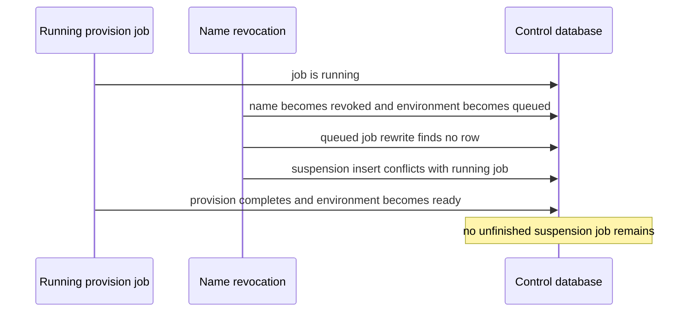
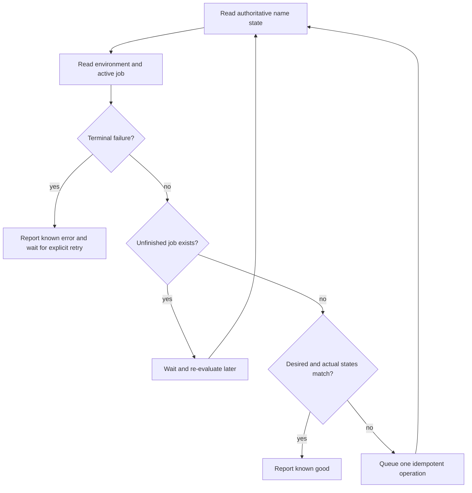
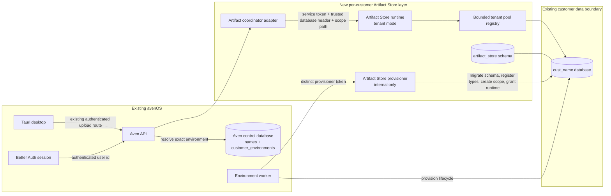
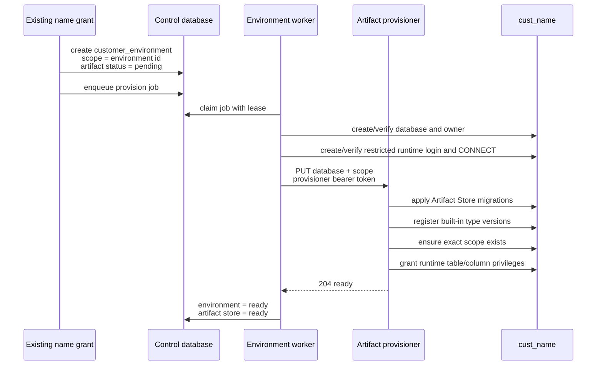
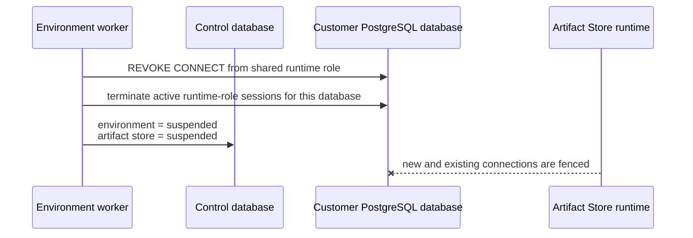
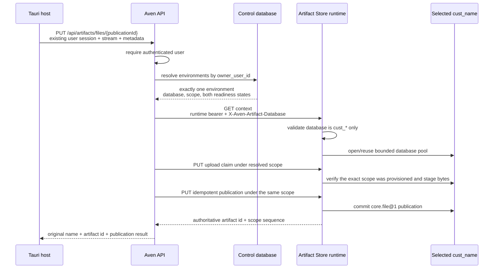
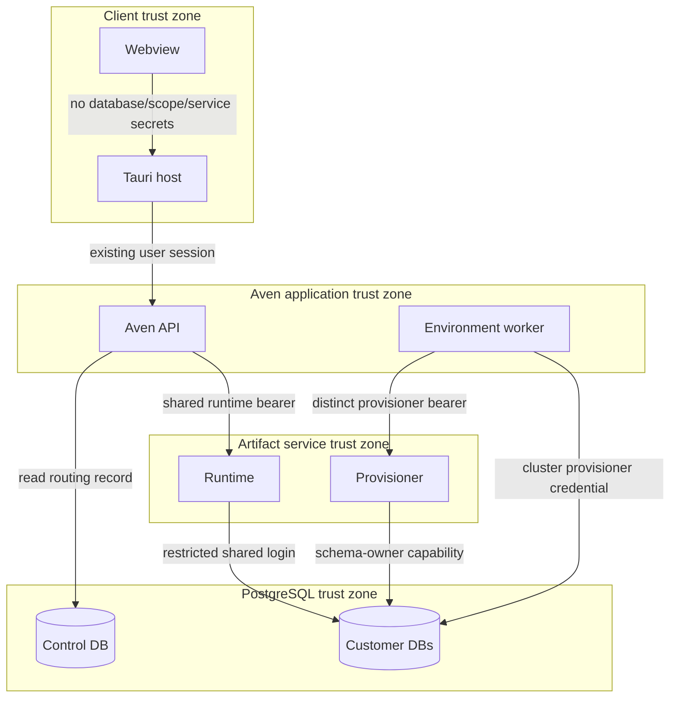
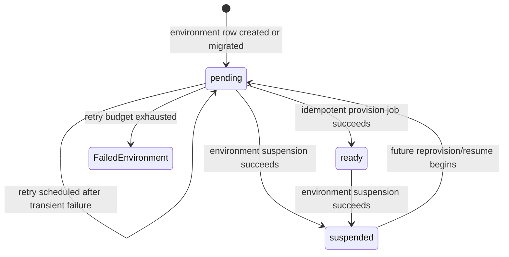
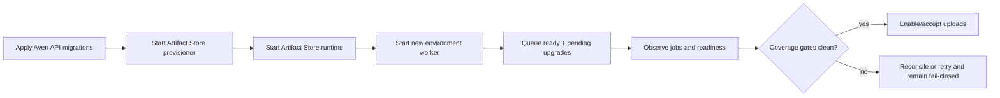

# Per-customer Artifact Store architecture

Status: implemented preview; the happy path works, but the final reliability review
below identifies blockers before broad deployment

Date: 23 August 2026

## Scope

This note describes only the new per-customer Artifact Store layer and the points at
which it touches the existing avenOS system. It does not restate the Artifact Store
kernel, the name-purchase flow, Better Auth, the desktop upload UI, or the general
customer-database design.

The new layer gives each customer environment:

- one `artifact_store` schema inside its existing `cust_*` PostgreSQL database;
- one stable Artifact Store scope, identified by the environment UUID;
- server-side routing from an authenticated Aven API request to that exact database
  and scope; and
- lifecycle coupling to environment provisioning and suspension.

It does not create one Artifact Store process per customer. One runtime process serves
many customer databases through bounded, lazy PostgreSQL pools. A separate internal
provisioner performs schema and privilege changes.

## Final reliability review

### Verdict

The artifact data path works as described. The control plane does not yet guarantee
convergence under every ordering of purchase, provisioning, refund, restart, and
credential rotation. The current implementation is suitable for the local spike and a
closely observed test environment, but it should not be presented as universally
self-healing or opened to unbounded public uploads yet.

| Property | Current result | Reason |
| --- | --- | --- |
| Exact database and scope routing | Good | Aven API chooses both values and the runtime validates the database grammar and exact installed scope |
| Publication atomicity and replay | Good | The root publication, artifact rows, scope sequence, and claim consumption commit in one PostgreSQL transaction |
| Repeatable schema provisioning | Good | Migrations, type registration, scope creation, and grants are idempotent and detect type-definition drift |
| Fail-closed upload admission | Good | Both environment states must be `ready`; absent databases/scopes and malformed routing fail |
| Existing-environment upgrade | Partial | Ready environments are discovered once at worker startup, but missing legacy environments and transient initialization failures are not self-healed |
| Suspension convergence | Blocking gap | A suspension can be lost while a provision job is already running, and missing databases are not treated as already suspended |
| Credential rotation | Blocking gap | The shared runtime role password is changed only while processing a customer provision job |
| Resource containment | Blocking gap for public use | A request can buffer 100 MiB and there is no staging quota, upload concurrency limit, expired-claim cleanup, or blob garbage collection |
| Known operational state | Partial | Environment/job errors and worker heartbeats exist, but Artifact Store reachability and reconciliation drift are absent from health status |

### Guarantees that already hold

The following behavior has a sound failure model and should be retained:

1. The client cannot supply the database, scope, publisher, or service credential.
2. A valid database paired with another customer's scope is rejected.
3. An upload claim verifies both declared length and SHA-256 before it is committed.
4. Publication is atomic. A crash before commit leaves no partial publication; a crash
   after commit is resolved by replaying the same publication UUID.
5. Provisioner retries converge when an attempt stopped after any individual migration,
   type, scope, or grant step.
6. Job completion and the environment state update share one control-database
   transaction, so they cannot commit independently.
7. A successfully completed suspension revokes new runtime connections and terminates
   existing runtime-role connections for that database.

The local stack proves this happy path for one existing name and one smoke customer.
That evidence does not exercise the adverse event orderings below.

### Blocking lifecycle edge cases

#### Suspension can be lost behind a running provision

The job table permits only one queued or running job per environment. When revocation
arrives while a provision job is already running, the suspension code cannot rewrite
the running job and its attempted insert is discarded by `ON CONFLICT DO NOTHING`.
The running provision can then finish and mark the environment ready, with no
suspension job left behind.



This is also an authorization problem because current artifact routing looks up the
environment by owner only; it does not re-check that the joined name is still `owned`.
The same missing check allows any pre-existing name/environment status drift to become
an access decision.

#### Suspension assumes resources exist

A queued provision can be changed into a suspension before the customer database or
runtime role exists. The suspension path currently issues `REVOKE CONNECT ON DATABASE`
directly. PostgreSQL reports an error for a missing database or role, although the
desired security state is already satisfied. Repeated attempts therefore end in a
misleading failed environment instead of the known-good `suspended` state.

Suspension should define an absent database or absent runtime grant as success. It
must remain idempotent whether provisioning completed fully, partially, or not at all.

#### Upgrade discovery and lease recovery are one-shot

Artifact upgrade discovery and expired-lease recovery run only during worker
initialization. The worker catches initialization failure and stays alive without
installing its timer, so Docker sees a running process that cannot do more work. The
heartbeat eventually becomes stale, but recovery requires an operator restart.

Expired running jobs are also not reclaimed periodically. A container restart normally
recovers them, but an already-running second worker does not. These are observable
failures, not eventual convergence.

#### Runtime credential rotation depends on customer work

The restricted `aven_artifact_store` login is created and its password is set inside
customer database provisioning. On a later deployment that rotates
`ARTIFACT_STORE_RUNTIME_PASSWORD`, all environments may already be `ready`, so no job
runs and PostgreSQL retains the old password. The new runtime repeatedly fails to
connect while every control-plane row still says `ready`.

Global runtime-role creation, safety validation, and password rotation should happen
once during worker/provisioner initialization, independently of customer jobs.
Per-customer jobs should only grant or revoke database access and install the schema.

#### Stored identifiers reach interpolated SQL

New names generate safe identifiers, but existing `database_name` and `owner_role`
values are read from the control database and interpolated into PostgreSQL identifier
positions before the Rust provisioner validates the database name. Quoting with a
literal pair of double quotes is insufficient if corrupted or legacy data contains a
double quote.

The TypeScript provisioning boundary must validate the database and owner-role grammar
and maximum length before its first SQL statement. The database should also have CHECK
constraints matching `environmentNames()`. This turns corrupted legacy data into a
clear terminal error instead of executable SQL or an accidentally addressed database.

The scope ID requires the same preflight validation because legacy environment IDs are
copied into a UUID route.

### Blocking resource edge cases

The current upload limit is a per-request body limit, not a capacity policy:

- Axum buffers the entire body and the PostgreSQL adapter holds/encodes the same bytes,
  so concurrent 100 MiB uploads can consume substantially more than 100 MiB each.
- There is no concurrent-upload admission limit.
- There is no per-scope or aggregate staged-byte/storage quota.
- Expired upload claims are not deleted.
- Blobs left by an upload whose publication never commits are not garbage-collected.
- Customer databases share one PostgreSQL cluster and disk, so filling one database can
  affect every customer and the control plane.

Authentication and the purchase requirement reduce anonymous abuse but do not bound a
legitimate or compromised account. Before broad exposure, the simplest safe choices
are either:

1. keep upload behind a controlled rollout flag; or
2. add a small concurrent-upload semaphore, a conservative initial size limit,
   per-scope staging/storage quotas, expired-claim cleanup, and disk alarms.

A container memory limit protects the host but is not sufficient on its own; it turns
excess concurrency into restarts without preventing database disk exhaustion.

### Liveness and observability edge cases

- PostgreSQL connect, lock, and statement operations in environment provisioning have
  no explicit deadlines. A live but stuck server can keep a leased job running
  indefinitely because its lease continues to renew.
- Worker freshness is updated only before claiming a job. A legitimate job longer than
  the 45-second stale threshold makes the worker look dead even though its lease is
  renewing.
- Lease-renewal promise failures are not handled or reflected in the job log.
- Tenant-mode runtime readiness does not connect to PostgreSQL. It proves process
  configuration, not that the shared login can open a ready customer database.
- `/api/health/status` reports worker freshness but does not report Artifact Store
  runtime/provisioner reachability, pending/failed environment counts, missing legacy
  environments, or desired/actual state drift.
- The deployment health check can therefore pass while customer Artifact Stores are
  inaccessible or unreconciled.

Every external provisioning step needs a finite deadline. The worker should update its
heartbeat while renewing a job lease and should record a lost lease-renewal attempt.
Health should expose aggregate counts only, never customer names or credentials.

### Simplest reliable convergence model

The setup does not need a second workflow engine or one service per customer. A small,
level-triggered reconciliation loop around the existing tables is enough.

The authoritative desired state already exists:

```text
names.status = owned    -> desired environment state is ready
names.status != owned   -> desired environment state is suspended
```

On startup and periodically thereafter, one reconciler should:

1. reclaim expired running-job leases;
2. create missing environments for owned legacy names using `environmentNames()`;
3. compare name state, environment state, Artifact Store state, and unfinished job;
4. enqueue one operation only when no unfinished operation exists;
5. wait for a running opposite operation, then enqueue the newly required operation on
   the next pass;
6. leave exhausted jobs in a visible terminal `failed` state until explicit retry;
7. bootstrap/rotate the global restricted runtime role independently of customer work;
8. publish a reconciliation timestamp and aggregate state counts; and
9. exit the worker on unrecoverable initialization failure so the existing container
   restart policy retries cleanly.

Artifact routing must additionally join `names` and require `names.status = 'owned'`.
That immediate authorization fence makes a late in-flight provision harmless while
the reconciler performs the eventual database suspension.



This retains the one-unfinished-job constraint. It fixes the lost-suspension race by
making events hints and the database state the durable truth. It also makes repeated
reconciliation harmless and easy to inspect.

### Known-state matrix

| Desired name state | Environment / Artifact Store | Active job | Classification |
| --- | --- | --- | --- |
| `owned` | `ready / ready` | none | Known good |
| `owned` | queued, provisioning, or Artifact Store pending | queued/running provision | Converging |
| `owned` | missing environment | none | Drift; synthesize environment and provision |
| revoked or disputed | `suspended / suspended` | none | Known good and inaccessible |
| revoked or disputed | any non-suspended state | queued/running operation | Converging; Aven API must already deny access |
| either | `failed` or failed job | none | Known error; expose code/message and require explicit retry |
| either | running job with expired lease | running | Drift; reclaim and retry |
| either | desired and actual differ with no job | none | Drift; enqueue the required operation |

There should be no fourth category such as “probably ready.” Every row must be known
good, converging with an owned lease, known failed, or detected as drift awaiting the
next reconciliation pass.

### Minimal release gates

Before broad deployment, the following are required rather than optional hardening:

1. Add the periodic reconciler, immediate owned-name authorization check, and
   no-op-success suspension for absent resources.
2. Validate all stored identifiers and scope UUIDs before SQL or HTTP construction.
3. Bootstrap and rotate the global runtime role independently of tenant jobs.
4. Add finite PostgreSQL deadlines and truthful heartbeat/lease reporting.
5. Expose aggregate reconciliation state and make deployment fail on Artifact Store
   component failure or unexplained drift.
6. Add automated integration tests for provision replay, the running-provision versus
   suspension race, missing-resource suspension, lease expiry, initialization retry,
   credential rotation, wrong database/scope, and existing-name reconciliation.
7. Keep public upload disabled until bounded concurrency, quota, and orphan cleanup are
   present, or explicitly accept a tightly controlled preview rollout.

The existing one-job queue, environment row, Artifact Store status, and provisioner can
all remain. The fixes are about making the existing state level-triggered and bounded,
not adding more infrastructure.

## System boundary



The important boundary is Aven API. The desktop supplies file bytes and file metadata,
but it never chooses a customer database, scope, Artifact Store publisher, or service
credential.

## New records in the existing control plane

The existing `customer_environments` row is the routing authority. Two fields were
added:

| Field | Meaning | Invariant |
| --- | --- | --- |
| `artifact_scope_id` | Stable scope inside the customer database | Non-null, globally unique, and currently equal to the environment UUID |
| `artifact_store_status` | Installation/access state | One of `pending`, `ready`, or `suspended` |

The environment's effective contract is raised to version 2 and records:

```json
{
  "artifactStore": {
    "schemaVersion": 1,
    "scopeId": "<environment UUID>"
  }
}
```

The name remains the commercial/customer identity. The environment row remains the
technical deployment identity. Artifact routing deliberately depends on the latter,
not directly on `names`, because the environment row owns the validated database name,
database lifecycle state, and stable scope.

## Control plane: installation and upgrade

### Newly purchased names

The existing name-grant transaction calls environment provisioning. The new fields and
the existing provision job are created in the same control-database transaction as the
environment record.



The provisioner endpoint is idempotent. Repeating it reapplies forward migrations,
upserts the source-controlled built-in type definitions, inserts the scope with
`ON CONFLICT DO NOTHING`, and reapplies grants.

### Existing customer environments

Database migrations backfill every row already present in `customer_environments`:

1. `artifact_scope_id` is set to the existing environment UUID.
2. The effective contract receives the Artifact Store configuration.
3. `artifact_store_status` starts as `pending`.
4. On environment-worker startup, each `ready + pending` environment without an
   unfinished job receives an idempotent `provision` job.
5. The ordinary provision path installs the schema and changes both states to `ready`
   only after the provisioner succeeds.

The worker does not mark a row ready optimistically. Upload routing remains closed
while installation is pending, provisioning, suspended, or failed.

### Suspension

Suspension is coupled to the existing environment suspension job:



After the suspension job succeeds, this prevents a suspended environment from
continuing to receive Artifact Store traffic even if a stale caller still knows its
internal database and scope identifiers. The final reliability review above explains
the currently missing immediate name-state fence and running-job convergence case.

## Data plane: authenticated file publication



The coordinator performs three bindings that are not accepted from the client:

| Binding | Authority |
| --- | --- |
| User to customer environment | Existing authenticated Aven API user ID |
| Environment to PostgreSQL database | `customer_environments.database_name` |
| Environment to Artifact Store scope | `customer_environments.artifact_scope_id` |

The Artifact Store independently checks that the requested scope exists in the
selected database. A valid database with a scope from another environment therefore
fails closed with `RESOURCE_UNAVAILABLE`.

## Authentication and trust boundaries



There are four separate credentials or decisions:

1. The existing user session authenticates the person to Aven API.
2. `ARTIFACT_STORE_BEARER_TOKEN` authenticates Aven API to the runtime.
3. `ARTIFACT_STORE_PROVISIONER_BEARER_TOKEN` authenticates the environment worker to
   the internal provisioner and must differ from the runtime token.
4. `ARTIFACT_STORE_RUNTIME_PASSWORD` authenticates the restricted PostgreSQL runtime
   role. The cluster provisioner credential remains confined to provisioning paths.

The trusted `X-Aven-Artifact-Database` header is created by Aven API. It must not be
forwarded from a desktop or public HTTP request. The runtime accepts only lowercase
PostgreSQL identifiers beginning with `cust_`; it does not accept arbitrary URLs,
hosts, schemas, or SQL identifiers.

## PostgreSQL boundary

The customer database remains the isolation unit. The Artifact Store adds one schema
but does not move artifacts to the Aven control database or to a shared artifact
database.

The provisioner can:

- apply the Artifact Store schema migration;
- install immutable built-in type definitions;
- create the environment's initial scope; and
- grant runtime privileges.

The runtime role can connect to provisioned customer databases and has the table and
column operations needed by the current PostgreSQL adapter. It cannot create roles,
create databases, run schema migrations, or grant itself privileges.

This is useful tenant placement isolation, but not complete process-compromise
isolation: the runtime role and runtime bearer are shared across customer databases.
A compromised runtime process could therefore attempt to address every provisioned
`cust_*` database. Per-customer database credentials, signed short-lived routing
decisions, or a policy-enforcing database proxy are later hardening options.

## Runtime pool boundary

Tenant mode builds a database URL from a configured PostgreSQL cluster URL plus the
validated database name. Pools are opened lazily and cached by database name.

- The number of cached customer pools is bounded by
  `ARTIFACT_STORE_MAX_TENANT_POOLS` (default `64`).
- Each customer pool is bounded by `ARTIFACT_STORE_CONNECTIONS_PER_TENANT`
  (default `2`).
- The least-recently-used cached pool is evicted when the bound is reached.
- The scope existence check runs after database selection and before every scoped
  operation.

Tenant-mode `/health/ready` proves that the runtime configuration and process are
ready; it does not connect to every customer database. Per-customer readiness is
represented by `artifact_store_status` and ultimately exercised by real routing or a
targeted smoke probe.

## State and failure semantics



Artifact access is allowed only when both conditions hold:

```text
customer_environments.status = ready
AND customer_environments.artifact_store_status = ready
```

Failures are fail-closed:

- No environment row: Aven API returns `NAME_REQUIRED`.
- More than one environment: Aven API returns `ARTIFACT_ENVIRONMENT_AMBIGUOUS` until
  an environment-selection contract exists.
- Either readiness state is not `ready`: Aven API returns
  `ARTIFACT_ENVIRONMENT_NOT_READY`.
- Invalid trusted database identifier: runtime returns a validation error.
- Scope absent from the selected database: runtime returns `RESOURCE_UNAVAILABLE`.
- Provisioning failure: the leased job is retried with exponential backoff; after the
  configured attempt limit the environment is marked failed for explicit retry.
- Expired worker leases are returned to the queue on worker startup.

The unfinished-job unique index and provisioner's idempotent operations make duplicate
execution safe. Complete restart convergence additionally requires periodic expired-
lease recovery and desired-state reconciliation as described in the final review. The
PostgreSQL advisory lock serializes database provisioning for one customer database.

## Existing-name coverage

### What is reliable now

Under a successful new-worker startup, an existing name reliably receives an Artifact
Store during rollout if it already has a `customer_environments` row and that
environment is `ready`:

- migrations deterministically set its scope to the existing environment UUID;
- the worker queues at most one unfinished upgrade job;
- the job is leased, retried, and safe to repeat;
- readiness is written only after schema migration, type registration, scope creation,
  and grants all succeed; and
- the data plane refuses traffic until readiness is recorded.

Existing queued or provisioning environments also use the new provision path when
their already queued job runs with Artifact Store provisioning configured.

### What is not covered yet

The current rollout is **not** a universal guarantee for every row in `names`.

`0010_customer_artifact_stores.sql` backfills `customer_environments`; it does not
create an environment for an older `names.status = 'owned'` row that lacks one. The
worker also scans environments, not names. Such a user is incorrectly reported as
requiring a name when attempting an upload, even though the commercial name exists.

There are two additional explicit edge cases:

- A user with more than one environment is blocked as ambiguous because the upload API
  does not yet carry an environment selector.
- Suspended or failed legacy environments are not upgraded in the background. This is
  correct for access control, but they need a defined resume/retry path before they can
  use the Artifact Store.

Upgrade discovery currently runs once during environment-worker initialization. If a
transient database error makes initialization fail, the error is logged and the
worker heartbeat becomes stale, but that process does not schedule another scan. An
operator/container restart is currently required. This is observable and fail-closed,
but it is not fully self-healing.

Current coverage can be audited without changing data:

```sql
SELECT n.name, n.owner_user_id
FROM names n
LEFT JOIN customer_environments e ON e.name = n.name
WHERE n.status = 'owned' AND e.id IS NULL;

SELECT owner_user_id, count(*)
FROM customer_environments
GROUP BY owner_user_id
HAVING count(*) <> 1;

SELECT name, status, artifact_store_status
FROM customer_environments
WHERE status = 'ready' AND artifact_store_status <> 'ready';
```

### Required universal-coverage reconciliation

Before claiming that every existing owned name has Artifact Store access, rollout must
add an idempotent reconciliation step that:

1. locks or otherwise serializes against the name-grant transaction;
2. creates a missing environment row for every owned name using the same
   `environmentNames()` derivation as new purchases;
3. assigns a stable environment UUID and uses it as `artifact_scope_id`;
4. enqueues the ordinary provision job, rather than provisioning inline in a database
   migration;
5. leaves revoked names unprovisioned and routes suspended names through the suspension
   policy;
6. emits an audit event for every synthesized environment;
7. is safe to rerun and refuses ownership/database-name conflicts; and
8. gates deployment success on zero missing owned-name environments plus zero
   unexpected owner ambiguities.

That reconciliation should live in application/worker code or a dedicated rollout
command, not as a large cross-database SQL migration. It needs the same validation,
UUID generation, job semantics, logging, and error handling as ordinary provisioning.
The upgrade-discovery scan should also move into a periodically retried reconciliation
path, or initialization failure should terminate the worker so the container restart
policy can retry it.

## Deployment interaction

The existing `next` release publishes one additional image and adds two private
services to the existing Aven API Compose project:

- `artifact-store`: runtime on the internal network;
- `artifact-store-provisioner`: internal control-plane endpoint.

No Artifact Store port is published publicly. Aven API receives only the runtime URL
and token; the environment worker receives only the provisioner URL, provisioner token,
runtime role name, and runtime password. PostgreSQL remains the only persistence layer.

The safe rollout order is:



Starting the new worker only after the new provisioner avoids an old worker consuming
Artifact Store upgrade jobs without knowing how to install the schema. The worker
itself creates the upgrade jobs at startup for that reason.

## Explicit non-goals and remaining boundaries

This layer does not yet solve:

- legacy owned-name rows without environments;
- selecting between multiple environments owned by one user;
- per-customer runtime credentials or cryptographically signed routing decisions;
- streaming inside the Rust HTTP adapter, which currently buffers at most 100 MiB;
- per-customer storage quotas and rate limits;
- complete backup/restore and divergent-feed recovery procedures;
- the final Tauri filesystem capability restriction for native dropped paths; or
- OCR, extraction, classification, search, or model invocation after upload.

Those are separate extensions. None should weaken the current rule that the client
cannot select its database or scope and that access is denied until installation is
authoritatively ready.

## Target acceptance invariants

The new setup is ready for broad operation when all of the following are true. These
are target gates; the final reliability review identifies which are not yet met:

1. Every accessible owned name maps to exactly one environment.
2. Every ready environment has exactly one stable non-null scope ID.
3. Every `ready + ready` environment has the Artifact Store schema, built-in types,
   exact scope row, runtime grants, and database `CONNECT` grant.
4. No `pending`, suspended, or failed environment can publish artifacts.
5. A database header outside the `cust_*` grammar is rejected.
6. A scope from customer A cannot be used against customer B's database.
7. Suspension revokes new connections and terminates existing runtime connections.
8. Repeating provisioning produces the same usable installation without duplicate
   scopes or types.
9. The provisioner endpoint and credentials are not reachable by the public client.
10. The three rollout audit queries above return no unexplained rows before universal
    availability is announced.
