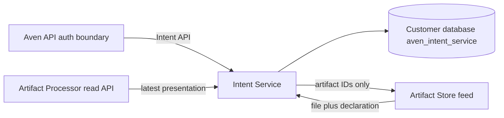

# Intent Service

The Intent Service is the tenant data-plane owner for durable work streams. It has its
own executable, container image, restricted PostgreSQL role, schema migration history,
provisioner, health contract, tenant directory credential, and API credential. It does
not run inside the Artifact Processor.

The service owns `aven_intent_service` in each customer database. It consumes immutable
Artifact Store publications to discover file-triggered intents and stores intent
metadata, ordered contributions, artifact membership, merge relations, and the visible
File-skill projection. It reads Processor presentations through the Processor's
read-only API using a dedicated credential; the Processor never writes this schema.



Runtime requests require a bearer token, a scope in the URL, and—under multi-tenant
mode—the exact customer database routing header. The authenticated directory is the
allowlist binding database names to scopes. A runtime refuses a binding whose schema
and scope were not installed by the provisioner.

Lifecycle mutations use monotonically increasing intent versions. Update, archive,
restore, merge, and delete reject stale versions with HTTP 409. Delete is a tombstone,
not physical erasure. Feed discovery and cursor advancement are transactional and
idempotent. Processor synchronization changes an intent only when its presentation
actually changed, avoiding artificial version churn.

Local verification is part of the combined stack:

```bash
bun run dev:api:artifacts
bun run test:persistent-intent:smoke
```

The service itself can be checked with:

```bash
cargo clippy --manifest-path services/intent-service/Cargo.toml --all-targets -- -D warnings
cargo test --manifest-path services/intent-service/Cargo.toml
```
